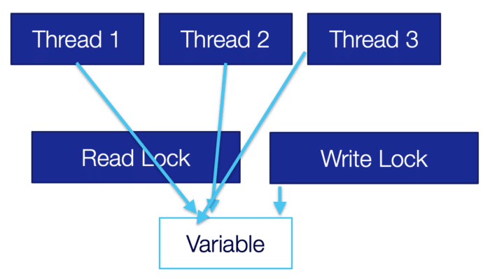
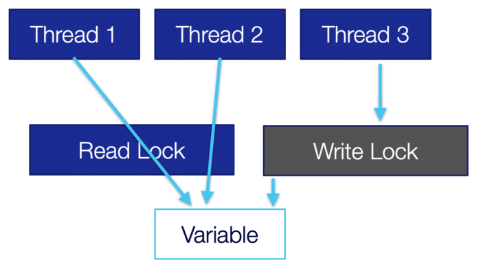
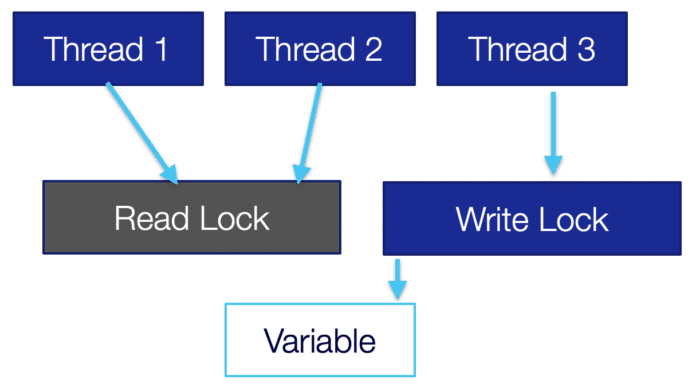

I've coded in Java since the first beta, even back then threads were at the top of my list of favorite features.

Java was the first language to introduce thread support in the language itself, it was a controversial decision back then.

In the past decade, every language raced to include async/await and [even Java had some third-party support for that](https://github.com/awaitility/awaitility)...

But Java zigged instead of zagging and introduced the far superior [virtual threads (project Loom)](https://www.youtube.com/watch?v=4mf24mzm0ks). This article isn't about that.

I think it's wonderful and proves the core power of Java. Not just as a language but as a culture. A culture of deliberating changes instead of rushing into the fashionable trend.

In this article, I want to revisit the old ways of doing threading in Java. I'm used to `synchronized`, `wait`, `notify`, etc.

But it has been a long time since they were the superior approach for threading in Java. I'm part of the problem, I'm still used to these approaches and find it hard to get used to some APIs that have been around since Java 5. It's a force of habit.

There are many great APIs for working with threads which I discuss in the videos here, but I want to talk about locks which are basic yet important.



 



 

Synchronized vs. ReentrantLock {#h2-0-synchronized-vs-reentrantlock}
--------------------------------------------------------------------

A reluctance I had with leaving synchronized is that the alternatives aren't much better. The primary motivation to leave it today is that at this time synchronized can trigger thread pinning in Loom which isn't ideal. JDK 21 might fix this (when Loom goes GA), but it still makes some sense to leave it.

The direct replacement for synchronized is ReentrantLock. Unfortunately, ReentrantLock has very few advantages over synchronized so the benefit of migrating is dubious at best. In fact, it has one major disadvantage to get a sense of that let's look at an example, this is how we would use synchronized:

<pre class="EnlighterJSRAW" data-enlighter-language="generic">synchronized(LOCK) {
    // safe code
}

LOCK.lock();
try {
    // safe code
} finally {
    LOCK.unlock();
}</pre>

The first disadvantage of `ReentrantLock` is the verbosity. We need the try block since if an exception occurs within the block the lock will remain. Synchronized handles that seamlessly for us.

There's a trick some people pull of wrapping the lock with `AutoClosable` which looks roughly like this:

<pre class="EnlighterJSRAW" data-enlighter-language="generic">public class ClosableLock implements AutoCloseable {
   private final ReentrantLock lock;

   public ClosableLock() {
       this.lock = new ReentrantLock();
   }

   public ClosableLock(boolean fair) {
       this.lock = new ReentrantLock(fair);
   }

   @Override
   public void close() throws Exception {
       lock.unlock();
   }

   public ClosableLock lock() {
       lock.lock();
       return this;
   }

   public ClosableLock lockInterruptibly() throws InterruptedException {
       lock.lock();
       return this;
   }

   public void unlock() {
       lock.unlock();
   }
}</pre>

Notice I don't implement the Lock interface which would have been ideal. That's because the lock method returns the auto-closable implementation instead of `void`.

Once we do that, we can write more concise code such as this:

<pre class="EnlighterJSRAW" data-enlighter-language="generic">try(LOCK.lock()) {
    // safe code
}</pre>

I like the reduced verbosity but this is a problematic concept since try-with-resource is designed for the purpose of cleanup and we reuse locks. It is invoking close but we will invoke that method again on the same object. I think it might be nice to extend the try with resource syntax to support the lock interface. But until that happens, this might not be a worthwhile trick.

Advantages of ReentrantLock {#h2-1-advantages-of-reentrantlock}
---------------------------------------------------------------

The biggest reason for using `ReentrantLock` is Loom support. The other advantages are nice but none of them is a "killer feature".

We can use it between methods instead of in a continuous block. This is probably a bad idea as you want to minimize the lock area and failure can be a problem. I don't consider that feature as an advantage.

It has the option of fairness. This means that it will serve the first thread that stopped at a lock first. I tried to think of a realistic non-convoluted use case where this will matter and I'm drawing blanks. If you're writing a complex scheduler with many threads constantly queued on a resource, you might create a situation where a thread is "starved" since other threads keep coming in. But such situations are probably better served by other options in the concurrency package. Maybe I'm missing something here...

`lockInterruptibly()` lets us interrupt a thread while it's waiting for a lock. This is an interesting feature but again, hard to find a situation where it would realistically make a difference. If you write code that must be very responsive for interrupting you would need to use the `lockInterruptibly()` API to gain that capability. But how long do you spend within the `lock()` method on average?

There are edge cases where this probably matters but not something most of us will run into, even when doing advanced multi-threaded code.

ReadWriteReentrantLock {#h2-2-readwritereentrantlock}
-----------------------------------------------------

A much better approach is the `ReadWriteReentrantLock`. Most resources follow the principle of frequent reads and few write operations. Since reading a variable is thread safe there's no need for a lock unless we're in the process of writing to the variable. This means we can optimize reading to an extreme while making the write operations slightly slower.

Assuming this is your use case, you can create much faster code. When working with a read-write lock we have two locks, a read lock as we can see in the following image. It lets multiple threads through and is effectively a "free for all".

Once we need to write to the variable, we need to obtain a write lock as we can see in the following image. We try to request the write lock but there are threads still reading from the variable so we must wait.

Once the threads finished reading all reading will block and the write operation can happen from a single thread only as seen in the following image. Once we release the write lock, we will go back to the "free for all" situation in the first image.

This is a powerful pattern that we can leverage to make collections much faster. A typical synchronized list is remarkably slow. It synchronizes over all operations, read or write. We have a CopyOnWriteArrayList which is fast for reading, but any write is very slow.

Assuming you can avoid returning iterators from your methods you can encapsulate list operations and use this API. E.g. in the following code we expose the list of names as read-only but then when we need to add a name we use the write lock. This can outperform `synchronized` lists easily:

<pre class="EnlighterJSRAW" data-enlighter-language="generic">private final ReadWriteLock LOCK = new ReentrantReadWriteLock();
private Collection&lt;String&gt; listOfNames = new ArrayList&lt;&gt;();

public void addName(String name) {
   LOCK.writeLock().lock();
   try {
       listOfNames.add(name);
   } finally {
       LOCK.writeLock().unlock();
   }
}

public boolean isInList(String name) {
   LOCK.readLock().lock();
   try {
       return listOfNames.contains(name);
   } finally {
       LOCK.readLock().unlock();
   }
}</pre>

StampedLock {#h2-3-stampedlock}
-------------------------------

The first thing we need to understand about `StampedLock` is that it isn't reentrant. Say we have this block:

<pre class="EnlighterJSRAW" data-enlighter-language="generic">synchronized void methodA() {
     // …
     methodB();
    // …
}

synchronized void methodB() {
     // …
}</pre>

This will work. Since synchronized is reentrant. We already hold the lock so going into `methodB()` from `methodA()` won't block. This works with ReentrantLock too assuming we use the same lock or the same synchronized object.

`StampedLock` returns a stamp that we use to release the lock. Because of that, it has some limits. But it's still very fast and powerful. It too includes a read-and-write stamp we can use to guard a shared resource. But unlike the `ReadWriteReentrantLock,` it lets us upgrade the lock. Why would we need to do that?

Look at the `addName()` method from before... What if I invoke it twice with "Shai"?

Yes, I could use a Set... But for the point of this exercise let's say that we need a list... I could write that logic with the `ReadWriteReentrantLock`:

<pre class="EnlighterJSRAW" data-enlighter-language="generic">public void addName(String name) {
   LOCK.writeLock().lock();
   try {
       if(!listOfNames.contains(name)) {
           listOfNames.add(name);
       }
   } finally {
       LOCK.writeLock().unlock();
   }
}</pre>

This sucks. I "paid" for a write lock only to check `contains()` in some cases (assuming there are many duplicates). We can call `isInList(name)` before obtaining the write lock. Then we would:

* Grab the read lock
* Release the read lock
* Grab the write lock
* Release the write lock

In both cases of grabbing we might be queued and it might not be worth the extra hassle.

With a `StampedLock`, we can update the read lock to a write lock and do the change on the spot if necessary as such:

<pre class="EnlighterJSRAW" data-enlighter-language="generic">public void addName(String name) {
   long stamp = LOCK.readLock();
   try {
       if(!listOfNames.contains(name)) {
           long writeLock = LOCK.tryConvertToWriteLock(stamp);
           if(writeLock == 0) {
               throw new IllegalStateException();
           }
           listOfNames.add(name);
       }
   } finally {
       LOCK.unlock(stamp);
   }
}</pre>

It is a powerful optimization for these cases.

Finally {#h2-4-finally}
-----------------------

I cover many similar subjects in the video series above, check it out and let me know what you think.

I often reach for the synchronized collections without giving them a second thought. That can be reasonable sometimes but for most, it's probably suboptimal. By spending a bit of time with the thread-related primitives we can significantly improve our performance.

This is especially true when dealing with Loom where the underlying contention is far more sensitive. Imagine scaling read operations on 1M concurrent threads... In those cases, the importance of reducing lock contention is far greater.

You might think, why can't `synchronized` collections use `ReadWriteReentrantLock` or even `StampedLock`?

This is problematic since the surface area of the API is so big it's hard to optimize it for a generic use case.

That's where control over the low-level primitives can make the difference between high throughput and blocking code.
