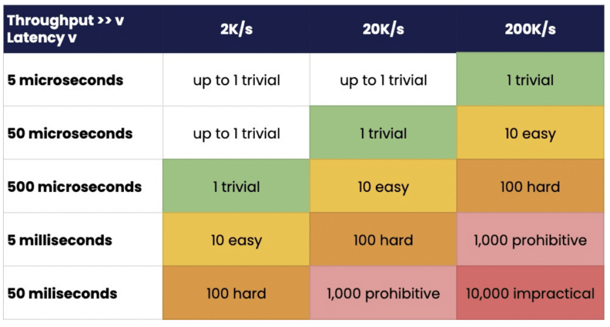
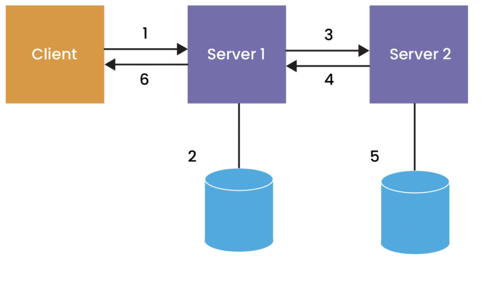
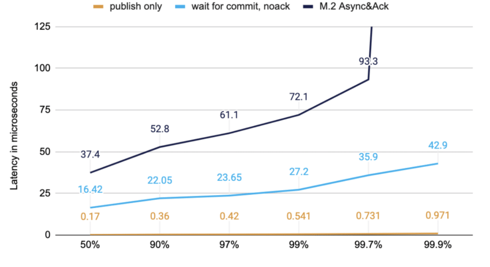
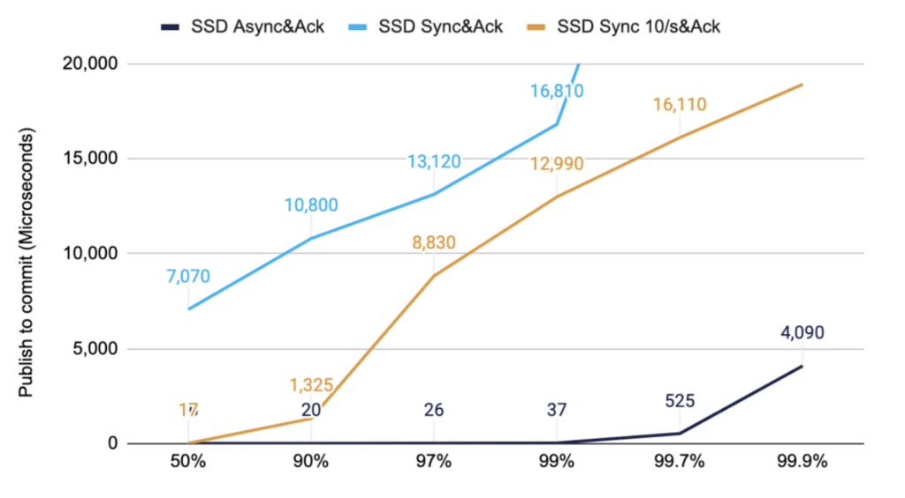
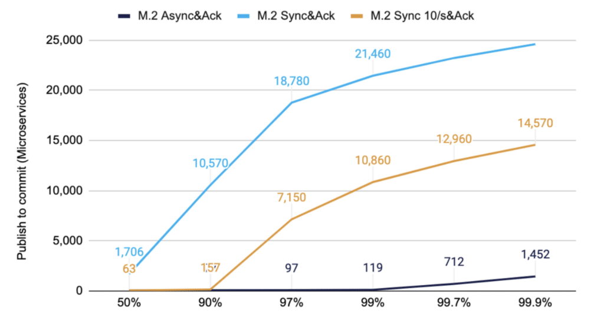

A significant feature of [Chronicle Queue Enterprise](https://chronicle.software/queue-enterprise/?utm_source=foojay&utm_medium=article&utm_campaign=comparing-approaches "Chronicle Queue Enterprise") is support for TCP replication across multiple servers to ensure high availability of application infrastructure.

I have generally held the view that replicating data to a secondary system is faster than sync-ing to disk, assuming the round trip network delay wasn't high due to quality networks and co-located redundant servers.

This is the first time I have benchmarked it with a realistic example.

### Little's Law and Why Latency Matters

In many cases, the assumption is that as long as throughput is high enough, the latency won't be a problem. However, latency is often a key factor in why the throughput isn't high enough.

Little's law states "the long-term average number L of customers in a[stationary](https://en.wikipedia.org/wiki/Stationary_process " stationary") system is equal to the long-term average effective arrival rate λ multiplied by the average time W that a customer spends in the system" .

In computer terminology, the level of concurrency or parallelism a system has to support must be at least the average throughput times the average latency.

To achieve a given throughput, the level of concurrency increases with the latency. This generally also increases the level of complexity and risk in order to achieve this concurrency. Many systems have a high inherent parallelism, however financial systems generally do not, limiting how much concurrency can be theoretically achieved. More moving parts increases the risk of failure as well.

*Table 1. Level of concurrency/parallelism required to achieve a given throughput and latency.*

### Best of Both Worlds

While sync-ing to disk is normally seen as a requirement for message durability, it carries a cost in terms of performance, directly increasing latency, but indirectly reducing throughput. Acknowledged replication gives similar guarantees and (spoiler alert) is quicker.

From time to time, however, you might get messages such as orders, trades or payments that are too large to risk losing.

A trade-off would be to use acknowledged replication but sync to disk when some business risk threshold is reached, either in an individual message or an aggregation of messages. In this test, I explore the difference that sync-ing only 10 times per second could make.

### Balancing Technical and Commercial Risks

Many IT systems tend to treat technical risks separately from commercial ones. For example, Kafka has the option to periodically sync data to disk say every 100 ms. This is regardless of the content or value of those messages. Unfortunately, you have no idea of the value of the messages that could be lost in that time.

However, you can achieve improved outcomes by aligning the technical solution with the commercial risks. For example, with the Chronicle stack, you can sync to disk based on the content. A large order or payment individually or a large total cumulatively can trigger a sync. Instead of a cap of 100 ms, of unknown value, you can have a cap of $10m (you can also cap by time).

Chronicle Queue has multiple ways of triggering a sync, however the simplest is to call sync() on the ExcerptAppender to sync everything up to the last message written. In Chronicle Services, writing a sync() event triggers a sync on the underlying queue, keeping a record of when it was performed. Downstream services can wait for this event if they need to know a sync was performed.

### Low Latency vs Durability Requirements

Low latency systems 'need for speed' usually trumps the need for reliability, so the fastest option available is usually chosen. Messages are usually kept as small as is reasonably possible. E.g. 40 -- 256 bytes.

However, many financial systems have higher durability but lower latency speed requirements. The message sizes are also typically larger e.g. 1 -- 8 KB.

### Benchmarked Scenario

Many systems support flushing or syncing to disk periodically, however, this is not based on the content of the messages. With Chronicle you can select the critical messages that have to be sync-ed to disk. There are several programmatic calls you can make to trigger or wait for a sync based on message content. Assuming our application has a small portion of messages that must be sync-ed to disk based on business requirements, we can sync only when those messages are written.

In this benchmark, (1) a client publishes a 1 KB message to a server over TCP, (2) the server writes the data to a Chronicle Queue on disk, either using async as msync(MS_ASYNC), sync as msync(MS_SYNC), or sync-ing 10 times/s based on a simulated business risk, your use case will vary, (3) data is replicated to a second server over TCP, (4) data is acknowledged, (5) on the replica the data is also written to disk via async flush under the control of the OS, (6) after step 2 \& 4, a commit message is sent back to the client.

Each case used fast machines (Ryzen 9 5950X) and a low latency network.. The OS was tuned for[isolating CPUs](https://access.redhat.com/solutions/480473 " isolating CPUs") to reduce latency, however no additional optimisations were added. Slower machines, disk subsystems, and network latencies will add to the timings below. No tuning was made to optimise how sync performed.

### Low Latency Options with Small Messages

A simple way to reduce latencies is to do less work. Low latency systems tend to use smaller messages around 256 bytes; what latency can we get if we don't need strong resilience guarantees. In each case, the same configuration is used. The difference is which points are timed. This chart illustrates the performance you can get if you consider:

* Time to publish only; this is the minimum you can do. All it does is write the data to a buffer so it can be written to the network asynchronously. The data doesn't even reach step 1 in the diagram above.
* Time to wait for a response from Server 1 without an acknowledgment from a second server. This does steps 1, 2 \& 6.
* Time to wait for a response from Server 1 after an acknowledgement; this does the same steps 1, 2, 3, 4, and 6 as before.

The chart below shows data from the same run, and the different lines represent which points we measure time at, to show the difference it makes if you wait for different stages of persistence.

  
*Figure 1. M.2 200K/s messages of 256 Bytes in timed at different stages*

While these tests benefit from smaller messages (compare "M.2 Async\&Ack" in the last chart below), the main speed improvement is not waiting for the same stage of persistence.

You can customise how your system behaves, either at the queue level, by message type or even based on the message's contents, to align the technical risks to the commercial risks.

### Waiting for either Replication Acknowledgement OR a Sync to Disk

For systems where a sync to disk is currently required, there could be a significant latency improvement if the alternative is to wait for acknowledged replication. In this case, the latency is the same as the "Async\&Ack" options (plus network round trip time), falling back to the "Sync\&Ack" latency when the replica isn't available (or after failover to the secondary system)

### SATA Solid State Drives with Medium Sized Messages

Above we compared the same configuration timed at different stages. In this case, the end-to-end is timed, with different options for sync-ing to disk.

In use cases requiring higher guarantees, the messages are often larger. In this test, 50K/s messages of 1 KB are timed from publishing on a client to receiving a committed message from the "Server 1". The "SYNC 10/s" assumes that on average, a SYNC is required ten times a second. This can be based on the content of the messages, e.g. a large order or payment, rather than just periodically.

  
*Figure 2. 50K/s messages of 1KB timed from publishing on client to receiving a committed message*

Note: the round trip time for an acknowledgement from a second machine is much faster than a sync to disk. The cost is about the round trip time for the network.

Solid State Drives are not unusual in enterprise-grade data storage systems. They perform much better than Hard Disk Drives; however as you increase the throughput, they can be a bottleneck.

As you can see from the yellow line, this significantly reduces the typical latency while improving the whole latency distribution for this SSD.

### M.2 Solid State Drives with Medium Sized Messages

M.2 drives perform much better across the board, and for the drive tested, even at 200Kmsg/s outperformed the SSD. Nevertheless, selective sync-ing still significantly improves the typical latency and the high end latencies. This is the same test as above but with a higher throughput of 200K/s vs 50K/s

  
*Figure 3. 200K/s messages of 1KB timed from publishing on client to receiving a committed message*

Again, you can see that the yellow line has significantly lower latencies with selective sync-ing compared to sync-ing every batch of messages.

### Head Room

To put this in context, VISA has a capacity of [65,000 transaction messages per second](https://www.visa.co.uk/dam/VCOM/download/corporate/media/visanet-technology/aboutvisafactsheet.pdf "65,000 transaction messages per second") (as of Aug 2017). This is a single pair of servers via a single TCP connection. Having greater headroom immediately available can increase reliability, reducing the risk of the system being overloaded in a burst of activity and reducing the time the system takes to return to normal operation.

Increased head room reduces the risk of a [cascading failure](https://en.wikipedia.org/wiki/Cascading_failure "cascading failure") in the event of a burst of activity or an interruption.

### Conclusion

Sync-ing to disk with SSDs, was under 25 milliseconds most of the time for even decent throughputs, up to 50K/s.

However, using high performance M.2 drives increases the throughput up to 200K/s and is still under 25 ms most of the time.

Typically latency can be reduced significantly if the application can selectively sync data based on the contents of those messages e.g. based on value.

This can result in typical latencies close to just waiting for acknowledged replication.

The fastest option tested was to async to disk and wait for acknowledged replication.

The higher percentile latencies can be one-tenth or better using this strategy.
