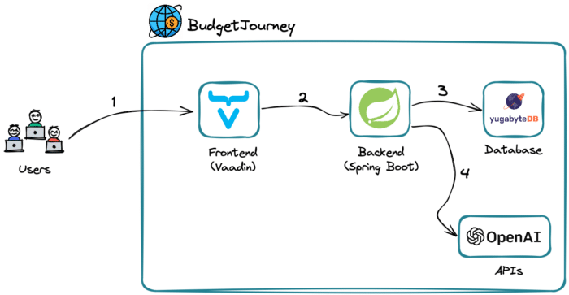
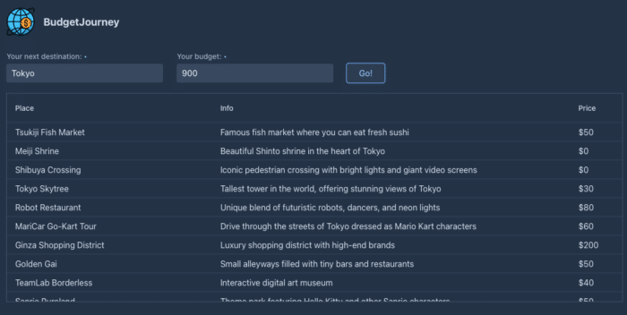
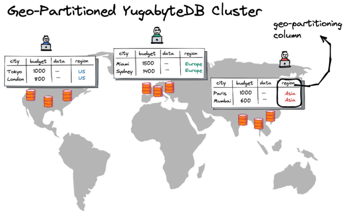

One of the more notable aspects of ChatGPT is its engine, which not only powers the web-based chatbot but can also be integrated into your Java applications.

Whether you prefer reading or watching, let's review how to start using the OpenAI GPT engine in your Java projects in a scalable way, by sending prompts to the engine only when necessary:



Imagine you want to visit a city and have a specific budget in mind. How should you spend the money and make your trip memorable? This is an excellent question to delegate to the OpenAI engine.

Let's help users get the most out of their trips by building a simple Java application called [BudgetJourney](https://github.com/YugabyteDB-Samples/budget-journey-gpt "BudgetJourney"). The app can suggest multiple points of interest within a city, tailored to fit specific budget constraints.

The architecture of the BudgetJourney app looks as follows:  


1. The users open a BudgetJourney web UI that runs on [Vaadin](https://vaadin.com "Vaadin").
2. Vaadin connects to a Spring Boot backend when users want to get recommendations for a specific city and budget.
3. Spring Boot connects to a [YugabyteDB](https://www.yugabyte.com/yugabytedb/ "YugabyteDB") database instance to check if there are already any suggestions for the requested city and budget. If the data is already in the database, the response is sent back to the user.
4. Otherwise, Spring Boot connects to the OpenAI APIs to get recommendations from the neural network. The response is stored in YugabyteDB for future reference and sent back to the user.

Now, let's see how the app communicates with the Open AI engine (step 4) and how using the database (step 3) makes the solution scalable and cost-effective.

The OpenAI engine can be queried via the HTTP API. You need to create an account, get your token (i.e., API key) and use that token while sending requests to one of the OpenAI models.

A model in the context of OpenAI is a computational construct trained on a large dataset to recognize patterns, make predictions, or perform specific tasks based on input data. Presently, the service supports [several models](https://platform.openai.com/docs/models "several models") that can understand and generate natural language, code, images, or convert audio into text.

Our BudgetJourney app uses the [GPT-3.5 model](https://platform.openai.com/docs/models/gpt-3-5 "GPT-3.5 model") which understands and generates natural language or code. The app asks the model to suggest several points of interest within a city while considering budget constraints. The model then returns the suggestions in a JSON format.

The open-source [OpenAI Java library](https://github.com/TheoKanning/openai-java "OpenAI Java library") implements the GPT-3.5 HTTP APIs, making it easy to communicate with the service via well-defined Java abstractions. Here's how you get started with the library:

* Add the latest OpenAI Java artifact to your **pom.xml** file.

```xml
<dependency>
    <groupId>com.theokanning.openai-gpt3-java</groupId>
    <artifactId>service</artifactId>
    <version>${version}</version>
</dependency>
```

* Create an instance of the `OpenAiService` class by providing your token and a timeout for requests between the app and OpenAI engine.

```java
OpenAiService openAiService = new OpenAiService(
    apiKey, Duration.ofSeconds(apiTimeout));
```

  Easy! Next, let's see how you can work with the GPT-3.5 model via the `OpenAiService` instance.

You communicate with the OpenAI models by sending text [prompts](https://platform.openai.com/docs/introduction/prompts "prompts") that tell what you expect a model to do. The model behaves best when your instructions are clear and include examples.

To build a prompt for the GPT-3.5 model, you use the `ChatCompletionRequest` API of the OpenAI Java library:

```java
ChatCompletionRequest chatCompletionRequest = ChatCompletionRequest
    .builder()
    .model(“gpt-3.5-turbo”)
    .temperature(0.8)
    .messages(
        List.of(
            new ChatMessage("system", SYSTEM_TASK_MESSAGE),
            new ChatMessage("user", String.format("I want to visit %s and have a budget of %d dollars", city, budget))))
    .build();
```

* `model("gpt-3.5-turbo")` is an optimized version of the GPT-3.5 model.
* `temperature(...)` controls how much randomness and creativity to expect in a model's response. For instance, higher values like 0.8 will make the output more random, while lower values like 0.2 will make it more deterministic.
* `messages(...)` are the actual instructions or prompts to the model. There are `"system"` messages that instruct the model to behave a certain way, `"assistant"` messages that store previous responses, and `"user"` messages that carry user requests with asks.

The `SYSTEM_TASK_MESSAGE` of the BudgetJourney app looks as follows:

*You are an API server that responds in a JSON format. Don't say anything else. Respond only with the JSON.*

*The user will provide you with a city name and available budget. While considering that budget, you must suggest a list of places to visit.*

*Allocate 30% of the budget to restaurants and bars. Allocate another 30% to shows, amusement parks, and other sightseeing. Dedicate the remainder of the budget to shopping. Remember, the user must spend 90-100% of the budget.*

*Respond in a JSON format, including an array named 'places'. Each item of the array is another JSON object that includes 'place_name' as a text, 'place_short_info' as a text, and 'place_visit_cost' as a number.*

*Don't add anything else after you respond with the JSON.*

Although wordy and in need of optimization, this system message conveys the desired action: to suggest multiple points of interest with maximal budget utilization and to provide the response in JSON format, which is essential for the rest of the application.

Once you created the prompt (`ChatCompletionRequest`) providing both the system and user messages as well as other parameters, you can send it via the `OpenAiService` instance:

```java
OpenAiService openAiService = … //created earlier

StringBuilder builder = new StringBuilder();

openAiService.createChatCompletion(chatCompletionRequest)
    .getChoices().forEach(choice -> {
        builder.append(choice.getMessage().getContent());
});
```

The `jsonResponse` object is then further processed by the rest of the application logic which prepares a list of points of interest and displays them with the help of Vaadin.

For example, suppose a user is visiting Tokyo and wants to spend up to $900 in the city. The model will strictly follow our instructions from the system message and respond with the following JSON:

```json
{
  "places": [
    {
      "place_name": "Tsukiji Fish Market",
      "place_short_info": "Famous fish market where you can eat fresh sushi",
      "place_visit_cost": 50
    },
    {
      "place_name": "Meiji Shrine",
      "place_short_info": "Beautiful Shinto shrine in the heart of Tokyo",
      "place_visit_cost": 0
    },
    {
      "place_name": "Shibuya Crossing",
      "place_short_info": "Iconic pedestrian crossing with bright lights and giant video screens",
      "place_visit_cost": 0
    },
    {
      "place_name": "Tokyo Skytree",
      "place_short_info": "Tallest tower in the world, offering stunning views of Tokyo",
      "place_visit_cost": 30
    },
    {
      "place_name": "Robot Restaurant",
      "place_short_info": "Unique blend of futuristic robots, dancers, and neon lights",
      "place_visit_cost": 80
    },
   // More places
]}
```

This JSON is then converted into a list of different points of interest. It is then shown to the user:  


**NOTE:** The GPT-3.5 model was trained on the Sep 2021 data set. Therefore, it can't provide 100% accurate and relevant trip recommendations. However, this inaccuracy can be improved with the help of OpenAI plugins that give models access to real-time data. For instance, once the [Expedia plugin for OpenAI](https://openai.com/blog/chatgpt-plugins "Expedia plugin for OpenAI") becomes publicly available as an API, this will let you improve this BudgetJourney app further.

As you can see, it's straightforward to integrate the neural network into your Java applications and communicate with it in a way similar to other 3rd party APIs. You can also tune the API behavior, such as adding a desired output format.

But, this is still a 3rd party API that charges you for every request. The more prompts you send and the longer they are, the more you pay. Nothing comes for free.

Plus, it takes time for the model to process your prompts. For instance, it can take 10-30 seconds before the BudgetJourney app receives a complete list of recommendations from OpenAI. This might be overkill, especially if different users send similar prompts.

To make OpenAI GPT applications scalable, it's worth storing the model responses in a database. That database allows you to:

1. Reduce the volume of requests to the OpenAI API and, therefore, the associated costs.
2. Serve user requests with low latency by returning previously processed (or preloaded) recommendations from the database.

The BudgetJourney app uses the YugabyteDB database due to its ability to scale globally and store the model responses close to the user locations. With [the geo-partitioned deployment mode](https://dzone.com/articles/what-developers-need-to-know-about-table-geo-parti "the geo-partitioned deployment mode"), you can have a single database cluster with the data automatically pinned to and served from various geographies with low latency.  


A custom geo-partitioning column (the `"region"` column in the picture above) lets the database decide on a target row location. For instance, the database nodes from Europe already store recommendations for a trip to Miami on a $1500 budget. Next, suppose a user from Europe wants to go to Miami and spend that amount. In that case, the application can respond within a few milliseconds by getting the recommendations straight from the database nodes in the same geography.

The BudgetJourney app uses the following JPA repository to get recommendations from the YugabyteDB cluster:

```java
@Repository
public interface CityTripRepository extends JpaRepository<CityTrip, Integer> {
    @Query("SELECT pointsOfInterest FROM CityTrip WHERE cityName=?1 and budget=?2 and region=?3")
    String findPointsOfInterest(String cityName, Integer budget, String region);
}
```

With an `Entity` class looking as follows:

```java
@Entity
public class CityTrip {
    @Id
    @GeneratedValue(strategy = GenerationType.SEQUENCE, generator = "landmark_generator")
    @SequenceGenerator(name = "landmark_generator", sequenceName = "landmark_sequence", allocationSize = 5)
    int id;

    @NotEmpty
    String cityName;

    @NotNull
    Integer budget;

    @NotEmpty
    @Column(columnDefinition = "text")
    String pointsOfInterest;

    @NotEmpty
    String region;

    //The rest of the logic
}
```

So, all you need to do is to make a call to the database first, then revert to the OpenAI API if relevant suggestions are not yet available in the database. As your application increases in popularity, more and more local recommendations will be available, making this approach even more cost-effective over time.

A ChatGPT web-based chatbot is an excellent way to demonstrate the OpenAI engine's capabilities. Explore the engine's powerful models and start building new types of Java applications. Just make sure you do it in a scalable way!
