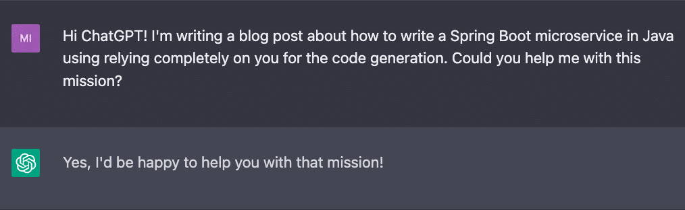
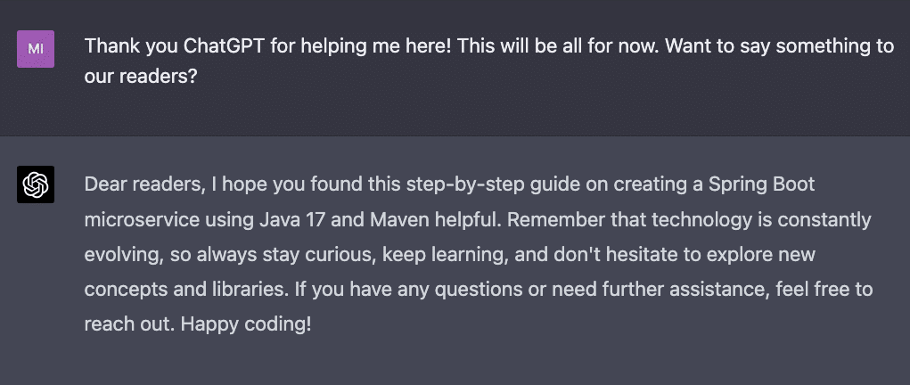

### We pit a seasoned Java developer against the all-knowing generative AI to find out once and for all: Can an AI generate a Java microservice end-to-end?

There's a lot of buzz around Generative AI tools for code generation. It's no secret that the future of developer productivity goes alongside tools such as [GitHub Copilot](https://github.com/features/copilot) and [OpenAI's ChatGPT](https://openai.com/blog/chatgpt) to enable us, developers, to produce code better and faster. These tools can learn from our existing code and suggest new code based on the desired functionality, most importantly, they can even write documentation and tests!

Many developers have previously posted examples of how AI can save time by generating targeted pieces of code, cracking complicated regexes, or building some front-end scaffolds. As a lazy developer, my first instinct was to see just how far we can take such code. It's one thing to ask our loveable assistant to solve a specific coding problem, another to ask it to come up with an end-to-end solution.

**Today, I want to tackle this very question by asking ChatGPT to write a complete, fully functional, [Spring Boot](https://spring.io/guides/gs/spring-boot/) Java microservice. The catch? Not a single line of code will be written by a human operator (me).**

**To make this experiment fun, we're going to build a RESTful web service that generates code for a given prompt by using [OpenAI API](https://platform.openai.com/docs/introduction) ([Codex models](https://platform.openai.com/docs/models/codex)) behind the scenes. Yes, it's a code generation service produced by a code generation model. 😉**

Before we start, let's define the requirements for the capabilities of the expected outcome.

1. A self-contained Spring Boot application (using the default embedded server) based on Java (17 or later) with Maven.
2. Have a resource controller (using the [@RestController](https://docs.spring.io/spring-framework/docs/current/javadoc-api/org/springframework/web/bind/annotation/RestController.html) annotation) for our code generation API endpoints.
3. Talk with OpenAI API (Codex) to generate the code according to our users prompt.
4. Use a [record class](https://openjdk.org/jeps/395) to represent the request and response payloads.
5. Allow basic persistence of the responses using [Spring Data JPA](https://docs.spring.io/spring-data/jpa/docs/current/reference/html/#preface).
6. Be able to spin up the project easily in IntelliJ.

Out of scope (for now):

1. Docker, K8s, and anything related to packaging and deployment.
2. Full E2E test coverage.

Sounds reasonable right? Let's get to it!


*Disclaimer: I am using ChatGPT Plus with the latest GPT4 model to generate the code snippets. Some of the code generation prompt examples here might not work with the current free-to-use GPT3.5 model.*

Step 1: Bootstrapping the initial Spring Boot skeleton
------------------------------------------------------

(The prompts and responses are copied as is - for the reader's benefit, the dialog is shared as text instead of screenshots. Prompts are shared as is without any modification)

**\[me\] \>** *Before we start, let's set the requirements for the project: use Java 17 or later as the language, use Maven as the build tool, and generate production-ready code. Sounds good?*

**\[chatGPT\] \>** *I acknowledge the requirements for the project:*

* *Use Java 17 or later as the programming language.*
* *Use Maven as the build tool.*
* *Generate production-ready code.*

*We can now proceed with creating the Spring Boot microservice based on these requirements.*

**\[me\] \>** *Write the initial code skeleton for the project. Name it* `CodeGenerationService`*, use* [`com.ai`](http://com.ai/) *as the package name, and provide the relevant files (main class,* `pom.xml`*) with the folder structure.*

**\[chatGPT\] \>** *Here's the initial code skeleton for the CodeGenerationService project. We will create a folder structure and the necessary files, including the main class and the pom.xml file.*

*Create the following folder structure:*

    CodeGenerationService

    |-- src
    |   |-- main
    |   |   |-- java
    |   |   |   |-- com
    |   |   |   |   |-- ai
    |   |   |-- resources
    |-- pom.xml

<br />

*Inside the* [`com.ai`](http://com.ai/) *package, create the main class file* [`CodeGenerationServiceApplication.java`](http://codegenerationserviceapplication.java/) *with the following content:*

```java
package com.ai;
import org.springframework.boot.SpringApplication;
import org.springframework.boot.autoconfigure.SpringBootApplication;

@SpringBootApplication
public class CodeGenerationServiceApplication {
    public static void main(String[] args) {
        SpringApplication.run(CodeGenerationServiceApplication.class, args);
    }
}
```


*Next, create the* `pom.xml` *file in the root directory of the project with the following content:*

```xml
<?xml version="1.0" encoding="UTF-8"?>
<project xmlns="http://maven.apache.org/POM/4.0.0"
         xmlns:xsi="http://www.w3.org/2001/XMLSchema-instance"
         xsi:schemaLocation="http://maven.apache.org/POM/4.0.0         http://maven.apache.org/xsd/maven-4.0.0.xsd">
    <modelVersion>4.0.0</modelVersion>
    <groupId>com.ai</groupId>
    <artifactId>CodeGenerationService</artifactId>
    <version>0.0.1-SNAPSHOT</version>
    <packaging>jar</packaging>
    <name>CodeGenerationService</name>
    <properties>
        <project.build.sourceEncoding>UTF-8</project.build.sourceEncoding>
        <maven.compiler.source>17</maven.compiler.source>
        <maven.compiler.target>17</maven.compiler.target>
        <java.version>17</java.version>
        <spring.boot.version>2.6.2</spring.boot.version>
    </properties>

    <dependencies>
        <dependency>
            <groupId>org.springframework.boot</groupId>
            <artifactId>spring-boot-starter-web</artifactId>
            <version>${spring.boot.version}</version>
        </dependency>
    </dependencies>

    <build>
        <plugins>
            <plugin>
                <groupId>org.springframework.boot</groupId>
                <artifactId>spring-boot-maven-plugin</artifactId>
                <version>${spring.boot.version}</version>
                <executions>
                    <execution>
                        <goals>
                            <goal>repackage</goal>
                        </goals>
                    </execution>
                </executions>
            </plugin>
        </plugins>
    </build>
</project>
```


*This sets up a basic Spring Boot project using Maven as the build tool and Java 17 as the programming language. The project has a single CodeGenerationServiceApplication class, which is the entry point for the application. The pom.xml file includes the required dependencies and build configurations.*

**\[me\] \>** *Provide a run command to start the application using Maven*

**\[chatGPT\] \>** *To run the application using Maven, you can use the spring-boot:run command. Open a terminal or command prompt, navigate to the project's root directory (where the pom.xml file is located), and execute the following command:*

```bash
mvn spring-boot:run
```


*This command will start the Spring Boot application, and you should see the application logs in the terminal.*


Okay. This was... pretty straightforward. We were able to generate a minimal required setup for a Spring Boot application. Let's check it actually works:

```bash
$ mvn spring-boot:run 

[INFO] Attaching agents: []

  .   ____                      _ 
 /\\ / ___'_ __ (_)_    _ \ \ \ \
( ( )\___ | '_ | '_| | '_ \/ _` | \ \ \ \
 \\/  ___)| |_)| | | | | || (_| |  ) ) ) )
  '  |____| .__|_| |_|_| |_\__, | / / / /
 =========|_|==============|___/=/_/_/_/
 :: Spring Boot ::                (v2.6.2)

2023-03-21 21:05:38.369  INFO 19502 --- [           main] com.ai.CodeGenerationServiceApplication  : Starting CodeGenerationServiceApplication using Java 17.0.1 on just.local with PID 19502 (/Users/mar/Development/ChatGPT/target/classes started by mar in /Users/mar/Development/ChatGPT)
2023-03-21 21:05:38.371  INFO 19502 --- [           main] com.ai.CodeGenerationServiceApplication  : No active profile set, falling back to default profiles: default
2023-03-21 21:05:39.231  INFO 19502 --- [           main] o.s.b.w.embedded.tomcat.TomcatWebServer  : Tomcat initialized with port(s): 8080 (http)
2023-03-21 21:05:39.244  INFO 19502 --- [           main] o.apache.catalina.core.StandardService   : Starting service [Tomcat]
2023-03-21 21:05:39.245  INFO 19502 --- [           main] org.apache.catalina.core.StandardEngine  : Starting Servlet engine: [Apache Tomcat/9.0.56]
2023-03-21 21:05:39.335  INFO 19502 --- [           main] o.a.c.c.C.[Tomcat].[localhost].[/]       : Initializing Spring embedded WebApplicationContext
2023-03-21 21:05:39.336  INFO 19502 --- [           main] w.s.c.ServletWebServerApplicationContext : Root WebApplicationContext: initialization completed in 918 ms
2023-03-21 21:05:39.666  INFO 19502 --- [           main] o.s.b.w.embedded.tomcat.TomcatWebServer  : Tomcat started on port(s): 8080 (http) with context path ''
2023-03-21 21:05:39.673  INFO 19502 --- [           main] com.ai.CodeGenerationServiceApplication  : Started CodeGenerationServiceApplication in 1.902 seconds (JVM running for 2.239)
```


Great success! Or at least a great start.

Step 2: Create OpenAI API client
--------------------------------

**\[me\] \>** *In this project we're going to use the OpenAI API. Write a Java client that contains a method named* `generateCode` *that accepts a String input and returns the generated code by the API.*

**\[chatGPT\] \>** *To use the OpenAI API in your Java project, you can use a library like Retrofit to make HTTP requests. First, add the necessary dependencies to your* `pom.xml`*:* [](https://devskeptic.hashnode.dev/java-developer-vs-chatgpt-part-i-writing-a-spring-boot-microservice#heading-step-2-create-openai-api-client)

```xml
<dependency>
    <groupId>com.squareup.retrofit2</groupId>
    <artifactId>retrofit</artifactId>
    <version>2.9.0</version>
</dependency>

<dependency>
    <groupId>com.squareup.retrofit2</groupId>
    <artifactId>converter-gson</artifactId>
    <version>2.9.0</version>
</dependency>
```


*Next, create a new package called* [`com.ai`](http://com.ai/)`.openai` *and add the following files:*

1*.* [`OpenAIApi.java`](http://openaiapi.java/)*:*

```java
package com.ai.openai;
import okhttp3.ResponseBody;
import retrofit2.Call;
import retrofit2.http.Body;
import retrofit2.http.Headers;
import retrofit2.http.POST;

public interface OpenAIApi {

    @Headers("Content-Type: application/json")
    @POST("v1/engines/davinci-codex/completions")
    Call<ResponseBody> generateCode(@Body String input);

}
```


*2.* [`OpenAIClient.java`](http://openaiclient.java/)*:*

```java
package com.ai.openai;

import okhttp3.OkHttpClient;
import okhttp3.ResponseBody;
import okhttp3.logging.HttpLoggingInterceptor;
import retrofit2.Call;
import retrofit2.Response;
import retrofit2.Retrofit;
import retrofit2.converter.gson.GsonConverterFactory;

import java.io.IOException;

public class OpenAIClient {
    private static final String API_KEY = "your_api_key";
    private static final String BASE_URL = "https://api.openai.com/";

    private final OpenAIApi api;

    public OpenAIClient() {

        OkHttpClient.Builder httpClient = new OkHttpClient.Builder(); 
        HttpLoggingInterceptor logging = new HttpLoggingInterceptor();
        logging.setLevel(HttpLoggingInterceptor.Level.BODY);
        httpClient.addInterceptor(logging);
        httpClient.addInterceptor(chain -> {    
            okhttp3.Request original = chain.request();
            okhttp3.Request request = original.newBuilder()
                .header("Authorization", "Bearer " + API_KEY)
                .method(original.method(), original.body())
                .build();

            return chain.proceed(request);
        });

        Retrofit retrofit = new Retrofit.Builder()
            .baseUrl(BASE_URL)
            .addConverterFactory(GsonConverterFactory.create())
            .client(httpClient.build())
            .build();

        api = retrofit.create(OpenAIApi.class);
    }

    public String generateCode(String input) {

        String code = "";
        Call<ResponseBody> call = api.generateCode(input);

        try {
            Response<ResponseBody> response = call.execute();
            if (response.isSuccessful()) {
                code = response.body().string();
            } 
            else {
                throw new IOException("Failed to generate code: " +                           response.errorBody().string());
        }

        } catch (IOException e) {
            e.printStackTrace();
        }
        return code;

    }
}
```


*Replace your_api_key with your OpenAI API key. The OpenAIClient class has a method* `generateCode` *that accepts a String input and returns the generated code by the API. It uses Retrofit to make API requests and OkHttpClient to add the necessary headers.*

*Please note that this implementation uses synchronous calls to the OpenAI API. In a real-world application, it's recommended to use asynchronous calls to avoid blocking the main thread.*


A few interesting observations on the generated code:

1. ChatGPT decides to use an external HTTP library for the client code implementation instead of using Spring's very own [RestTemplate](https://docs.spring.io/spring-framework/docs/current/javadoc-api/org/springframework/web/client/RestTemplate.html). Weird.

2. It is still aware of the project scope and names the package according to our original prompt (\`[com.ai](http://com.ai/)\`). Nice!

3. The implementation is using the Codex model by default (\`davinci-codex\`) without mentioning that explicitly. Not bad!

4. The sync vs. async comment at the end: it seems that ChatGPT decided to regard the 'production-ready code' requirement we mentioned to it before in a manner of criticizing its own code rather than implementing it "properly" from the first try.


Let's continue:

**\[me\] \>** *Please extract the* `API_KEY` *property into external* [`application.properties`](http://application.properties/) *file and refactor the client to use the new config property*

**\[chatGPT\] \>** *First, create a new file named* [`application.properties`](http://application.properties/) *inside the* `src/main/resources` *folder and add the following line:*

```yaml
openai.api-key=your_api_key
```


*Replace your_api_key with your OpenAI API key.*

*Next, modify the* `OpenAIClient` *class to read the API key from the* [`application.properties`](http://application.properties/) *file. You can use the Spring Boot's* `@Value` *annotation to inject the property value into the class. Also, make the class a Spring-managed bean by adding the* `@Service` *annotation.*

*Update the* [`OpenAIClient.java`](http://openaiclient.java/) *file as follows:*

```java
package com.ai.openai;
import okhttp3.OkHttpClient;
import okhttp3.ResponseBody;
import okhttp3.logging.HttpLoggingInterceptor;
import org.springframework.beans.factory.annotation.Value;
import org.springframework.stereotype.Service;
import retrofit2.Call;
import retrofit2.Response;
import retrofit2.Retrofit;
import retrofit2.converter.gson.GsonConverterFactory;
import java.io.IOException;

@Service
public class OpenAIClient {

    @Value("${openai.api-key}")
    private String apiKey;
    private static final String BASE_URL = "https://api.openai.com/";
    private final OpenAIApi api;

    public OpenAIClient() {

        OkHttpClient.Builder httpClient = new OkHttpClient.Builder();
        HttpLoggingInterceptor logging = new HttpLoggingInterceptor();
        logging.setLevel(HttpLoggingInterceptor.Level.BODY);
        httpClient.addInterceptor(logging);
        httpClient.addInterceptor(chain -> {
            okhttp3.Request original = chain.request();
            okhttp3.Request request = original.newBuilder()
                .header("Authorization", "Bearer " + apiKey)
                .method(original.method(), original.body())
                .build();
            return chain.proceed(request);
        });

        Retrofit retrofit = new Retrofit.Builder()
            .baseUrl(BASE_URL)
            .addConverterFactory(GsonConverterFactory.create())
            .client(httpClient.build())
            .build();
        api = retrofit.create(OpenAIApi.class);

    }

    public String generateCode(String input) {
        String code = "";
        Call<ResponseBody> call = api.generateCode(input);
        try {
            Response<ResponseBody> response = call.execute();
        if (response.isSuccessful()) {
            code = response.body().string();
        } else {
            throw new IOException("Failed to generate code: " + response.errorBody().string());
        }
        } catch (IOException e) {
        e.printStackTrace();
        }
        return code;
    }

}
```


*Now, the OpenAIClient class reads the API key from the* [](http://application.properties/)*[application.properties](http://application.properties/)* *file and uses it for authentication when making requests to the OpenAI API.*


We can see that ChatGPT made the change correctly using Spring's proper annotations, understood where the [`application.properties`](http://application.properties/) should be located (under `resources` folder) and refactored the code accordingly.

Implicitly, I hoped for it to take one step further and create a relevant interface, a separate [Service class](https://docs.spring.io/spring-framework/docs/current/javadoc-api/org/springframework/stereotype/Service.html), and take any [DDD](https://en.wikipedia.org/wiki/Domain-driven_design) aspects in concern. We'll get back to it later!

Step 3: POJOs to the rescue
---------------------------

**\[me\] \>** *Write a record class named* `PromptRequest` *that contains one String argument named* `input` *and place it under a new relative package called* `pojos`

**\[chatGPT\] \>** *To create a record class named* `PromptRequest` *with a single String argument named* `input`*, create a new package called* [`com.ai`](http://com.ai/)`.pojos` *and add the following* [`PromptRequest.java`](http://promptrequest.java/) *file:*

```java
package com.ai.pojos;

public record PromptRequest(String input) {

}
```


**\[me\] \>** *Now create another record class under the same package, named* `GeneratedCodeResult`*, that has one String argument named* `result`

**\[chatGPT\] \>** *To create a record class named* `GeneratedCodeResult` *with a single String argument named* `result`*, add the following* [`GeneratedCodeResult.java`](http://generatedcoderesult.java/) *file to the* [`com.ai`](http://com.ai/)`.pojos` *package:*

```java
package com.ai.pojos;

public record GeneratedCodeResult(String result) {

}
```


Nothing complicated here. We created the request \& response POJOs that will be used later for serving the API calls. ChatGPT delivered as desired.

Step 4: Write our first REST service endpoint (controller)
----------------------------------------------------------

**\[me\] \>** *Write a REST controller named* `CodeGeneration`*. Use Spring conventions.*

**\[chatGPT\] \>** *To create a REST controller named* `CodeGeneration` *using Spring conventions, follow these steps:*

*1. Create a new package called* [`com.ai`](http://com.ai/)`.controllers`*.*

*2. Create a new file named* [`CodeGenerationController.java`](http://codegenerationcontroller.java/) *in the* [`com.ai`](http://com.ai/)`.controllers` *package.*

*3. Add the following content to the* [`CodeGenerationController.java`](http://codegenerationcontroller.java/) \*file:

```java
package com.ai.controllers;
import com.ai.openai.OpenAIClient;
import com.ai.pojos.GeneratedCodeResult;
import com.ai.pojos.PromptRequest;
import org.springframework.beans.factory.annotation.Autowired;
import org.springframework.web.bind.annotation.PostMapping;
import org.springframework.web.bind.annotation.RequestBody;
import org.springframework.web.bind.annotation.RequestMapping;
import org.springframework.web.bind.annotation.RestController;

@RestController
@RequestMapping("/api/codegeneration")
public class CodeGenerationController {

    private final OpenAIClient openAIClient;

    @Autowired
    public CodeGenerationController(OpenAIClient openAIClient) {
        this.openAIClient = openAIClient;
    }

    @PostMapping("/generate")
    public GeneratedCodeResult generateCode(@RequestBody PromptRequest     promptRequest) {

        String input = promptRequest.input();
        String generatedCode = openAIClient.generateCode(input);
        return new GeneratedCodeResult(generatedCode);

    }

}
```


*The* `CodeGenerationController` *class is annotated with* `@RestController`*, which indicates that it is a RESTful web service. The* `@RequestMapping` *annotation sets the base URL path for this controller, which is* `/api/codegeneration`*.*

*The* `generateCode` *method is mapped to the* `/generate` *endpoint and accepts a POST request with a JSON payload. It takes a* `PromptRequest` *object as input and returns a* `GeneratedCodeResult` *object. The* `@RequestBody` *annotation tells Spring to deserialize the JSON payload into a* `PromptRequest` *object.*

*The* `OpenAIClient` *is injected into the controller via the constructor, and its* `generateCode` *method is called to get the generated code from the OpenAI API.*


I wanted to take ChatGPT step by step in the Controller code generation, instead, it already included the implementation using the client and the POJOs we previously generated! ***I am shocked.*** This was a very unexpected outcome from my prompt and made me stare at the screen for a minute realizing how it inferred the scope immediately. I salute you, my AI friend.

Summary
-------

We saw how using ChatGPT we managed to create a new Spring Boot microservice, implemented relevant classes (OpenAI API client and the request/response POJOs), and more importantly: generated our first Controller code that combines all the various components created by that point.

While on some occasions it decided to follow the original requirements and Spring conventions, on many others we see that they were ignored, resulting in future refactoring we'll have to do. For a model that outshined at the last prompt, I would expect a more consistent behavior while nonetheless impressed by the outcome.

In the next article in the series, I will 'productionize' the generated code: add persistence for responses (using Spring Data JPA), refactor the code to apply best practices, add some observability and answer the question: can we actually do it?


Till the next time!
