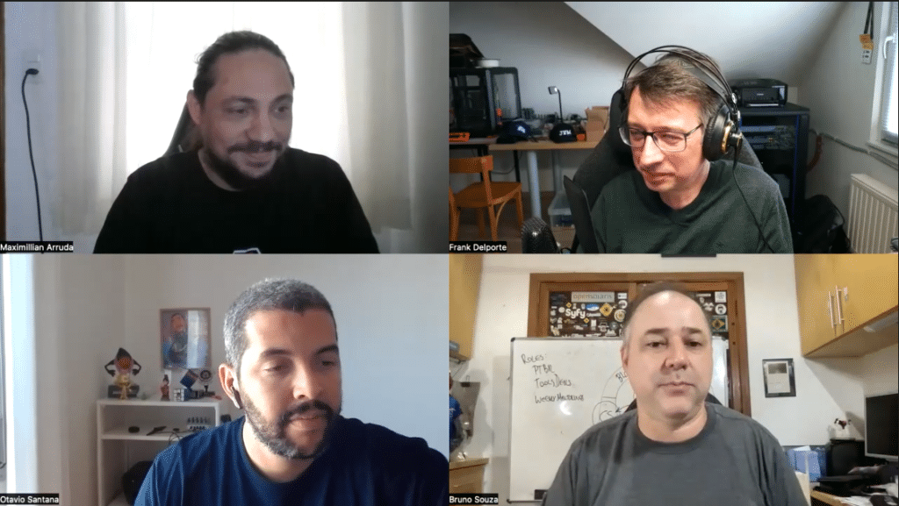

Once a month, the Foojay Podcast virtually visits a JUG to talk with the people behind it.

**SouJava, the Brazil JUG**, was founded in 1999, and according to Wikipedia, is recognized as the world's largest Java User Group with 40,000 members.

There's a lot we can learn from the people who have achieved this!



## Podcast Apps

You can listen and subscribe to the Foojay Podcast on:

* [Spotify](https://open.spotify.com/show/6CpTfgn9LirzJGAtc4ICdQ)
* [Apple Podcasts](https://podcasts.apple.com/be/podcast/foojay-io-the-friends-of-openjdk/id1652281304)
* And most others...

## **Guests**

* Otavio Santana
  * <https://twitter.com/otaviojava>
  * <https://www.linkedin.com/in/otaviojava/>
  * <https://www.youtube.com/@otaviojava>
* Maximillian Arruda
  * <https://twitter.com/maxdearruda>
  * <https://mastodon.social/@maxdearruda>
  * <https://www.linkedin.com/in/maxarruda/>
  * <https://linktr.ee/maxdearruda>
* Bruno Souza
  * <https://twitter.com/brjavaman>
  * <https://code4.life/>
  * Free book: <http://jav.mn/bestyear>

## Podcast host

* Frank Delporte
  * [@\[email protected\]](https://foojay.social/@frankdelporte)
  * <https://twitter.com/FrankDelporte>

## Links

* <http://soujava.org.br/>
* <https://www.meetup.com/SouJava/>
* <https://en.wikipedia.org/wiki/SouJava>

## Content

* 00'00 Intro
* 00'26 Introduction of the guests
* 02'39 History of Java and SouJava
* 08'03 About working on open source projects and the relationship with JUGs
* 12'55 How Max became part of the JUG organizers and how to incrementally improve your skills
* 23'38 Impact of Covid and the advantage of in-person meetings
* 28'20 The best ways to grow as a developer, the spiral of growth
* 51'29 Trying to get back to the "new normal" with the JUGs
* 01h01'12 Conclusions
