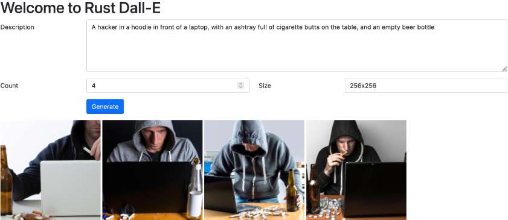

Last week, I decided to see the capabilities of OpenAI's image generation. However, I noticed that one has to pay to use the [web interface](https://labs.openai.com/), while the [API](https://api.openai.com/v1/images/generations) was free, even though rate-limited. Dall.E offers [Node.js and Python](https://platform.openai.com/docs/guides/images/language-specific-tips) samples, but I wanted to keep learning Rust. So far, I've created a [REST API](https://blog.frankel.ch/http-api-rust/). In this post, I want to describe how you can create a webapp with server-side rendering.

## The context

[Tokio](https://tokio.rs/) is a runtime for asynchronous programming for Rust; [Axum](https://github.com/tokio-rs/axum) is a web framework that leverages the former. I already used Axum for the previous REST API, so I decided to continue.

A server-side rendering webapp is similar to a REST API. The only difference is that the former returns HTML pages, and the latter JSON payloads. From an architectural point of view, there's no difference; from a development one, however, it plays a huge role.

There's no visual requirement in JSON, so ordering is not an issue. You get a struct; you serialize it, and you are done. You can even do it manually; it's no big deal - though a bit boring. On the other hand, HTML requires a precise ordering of the tags: if you create it manually, maintenance is going to be a nightmare. We invented **templating** to generate order-sensitive code with code.

While templating is probably age-old, PHP was the language to popularize it. One writes regular HTML and, when necessary, adds the snippets that need to be dynamically interpreted. In the JVM world, I used s and Apache Velocity, the latter, to generate RTF documents.

## Templating in Axum

As I mentioned above, I want to continue using Axum. Axum doesn't offer any templating solution out-of-the-box, but it allows integrating any solution through its API.

Here is a small sample of templating libraries that I found for Rust:

* [handlebars-rust](https://crates.io/crates/handlebars), based on Handlebars
* [liquid](https://crates.io/crates/liquid), based on Liquid
* [Tera](https://crates.io/crates/tera), based on Jinja, as the next two
* [askama](https://crates.io/crates/askama)
* [MiniJinja](https://crates.io/crates/minijinja)
* etc.

As a developer, however, I'm lazy by essence, and I wanted something integrated with Axum out of the box. A quick Google search lead me to [axum-template](https://github.com/Altair-Bueno/axum-template), which seems pretty new but very dynamic. The library is an abstraction over handlebars, askama, and minijinja. You can use the API and change implementation whenever you want.

## axum-template in short

Setting up axum-template is relatively straightforward. First, we add the dependency to Cargo:

```bash
cargo add axum-template
```

Then, we create an engine depending on the underlying implementation and configure Axum to use it:  

Here, I'm using Jinja:

```rust
type AppEngine = Engine<Environment<'static>>;                 //1

#[derive(Clone, FromRef)]
struct AppState {                                              //2
    engine: AppEngine,
}

#[tokio::main]
async fn main() {
    let mut jinja = Environment::new();                        //3
    jinja.set_source(Source::from_path("templates"));          //4
    let app = Router::new()
        .route("/", get(home))
        .with_state(AppState {                                 //5
            engine: Engine::from(jinja),
        });
}
```

1. Create a type alias
2. Create a dedicated structure to hold the engine state
3. Create a Jinja-specific environment
4. Configure the folder to read templates from. The path is relative to the location where you start the binary; it shouldn't be part of the `src` folder. I spent a nontrivial amount of time to realize it.
5. Configure Axum to use the engine

Here are the base items:



* `Engine` is a facade over the templating library
* Templates are stored in a hashtable-like structure. With the MiniJinja implementation, according to the configuration above, `Key` is simply the filename, *e.g.* , `home.html`
* The final `S` parameter has no requirement. The library will read its attributes and use them to fill the template.

I won't go into the details of the template itself, as the [documentation](https://docs.rs/minijinja/latest/minijinja/) is quite good.

## The impl return

It has nothing to do with templating, but this mini-project allowed me to ponder the `impl` return type. In my previous REST project, I noticed that Axum handler functions return `impl`, but I didn't think about it. It's indeed pretty simple:
> If your function returns a type that implements `MyTrait`, you can write its return type as `-> impl MyTrait`. This can help simplify your type signatures quite a lot!
>
> -- [Rust by example](https://doc.rust-lang.org/rust-by-example/trait/impl_trait.html#as-a-return-type)

However, it has interesting consequences. If you return a single type, it works like a charm. However, if you return more than one, you either need a common trait across all returned types or to be explicit about it.

Here's the original sample:

```rust
async fn call(engine: AppEngine, Form(state): Form<InitialPageState>) -> impl IntoResponse {
    RenderHtml(Key("home.html".to_owned()), engine, state)
}
```

If the page state needs to differentiate between success and error, we must create two dedicated structures.

```rust
async fn call(engine: AppEngine, Form(state): Form<InitialPageState>) -> Response {                     //1
  let page_state = PageState::from(state);
  if page_state.either.is_left() {
    RenderHtml(Key("home.html".to_owned()), engine, page_state.either.left().unwrap()).into_response()  //2
  } else {
    RenderHtml(Key("home.html".to_owned()), engine, page_state.either.right().unwrap()).into_response() //2
  }
}
```

1. Cannot use `impl IntoResponse`; need to use the explicit `Response` type
2. Explicit transform the return value to `Response`

## Using the application

You can build from the source or run the Docker image, available at [DockerHub](https://hub.docker.com/repository/docker/nfrankel/rust-dalle). The only requirement is to provide an OpenAI authentication token via an environment variable:

```bash
docker run -it --rm -p 3000:3000 -e OPENAI_TOKEN=... nfrankel/rust-dalle:0.1.0
```

Enjoy!



## Conclusion

This small project allowed me to discover another side of Rust: HTML templating with Axum. It's not the usual use case for Rust, but it's part of it anyway.

On the Dall.E side, I was not particularly impressed with the capabilities. Perhaps I didn't manage to describe the results in the right way. I'll need to up my prompt engineering skills.

In any case, I'm happy that I developed the interface, if only for fun.

The complete source code for this post can be found on [GitHub](https://github.com/nfrankel/rust-dalle).

**To go further:**

* [Axum](https://github.com/tokio-rs/axum)
* [axum-template](https://crates.io/crates/axum-template)
* [MiniJinja](https://docs.rs/minijinja/latest/minijinja/)
* [Dall.E webapp](https://labs.openai.com/)
* [Image generation API](https://platform.openai.com/docs/guides/images)

*Originally published at [A Java Geek](https://blog.frankel.ch/server-side-rendering-rust/) on April 30th, 2023*

*[JSP]: Java Server Pages
