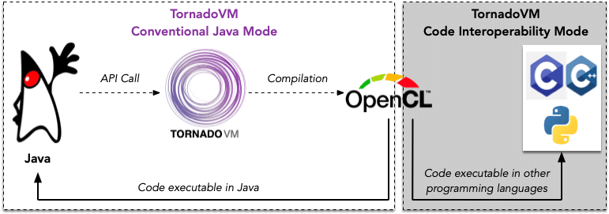

[TornadoVM](https://www.tornadovm.org/) is a programming framework for accelerating Java applications on heterogeneous devices, like multi-core CPUs, GPUs and FPGAs.

Java developers can use the TornadoVM API to prototype Java methods within their code bases for hardware acceleration.

TornadoVM is hardware-agnostic, but the generated code (i.e., kernels) for acceleration can be executed only through the TornadoVM runtime.

This blog outlines the key changes in TornadoVM to **enable code interoperability of kernels with other programming languages beyond Java**.

The following figure illustrates the code interoperability of the generated OpenCL kernels in TornadoVM.  

<figure class="aligncenter is-resized">
 
</figure>

**Note:** The code interoperability is prototyped as a complementary mode[^\[1\]^](#_ftn1){#_ftnref1} to enable TornadoVM-generated kernels to be transferable for execution from other programming languages, beyond Java.

Learning Outcome:

* Outline the changes needed in TornadoVM to achieve cross-language interoperability for the generated OpenCL kernels.
* Demonstrate how to use the code interoperability mode of TornadoVM.

## ***OpenCL Kernels generated by TornadoVM***

To understand the limitations that prevent the execution of TornadoVM kernels from other programming languages, we will follow an example. This example will use the TornadoVM v0.14.1 JIT compiler to generate a kernel for vector addition. The class file is [VectorAddIntCim.java](https://github.com/elegant-h2020/TornadoVM/blob/feat/code-interoperability-mode/examples/src/main/java/uk/ac/manchester/tornado/examples/VectorAddIntCim.java) and the accelerated method is ***vectorAdd***, as shown in the following code snippet:

```java
private static void vectorAdd(int[] a, int[] b, int[] c, int size) {
    for (@Parallel int i = 0; i < size; i++) {
        c[i] = a[i] + b[i];
    }
}
```

The ***vectorAdd*** method accepts four input parameters, three integer arrays (a, b, and c) and one integer value that stores the size of the arrays. The method performs the addition between the elements in the first two arrays and stores the result in the third array. The command to execute and display the generated kernel is:

```bash
$ tornado --printKernel -m tornado.examples/uk.ac.manchester.tornado.examples.VectorAddIntCim --params 1024
```

The signature of the generated kernel has 8 parameters, as shown in line 3 beneath:

```c
#pragma OPENCL EXTENSION cl_khr_fp64 : enable  
#pragma OPENCL EXTENSION cl_khr_int64_base_atomics : enable  
__kernel void vectorAdd(__global long *_kernel_context, __constant uchar *_constant_region, __local uchar *_local_region, __global int *_atomics, __global uchar *a, __global uchar *b, __global uchar *c, __private int size)
{
  ulong ul_8, ul_2, ul_0, ul_1, ul_12, ul_10; 
  int i_3, i_13, i_14, i_15, i_9, i_11, i_4; 
  long l_7, l_5, l_6; 

  // BLOCK 0
  ul_0  =  (ulong) a;
  ul_1  =  (ulong) b;
  ul_2  =  (ulong) c;
  i_3  =  get_global_id(0);
  // BLOCK 1 MERGES [0 2 ]
  i_4  =  i_3;
  for(;i_4 < 1024;)
  {
    // BLOCK 2
    l_5  =  (long) i_4;
    l_6  =  l_5 << 2;
    l_7  =  l_6 + 24L;
    ul_8  =  ul_0 + l_7;
    i_9  =  *((__global int *) ul_8);
    ul_10  =  ul_1 + l_7;
    i_11  =  *((__global int *) ul_10);
    ul_12  =  ul_2 + l_7;
    i_13  =  i_9 + i_11;
    *((__global int *) ul_12)  =  i_13;
    i_14  =  get_global_size(0);
    i_15  =  i_14 + i_4;
    i_4  =  i_15;
  }  // B2
  // BLOCK 3
  return;
}  //  kernel
```

TornadoVM uses the first 4 parameters to apply custom optimizations:

* **_kernel_context**: It is a pointer to a space that is allocated by TornadoVM, but it is not currently utilized.
* **_constant_region**: It is a pointer to an allocated space that is allocated by TornadoVM in the constant memory address space of a device.
* **_local_region**: It is a pointer to an allocated space that is allocated by TornadoVM in the local memory address space of a device.
* **_atomics**: It is a pointer to an atomic region that is allocated by TornadoVM.

The remaining four parameters correspond to the arguments of the accelerated method. In this case, these parameters are three pointers to arrays *a* , *b* , and *c* stored in the global memory of the device and one variable that stores the *size* of those arrays.

## ***Code Interoperability Mode for portable OpenCL kernels***

To use TornadoVM for generating OpenCL kernels that will be executable by any system out of the Java Virtual Machine, three primary modifications are necessary. We will describe each modification one by one (Steps 1-3), in order to build the final kernel incrementally.

The final kernel will be the one that can execute on any system out of the JVM. Each code snippet in this paragraph highlights the outcome of the corresponding modification on top of the previous modifications. A more elaborative description of all the modifications has been presented in [MoreVMs'23](https://github.com/stratika/stratika.github.io/blob/master/files/Stratikopoulos-MoreVMs2023-Preprint.pdf).

### Step 1. ***Modify the signature of kernels to remove TornadoVM-specific parameters***

The first modification is the elimination of the four TornadoVM-specific input parameters from the generated kernels. Thus, the kernel signature (line 1) after applying that modification would be similar to the layout of the compiled method, as follows:

```c
__kernel void vectorAdd(__global uchar *a, __global uchar *b, __global uchar *c, __private int size)
{
  ulong ul_0, ul_1, ul_2, ul_8, ul_12, ul_10;
  int i_3, i_4, i_14, i_15, i_11, i_13, i_9;
  long l_7, l_5, l_6;

  // BLOCK 0
  ul_0  =  (ulong) a;
  ul_1  =  (ulong) b;
  ul_2  =  (ulong) c;
  i_3  =  get_global_id(0);
  // BLOCK 1 MERGES [0 2 ]
  i_4  =  i_3;
  for(;i_4 < 1024;)
  {
    // BLOCK 2
    l_5  =  (long) i_4;
    l_6  =  l_5 << 2;
    l_7  =  l_6 + 24L;
    ul_8  =  ul_0 + l_7;
    i_9  =  *((__global int *) ul_8);
    ul_10  =  ul_1 + l_7;
    i_11  =  *((__global int *) ul_10);
    ul_12  =  ul_2 + l_7;
    i_13  =  i_9 + i_11;
    *((__global int *) ul_12)  =  i_13;
    i_14  =  get_global_size(0);
    i_15  =  i_14 + i_4;
    i_4  =  i_15;
  }  // B2
  // BLOCK 3
  return;
}  //  kernel
```

### Step 2. ***Skipping header offset for read/write accesses***

The second modification is about the memory accesses for read and write operations performed within a kernel. The TornadoVM JIT compiler creates an address to access the data in arrays (e.g., *a* , *b* , *c*) by adding:

* the base address that is stored in an unsigned long variable (*ul_0* , *ul_1* , *ul_2*),
* the corresponding index (originated from *get_global_id(0)*),
* the offset, stored in variable *l_7* which is used to skip the object header of a primitive array (keep in mind that primitive arrays are stored in the JVM as plain objects).

This process of calculating addresses for the memory accesses performed within the OpenCL kernels is aligned with the way that data is managed in JVM.

Therefore, to generate kernels that will be executable from other programming languages that run out of the JVM, it is necessary to remove the arithmetic offset associated with the object header (i.e., 24 bytes since CompressedOops is disabled). See line 18 of the following kernel:

```c
__kernel void vectorAdd(__global uchar *a, __global uchar *b, __global uchar *c, __private int size)
{
  ulong ul_10, ul_8, ul_12, ul_2, ul_1, ul_0;
  long l_6, l_7;
  int i_3, i_4, i_13, i_14, i_15, i_9, i_11, i_5;

  // BLOCK 0
  ul_0  =  (ulong) a;
  ul_1  =  (ulong) b;
  ul_2  =  (ulong) c;
  i_4  =  get_global_id(0);
  // BLOCK 1 MERGES [0 2 ]
  i_5  =  i_4;
  for(;i_5 < 1024;)
  {
    // BLOCK 2
    l_6  =  (long) i_5;
    l_7  =  l_6 << 2; // Header offset (24L) is skipped
    ul_8  =  ul_0 + l_7;
    i_9  =  *((__global int *) ul_8);
    ul_10  =  ul_1 + l_7;
    i_11  =  *((__global int *) ul_10);
    ul_12  =  ul_2 + l_7;
    i_13  =  i_9 + i_11;
    *((__global int *) ul_12)  =  i_13;
    i_14  =  get_global_size(0);
    i_15  =  i_14 + i_5;
    i_5  =  i_15;
  }  // B2
  // BLOCK 3
  return;
}  //  kernel
```

### Step 3. ***Disable replacement of parameters which hold constant values***

The third modification regards the disablement of the replacement of any method argument that holds a constant value with the actual constant value. This replacement is an optimization phase of the TornadoVM JIT compiler to avoid loading constant data from the memory. Instead of loading the data, the data is attached to the kernel code to be consumed directly.

For example, the code snippet of the previous paragraph should use the input argument of the *size* as the bound value in the for loop. However, the compiler replaces the argument value with the constant value `1024`. Although this optimization can increase performance, it can impact the re-purposing of a kernel as the loop boundary is a fixed value that cannot be overwritten.

For instance, a change in input argument of *size* would result in a recompilation in order to reflect that change in the kernel code. Thus, the CIM mode disables this optimization to produce a kernel that is portable across other programming languages. See line 15 of the kernel below:

```c
__kernel void vectorAdd(__global uchar *a, __global uchar *b, __global uchar *c, __private int size)
{
  ulong ul_10, ul_8, ul_12, ul_2, ul_1, ul_0;
  long l_6, l_7;
  int i_3, i_4, i_13, i_14, i_15, i_9, i_11, i_5;

  // BLOCK 0
  ul_0  =  (ulong) a;
  ul_1  =  (ulong) b;
  ul_2  =  (ulong) c;
  i_3  =  (ulong) size;
  i_4  =  get_global_id(0);
  // BLOCK 1 MERGES [0 2 ]
  i_5  =  i_4;
  for(;i_5 < i_3;) // Replacement of constant value
  {
    // BLOCK 2
    l_6  =  (long) i_5;
    l_7  =  l_6 << 2;
    ul_8  =  ul_0 + l_7;
    i_9  =  *((__global int *) ul_8);
    ul_10  =  ul_1 + l_7;
    i_11  =  *((__global int *) ul_10);
    ul_12  =  ul_2 + l_7;
    i_13  =  i_9 + i_11;
    *((__global int *) ul_12)  =  i_13;
    i_14  =  get_global_size(0);
    i_15  =  i_14 + i_5;
    i_5  =  i_15;
  }  // B2
  // BLOCK 3
  return;
}  //  kernel
```

## Summary

All the aforementioned steps outline the main features for prototyping the functionality of the **Code Interoperability Mode** in TornadoVM.

The CIM mode enables the generation of OpenCL kernels that can execute not only on the JVM side but also out of it.

It is not upstreamed at the moment and it is prototyped for the OpenCL backend.

However, it can be extended for the other compiler backends of TornadoVM (i.e., PTX, SPIRV).

The work on the CIM mode is published in MoreVMs'23 and its presentation is available on [YouTube](https://youtu.be/tZajQPNwVVQ).

To test this example, you can run the following:

```bash
$ git clone https://github.com/elegant-h2020/TornadoVM.git 
$ git checkout feat/code-interoperability-mode
# Build TornadoVM with a JDK version. In this case, OpenJDK 11.
$ make jdk-11-plus
$ tornado --printKernel --jvm="-Dtornado.cim.mode=True" -m tornado.examples/uk.ac.manchester.tornado.examples.VectorAddIntCim --params 1024
```

[^\[1\]^](#_ftnref1){#_ftn1} <https://github.com/elegant-h2020/TornadoVM/tree/feat/code-interoperability-mode>
