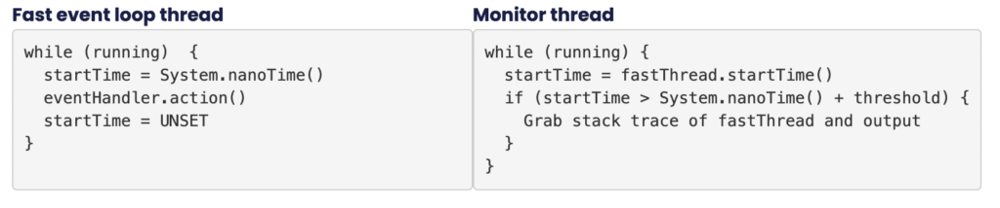

Chronicle's open source [Chronicle Threads](https://github.com/OpenHFT/Chronicle-Threads "Chronicle Threads ")library has a little known feature which is one of the first tools I get from my bag if a client reports that they are seeing latency outliers.

The usual way that a developer will measure their system for latency hotspots is to use a profiler, and modern profilers are amazing; there are numerous commercially available, but I generally find myself using Java Flight Recorder, async-profiler, or honest-profiler. These three are engineered to avoid the [safepoint bias](https://stackoverflow.com/questions/17839933/what-are-safe-points-and-safe-point-polling-in-context-of-profiling "safepoint bias"), and thus give very accurate results.

The problem with profilers however is that they present aggregate information – a profiler will tell you that function x is using 40% of your program's CPU – thus allowing you to prioritise your engineering efforts on optimising function x, but what they won't do is tell you that function y (which only takes 5% of your program's CPU) normally takes 1 microsecond to run, but occasionally takes 10,000, thus causing rare but important latency outliers.

Another problem with profilers is that it is very difficult to convince management that it is safe to run a profiler – even a low overhead profiler – in production, and some performance outliers only happen in production and can't be reproduced in test systems.

### Event Loop Monitoring

[Chronicle Threads](https://github.com/OpenHFT/Chronicle-Threads "Chronicle Threads") provides high performance event loop implementations and utility functions to help with threading and concurrency. Event loops are a very useful abstraction when building a low latency system, and event handlers are a simple mechanism to write safe code in a concurrent world. If you use Chronicle's [EventGroup](https://github.com/OpenHFT/Chronicle-Threads#event-loops "EventGroup") as your event loop then you get automatically enabled Event Loop Monitoring (this has historically also been known as Loop Block Monitoring).

Event Loop Monitoring monitors fast event loop threads and only looks for outliers – it does not measure and record all execution times, like a profiler. This solution works in dev, test and production environments, and adds essentially zero overhead (other than when a slow event handler is detected).

It works by checking to see if event handler latency remains within acceptable bounds. Latency is determined by measuring the time the action() method of the event loop's event handlers takes to run and whenever the action() method runs beyond an acceptable latency limit, the event loop monitor asks the JVM for a stack trace for the event loop thread, and outputs this to the log.

This can be explained using pseudo code:



### Best practice

The recommended way to use the Event Loop Monitor is to configure it initially with a relatively high threshold (default threshold is 100ms), run, examine stack traces and fix problems, decrease the threshold and repeat.

It is expected that in normal operation it will be configured to fire only 10s or 100s of times a day.

The only real downside to this approach is that we make use of Thread#getStackTrace to get the stack trace of the blocked thread, and this method is safepoint-biased i.e. the blocked thread has to come to a safepoint before the stack trace can be taken and this can lead to inaccurate stack traces. A mitigation to this is to sprinkle the code that you are focused on with Jvm.safepoint() calls, which are a no-op unless you set the jvm.safepoint.enabled system property.

### Sample code

If, for example you have some code that looks like this:

```
class MySlowHandler implements EventHandler {
   private final Random random = new Random();

   @Override
   public boolean action() {
       // simulate sometimes slow application logic
       if (random.nextInt(100) < 5)
           Jvm.pause(150);
       return true;
   }
}

EventGroup eg = EventGroup.builder().build();
eg.start();
eg.addHandler(new MySlowHandler());
... just let it run …
```

Then, once the Event Loop Monitor has started (it delays for a few seconds to allow everything to get started and warm up), you will start to see:

```
[main/~monitor] INFO net.openhft.chronicle.threads.VanillaEventLoop - core-event-loop thread has blocked for 102.3 ms.
    at java.lang.Thread.sleep(Native Method)
    at net.openhft.chronicle.core.Jvm.pause(Jvm.java:484)
    at ...MySlowHandler.action(EventGroupTest2.java:40)
    at ...
```

### Real-world examples

The below have all happened in the real world.

#### Non-blocking APIs

Many of Java's networking APIs are described as "non-blocking" but if you run some code that makes use of the TCP (or UDP) stack, together with the event loop monitor, on an untuned machine, you will see the event loop monitor firing plenty of times and highlighting blocking in the network stack e.g.:

```
2022-08-16 04:39:57.806 INFO  VanillaEventLoop - tr_sbe_core-event-loop thread has blocked for 4.3 ms.
    at sun.nio.ch.DatagramChannelImpl.receive(DatagramChannelImpl.java:392)
    at sun.nio.ch.DatagramChannelImpl.receive(DatagramChannelImpl.java:345)
    at software.chronicle.enterprise.network.datagram.UdpHandler.action(UdpHandler.java:118)
    at ...
```

#### Surprising synchronizeds

Again, in the Java network stack, the event loop monitor can expose some surprising (over)uses of the Java synchronized keyword.

See also this[tremendous article](http://blog.pisklov.me/blog/how-to-make-java-sockets-faster-or-how-to-be-naughty-with-your-jdk-2018-08-06/ " tremendous article") by Dmitry that details what we did about it.

#### Loading up a logger for the first time

On a heavily loaded machine, loading up a new library such as Log4J can be expensive e.g.:

```
net.openhft.chronicle.threads.MediumEventLoop - event-loop thread has blocked for 102 ms.
    at sun.misc.Launcher$AppClassLoader.loadClass(Launcher.java:355)
    at java.lang.ClassLoader.loadClass(ClassLoader.java:351)
    at org.apache.logging.log4j.util.LoaderUtil.loadClass(LoaderUtil.java:164)
    at org.apache.logging.slf4j.Log4jLogger.createConverter(Log4jLogger.java:416)
    at org.apache.logging.slf4j.Log4jLogger.<init>(Log4jLogger.java:54)
    at org.apache.logging.slf4j.Log4jLoggerFactory.newLogger(Log4jLoggerFactory.java:37)
    at org.apache.logging.slf4j.Log4jLoggerFactory.newLogger(Log4jLoggerFactory.java:29)
    at org.apache.logging.log4j.spi.AbstractLoggerAdapter.getLogger(AbstractLoggerAdapter.java:52)
    at org.apache.logging.slf4j.Log4jLoggerFactory.getLogger(Log4jLoggerFactory.java:29)
    at org.slf4j.LoggerFactory.getLogger(LoggerFactory.java:355)
    at org.slf4j.LoggerFactory.getLogger(LoggerFactory.java:380)
    at com.yourcompany.application.MyClass
    at ...
```

In this case, the machine was heavily loaded, logging was very infrequent, and the first log caused some classloading to take place, which is an expensive (and blocking) activity.

The lesson here is not to use logging in your fast path.

### Conclusion

For lightweight, always-on detection of latency outliers, the Event Loop Monitor is hard to beat.
