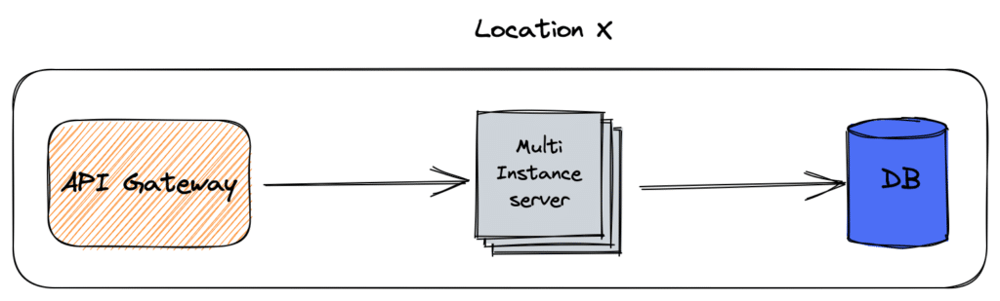
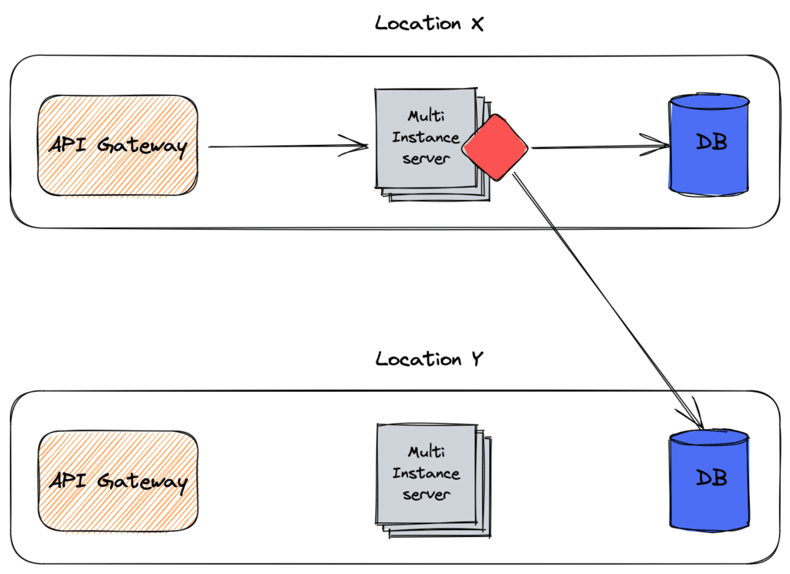
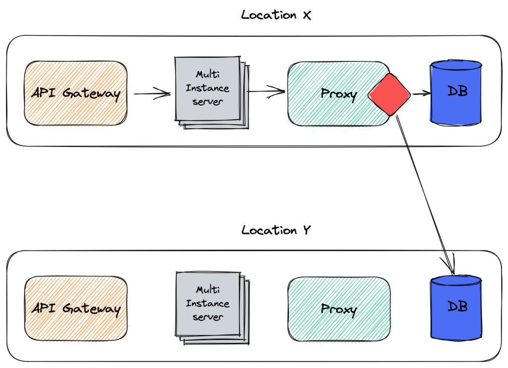
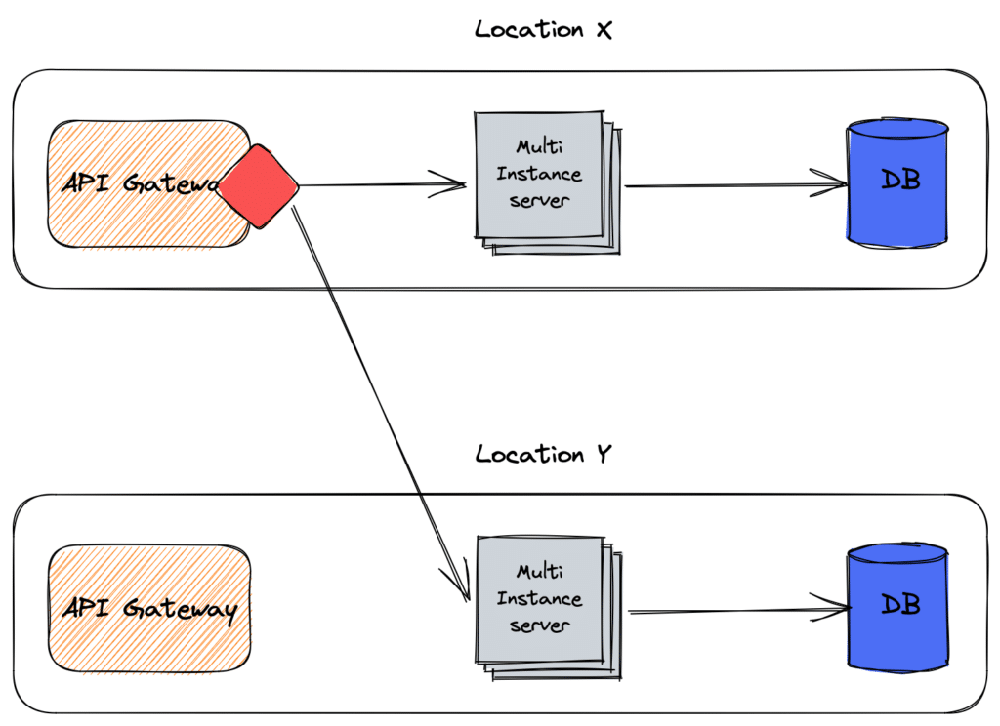
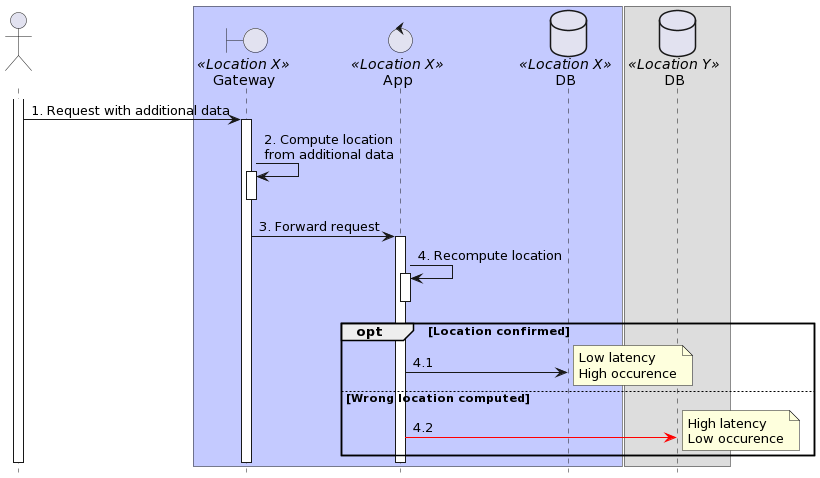

Cloud computing has opened a Pandora's Box of many original issues compared to sound old on-premise systems. I believe that chief among them is **Data Residency**, or Data Location.
> Data localization or data residency law requires data about a nation's citizens or residents to be collected, processed, and/or stored inside the country, often before being transferred internationally. Such data is usually transferred only after meeting local privacy or data protection laws, such as giving the user notice of how the information will be used and obtaining their consent.
>
> Data localization builds upon the concept of data sovereignty that regulates certain data types by the laws applicable to the data subjects or processors. While data sovereignty may require that records about a nation's citizens or residents follow its personal or financial data processing laws, data localization goes a step further in requiring that initial collection, processing, and storage first occur within the national boundaries. In some cases, data about a nation's citizens or residents must also be deleted from foreign systems before being removed from systems in the data subject's nation.
>
> -- [Data localization](https://en.wikipedia.org/wiki/Data_localization)

Data residency is an essential consideration for solution architects. Two critical scenarios can impact data residency requirements:

* Legal requirements: Certain countries have laws that require data to be stored within their territory. For example, China has strict [data residency laws](https://en.wikipedia.org/wiki/Data_Security_Law_of_the_People%27s_Republic_of_China), which can impact the storage of data for businesses operating in the country. It is essential to be aware of such regulations and ensure compliance.
* Jurisdictional challenges: Laws and regulations governing data privacy and security vary between countries. This gap can create challenges for cloud providers in managing data storage and access across multiple countries, as they need to comply with the laws and regulations of each jurisdiction. For instance, the and the Patriot Act in the US allow US actors to access the data of EU citizens, even though they are protected by the . As a cloud service provider responsible for upholding EU regulations, you could be liable under EU law if such access happens.

Most Cloud providers offer this capability, *e.g.* , [Google](https://cloud.google.com/architecture/framework/security/data-residency-sovereignty). However, it assumes the provider has Data Centers in the desired location. For example, Google has none in China.

I want to offer a couple of options to handle this requirement in this post.

## Where to compute the location?

In this section, I'll list a couple of approaches to compute the location.

### In the code

We can manage Data Residency at the code level. It's the most flexible option, but it also requires writing code and thus is the most error-prone.

Specifics depend on your tech stack, but it goes like this:

1. Get the request
2. Optionally query additional data
3. Establish where the data should go to
4. Write the data in the computed location

Here's what it looks like:

X and Y correspond to different countries.

### In a library/framework

From an architectural point-of-view, the driver approach is similar to the one above. However, the code doesn't compute the final location. The library/framework offers *sharding*:
> A database shard, or simply a shard, is a horizontal partition of data in a database or search engine. Each shard is held on a separate database server instance, to spread load.
>
> Some data within a database remains present in all shards,\[a\] but some appear only in a single shard. Each shard (or server) acts as the single source for this subset of data.
>
> -- [Shard (database architecture)](https://en.wikipedia.org/wiki/Shard_(database_architecture))

The application knows about all countries' database URLs in this approach and needs to keep track of them.

For example, the Apache ShardingSphere project provides a JVM database driver with such sharding capabilities. One can configure the driver to write data to a shard depending on a key, *i.e*, the location.
> Apache ShardingSphere is an ecosystem to transform any database into a distributed database system, and enhance it with sharding, elastic scaling, encryption features \& more.
>
> The project is committed to providing a multi-source heterogeneous, enhanced database platform and further building an ecosystem around the upper layer of the platform. Database Plus, the design philosophy of Apache ShardingSphere, aims at building the standard and ecosystem on the upper layer of the heterogeneous database. It focuses on how to make full and reasonable use of the computing and storage capabilities of existing databases rather than creating a brand new database. It attaches greater importance to the collaboration between multiple databases instead of the database itself.
>
> -- [Apache ShardingSphere](https://shardingsphere.apache.org/document/current/en/overview/)

### In a proxy

The proxy approach is similar to the library/framework approach above; the difference comes from the former running inside the application, while the latter is a dedicated component.

The responsibility of keeping track of the databases falls now on the proxy's shoulders.

Apache ShardingSphere provides both alternatives, a JDBC driver and a proxy.

### In the API Gateway

Another approach is to compute the location in the API Gateway.

Interestingly enough, part of a Gateway's regular responsibilities is to keep part of the upstreams.

## How to compute the location?

This section will consider what we need to compute the location. Let's examine the case of an HTTP request from a client to a system. The system as a whole, regardless of the specific component, needs to compute the location to know where to save the data.

Two cases can arise: the HTTP request may carry enough information to compute where to send the data to or not. In the former case, it may be because of a client cookie, the previous request set relevant data in hidden fields on a web page, or any other approach. In the latter case, the system needs additional data.

If the data is self-sufficient, it's better to forward the request to the correct country as early in the request processing chain as possible, *i.e.*, from the API Gateway. Conversely, if the data requires enrichment, it should be done as close to the data enrichment component as possible.

Imagine a situation where data location is based on a user's living place. We could set a cookie to store this information or data that allows us to compute it client-side. Every request would carry the data, and we wouldn't need additional data to compute the location. However, storing sensitive data on the client is a risk, as malicious actors could tamper with storage.

To improve security, we could keep everything server-side. The system would need to request additional data to compute the location on every request.

## A tentative proposal

We can reconcile the best of both worlds at the cost of additional complexity. Remember that everything is a trade-off; your mileage may vary depending on your context. The following is a good first draft that you can refine later.

1. The first request can hit any of the two (or more) endpoints. The response adds additional metadata: which Gateway to query on the subsequent request, plus enough data so it can compute the location.
2. On the second request, the client queries the correct Gateway. Note that for resiliency purposes, there can be two layers. Also, the request adds data necessary to compute the location.
3. The Gateway receives the request, calculates the location, and forwards it to the app in the same location.
4. The app receives the request and does what it's supposed to do using a sharding-friendly library.
5. The library computes the location **again**. In most cases, it should yield the current location; if the data has been tampered with or the topology has changed since the initial computation, it switches to the correct location.

In the latter case, we incur a performance penalty. However, our design makes it unlikely to happen. The main principle is that we should select the correct location as early as possible but leave the option to move to the right location if needed.

Here's the sequence diagram of the second call, with location metadata already added:

## Conclusion

In this post, we looked at data residency and designed a draft architecture to implement it. In the next post, we will delve into the technical details.

**To go further:**

* [Data Security Law of the People's Republic of China](https://en.wikipedia.org/wiki/Data_Security_Law_of_the_People%27s_Republic_of_China)
* [Foreign Intelligence Surveillance Act](https://en.wikipedia.org/wiki/Foreign_Intelligence_Surveillance_Act)
* [Patriot Act](https://en.wikipedia.org/wiki/Patriot_Act)
* [GDPR](https://en.wikipedia.org/wiki/General_Data_Protection_Regulation)
* [Apache ShardingSphere](https://shardingsphere.apache.org/)

*Originally published at [A Java Geek](https://blog.frankel.ch/data-residency/1/) on May 5^th^, 2023*

*[FISA]: Foreign Intelligence Surveillance Act
*[GDPR]: General Data Protection Regulation
