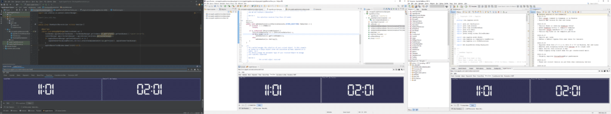
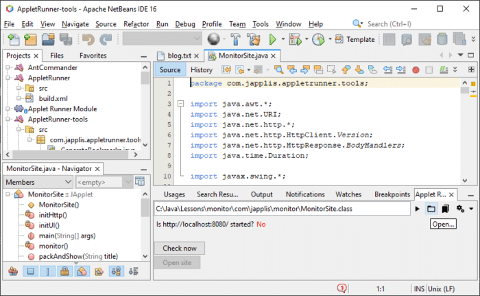
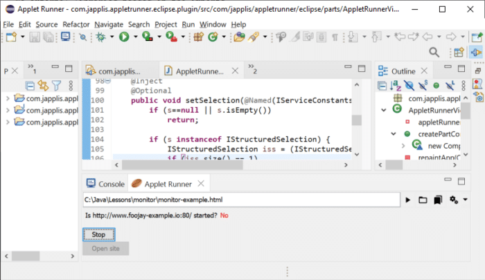
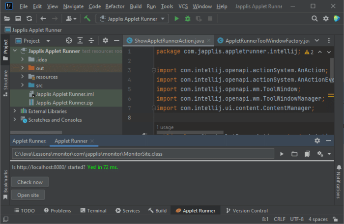

[](time-zones.png)

**Having written many Java GUI applications, I thought it would be cool to run them embedded in IntelliJ IDEA, Eclipse and NetBeans. I didn't want to write three plugins per application so I came up with this solution.**

The embedded panel criteria {#h2-0-the-embedded-panel-criteria}
---------------------------------------------------------------

To convert my Java Swing applications to run embedded in an IDE, I had to put the user interface in a panel with minimal implementation changes. I came up with these *should ideally* criteria:

* Not depend on any IDE class
* Not require a new external library for the application
* Have a `JRootPane` like the application `JFrame`, implements `RootPaneContainer` interface
* Be able to specify the main class and a classpath
* Be able to pass parameters
* Have a life cycle like a plugin
* Load (new) applications dynamically like a plugin
* Not prevent the application to run normally in a window

Hopefully Java has a class for this: **`JApplet`**   

Applets were designed (in 1995) to run embedded Java applications in an HTML browser, but nothing in the API prevents them to run in an application that is not an HTML browser.

Let's write our monitoring applet {#h2-1-let-s-write-our-monitoring-applet}
---------------------------------------------------------------------------

Let's write and deploy an application that monitors localhost and shows us when it's ready for testing.  

This way you can continue coding in your IDE without spending a few minutes a day checking the logs for the *server started* text.

<pre class="EnlighterJSRAW" data-enlighter-language="java" data-enlighter-highlight="12,25,32">package com.japplis.monitor;

import java.awt.*;
import java.net.URI;
import java.net.http.*;
import java.net.http.HttpClient.Version;
import java.net.http.HttpResponse.BodyHandlers;
import java.time.Duration;

import javax.swing.*;

public class MonitorSite extends JApplet {

    private boolean isAppletMode = true;
    private JLabel questionLabel;
    private JLabel answerLabel;
    private JButton checkNowButton;
    private JButton openSiteButton;
    private Timer checkSiteTimer;
    private HttpClient httpClient;
    private HttpRequest httpRequest;
    private String server;

    @Override
    public void start() {
        initHttp();
        initUI();
        monitor();
    }

    private void initHttp() {
        String host = isAppletMode ? getParameter("host") : null;
        if (host == null) host = "localhost";
        String port = isAppletMode ? getParameter("port") : null;
        if (port == null) port = "8080";
        server = "http://" + host + ":" + port + "/";
        httpClient = HttpClient.newBuilder()
                .version(Version.HTTP_1_1)
                .connectTimeout(Duration.ofSeconds(3))
                .build();
        httpRequest = HttpRequest.newBuilder()
            .uri(URI.create(server))
            .timeout(Duration.ofSeconds(5))
            .build();
    }

    private void initUI() {
        JPanel infoPanel = new JPanel();
        // Normally I would use MiG Layout but it's not the point of this demo
        infoPanel.setLayout(new BoxLayout(infoPanel, BoxLayout.PAGE_AXIS));
        JPanel statusPanel = new JPanel(new FlowLayout(FlowLayout.LEADING));
        statusPanel.setAlignmentX(LEFT_ALIGNMENT);
        questionLabel = new JLabel("Is " + server + " started?");
        answerLabel = new JLabel();
        checkNowButton = new JButton("Check now");
        checkNowButton.setAlignmentX(LEFT_ALIGNMENT);
        checkNowButton.addActionListener(ae -&gt; startStopMonitor());
        statusPanel.add(questionLabel);
        statusPanel.add(answerLabel);
        infoPanel.add(statusPanel);
        infoPanel.add(checkNowButton);
        openSiteButton = new JButton("Open site");
        openSiteButton.addActionListener(ae -&gt; {
            try {
                Desktop.getDesktop().browse(URI.create(server));
            } catch (Exception ex) {
                answerLabel.setText(ex.getMessage());
            }
        });
        infoPanel.add(openSiteButton);
        infoPanel.add(Box.createVerticalGlue());
        add(infoPanel);
    }

    private void startStopMonitor() {
        boolean started = !checkNowButton.getText().equals("Check now");
        if (started) {
            checkSiteTimer.stop();
            checkNowButton.setText("Check now");
            answerLabel.setText("");
        } else {
            checkSiteTimer = new Timer(10_000, ae -&gt; monitor());
            checkSiteTimer.setInitialDelay(0);
            checkSiteTimer.start();
            checkNowButton.setText("Stop");
        }
    }

    private void monitor() {
        long startRequest = System.currentTimeMillis();
        httpClient.sendAsync(httpRequest, BodyHandlers.discarding())
            .thenApply(response -&gt; {
                if (response.statusCode() == 200) {
                    responseOk(startRequest);
                } else {
                    responseFailed();
                }
                return response;
            })
            .exceptionally(ex -&gt; {
                responseFailed();
                return null;
            });
    }

    private void responseOk(long startRequest) {
        long responseTime = System.currentTimeMillis() - startRequest;
        answerLabel.setText("Yes! in " + responseTime + " ms.");
        answerLabel.setForeground(Color.GREEN);
        openSiteButton.setEnabled(true);
    }

    private void responseFailed() {
        answerLabel.setText("No");
        answerLabel.setForeground(Color.RED);
        openSiteButton.setEnabled(false);
    }

    @Override
    public void stop() {
        if (checkSiteTimer != null &amp;&amp; checkSiteTimer.isRunning()) {
            checkSiteTimer.stop();
        }
    }

    public void packAndShow(String title) {
        start();
        JFrame frame = new JFrame(title);
        frame.setContentPane(getContentPane());
        frame.pack();
        frame.setLocationRelativeTo(null);
        frame.setDefaultCloseOperation(WindowConstants.EXIT_ON_CLOSE);
        frame.setVisible(true);
    }

    // Launch the same application from the command line or via a desktop link or from the IDE
    public final static void main(String[] args) {
        MonitorSite applet = new MonitorSite();
        applet.isAppletMode = false;
        SwingUtilities.invokeLater(() -&gt; applet.packAndShow("Monitor Site"));
    }
}</pre>

### Let's analyze the code {#h3-2-let-s-analyze-the-code}

* No external libraries needed in the imports
* Extends `JApplet`. Extending `java.applet.Applet` would also work.
* Override the `start()` method. Overriding the `init()` method would also work.
* Write your code like you would write a normal Swing application.

### Compile, package, run and distribute {#h3-3-compile-package-run-and-distribute}

As it's a single file, **compilation** can be done with

```shell
javac com\japplis\monitor\MonitorSite.java
```

For this example, as it's a single class file, there no need to package it in a Jar file.

If you decide to **package** it in a Jar file, Applet Runner will use the *Main-Class* and the *Class-Path* attributes of the *Manifest.mf* file if you specify the Jar file location in the URL field.

To **run** the application in your IDE, install and start Applet Runner, use the *Open...* icon and select the class file.



<br />

It is also possible to specify another class file or to add external libraries or to pass parameters to the applet. For this you need to create an HTML file with an [\<applet\>](https://developer.mozilla.org/en-US/docs/Web/HTML/Element/applet) tag or a JNLP file with an [\<applet-desc\>](https://docs.oracle.com/javase/tutorial/deployment/deploymentInDepth/embeddingJNLPFileInWebPage.html) tag.

<pre class="EnlighterJSRAW" data-enlighter-language="html" data-enlighter-linenumbers="false">&lt;html&gt;
&lt;body&gt;
&lt;applet codebase="." code="com.japplis.monitor.MonitorSite.class" archives="" width="300" height="100"&gt;
  &lt;param name="host" value="www.foojay-example.io"&gt;
  &lt;param name="port" value="80"&gt;
  &lt;p&gt;This applet won't work in the browser, &lt;a href="https://www.japplis.com/applet-runner/"&gt;use Applet Runner&lt;/a&gt;.&lt;/p&gt;
&lt;/applet&gt;
&lt;/body&gt;
&lt;/html&gt;</pre>



<br />

If you have JDK 18 or higher installed, you can test the monitoring by executing *jwebserver -p 8080*.



<br />

For the **distribution**, copy the html and class files on a network drive or website and send the location of the file to your colleagues.

### Limitations {#h3-4-limitations}

* The Applet class is deprecated for removal, so it may not work forever.
* Applet Runner supports local files and https URLs. Applet Runner Pro also supports http URLs.
* There is no security manager for the applets started in Applet Runner.
* If you try to open an http or https applet that is not in your bookmarks, you will get a warning window before.
* You can only run one applet at a time in Applet Runner. Applet Runner Pro allows multiple applets running.

For the lazy ones {#h2-5-for-the-lazy-ones}
-------------------------------------------

Applet Runner is distributed with more than 100 applet bookmarks. And more are coming soon, such as [Control Dashboard](https://www.japplis.com/control-dashboard/) to monitor websites 😉.  

Here is a small overview:

* **Office**: PDF, MS Word, Excel, CSV and Powerpoint viewers
* **Text**: clipboard history, JSON, XML, YAML viewers and more than 50 text utilities
* **Dictionaries**: English, French, Spanish, Dutch, German, Italian, Portuguese, Hebrew, Czech, Danish, Swedish, Norwegian and more
* **Time**: clock, timer, time zones, stopwatch and more
* **Other**: VNC Client, MP3 player, HTML browser (JavaFX WebView), terminal (JediTerm) and games



Links {#h2-6-links}
-------------------

* [Applet Runner website](https://www.japplis.com/applet-runner/)
* [Applet Runner plugin in **JetBrains** Marketplace](https://plugins.jetbrains.com/plugin/16682-applet-runner/)
* [Applet Runner plugin in **Eclipse** Marketplace](https://marketplace.eclipse.org/content/applet-runner-eclipse)
* [Applet Runner plugin in Apache **NetBeans** Plugin Portal](https://plugins.netbeans.apache.org/catalogue/?id=57)
