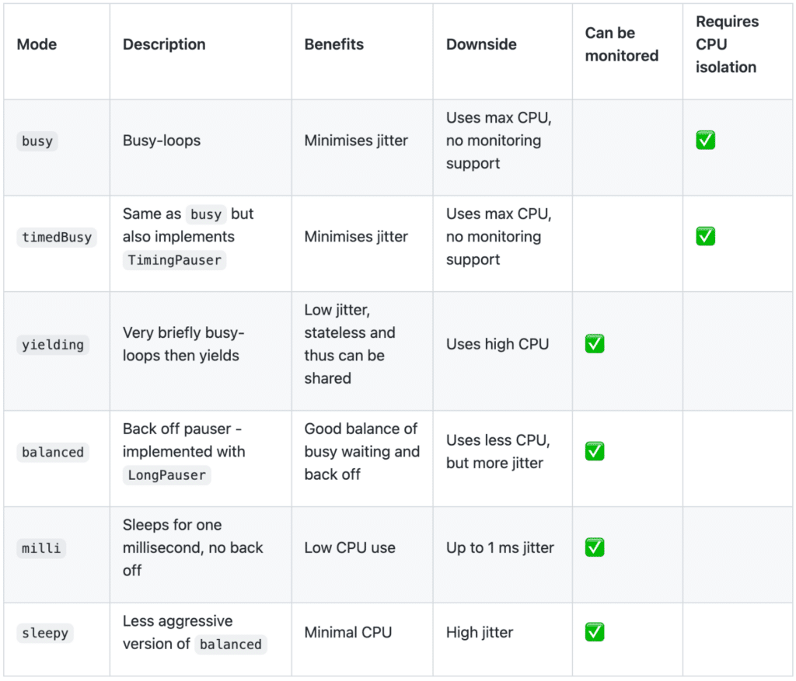
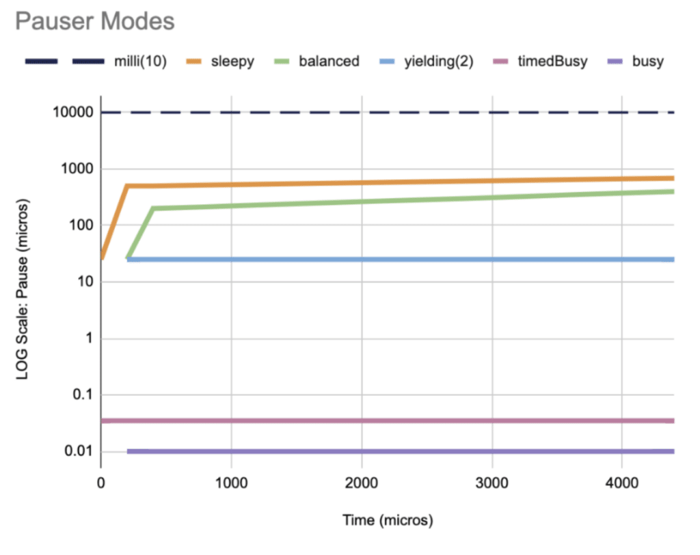

Typically in low-latency development, a trade-off must be made between minimising latency and avoiding excessive CPU utilisation.

This article explores how Chronicle's Pausers can be used to automatically apply a back-off strategy when there is no data to be processed, providing an excellent balance between resource usage and responsive, low-latency, low-jitter applications.

### Description of the Problem

In a typical application stack multiple threads are used for servicing events, processing data, pipelining etc.

An important design consideration is how threads become aware that there is work to do, with some general approaches including:

* **Signal/Notification** : In this case the receiving thread yields (is added to a wait queue) until notified by another thread. This has the benefit of low resource consumption, however there is a relatively high latency of at least 20-50 microseconds (and likely much more -- see below) to reschedule the thread in response to a signal.  
  -**Busy Waiting**: In this case the receiving thread continually spins checking for some indication that there is work to do. This has the benefit of quick response (low latency) when there is work for the thread to do, however comes at the expense of high CPU usage, wasting cycles when there is nothing to do. In addition, the constant high CPU usage in turns leads to appreciably higher power demand, and associated cooling load.
* **Fixed Sleep**: In this case, when there is no further work to be done the receiving thread sleeps for a fixed period of time before checking again for more work. This has the benefit of low resource usage, but the clear downside of this strategy is that worst case latency is at least as large as the sleep period.

### The Problems with Sleeping, and how to Sleep Soundly

The actual behaviour when a thread requests a `sleep` varies not only across platforms, but also across different versions and usage patterns for the same platform.

For example, POSIX requires that `sleep` calls always yield the CPU, whereas Linux allows `sleep` implementations (including `sleep`, `usleep`, `nanosleep` and similar) to busy wait in some cases. For older versions of Linux with fixed timer ticks (usually 100Hz, 250Hz, or 1000Hz) there was a relatively large penalty when yielding to the scheduler, which encouraged the use of busy-waiting internally within `sleep` calls for short periods.

By contrast, more recent versions of Linux have more sophisticated schedulers using dynamic ticks, which enable more accurate short-period interactions with a sleeping thread, which largely removes the need for busy-waiting to achieve low `sleep` periods.

The following rules of thumb generally apply across recent Linux versions for standard processes (ie those running with normal permissions under the standard scheduler):

* `sleep` requests \~1us can in principle be serviced with reasonable accuracy
* In general, even short `sleep` periods will not busy wait -- although extremely short periods almost certainly will
* `sleep` requests of \~1ms and \~1us reduce CPU usage to \~1% and \~10% respectively compared with busy waiting (100%)

While the above suggests that even relatively short sleeps of \~1us could potentially provide a useful compromise between latency and resource use, the major issue is scheduling: as soon as the sleeping process is fully context switched off a core, the overhead to reschedule can be orders of magnitude higher than the intended `sleep` period.

Here again, there is no single answer as to how the system will behave. The key is to bias the situation as much as possible to avoid the thread being switched from a core, and the use of thread affinity (to avoid the thread being moved to another core) and CPU isolation (to avoid another process/thread contending with the thread) can be very effective in this case `1`.

Careful use of affinity, isolation, and short `sleep` periods can result in responsive, low-jitter environments, which use considerably fewer CPU resources compared with busy waiting.

`1` Other options include running with real-time priorities, however we want to keep the focus of this document on standard setups as much as possible

### What are Pausers?

[Chronicle](https://chronicle.software/ "Chronicle")'s Pausers provide a sliding scale of behaviours between the above extremes of Signal/Notification, Fixed Sleep, and Busy Waiting, by using an intelligent back-off strategy which enables a more nuanced control to better balance low latency and resource utilisation.

The general strategy is to busy-wait for a short period before incrementally backing off to longer and longer pauses (consuming decreasing amounts of CPU) when there is no work to be done.

Different strategies (Pauser Modes) are available depending on the task, with the canonical way of using a Pauser being:

```
while (running) {
       if (pollForWork())  // pollForWork returns true if work was done
           pauser.reset(); // minimal or no pause path
       else
           pauser.pause(); // incrementally back off
    }
```

### Pauser Modes

This table illustrates several different Pauser modes, as well as the benefits and downsides to using each of them.

  
*Table 1. Pauser Modes*

[Chronicle](https://chronicle.software/ "Chronicle") Pausers allow for optimising the CPU load for a given level of responsiveness and latency. This trade-off can be configured with high accuracy, without needing to make significant changes to your application code. For instance, if you realise that a particular thread needs to be more responsive, you can change its Pauser from a back-off Pauser to a busy Pauser and vice versa.

Of note, the Busy Pauser used for lowest latency internally uses busy waiting, and as such will consume 100% of one core. It is therefore important to ensure Busy Pausers do not contend for the same core, and CPU affinity and isolation should be considered when using Busy Pausers to control this aspect. More information about CPU isolation and its benefits in event loops can be found [here](https://chronicle.software/why-the-cool-kids-use-event-loops/ "here").

### Performance of Pauser Modes

The graph below plots the time waiting for an event (x-axis) against the pause/response time for a selection of Pausers.

The `Busy`, `TimedBusy`, `Yielding` and `Millis` Pausers show flat response times regardless of how long the thread waits to receive an event, but with varying response times due to the different yielding strategies vs CPU usage. In many cases `TimedBusy` in particular provides an excellent compromise between low latency and CPU usage.

The `Sleepy` and `Balanced` strategies show step changes and steady growth in response times reflecting the incremental back-off the longer the thread waits to receive an event.

  
*Figure 1. Pauser Mode Performance*

### Conclusion

This article explored the use of Chronicle's Pausers and how they are used to build responsive, low-latency, low-jitter applications with relatively low CPU utilisation.

This in turn helps maximise hardware utilisation, while also reducing power consumption, helping reduce costs to your organisation.
