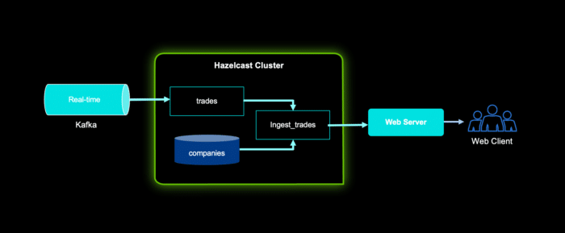
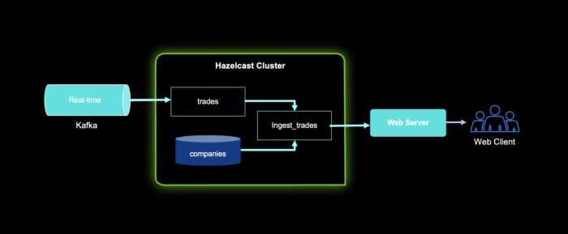

Developing high-performance large-stream processing applications is a challenging task.

Choosing the right tool(s) is crucial to get the job done; as developers, we tend to focus on performance, simplicity, and cost.

However, the cost becomes relatively high if we end up with two or more tools to do the same task.

Simply put, you need to multiply development time, deployment time, and maintenance costs by the number of tools.

## Kafka

Kafka is great for event streaming architectures, continuous data integration (ETL), and messaging systems of record (database).

However, Kafka has some challenges, such as a complex architecture with many moving parts, it can't be embedded, and it's a centralized middleware, just like a database.

Moreover, Kafka does not offer batch processing and all intermediate steps are materialised to disk in Kafka. This leads to enormous disk space usage.

## Hazelcast

Hazelcast is a real-time stream processing platform that can enhance Kafka (and many more sources).

Hazelcast can address Kafka's challenges mentioned above by simplifying deployment and operations with ultra-low latency and a lightweight architecture making it the right tool for edge (restricted) environments.

This article aims to take your Kafka applications to the next level.

Hazelcast can process real-time and batch data in one platform, making it the right platform to use because it enriches your Kafka applications with "context."



## Prerequisites

* If you are new to Kafka or you're just getting started, I recommend you start with [Kafka Documentation](https://kafka.apache.org/documentation/)
* If you are new to Hazelcast or you're just getting started, I recommend you start with [Hazelcast Documentation](https://docs.hazelcast.com/home/)
* For Kafka, you need to download Kafka, start the environment, create a topic to store events, write some events to your topic, and finally read these events. Here's a [Kafka Quick Start](https://kafka.apache.org/quickstart).
* For Hazelcast, you can use either the [Platform](https://docs.hazelcast.com/hazelcast/latest/) or the [Cloud](https://docs.hazelcast.com/cloud/overview). I will use a local cluster.

## Step 1

Start a Hazelcast local cluster: This will run a Hazelcast cluster in client/server mode and an instance of Management Center running on your local network.

```
brew tap hazelcast/hz

brew install <a href="/cdn-cgi/l/email-protection" class="__cf_email__" data-cfemail="d9b1b8a3bcb5bab8aaad99ecf7ebf7ea">[email protected]</a>

hz -V

hz start
```

To add more members to your cluster, open another terminal window and rerun the start command.

**Optional**: The Management Center is a user interface for managing and monitoring your cluster. It is a handy tool that you can use to check clusters/nodes, memory, and jobs.

```
brew tap hazelcast/hz

brew install <a href="/cdn-cgi/l/email-protection" class="__cf_email__" data-cfemail="a1c9c0dbc4cdc2c0d2d58cccc0cfc0c6c4ccc4cfd58cc2c4cfd5c4d3e1948f938f92">[email protected]</a>

hz-mc -V

hz-mc start
```

We will use the SQL shell, the easiest way to run SQL queries on a cluster. You can use SQL to query data in maps and Kafka topics.

The Results can be sent directly to the client or inserted into maps or Kafka topics. You can do so by running the following command:

```
bin/hz-cli sql
```

We need a Kafka Broker, I'm using a Docker image to run it (on the same cluster/device as my Hazelcast member).

```
docker run --name kafka --network hazelcast-network --rm hazelcast/hazelcast-quickstart-kafka
```

## Step 2

Once we have all components up and running, we need to create a Kafka mapping to allow Hazelcast to access messages in the trades topic.

```
CREATE MAPPING trades (

    id BIGINT,

    ticker VARCHAR,

    price DECIMAL,

    amount BIGINT)

TYPE Kafka

OPTIONS (

    'valueFormat' = 'json-flat',

    'bootstrap.servers' = '127.0.0.1:9092'

);
```

Here, you configure the connector to read JSON values with the following fields:

```
{

  "id"

  "ticker"

  "price"

  "amount"

}
```

You can write a streaming query to filter messages from Kafka:

```
SELECT ticker, ROUND(price * 100) AS price_cents, amount

  FROM trades

  WHERE price * amount > 100;
```

This will return an empty table, we need to insert some data:

```
INSERT INTO trades VALUES

  (1, 'ABCD', 5.5, 10),

  (2, 'EFGH', 14, 20);
```

Go back to the terminal where you created the streaming query.

You should see that Hazelcast has executed the query and filtered the results.

## Step 3

While the previous step is possible to execute with Kafka only, this step will enrich the data in Kafka message, taking your Kafka processing to the next step. Kafka messages are often small and contain minimal data to reduce network latency. For example, the trades topic does not contain any information about the company that's associated with a given ticker.

To get deeper insights from data in Kafka topics, you can join query results with data in other mappings. In order to do this, we need to create a mapping to a new map in which to store the company information that you'll use to enrich results from the trades topic. Then we need to add some entries to the companies map.

```
CREATE MAPPING companies (

__key BIGINT,

ticker VARCHAR,

company VARCHAR,

marketcap BIGINT)

TYPE IMap

OPTIONS (

'keyFormat'='bigint',

'valueFormat'='json-flat');

INSERT INTO companies VALUES

(1, 'ABCD', 'The ABCD', 100000),

(2, 'EFGH', 'The EFGH', 5000000);
```

Use the JOIN clause to merge results from the companies map and trades topic so you can see which companies are being traded.

```
SELECT trades.ticker, companies.company, trades.amount

FROM trades

JOIN companies

ON companies.ticker = trades.ticker;
```

In another SQL shell, publish some messages to the trades topic.

```
INSERT INTO trades VALUES

  (1, 'ABCD', 5.5, 10),

  (2, 'EFGH', 14, 20);
```

Go back to the terminal where you created the streaming query that merges results from the companies map and trades topic.

## Step 4

Finally, we will ingest query results into a Hazelcast map. We create a mapping to a new map in which to ingest your streaming query results.

```
CREATE MAPPING trade_map (

__key BIGINT,

ticker VARCHAR,

company VARCHAR,

amount BIGINT)

TYPE IMap

OPTIONS (

'keyFormat'='bigint',

'valueFormat'='json-flat');
```

Submit a streaming job to your cluster that will monitor your trade topic for changes and store them in a map, you can check running jobs by running SHOW JOBS;

```
CREATE JOB ingest_trades AS

SINK INTO trade_map

SELECT trades.id, trades.ticker, companies.company, trades.amount

FROM trades

JOIN companies

ON companies.ticker = trades.ticker;

INSERT INTO trades VALUES

(1, 'ABCD', 5.5, 10),

(2, 'EFGH', 14, 20);
```

Now you can query your trade_map map to see that the Kafka messages have been added to it.

```
SELECT * FROM trade_map;
```

The following diagram explains our demo setup; we have a Kafka topic called trades which contains a collection of trades that will be ingested into a Hazelcast cluster.



Additionally, a companies map represents companies' data stored in the Hazelcast cluster.

We create a new map by aggregating trades and companies into ingest_trades map.

We used SQL but you can send results to a web server/client.

So here you have it, Hazelcast can be used to enrich Kafka applications with contextual data, this can be done programmatically, using the command line, or through SQL as demonstrated in this article.

Hazelcast can process real-time data and batch data in one platform, making it the right platform to use with Kafka applications by providing "context" to your Kafka applications.

We are looking forward to your feedback and comments about this article.

Don't hesitate to share your experience with us in our community [Slack](https://slack.hazelcast.com/) or [Github](https://github.com/hazelcast) repository.
