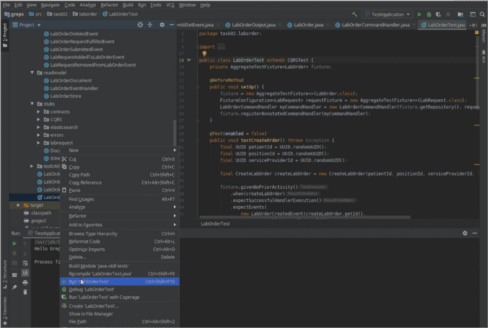
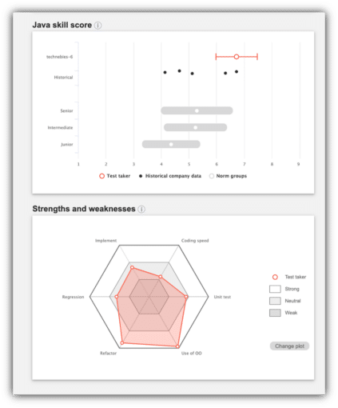

***Learn the why and how of a group of enthusiastic people implementing a new sort of developer certification that objectively measures dev skills. We also invite you to join our initiative if you're interested via #certification [on the Foojay slack](https://bit.ly/join-foojay-slack).***

There's a lot of debate about what defines a 'good' developer. Of course, there are different dimensions to start with. Perhaps you can say there are two main ones: soft and technical skills. Soft skills include collaboration skills, communication, organizational sensitivity, personal leadership and so on.

All very important without a doubt, but you can still produce code without them. Technical skills would be needed for that. But how to measure this and how to keep track of how skills improve over time? This is what Foojay developer certification is about, measuring these skills. For now specifically Java developer skills.

Surely, there is already Java certification out [there](https://education.oracle.com/oracle-certification-path/pfamily_48#path-p-prod-product_267 "there"). Oracle is offering Oracle Certified Associate and Professional certification for Java 8, 11 and 17. The LTS versions. Notably, associate seems to be discontinued, since it's only available for Java 8, but there's no good information about that available.

### Determine the seniority of a developer

While these certification programs are definitely set up well, with excellent books and exams, you can argue they do not measure actual coding skills. If you have finished one of the certification programs you can testify that you will learn to think like a compiler and that you need to internalize important parts of the Java API.

It also measures what you know at one point in time and it's unclear what the value of this is in 5 years. So, probably a good starting point for junior Java developers, but as you progress in your career other skills like refactoring, regression, unit testing and implementation strategies become important and make a difference in the quality of the code.

This is not objectively addressed in the Oracle certification exam and probably the reason why in tech interviews with experienced developers having such a certificate is usually not a huge topic if someone received an associate or professional certification anywhere in their career.

As a result, many different dev teams came up with all kinds of homegrown interview strategies. While this may work, some of these strategies are also quite 'subjective'.

Maybe the interviewer thinks it's crucial you understand how memory management under the hood works and what the differences are between the heap and the stack, that you can explain how to implement Dijkstra's algorithm, or that you're able to explain which issue a big decimal solves.

This is more about understanding concepts, and it's quite possible that it makes sense for a specific role to test this, but it's still not about skills.

Whiteboard coding and coding assignments are a way to assess skills. But how objective is that? I've seen a number of times that within the same organization the same assessment is judged differently. This is not ideal and it's also a lot of work for the candidate.

Sometimes an assignment takes days to complete, and if you're unlucky and - for instance as a consultant - looking for a new assignment you might need to make a number of coding assignments in parallel. Even though you've been coding for many years.

### How to measure coding skills

We can do better as an industry, we think at Foojay. We came across a platform called GrepS that uses a model that is based on [scientific research](https://scholar.google.com/citations?user=p_E5TZcAAAAJ&hl=no&oi=ao "scientific research") (mostly by Assistant Professor Gunnar Bergerson from the Oslo University) about what skills predict the productivity of developers. This model has been tested on a large group of developers and now has sufficient data points to come to an 'objective' score for these skills.

What's extra interesting is that this platform has the ability to rotate tasks for each test taker and that, because of the model the scores of the tasks can be objectively compared and the final test score of tests with different tasks can be compared one on one.

The idea would be that a certification method based on this platform offers a time-effective, objective and reusable testing method that results in a score and assessment that is recognizable and understandable across teams and organizations. Wouldn't that be great?

Just do a certification test once and different people can use your score and wouldn't require you to do all these coding assignments. And you can retake the test anytime if you think you have improved. Moreover: you can find out how to improve based on the test result! Also would it allow organizations to track progress.

### Foojay certification committee

With this idea in mind, we had several brainstorms with many members of Foojay and next a Foojay certification committee was formed. about 10 months ago that had several meetings (thanks Rodolfo Felipe, Maarten Mulders, Geertjan Wielenga, Jago de Vreede and others).

This with the goal to create an industry standard for Java developer certification that measures coding skills based on the aforementioned platform by using IntelliJ or Eclipse (at the moment).

This committee has reviewed the platform and indicated what kind of tasks the platform should have. Currently, two tasks have been implemented, one for concurrency and one about stream processing (thanks Jan Hendrik Kuperus and all others). The following two images give an impression of the test taking experience and the feedback afterwards.  
  
*Figure 1: Screenshot of a task in IntelliJ*   
  
*Figure 2: Sample of feedback and score from a test result*

These have been demoed recently by a spin-off workgroup to the certification committee and there's a lot of enthusiasm now about the progress and new goals and steps have been defined to make it a success.

Ps. good to know: anyone is welcome to the committee, just join #certification on the [Foojay slack](https://join.slack.com/t/foojay/shared_invite/zt-1vbgap6ad-~jEIrCj1_v6_AyRe9imXJw "Foojay slack") and reach out to us.

### Next steps: create tasks and test drive!

The next goal is to create more tasks and this is something we would like to do with the community, meaning you.

Please give us input or help with coding examples.

We've set up a GitHub repo for these tasks, because they're open source, but not publicly available.

Of course, test takers shouldn't be able to research the tasks for the test upfront.

Therefore reach out to @roywasse on the Foojay Slack if you want access.

You can also expect a follow up post about the task making progress here!

And... we're also reaching out to JUG and comparable communities to test drive the alpha version of the certification. Let us know if you're up for it!
