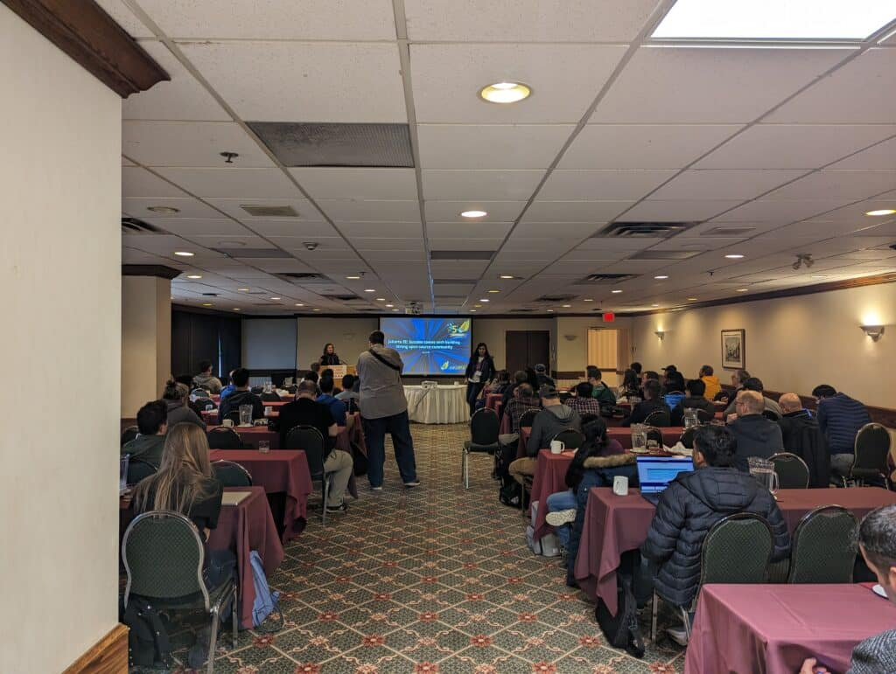
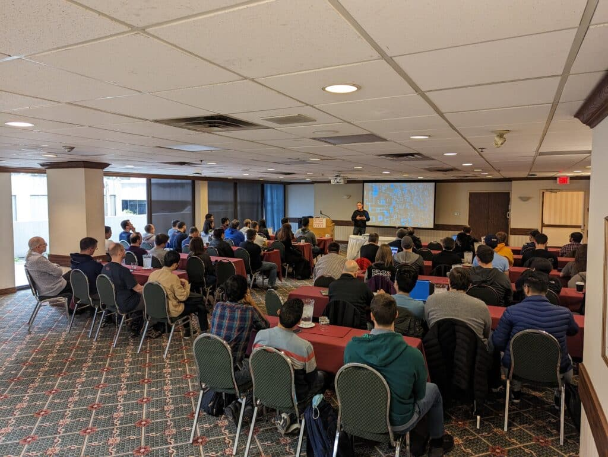
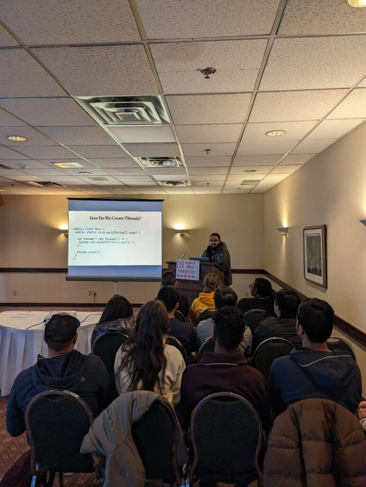
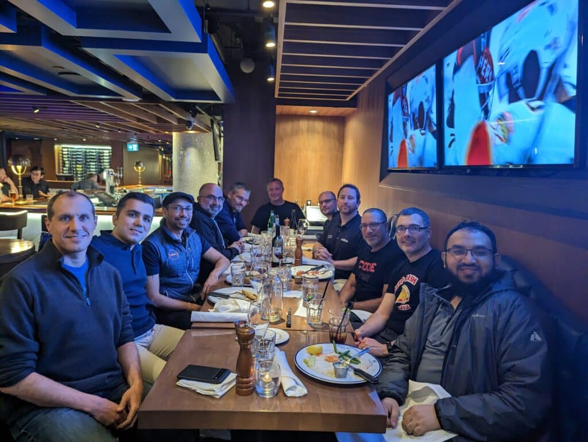
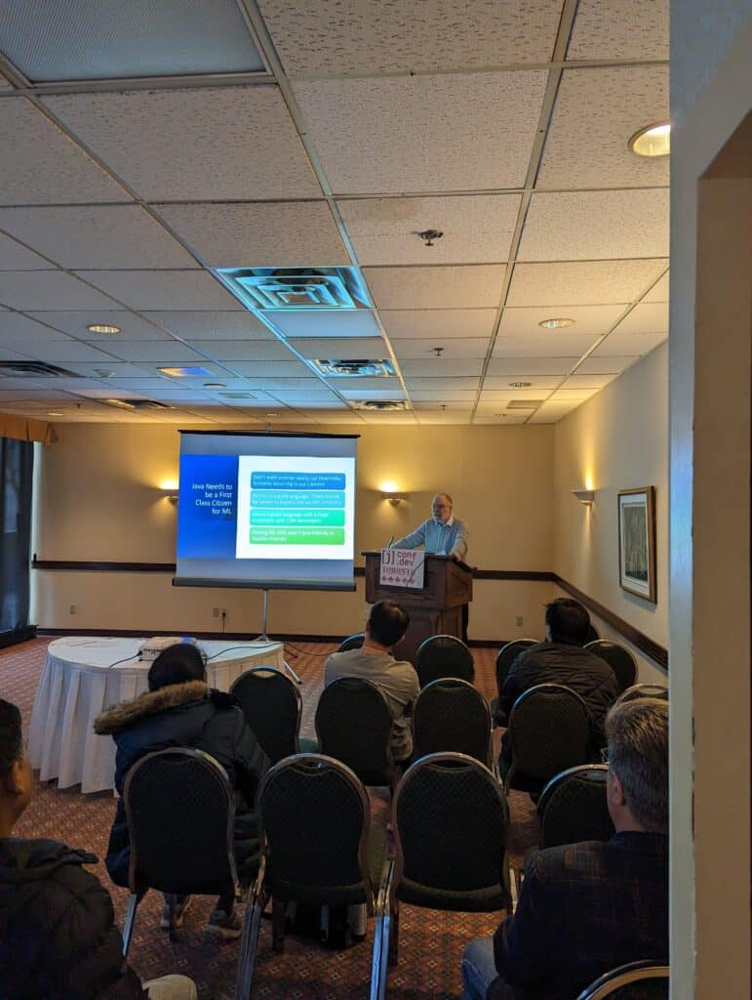
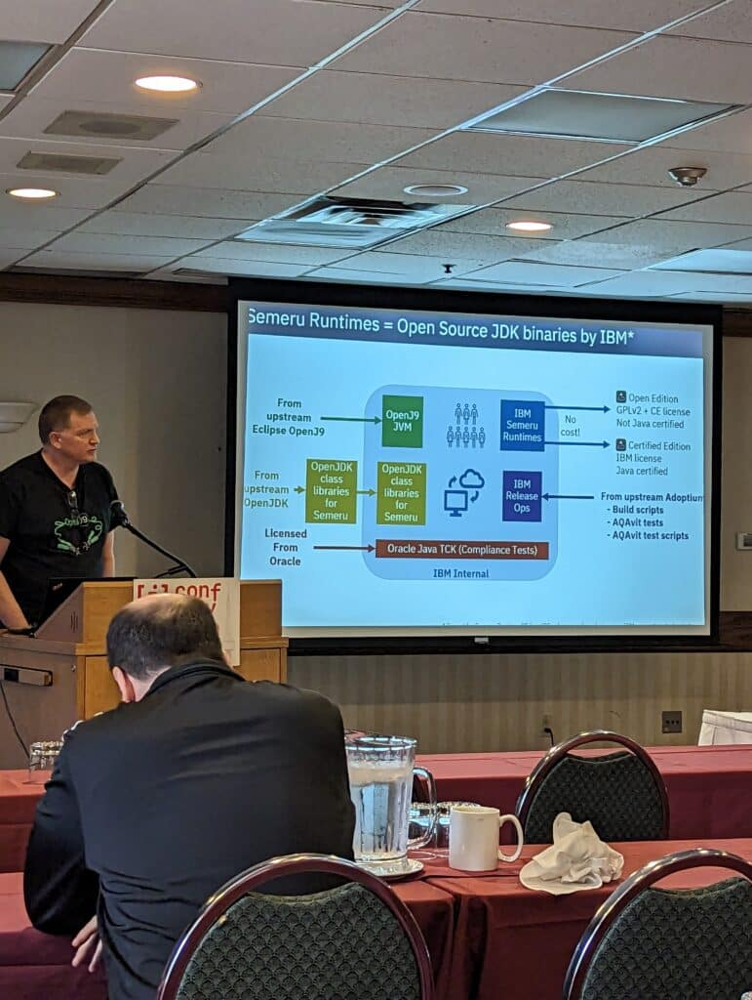
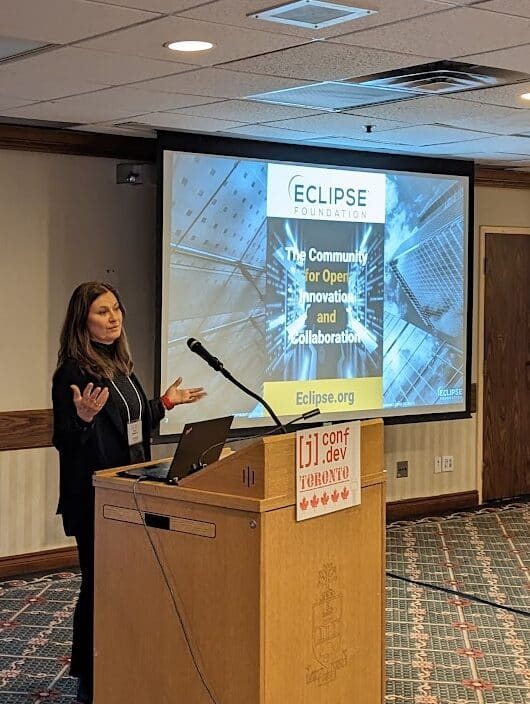

[JConf Toronto](https://2023.jconftoronto.dev/), held on May 3rd, 2023, was a memorable gathering of Java enthusiasts and experts from both the local and global communities.

The event took place at the Chestnut Conference Center, Toronto, featuring a wide variety of in-depth sessions, interactive Q\&As, and two insightful keynote presentations.

Notable keynote speakers included [Venkat Subramaniam](https://twitter.com/venkat_s) and [Neal Ford](https://nealford.com/).

Venkat's keynote, titled "**Know Your Java**," was a deep dive into the intricacies of Java, demonstrating that there's always something new to learn, even in a language that's over two decades old.

Neal Ford closed the conference with a keynote on architecture, emphasizing the importance of thinking beyond the code when constructing a comprehensive application.

 

I had the unique opportunity to present a talk titled "**Virtual Threads: Ushering in a New Era of Concurrency**". This presentation was one of the highlights of my speaking career, as it was met with a great deal of interest from the audience. The discussion centred around Project Loom and how it introduces virtual threads.

These lightweight threads aim to significantly reduce the complexity of writing, maintaining, and monitoring high-throughput concurrent applications on the Java platform. The interactive Q\&A session was particularly engaging, with many attendees continuing the discussion even after the session had concluded.

Overall, it was an enriching experience sharing my knowledge and engaging with an enthusiastic audience on such a transformative topic.

One of the highlights of the conference for me was finally meeting some of the colleagues I'd only known online.

I had the opportunity to meet [Vincent Mayers](https://www.linkedin.com/in/vincentmayers/), a tech community leader, Java Champion, and organizer of [Devnexus](https://devnexus.com/) and the [Atlanta Java Users Group](https://ajug.org/), in person for the first time.

Sharing meals and shaking hands with people I've previously only interacted with through screens added a whole new layer of connection and camaraderie to the event​​.

The audience greatly appreciated the variety of presentations from luminaries in the field and local experts.

The in-depth 1-hour sessions, coupled with interactive Q\&A, proved to be a big hit with the developers in attendance.

Furthermore, the 'hallway track' facilitated continued discussions on a range of topics, from Java on Kube to new features in Java to cloud architecture.

[Pratik Patel](https://www.linkedin.com/in/prpatel/), one of the organizers, along with Vincent Mayers and [Jonathan Fuerth](https://www.linkedin.com/in/jonathan-fuerth-1b751a123/), have done an exceptional job orchestrating the event, and he announced that JConf Toronto would be back next year, promising a bigger and better event​.

Looking forward, JConf Toronto is expected to return around the same time in 2024.

With the success of the first event, the hope is that the Toronto Java developer community will be back for an even bigger and better second event.

For those who could not attend, presentation slides will be posted on the conference website. However, it's worth noting that the true value of an event like this lies in in-person participation.

The '**hallway track**', the networking opportunities at the pub afterwards, and the direct access to presenters are integral parts of the overall experience that virtual interactions cannot replace.

<figure class="wp-block-image size-large is-resized is-style-default">
 
</figure>

In conclusion, JConf Toronto 2023 was a confluence of minds and ideas, weaving together the threads of innovation and camaraderie, setting the stage for an even more inspiring event in 2024.
