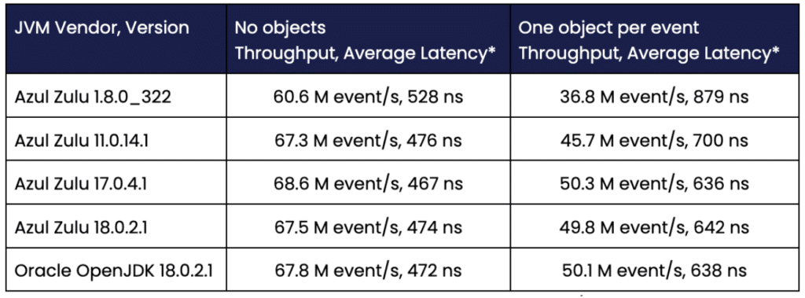
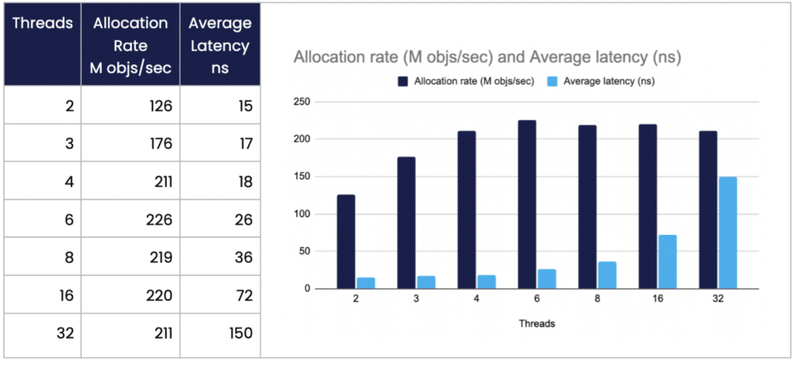

This article looks at a benchmark passing events over TCP/IP at 4 billion events per minute using the net.openhft.chronicle.wire.channel package in [Chronicle Wire](https://chronicle.software/wire/?utm_source=article&utm_medium=foojay&utm_campaign=java-is-fast "Chronicle Wire") and why we aim to avoid object allocations.

One of the key optimisations is creating almost no garbage. Allocation is supposed to be a very cheap operation and garbage collection of very short lived objects is also very cheap.

Does not allocating really make such a difference? What difference does one small object per event (44 bytes) make to the performance in a throughput test where GC pauses are amortised?

While allocation is as efficient as possible, it cannot avoid the memory pressure on the L1/L2 caches of your CPUs and when many cores are busy, they are contending for memory in the shared L3 cache.

### Results

#### Benchmark on a Ryzen 5950X with Ubuntu 22.10.



*Across 16 clients, an event is sent in both directions. The Average Latency = 2* 16 / throughput

**ns :** nano seconds  
**M events/s:** million events per second

One extra allocation for each event adds 166 ns or so. This doesn't sound like much; however, in this highly optimised, high throughput context, this reduces performance by 25%. The default behaviour for reading events in Chronicle Wire is to reuse the same object for the same event type every time on deserialisation. This provides a simple object pooling strategy to avoid allocations. If this data has to be persisted it must first be copied, because Objects are reused to reduce Object creation.

#### Only 0.3% of the time was in the Garbage Collector

The total time spent in GC was about 170 milliseconds per minute or 0.3% of the time. It is the allocations rather than the time to clean up these very short-lived objects that takes time.

#### Allocation Rate and Average Latency

A benchmark that just creates short lived TopOfBook objects, across multiple CPUs, produces a similar result. This suggests that the rate new objects can be allocated is quickly saturated by even a small number of cores, increasing the average latency with more threads. This is for the same small 44 byte object.

#### On a Ryzen 5950X with Ubuntu 21.10, Java 17.0.4.1



### The Benchmarks

  

In this benchmark, sixteen clients connect to a simple microservice that takes each event and sends it back again. All events are (de)serialised POJOs with an event type. This translates to an asynchronous RPC call.

```
public class EchoTopOfBookHandler implements TopOfBookHandler {
   private TopOfBookListener topOfBookListener;

   @Override
   public void topOfBook(TopOfBook topOfBook) {
       if (ONE__NEW_OBJECT)
           topOfBook = topOfBook.deepCopy();
       topOfBookListener.topOfBook(topOfBook);
   }
```

In this case, deepCopy() creates a new TopOfBook and sets all the fields.

The benchmark can be run in two modes, one where no objects are allocated and one where any object is allocated and initialised, allowing us to measure the difference this makes. Each event is modelled as an asynchronous RPC call to make testing, development and maintenance easier.

```
public interface TopOfBookListener {
   void topOfBook(TopOfBook topOfBook);
}
```

Low latency software can be very fast but also difficult to work with, slowing development. In other words, often to create low latency software developers adopt low level techniques that are hard to read and maintain. This overhead can slow down your development. With Chronicle Wire your data structures are easy to read and debug, yet do not sacrifice performance.

Using events modelled in YAML we can support Behaviour Driven Development of the microservice.

For testing purposes your data can be represented in a simple yaml format, as seen below:

```
# This is the in.yaml for the microservice of topOfBook that was described above. 
# first top-of-book
---
topOfBook: {
 sendingTimeNS: 2022-09-05T12:34:56.789012345,
 symbol: EUR/USD,
 ecn: EBS,
 bidPrice: 0.9913,
 askPrice: 0.9917,
 bidQuantity: 1000000,
 askQuantity: 2500000
}
...
# second top-of-book
---
topOfBook: {
 sendingTimeNS: 2022-09-05T12:34:56.789123456,
 symbol: EUR/USD,
 ecn: EBS,
 bidPrice: 0.9914,
 askPrice: 0.9918,
 bidQuantity: 1500000,
 askQuantity: 2000000
}
...
```

#### The Code

Is available [here](https://chronicle.software/email-submit/ "here").

This library is used in [Chronicle Services](https://chronicle.software/services/?utm_source=article&utm_medium=foojay&utm_campaign=java-is-fast "Chronicle Services")

#### Conclusion

Java can be very fast, however it can be well worth avoiding object creation.

The cost of object creation can be far higher than the cost of cleaning them up if they are very short lived.
