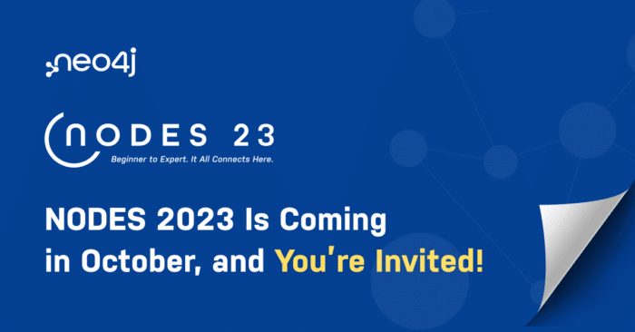

NODES is back for its fifth year on October 26, 2023!

It's the biggest graph community gathering dedicated to learning how to integrate graph technologies into ML and dev projects.

For 24 hours nonstop, speakers from around the world will showcase their implementations, tools, models, and more – sharing everything they've learned over this past year.

Join thousands of fellow developers, data scientists, and data engineers to get firsthand knowledge from peers who will show you the ropes – for free! So be sure to [save your seat](https://neo4j.registration.goldcast.io/events/6fb85147-ca27-4310-9dec-cb345c53bd6f "save your seat")!

Last year, NODES featured an impressive lineup of 110+ sessions from more than 100 speakers from over 30 countries. This year, we expect it to be even better.

### What to Expect at NODES 2023

* **24-hour, multi-time zone coverage:** There will be live sessions no matter whether you're attending virtually from the Americas, Europe, the Middle East, Africa, or the Asia Pacific.
* **Knowledge and skill development:** Highly technical, interactive content will be delivered by your fellow developers and data scientists, offering value to beginners and experts alike. The three session tracks for 2023 are building intelligent applications, graph-powered machine learning and AI, and visualization.
* **Coverage of the latest topics:** We are expanding conference content to include trending topics like LLMs, graph neural networks, and more.
* **An energetic, collaborative community:** At NODES, speakers present live talks and engage in thoughtful Q\&As, showcasing the latest implementations and prototypes using graphs. It's a fantastic opportunity to build your skills while you connect and exchange ideas.

### Submit a Talk

The [Call for Papers](https://dev.neo4j.com/417Qa1D "Call for Papers") (CFP) is open now through June 30, 2023.

Make sure your presentations are educational, show the use of graph-related technologies, and focus on how to solve problems using code, data models, Cypher, and other best practices.

There are three types of talks:

* 30-minute talks, with additional time for Q\&A
* 10-minute lightning talks (great for first-time speakers!)
* 2-hour workshops

This year's three conference tracks are:

* **Building Intelligent Applications: APIs, Libraries, and Frameworks**   
  Tools and best practices to create graph-powered applications with any software stack and programming language. Topics also include the open source development of frameworks and libraries for the graph ecosystem.
* **Machine Learning and AI**   
  How graph technology provides context for your data and enhances the accuracy of ML and AI projects. Topics may include graph neural networks, responsible AI, graph embeddings, knowledge graph mining, and much more
* **Visualization: Tools, Techniques, and Best Practices**   
  Techniques and tools for exploring hidden and unexpected patterns in your data and presenting complex relationships. Topics may include knowledge graphs, ethical data practices, data representation, and much more.

### Discover Talks From Previous NODES

Get an idea of what to expect at the conference from our collection of talks from previous years:

NODES 2019 [Schedule](https://neo4j.com/online-summit/ "Schedule") and [Playlist](https://www.youtube.com/playlist?list=PL9Hl4pk2FsvUbsmdPrqTRF_DWvUb4z5AK "Playlist")  

NODES 2020 [Schedule](https://neo4j.com/nodes-2020/agenda/ "Schedule") and [Playlist](https://www.youtube.com/playlist?list=PL9Hl4pk2FsvWZB-w5Du5wy-HivtNqp5ly "Playlist")  

NODES 2020 [Extended Playlist](https://www.youtube.com/playlist?list=PL9Hl4pk2FsvVnz4oi0F8UXiD3nMNqsRO2 "Extended Playlist")  

NODES 2021 [Schedule](https://neo4j.brand.live/c/2021nodes-homepage "Schedule") and [Playlist](https://neo4j.com/video/nodes-2021/ "Playlist")  

NODES 2022 [Schedule](https://hopin.com/events/nodes-2022/registration "Schedule") and [Playlist](https://neo4j.com/video/nodes-2022/ "Playlist")

### Brainstorm Your Presentation Idea

Want help deciding what to talk about at NODES 2023? Explore postings on the [community forums](http://community.neo4j.com/ "community forums") and see if your presentation can answer a question, contribute to a discussion, or share relevant best practices.

You could also ask the community for feedback and suggestions on this [conference and event forum thread](https://community.neo4j.com/c/conferences-meetups-events/65 "conference and event forum thread"). You might find someone who wants to collaborate on a topic!

All set? [Submit a talk!](https://dev.neo4j.com/417Qa1D "Submit a talk!")
