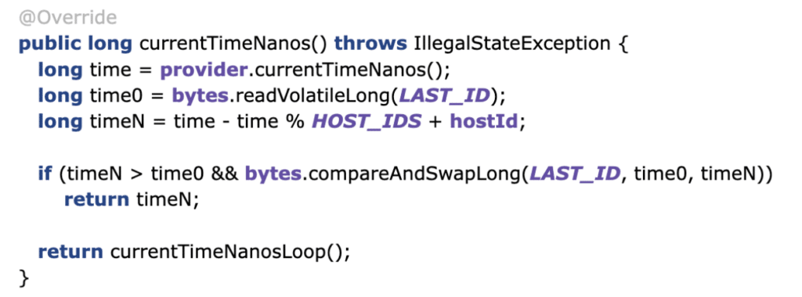
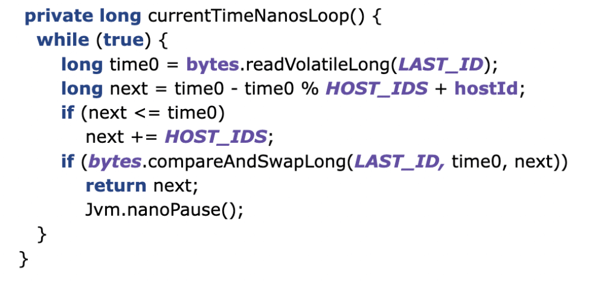
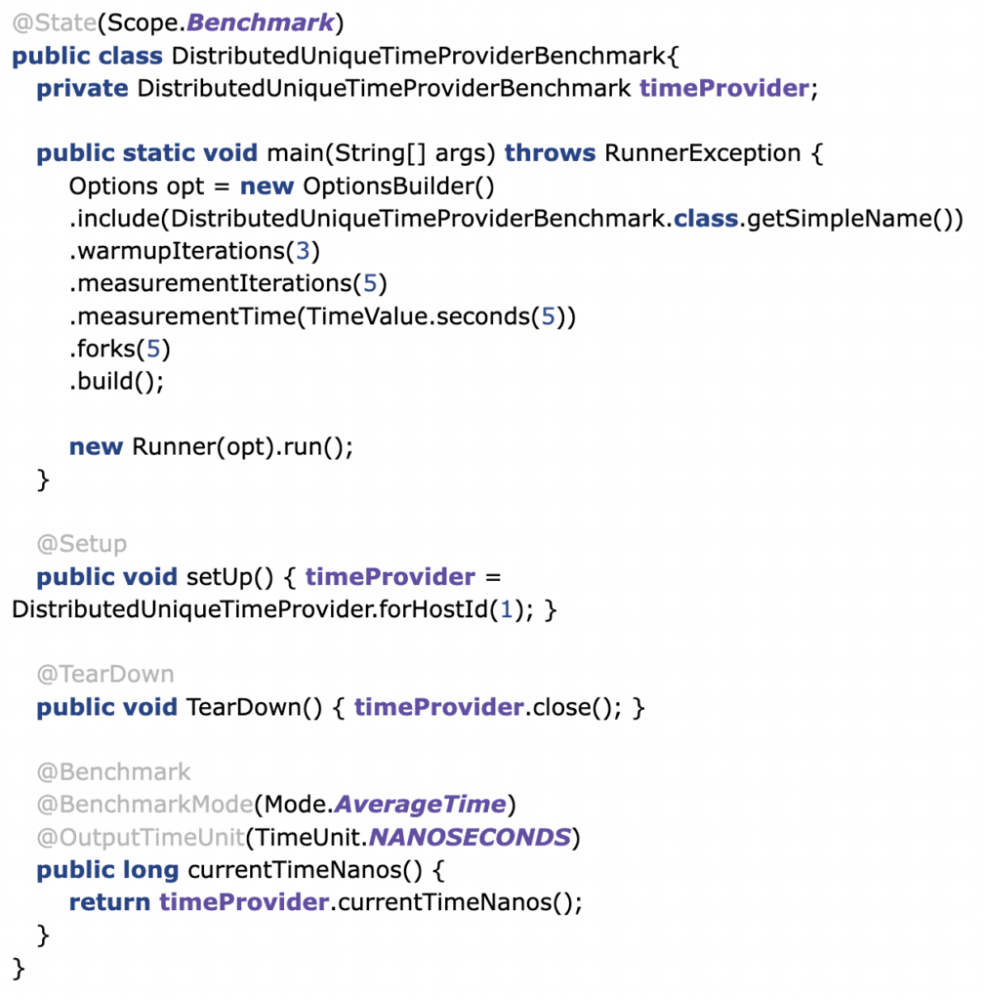
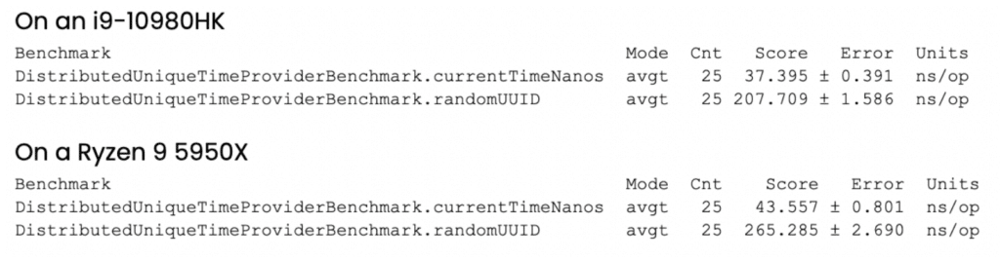

At [Chronicle](https://chronicle.software/?utm_source=website&utm_medium=foojay&utm_campaign=unique-identifiers "Chronicle") we build applications that must process very high numbers of events with minimum latency. Generating unique IDs for these events using the traditional method of UUIDs introduces an unacceptable time overhead into our applications, so an alternative approach is needed.

I recently wrote [an article](http://blog.vanillajava.blog/2021/12/system-wide-unique-nanosecond-timestamps.html "an article") on how timestamps can be used as unique identifiers, as they are much cheaper to generate than other methods of generating unique identifiers, taking a fraction of a microsecond.

Guaranteeing uniqueness when using timestamps at nanosecond granularity is straightforward on a single system. However, providing the same guarantee in a distributed application where functionality is spread over multiple systems, each with its own clock, can be much harder.

This article describes an extension of the previously described algorithm that generates unique identifiers in a distributed environment, and presents them in a format that is easy to read.

### A Nanosecond Timestamp with a Host Identifier

Chronicle's `DistributedUniqueTimeProvider` overwrites the lowest two digits of a generated nanosecond timestamp with the hostId. This makes it easy to identify when looking at the generated identifier.

We can therefore produce identifiers that are guaranteed unique, across up to 100 machines.

For a hostId of 28, the generated timestamp would look like this:

```
2021-12-28T14:07:02.954100128
```


The last two digits represent the hostId, and the remainder represents the timestamp on that hostId as date/time/microseconds.

With this change, the resolution of the timestamp is now one-tenth of a microsecond (hundreds of nano-seconds). This apparent loss of precision is not important, since it corresponds to the limit of the available wall clock in many systems.

The hostId can be set as a system property by default on the command line with `-DhostId=xx`, or programmatically using:

```
DistributedUniqueTimeProvider.instance().hostId(hostId)
```


### Generating Unique IDs in a Distributed System

Each host participating in the application has a predefined, unique host identifier, or hostId.

Currently, we assume up to 100 hosts.

Of course, Java application components run in a JVM, and there may be multiple JVMs active on the same physical machine. JVMs sharing the same (memory mapped) `DistributedUniqueTimeProvider` may share a hostId. Alternatively, a JVM may have its own unique hostId assigned to it.

### Speeding Up Generation with a Saved Host Identifier

Having a preconfigured host identifier and keeping track of the most recent identifier in shared memory allows fast concurrent generation of timestamp based identifiers across machines. As timestamps only have a resolution of 100 ns, the sustained limit for a single host is ten million per second.

For a maximum number of 100 hosts, the theoretical limit is one billion per second. If you need more than 100 servers, the strategy can be altered to reduce resolution, and allow more concurrent hosts. e.g. 1000 hosts could generate one million ids per second with a microsecond resolution.

### Implementation

The happy path is simple. Take the current time, remove the lower two digits and add the hostId. The value of **HOST_IDS** is hardcoded to 100, as we assume 2 digits for the hostId. As long as the generated identifier is higher than the last one generated, it's ok.

Should the machine fail and the information as to the last identifier be lost, the assumption is that the time taken to restart the service is enough time to ensure there is no overlap. If the service fails, but not the machine, the information is retained.

NOTE: This used the MappedFile in shared memory supported by Chronicle Bytes, which is open source.



If the time hasn't progressed, either due to high contention, or the wall clock going backwards e.g. due to a correction, a loop is called to find the next available identifier.



This loop looks for the next possible timestamp (with the hostId) and attempts to update it.

### Using JMH to Benchmark the Timestamp Provider

With JMH, benchmarking this utility in a single-threaded manner is pretty easy.



After less than five minutes, we get the following result on a windows laptop. You can get better results on a high-end server or desktop.

The average time is around 37.4 nanoseconds. While this is single-threaded, this is generally on the unhappy path, as timestamps need to be at least 100 ns apart or they temporarily run ahead of the wall clock.

UUID.randomUUID() is also very fast, only six times longer, however, if you need a timestamp and a source identifier for your event anyway, this is additional work/data.



### Disadvantages of This Approach

Traditionally, Java applications used UUIDs as unique identifiers. This approach is considerably more efficient than the generation of UUIDs, however there may still be some cases where UUIDs present a more suitable approach:

* Support is built-in, and the extra overhead may not be a concern
* No configuration is required
* UUIDs are not predictable, the timestamp-based ones are highly predictable

### Conclusion

This article has described a highly efficient approach to generating an 8-byte lightweight identifier that is unique across many hosts, based on some predetermined partitioning by host identifier.

The identifier is still easily readable as text in a slightly modified form of a timestamp.
