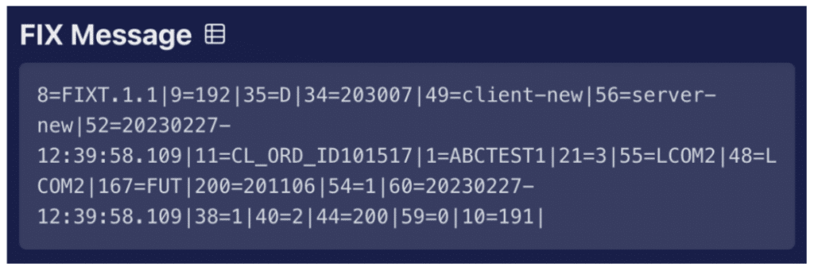
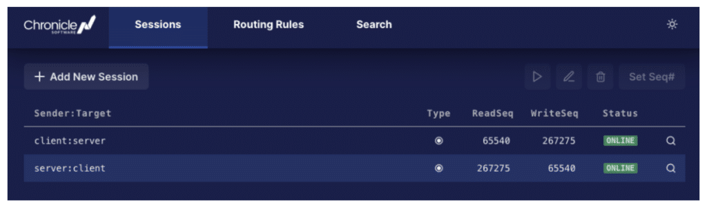
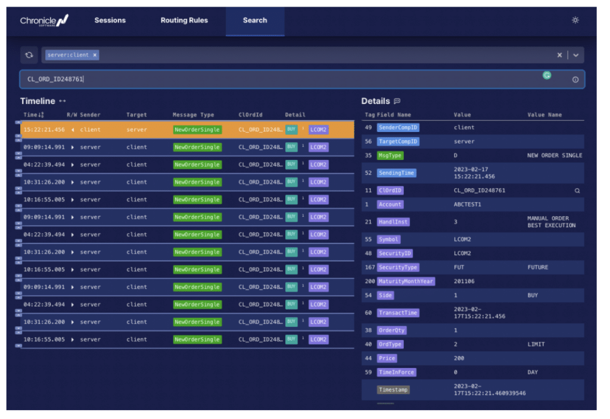
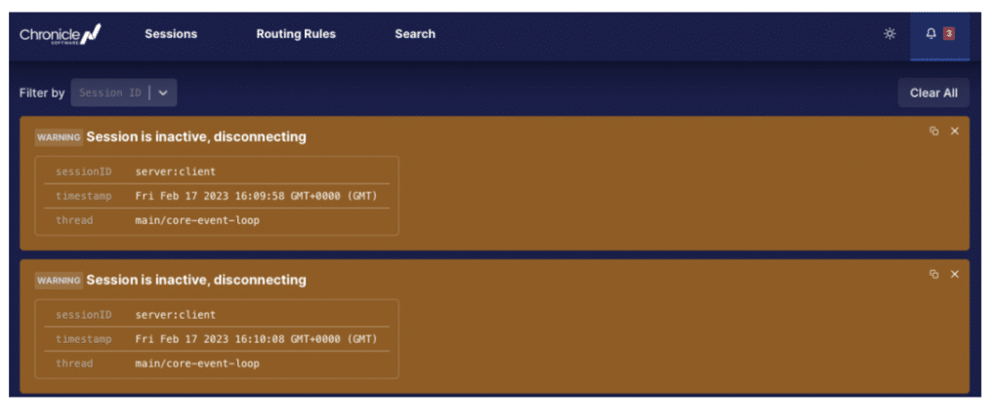

### The Challenges of Building a FIX Engine

The first day I was introduced to [Financial Information eXchange (FIX)](https://en.wikipedia.org/wiki/Financial_Information_eXchange) was when I worked at an investment bank in London as a developer.

I was told to write a feed handler to retrieve market data.

Bear in mind that at this time, I knew nothing about FIX, apart from Googling it for about 10 mins on the internet.

With a touch of overconfidence and slight arrogance, I set to work coding a direct socket connection to the remote FIX endpoint, "how hard could it be?"

### So, What Is FIX ?

FIX is both a market data format and a protocol. It is used by investment banks to place orders and receive market data and has become a global language in financial trading.

The format of a FIX message controls how it is encoded. All FIX messages start with 8=FIX, which denotes the start of a FIX message. They then go on to list key and value pairs; the keys are represented as numbers (known as TagNumbers) followed by a '=" delimiter to delimit the values.

Each key=value combination is then delimited by the \\u0001 character, which is sometimes visually represented as either \^ or \|The value is often written in a semi-human-readable format.

I say semi-human readable because most of the time it is human-readable, but all too often FIX will use a single character to denote a state or type of message; these characters are not always that obvious; I agree that the character 'B' for Buy and 'S' for Sell, makes sense, but other characters are used that make no sense.

For example, 'D' denotes a New Order Single message, which is a message that is often used when you wish to place an order with your counterparty.

  
*Image 1. An example FIX message in FIX format*

When it comes to the FIX protocol, you have to be careful, as it turns out to be much more involved than just having the correct FIX message format and being able to decode the key=value pairs. The protocol also includes ensuring the counterparty has successfully logged in and that any missed messages are retransmitted; it also requires support for gap fills and sequence resets.

### And, What Is QuickFIX?

Back again to the coding. The first challenge was to get past the login phase; it looked like this login message was mandatory! Over time, I managed to put together enough of a login message that the other end came back with a login reply, but it was not long before my colleagues started taunting me, "Why don't you just use [Quick/FIX4J?](https://www.quickfixj.org/ "Quick/FIX4J?")"

Saving face and trying not to show that I knew nothing about QuickFIX, I quietly down my I.D.E. and jumped back onto the web browser. While doing a bit of research about QuickFIX; I was thinking -- "perhaps using this open-source library could be simpler than implementing it all myself", or "maybe it's going to take me longer to understand how to use this library."

The library was extensive, and they clearly put a lot of work into it, but I was overwhelmed by how complicated it all looked -- does it really need to be like this?

At the time, I was working alongside a team of developers that I looked up to; these guys stood by the "No code is the fastest code" mantra; everything they wrote was super optimal; they would work with raw byte buffers rather than create unwanted objects, and their java code looked more like 'C' code than any java I had ever seen before.

So, I got back to my PC and proceeded to implement the lightweight raw byte buffer parser route; over the next few weeks, I was starting to get end-to-end data going through the FIX adapter, and when I was finished, it screened.

### Should I Have Implemented It Myself?

Now looking back on those early days, I ponder, 'did I make the right decision? 'and 'should I have implemented it myself?'. The answer is I think yes, it was best to implement the custom simple, lightweight solution that I ended up with, but I only got away with it because I had an extremely simple FIX use case. I was only connecting a single session to a single counterparty with a single version of FIX and, apart from the login and heartbeat messages, just a single message.

My problem would have been if later this was to be upgraded to another FIX version, or we had to support resend-requests, or sequence resets and gap fills. Or to offer production support and a dashboard where administering existing running sessions on the live system.

  
*Image 2. Example dashboard for FIX sessions*

At this point, it becomes a serious undertaking; and it starts to make more sense to turn to a tried and tested solution, already with all these bells and whistles. To use products with the ability to search historic fix messages:

  
*Image 3. Searching for all FIX messages with a given client order id.*

...and which raise alerts when sessions disconnect:

  
*Image 4. Alerts being raised in FIX UI*

### Conclusion

Not long after, I joined a company founded by Peter Lawrey called [Chronicle Software](https://chronicle.software/ "Chronicle Software"); Peter is one of those super-optimal developers I mentioned earlier. He developed the widely used open-source software [Chronicle Queue](https://chronicle.software/quick-start/?product=queue "Chronicle Queue") and [Chronicle Map](https://chronicle.software/map/ "Chronicle Map").

We, together, set to work and built such a FIX engine that has all these bells and whistles, and in doing so, we also built a company that has grown to a team of over 20 people.

[Chronicle FIX](https://chronicle.software/fix-engine/ "Chronicle FIX") follows this low latency, low object creation mantra that I always envied. Now it's being used by companies worldwide, including large investment banks, adopting it across their whole organisation.

Looking back, developers can save time and effort using a buy-and-build software solution like Chronicle FIX.

As mentioned, I would have been stuck if we had wanted to provide production support with my simple solution.

Moreover, I certainly would have needed more time to build a UI.

The lesson learnt was **"Sometimes time spent reinventing the wheel results in a revolutionary new rolling device. But sometimes it just amounts to time spent reinventing the wheel."**
