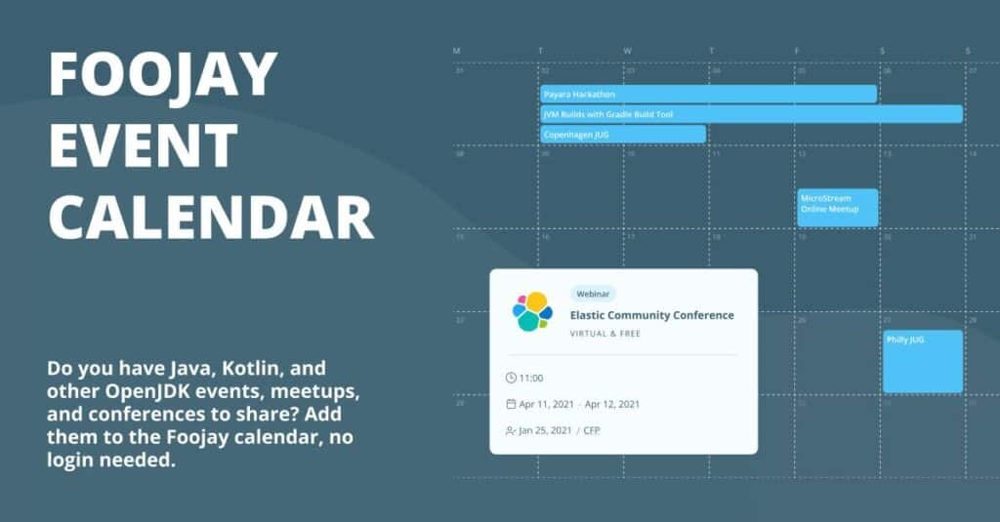

We are excited to share that Foojay is growing and offering additional resources to bring the Java and OpenJDK community together on a global scale.

Several months ago, we launched the [Foojay Calendar](https://foojay.io/calendar/), an interactive platform that allows individuals to propose Java-related and Kotlin-related and any other OpenJDK-related events and add them to the calendar.

All Foojay members are welcome to submit their events. Once reviewed, the event will be included in the calendar.


Although many users loved the idea, several organizations that provide their own event platforms reached out to us and asked if they could integrate their own events database into our calendar directly.

During our latest collaborations, we integrated events from [JUG Switzerland](https://www.jug.ch/), thanks to **Patrick Baumgartner** , and [Adoptium](https://adoptium.net/) with the Eclipse Foundation, thanks to **Carmen Delgado**.

We have expanded our API capabilities and now **allow anyone to send their own events**.

Our hope is that this change will keep the OpenJDK community engaged and informed about relevant events happening worldwide.

*Updated: foojay.io no longer runs on WordPress, and the `POST` API described
below has been retired with it. Events now reach the calendar by the two routes
described here. The history above is unchanged.*

## How events reach the calendar now

There is no API key to request any more, and nothing to authenticate against.
Both routes are public.

### 1. A calendar feed — automatic

If your organization or user group already publishes a calendar, foojay reads it
directly, once a day. Any iCal feed works: your own site's, a Google Calendar,
Meetup's export, or what Luma, Eventbrite, Tito, Bevy and Mobilizon export.
Nothing has to be pushed to us, and nothing goes stale.

For a Java User Group, the feed is picked up from the community-run
[World Wide JUGs directory](https://github.com/World-Wide-JUGs/GlobalWWJugs) —
add a `calendar:` or `meetup_slug:` entry for your group there, which the JUG
leads maintain themselves.

### 2. A conference or one-off — a small file, by pull request

A conference publishes no subscribable feed, so those are added as one file per
event in the site's repository:

```yaml
# data/events/devoxx-belgium-2026.yaml
name: "Devoxx Belgium 2026"
type: "Conference"
url: "https://devoxx.be/"
start: "2026-10-05"
end: "2026-10-09"
venue: "Kinepolis Antwerpen"
city: "Antwerp"
country: "Belgium"
```

Copy [`template/event.yaml`](https://github.com/foojayio/website/blob/main/template/event.yaml),
fill it in, open a pull request. `name`, `url`, `start`, `city` and `country` are
required — `city` and `country` only when the event is not online. The colour on
the calendar, the band across a multi-day conference and the counts in the page
header are all derived, and the event drops off by itself the day after it ends.

The full field reference is in
[CONTRIBUTING.md](https://github.com/foojayio/website/blob/main/CONTRIBUTING.md),
and [How to Add an Event to the Foojay Event Calendar](/today/how-to-add-an-event-to-the-foojay-event-calendar/)
walks through it.

*If you encounter any problems or have any questions, please reach out to us at
[hello@foojay.io](mailto:hello@foojay.io) or on the
[Foojay Slack](https://foojay.slack.com/join/shared_invite/zt-tgefdcxv-SDwnqUqPH8peWujGNvC1ZQ#/shared-invite/email).*
