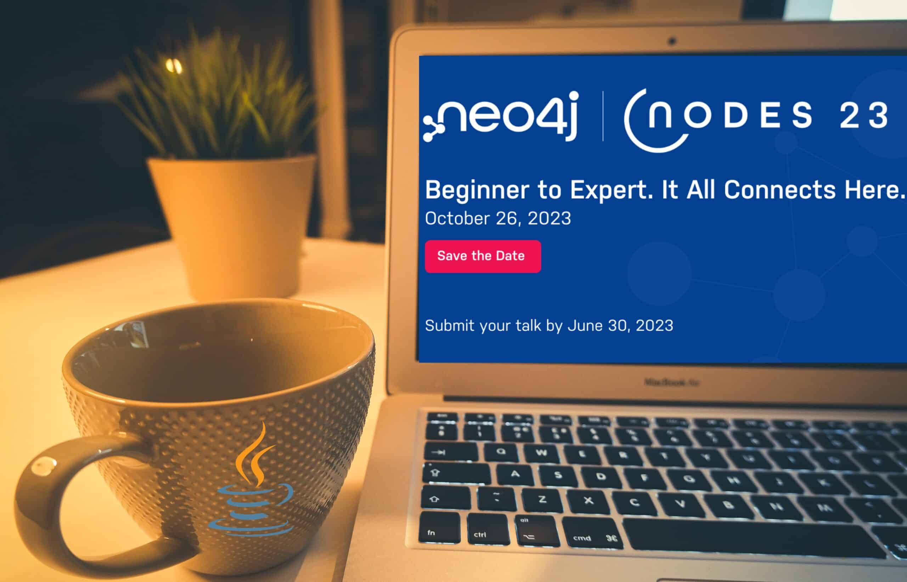
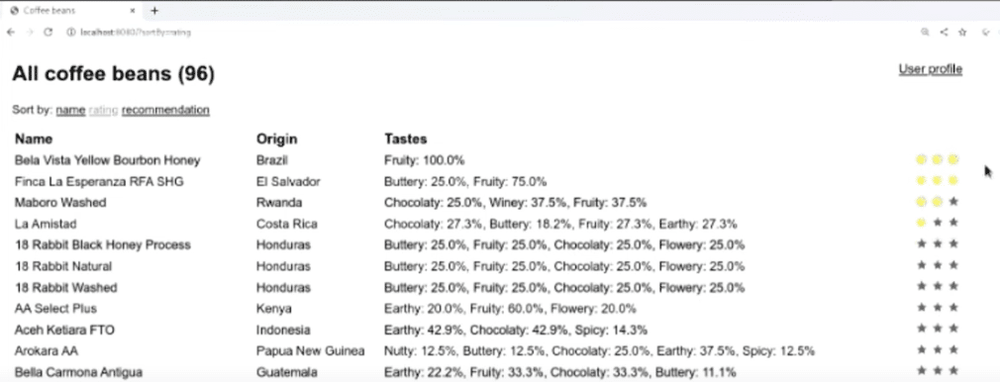
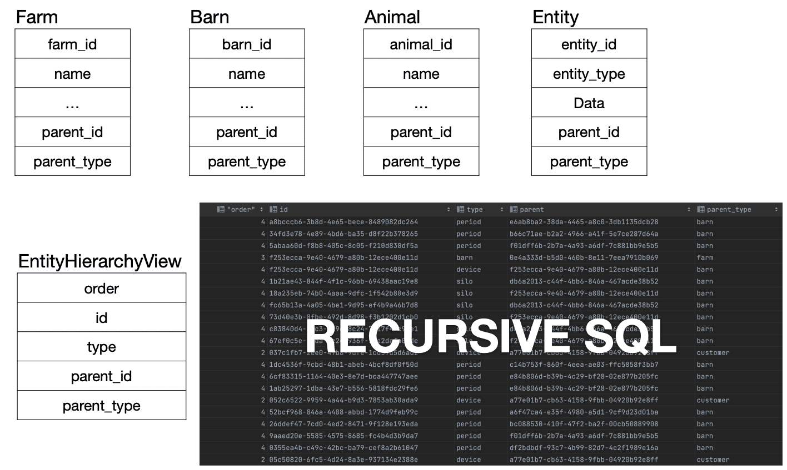
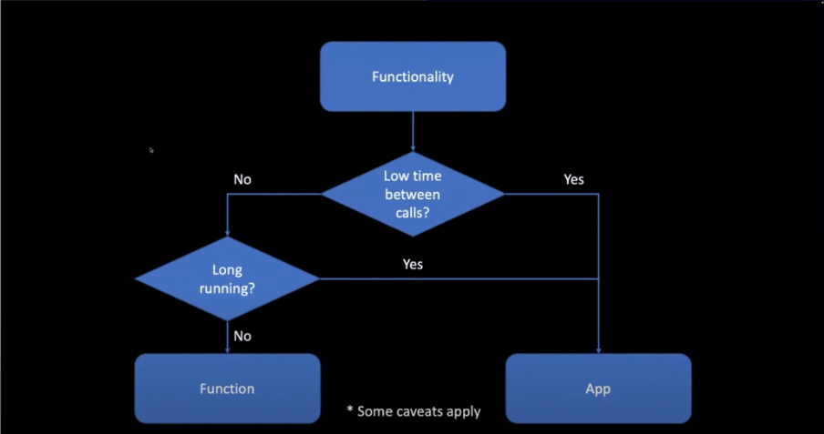
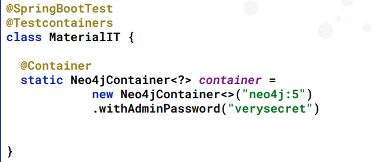

Figure 1. Base Photo by Compare Fibre on Unsplash

As we prepare for NODES 2023, I wanted to pull out the time machine and review the Java sessions from [NODES 2022](https://neo4j.com/video/nodes-2022/).

I will be submitting some abstracts to the [2023 Call for Proposal](https://sessionize.com/neo4j-nodes-2023) here soon, likely in the Java category, so I thought looking at last year's sessions might give me some inspiration or ideas for gaps or continuations I might want to explore.

I hope it will inspire you all in the Java community to do likewise! I would love to see a larger Java presence in the submissions and schedule lineup, and we can't do that without all the wonderful ideas and projects going on in the Java ecosystem.

Without further ado, let's take a look at seven Java-focused sessions. I'll also give honorable mentions to two sessions who used Java examples and code, even though the main session topic was for something outside Java.

## Building Java Application with Quarkus and Neo4j

[Sebastian Daschner's presentation](https://www.youtube.com/watch?v=EfD2qa16bHM&list=PL9Hl4pk2FsvWPcphew_GbLjCWvMpmh4mV&index=49) showed how to write a Java application that connected to Neo4j using the Quarkus framework.

While existing documentation shows how to work with Quarkus and Neo4j using the standard Java driver, Sebastian wanted to show us how to use Quarkus and Neo4j with an object-graph mapper (OGM). The example dataset was made up of coffee and relationships to flavors and origins. Sebastian dove right into demoing with a recommendation system that used a Cypher query to search the data for coffees matching a specific flavor. We then moved over to a UI where a user rated coffees, and the recommendation used the ratings as input. It found similar coffees based on flavors the user rated more favorably.

Figure 2. User interface for rating coffees

Sebastian wrapped up with resources for exploring the code and taking it further with cloud and other features. Lots of code, lots of coffee, lots of Java!

## Farm Topologies and Time Series Data

[Chris Engelbert's presentation](https://www.youtube.com/watch?v=n6uBUAGbLlA&list=PL9Hl4pk2FsvWPcphew_GbLjCWvMpmh4mV&index=51) reviewed the former Clevabit's use case to monitor and improve farm efficiency. We got a quick background on graphs and time-series data before diving into the initial use case for developing the data model to monitor agricultural farms.

Figure 3. Relational model and tables versus graph model

The data model started out in tables with some recursive SQL, which worked pretty well to start. However, the tree became more and more complicated. At a certain data size, performance degraded significantly. The data turned out to be a graph. Migrating to a graph data model produced a cleaner, more understandable system of data with a highly connected distribution.

To wrap up, Chris discussed a few lessons learned from the project, showing how problems can arise with disconnect between technical and business understanding, as well as reminding developers to question assumptions and decisions, even when it's tough and expensive.

## Let's Get Functional! Pull Off a Trifecta with Spring Cloud Function, Azure Functions, and Neo4j

[Mark Heckler's session](https://www.youtube.com/watch?v=0DhtxRCPQRo&list=PL9Hl4pk2FsvWPcphew_GbLjCWvMpmh4mV&index=55&t=13s) showed us how to write, build, and deploy functions with Neo4j.

Figure 4. Deciding whether to build an application or function

First, we saw a diagram to help us determine whether to build an application or a function, then discovered why each technology was chosen for this session. Spring Cloud Functions give us a more streamlined path to deployment by reducing boilerplate. Azure Functions sets up a deployment path and location for the function to exist and run. Lastly, Neo4j helps us see the data entities, as well as the relationships between them.

Then we dove right into code! Spring Initializr was used to outline the project template, followed by Mark writing some code for the Aircraft domain class. Once we defined a method to access aircraft, we tested the application. Then, this data needed to be stored to Neo4j for analyzing insights on the aircraft. Lastly, we saw how to deploy the application using Azure Functions.

In closing, Mark gave us a link to the code repository, as well as additional helpful resources to get us started with our own functions.

## Divide and Conquer: Send Forth the Microservices

[Jennifer Reif's (my) presentation](https://www.youtube.com/watch?v=ALxxfKC0HsE&list=PL9Hl4pk2FsvWPcphew_GbLjCWvMpmh4mV&index=60) introduced us to microservices architecture and how to build them. We got some background on the contrasting monoliths, then we discussed microservices before diving into code!

Spring Initializr outlined the template for each service, then we coded a backend service and frontend service to provide a "Hello, World!" string and display it to the client, respectively. Next, we introduced Neo4j as the backing database. The domain was migrated to book reviews, and a new method was created in the backend service to retrieve one thousand reviews. The frontend application accepted those reviews from the backend and displayed them.

Next, we incorporated Docker Compose to handle service orchestration. We configured Docker Compose to run our applications with a YAML file, and tested it all with a docker-compose up command. The frontend service successfully pinged the backend service, which connected to a config service for database credentials and pulled data from Neo4j to send to the frontend application.

Jennifer closed her presentation with a repository link for all of the code, followed by some additional resources.

## What's New in Neo4j Java Driver Version 5.0

[Dmitriy Tverdiakov's session](https://www.youtube.com/watch?v=wqNyCBo8-Y0&list=PL9Hl4pk2FsvWPcphew_GbLjCWvMpmh4mV&index=95) walked us through the changes to the Neo4j Java driver with the release of Neo4j 5.0. Some changes only affected the Java driver, while others applied to all of the Neo4j drivers.

First up was to upgrade the base Java version to Java 17, the latest LTS release of the language. Next, the session API and reactive API saw some improvements with new session methods and deprecation of old ones. Likewise, bookmarks got an update for single bookmarks, and the new bookmark manager was released for experimentation. There were also some small changes to managed transactions, and retryable transactions were exposed to the user for creating custom solutions. The speaker then introduced support for Micrometer metrics for monitoring, and utilized the JPMS in Java for scaling and locating classes.

Dmitriy wraps up with some resources and ways to stay up-to-date on the driver releases.

## Better Testing with Testcontainers

[Gerrit Meier's presentation](https://www.youtube.com/watch?v=r8rvWrTfmE4&list=PL9Hl4pk2FsvWPcphew_GbLjCWvMpmh4mV&index=101) dove into testing Java applications with Testcontainers.

We started with a definition of integration testing, then took a look at the typical methods of testing --- using an embedded instance, a local instance, a remote instance, or a docker container. Gerrit covered some pros and cons of each, but they still lacked some level of resiliency, flexibility, or consistency. Enter Testcontainers, which utilize tools and processes we are already familiar with and remove some of the hassles of other solutions.

Figure 5. Creating a Neo4j Testcontainer

We saw some example code for Testcontainers in a project using Neo4j's own Testcontainers module for the graph database. Adding Neo4j's module to a project included creating a Neo4j container with optional plugins, such as APOC or custom ones. We also saw how to use the experimental feature to reuse a container, so we aren't setting up and tearing down a container for each test.

Gerrit concludes with resources to the core Testcontainers information, as well as a blog post on reusable testcontainers.

## Introduction to Neo4j Plugins

[Bert Radke's session](https://www.youtube.com/watch?v=LwMuQXOm3zo&list=PL9Hl4pk2FsvWPcphew_GbLjCWvMpmh4mV&index=52) gave us insight into plugins to extend the functionality of Neo4j. We saw the process for building and integrating the plugin, and then how to create one.

We first use an annotation for either procedure or function, specify read or write functionality, and provide a description (documentation) of it. Lastly, and most importantly, we write the code itself for defining the procedure/function. The next part of the session explored what we can use within the plugin. Since it was in Java, we can utilize Java APIs, and even include outside Java libraries and dependencies. Bert also covered topics with example code on injectables, logs, database transactions, threads, traversal API (following relationships), and testing.

Bert wrapped up with info to help us determine whether we need to build a custom plugin or use something out-of-the-box, as well as a link to a Github repository and a couple of resources.

## Honorable mentions

The last two sessions did not focus solely on Java topics, but utilized tools and examples in the Neo4j/Java ecosystem. Some demo code was provided in Java, and the speakers spoke from the Java perspective and were inspired by Java tooling for their projects.

### Neo4j Migrations: The Lean Way of Applying Database Refactorings to Neo4j

[Michael Simon's presentation](https://www.youtube.com/watch?v=5-j0xiVAeoM&list=PL9Hl4pk2FsvWPcphew_GbLjCWvMpmh4mV&index=70) walked us through a new tool for refactoring data in Neo4j. We started with an introduction to schema and refactoring before looking at the existing methods for refactoring Neo4j. However, there were none that quite fit the set of requirements desired, so a new plugin was born that is based heavily on Cypher usage.

The tool was showcased via a live demo, where Michael used the movies data set in a Spring application. We saw how to use the project and create scripts to run pure Cypher to populate missing id fields or XML to add constraints and indexes. However, XML can be cumbersome, so Michael showed us the related annotation processor that reads annotations on domain classes to create the XML for us.

Michael wrapped up with some resources for learning how to take the plugin further.

### Building Neo4j Ops Manager: Lessons from Dogfooding

[Sascha Peukert's session](https://www.youtube.com/watch?v=SyE-trGZnPU&list=PL9Hl4pk2FsvWPcphew_GbLjCWvMpmh4mV&index=105) introduced us to how the team used Neo4j's own software to build the new Neo4j Ops Manager tool for administrators.

First, we looked at how to use Neo4j to store metrics. By storing static properties as additional labels on nodes, it reduced the storage space needed in the database. Next, the team utilized Michael Simon's migrations project (covered above) to refactor the data while they were exploring the most optimized format. Lastly, Spring Data Neo4j was used to retrieve the data in the database, and using the Cypher-DSL avoided string concatenations and made using complex queries easier.

To close, the team learned that using their own products was a great source of feedback and helpful for finding bugs and complicated aspects of the software we build, promote, and sell every day.

## Wrap Up

These sessions, as well as those on other languages and topics, are available on the full [NODES 2022 YouTube playlist](https://www.youtube.com/playlist?list=PL9Hl4pk2FsvWPcphew_GbLjCWvMpmh4mV).

Do you feel there are gaps or opportunities to dive deeper on topics that could help the Neo4j Java audiences?

We would love to have you submit your session idea for the [NODES 2023 Call for Proposals](https://sessionize.com/neo4j-nodes-2023)!

Don't wait too long, though.

The CfP is only open through June 30. I will be off submitting my own ideas, as well, and hope to see you there for the event in October!
