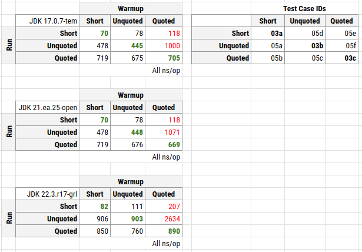
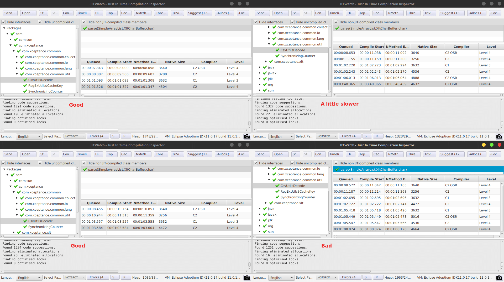
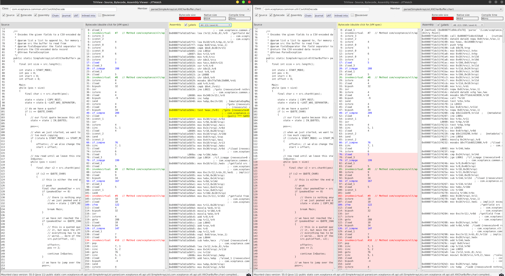
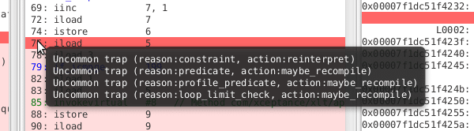
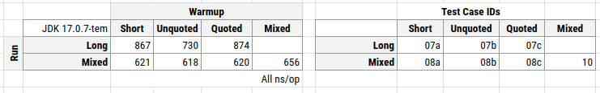

**While running some final tests, we noticed extremely erratic runtime behavior. It was hard to reproduce but very annoying because it means that the application runtime goes up from 5 to almost 14 min. This article tries to show how we diagnosed it and condensed it down to a few test cases. These might hopefully help us to provide some answers. Maybe, but only maybe, we discovered a defect or at least strange edge-case in the JVM.**

The following article discusses a performance problem encountered while finalizing our software. Because it is absolutely not predictable when it happens but when it does, it hits us with an 100 to 200% runtime increase. Because the golden rule for bug reporting says, no test case, no problem, we want to show you how we got to the bottom of the issue but theorizing, profiling, and testing.

By the way, we can change the code to make the problem go away, but we are still interested to find out why Java's JIT comes to its conclusion and permanently sticks to it. The code is question is almost compatible with any Java version and no does not use any fancy features.

The Problem {#_the_problem}
---------------------------

We updated our [load test software XLT](https://github.com/Xceptance/XLT) and especially worked on the runtime of the report generator. While testing it before release, we noticed very unstable runtimes. A fixed data set sees runtimes between 5 to 14 min. The 5 min runtime is the expected one, while higher runtimes only occur occasionally. These range from 6 to 14 min in about 10 to 15% of the cases.

The report generator is multi-threaded and reads about 7 GB of compressed CSV data (56 GB uncompressed). This is a total of 722,176,188 lines. Because of the multi-threaded model, the order of things is always slightly different when processing the data.

*Disclaimer*: I am not an JDK/JVM/JIT expert. Everything you will find below is based on knowledge shared by others or gained by experimenting around. Your feedback is highly appreciated.

You can find the full source code of the examples below on [GitHub](https://github.com/rschwietzke/jmh-C2-compile).

Summary {#_summary}
-------------------

Because you might just say TL;DR now, here is a quick summary of all the data and experiments below.

When we show our Java code certain data first, it will compile machine code that contains still a lot of uncommon trap markers which seem to change the runtime behavior (just an observation, not a conclusion). When showing different data to the compiler later, it sticks to its opinion and the runtime suffers by a magnitude of 2 to 5. If we change the order of the data, the runtime behavior improves dramatically and even the data that was presented before first (which led to our possible horrible code), is running fine now.

This table summarizes the runtimes when training (warmup) and executing (measurement) of our examples CSV lines (see below). We have short CSV lines, long lines (unquoted), and long lines with a section being quoted (quoted). The difference lies in the inner loop not being finished regularly anymore, because we have to skip over characters, hence we break the loop with a `continue outerloop`.

Columns are formed by the warm-up data, the later measurement data (run) is in the rows. The green numbers are the expectation (we used the same data for warming and measurement). The red numbers are the unexpected outliers.

Running this with GraalVM 22.3-19 produces even worse runtimes. We talk about 2600 ns/op now instead of 1000 ns/op for OpenJDK 17. No idea why, especially because the JIT of Graal is totally different but of course might follow the same basic ideas.

First Diagnostics {#_first_diagnostics}
---------------------------------------

### Async Profiler {#_async_profiler}

When we caught a process in the act of being slow, we connected Async Profiler and got some traces. These are 60 sec captures and they show clearly a shift towards the CSV parser.

#### Good {#_good}

<pre class="EnlighterJSRAW">         ns  percent  samples  top
  ----------  -------  -------  ---
 45612243950    9.55%     4559  com.xceptance.common.util.CsvUtilsDecode.parse
 31634884015    6.62%     3162  itable stub
 25989872875    5.44%     2589  /usr/lib/x86_64-linux-gnu/libz.so.1.2.11
 23561485986    4.93%     2355  java.util.regex.Pattern$Slice.match
 21140760305    4.42%     2113  vtable stub
 20569614899    4.30%     2056  java.util.regex.Pattern$BmpCharProperty.match
 19321839309    4.04%     1931  jdk.internal.util.ArraysSupport.mismatch
 18011700149    3.77%     1800  com.xceptance.xlt.api.util.XltCharBuffer.hashCode</pre>

#### Bad {#_bad}

<pre class="EnlighterJSRAW">       ns  percent  samples  top
  ----------  -------  -------  ---
384925806756   79.68%    38490  com.xceptance.common.util.CsvUtilsDecode.parse
  5582345351    1.16%      558  com.xceptance.xlt.api.util.XltCharBuffer.hashCode
  5393452865    1.12%      537  /usr/lib/x86_64-linux-gnu/libz.so.1.2.11
  5132247709    1.06%      513  itable stub
  4932415970    1.02%      493  java.util.regex.Pattern$Slice.match
  4400943650    0.91%      440  com.xceptance.xlt.api.util.XltCharBuffer.viewFromTo
  4381854811    0.91%      438  java.util.regex.Pattern$BmpCharProperty.match
  3881428022    0.80%      388  vtable stub</pre>

### PrintCompilation {#_printcompilation}

Because it seems that the compiled code differs occasionally, we looked at the compilation for that very method. This screenshot shows four different captures (displayed using [JITWatch](https://github.com/AdoptOpenJDK/jitwatch)).

There seem to be a pattern related to the slowness, the C2 OSR compiler compiled last. In all other cases, the performance was good. It is also clearly visible, that the outcome of the compile runs in regards to size, even when seeing the code results, is different. Therefore, it seems, the data presented heavily drives the decisions made by the JIT.

Because of that, we inspected the resulting compiled code closer using what JITWatch tells us.

JITWatch marks an area in red and tells us that this code owns four additional uncommon traps while the good code version does not have any of these.

Ok, we got here by profiling and watching the compiler. We still don't know why this happens and how to reproduce that reliably.

Theory {#_theory}
-----------------

Based on the observation, profiling, and knowing the data that goes into the parser, we came up with the following theory:
> When the parser code sees a certain CSV line length or CSV data content early, it will come up with a compile result that is, bluntly spoken, horrible. The compiler will also not reconsider its decision later, hence the program stays extremely slow forever. Due to the multi-threading of the CSV processing, the order of CSV lines is not deterministic. Because this problem only occurs in 10 to 15% of the case, the data causing it must be "rare" too.

Let's find some possible simple test cases that exactly exhibits the behavior we see under load. This might allow us to better understand the problem and possible submit it as a defect or publish it as a learning experience.

We will take the extreme cases of our data and try to construct some test cases.

Data {#_data}
-------------

For this test, we use three lines of CSV data. The long versions are displayed in a shorted version here, to highlight the difference. You find the long version in the source code.

* SHORT: `T,TFlashCheckout,1666958662310,17729,false,,,,`
* LONG Unquoted: `R,CandleDaySalesPage.2,1666954266805,95,false,1349,429,200,https://,image/gif,0,0,95,0,95,95,,GET,,,0,,`
* LONG Quoted: `R,CandleDaySalesPage.2,1666954266805,95,false,1349,429,200,"https://",image/gif,0,0,95,0,95,95,,GET,,,0,,`

As you can see, the long version only differs in one spot - additional quotes around the URL, because it might contains commas. The parsing will change here and inline remove the quotes while parsing the data. The entire parsing is optimized towards low or no allocation, because we have to parse millions of these lines. This is also the reason while we are not running String parsing here, but access a custom char array which later returns views on that backing array instead of providing copies.

This quoted version is very rare, because commas in urls are not often used.

Test Case {#_test_case}
-----------------------

Our test case utilizes JMH and uses a trick to be able to use different data during warm-up. We count how often we ran setup and compare that to the provided `BenchmarkParams`. When we reach the measurement phase, we setup different data.  

There might be another way of doing that, but I could not find an JMH-API exposing the state of the test.

The regular test cases are just using a single character array (the parser prefers open writable arrays over Strings), and runs the benchmark for that. See all B03 test cases. The advanced test case, where warm-up and measurement data have to differ, keeps a state counters and calls setup per invocation. See the B05 test cases.

Measurements and Results {#_measurements_and_results}
-----------------------------------------------------

All measurements have been taken on a Google Cloud c2-standard-8 instance. Similar data has been seen on a Lenovo T14s AMD.

We compiled additional test cases to vary the data a little more.

* B07 - Train with single line data, measure the long lines only
* B08 - Train with single line data, measure with all line types
* B10 - Train with all, measure with all

The differences are not as big as with the single runs, but that is also related to the averaging effect of the data lines. Training with small and quoted leads to a larger runtimes difference when runnig just against the long data, but for mixed execution and mixed training, no differences are visible.

Conclusion {#_conclusion}
-------------------------

We have produced a test case that shows us that the JIT comes up with different code when the data presented and the data later run is different. That does not come as a surprise, that is the nature of C2 optimization. Just profile the running code and find the best version for that.

The surprise comes when we first see the difference between both version and second, when the JVM sticks to that slow and imperfect version until the end. Until the end can mean, the program runs for another 10 min.

Maybe this comes intentional, and perhaps we cannot do anything about it, but change our Java code to prevent us from running into that. Definitely, it is not perfect. Changing it, is an option, but possibly, what we see with the JIT, is a general and rarely encountered issue. At least, it is really hard to find and might cause a lot of head scratching.

P.S. We already have a version that works better and does not get "trapped".
