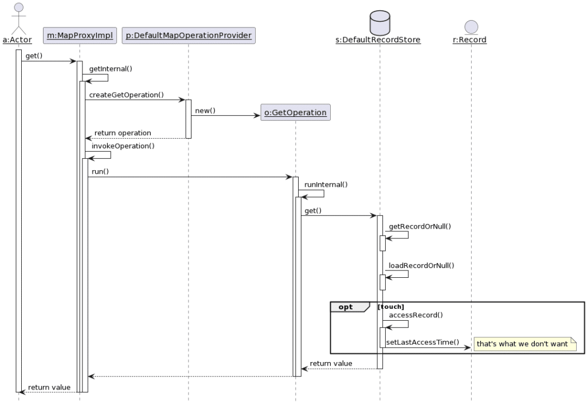

In our profession, it's common to work on an unfamiliar codebase.

It happens every time one joins a new project or even needs to work on a previously untouched part in big ones.

This occurrence is not limited to a developer having to fix a bug; it can be a solution architect having to design a new feature or an OpenSource contributor working on a GitHub issue in their free time.

Hence, I want to describe how I approach the situation so it can benefit others.

## An example issue

To illustrate my point, I'll use a common GitHub issue requesting a new feature on an Open Source project.

While working for Hazelcast, I regularly scanned the so-called "good first issues" to work on at hackathons. I never could run such a hackathon, but that is beside the point. My idea was to help people interested in contributing to Open Source start getting familiar with the code base.

At the time, I found this interesting issue:
> Add support for getQuiet operation <http://ehcache.org/apidocs/net/sf/ehcache/Cache.html#getQuiet(java.lang.Object>)?
>
> The idea is to be able to get an entry without touching it, meaning that it will not update the last accessed time stamp.
>
> The use case behind it is to be able to monitor existence of a key without changing the eviction of that key.
>
> -- [Distributed Map: Add support for getQuiet operation](https://github.com/hazelcast/hazelcast/issues/1540)

As an OpenSource contributor, how would I approach the work?

## Diagramming is key

Documentation is the first step to embark on a new project. On a regular project, the documentation will probably be missing, incomplete, or partly (if not entirely) misleading; at a hackathon, time may be too short to read it in detail.

Successful Open Source projects do have good documentation in general. However, documentation is mainly oriented toward users, rarely toward developers. Even when it's the case, the chances that the documentation addresses the issue are low.

For this reason, my entry point is to draw a diagram. Not that while some tools can reverse engineer code and draw diagrams automatically, I don't use them on purpose. Manually drawing a diagram has many benefits over an automatically-generated one:

* It focuses on areas of the code relevant to the issue at hand
* It forces the drawer to read and understand the code, which is the only source of truth
* It builds our mental model of the code
* It documents our findings to be accessible later on. However, note that the documentation value decreases with time as the underlying code evolves and both part ways.

Let's create a diagram for the code for the issue. First, we shall clone the repo locally to open it in our favorite IDE; the only required feature is that when one clicks on a method call, one is directed to the method.

For the diagram itself, call me old-fashioned, but I still favor [UML sequence diagrams](https://en.wikipedia.org/wiki/Sequence_diagram) for two reasons:

* I've some experience with them
* Semantics are not *ad-hoc*, but shared among people who know UML, up to a point

Without further ado, here it is:



Having drawn the diagram, we can locate pretty quickly where the issue is:

```java
public abstract class AbstractCacheRecordStore<R extends CacheRecord, CRM extends SampleableCacheRecordMap<Data, R>>
        implements ICacheRecordStore, EvictionListener<Data, R> {

    protected long onRecordAccess(Data key, R record, ExpiryPolicy expiryPolicy, long now) {
        record.setAccessTime(now);                                            // 1
        record.incrementAccessHit();
        return updateAccessDuration(key, record, expiryPolicy, now);
    }

    //...
}
```

1. The `DefaultRecordStore` reads the `Record`, which triggers the update of the last access time.

Fixing the issue is outside of the scope of this post. It involves talking to people more familiar with the overall design to develop the best solution. A good approach in a hackathon is first to offer at least two alternatives and document their respective trade-offs.

For the tooling, plenty of alternatives are available. My preferences go to [PlantUML](https://github.com/plantuml/):

* It offers a [web app](https://www.plantuml.com/) and a [Docker container](https://hub.docker.com/r/plantuml/plantuml-server)
* It generates SVG or PNG images
* It's skinnable
* It's Open Source and free
* It's maintained regularly

## Conclusion

Understanding an existing codebase is a crucial skill regardless of one's exact technical role.

Creating a diagram goes a long way toward this goal, with the additional benefit of documentation.

I like UML diagrams because I'm familiar with them, and they offer shared semantics.

Hence, if you want to understand a codebase better, you need more than just to read its code; you need to draw diagrams.

*Originally published at [A Java Geek](https://blog.frankel.ch/working-unfamiliar-codebase/) on May 14^th^, 2023*
