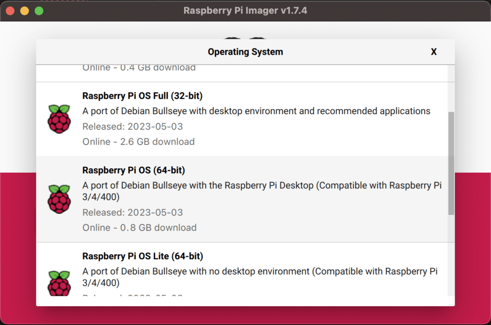
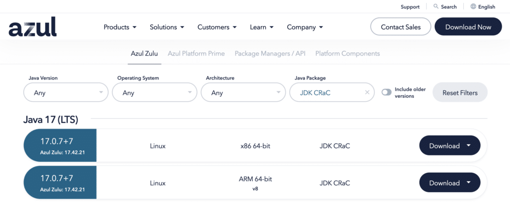
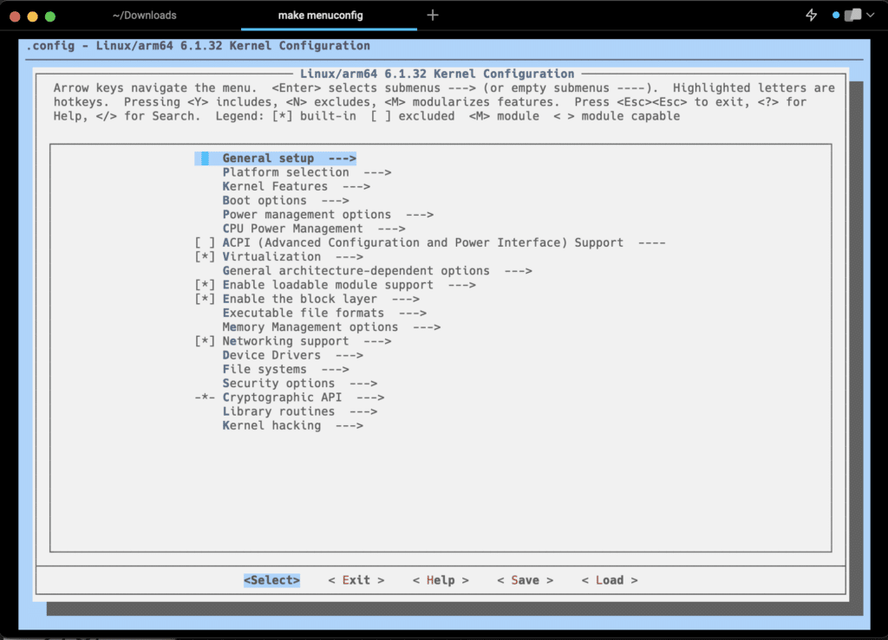
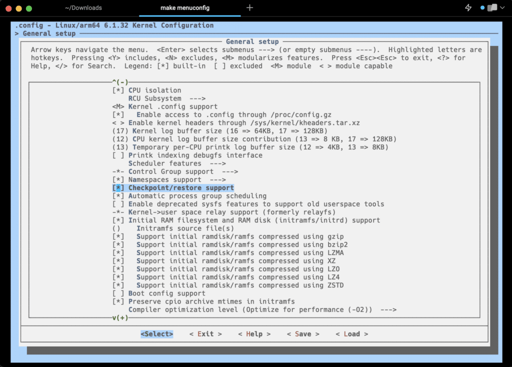

With the April release of the Zulu Build of OpenJDK, Azul announced [the integration of CRaC in its version 17 of Java for Linux](https://www.azul.com/blog/reduce-java-application-startup-and-warmup-times-with-crac/). [Coordinated Restore at Checkpoint (CRaC)](https://www.azul.com/products/components/crac/) is a feature introduced in OpenJDK to improve Java's application startup and warmup times to milliseconds from seconds or even minutes, by allowing a running application to pause, snapshot its state, and restart later, even on a different machine.

CRaC is the final step after previous projects by Azul in multiple client projects in the automotive and IoT industry. Infotainment systems for car, gateways in electronic systems, and other use-cases require high-speed startup of their applications running on embedded ARM32 and ARM64 systems.

The Raspberry Pi also has an ARM processor, so I wanted to know if CRaC can improve the speedup of Java applications on Raspberry Pi OS. This post is the result of my first experiments.
> <br />
>
> TL;DR; It does work perfectly but still needs a modified kernel and changes in Zulu which will be part of the next release in July.

## Raspberry Pi OS

On the [download page of Azul](https://www.azul.com/downloads/?package=jdk-crac#zulu), two versions of Zulu are available now, with CRaC included. As you can see in the screenshot, both aim Linux, one for x86 64-bit platforms and the other one for ARM v8 64-bit. The second one is the same processor used in the Raspberry Pi 4.

With the Raspberry Pi Imager Tool, I prepared an SD card with the 64-bit version of Raspberry Pi OS. I started with a 16GB card but had to restart as this isn't enough to build the kernel as is currently necessary, as you can read further. Luckily, I had a 64GB card available for a second attempt.

When the device has started for the first time, make sure to update it fully and we can start with a "fresh up-to-date" system.

```
$ sudo apt update
$ sudo apt upgrade
```

<figure class="wp-block-gallery has-nested-images columns-default is-cropped wp-block-gallery-1 is-layout-flex wp-block-gallery-is-layout-flex">
 <figure class="wp-block-image size-large">
  
 </figure>
 <figure class="wp-block-image size-large">
  
 </figure>
</figure>

## Install Azul Zulu OpenJDK

### Manual Install Steps

Download the "ARM 64-bit" version from the Azul website and follow these steps to unpack it and make a link to easy use it for our tests.

```
# Download
$ cd Downloads
$ wget https://cdn.azul.com/zulu/bin/zulu17.42.21-ca-crac-jdk17.0.7-linux_aarch64.tar.gz

# Move and unpack in /opt/
$ sudo mv ~/Downloads/zulu17.42.21-ca-crac-jdk17.0.7-linux_aarch64.tar.gz /opt/
$ cd /opt/
$ sudo tar -xzvf zulu17.42.21-ca-crac-jdk17.0.7-linux_aarch64.tar.gz

# Make a link for easier use
$ sudo ln -s zulu17.42.21-ca-crac-jdk17.0.7-linux_aarch64/ zulu-crac

# Checking the installed version
$ /opt/zulu-crac/bin/java -version
openjdk version "17.0.7" 2023-04-18 LTS
OpenJDK Runtime Environment Zulu17.42+21-CRaC-CA (build 17.0.7+7-LTS)
OpenJDK 64-Bit Server VM Zulu17.42+21-CRaC-CA (build 17.0.7+7-LTS, mixed mode)
```

### Using SDKMAN

Another approach is to use [SDKMAN](https://sdkman.io/). When I started this test, the CRaC version of Zulu was not included yet in the list of Java distributions in SDKMAN, but thanks to a quick intervention of Gerrit Grunwald (creator of the [DiscoAPI](https://github.com/foojayio/discoapi)) and the SDKMAN-team, this got solved within minutes.

```
# Install SDKMAN
$ sudo apt install zip
$ curl -s "https://get.sdkman.io" | bash
$ source "$HOME/.sdkman/bin/sdkman-init.sh"

# Check all available Java distributions for the system
$ sdk list java
================================================================================
Available Java Versions for Linux ARM 64bit
================================================================================
 Vendor        | Use | Version      | Dist    | Status     | Identifier
--------------------------------------------------------------------------------
 AdoptOpenJDK  |     | 8.0.275+1.hs | adpt    |            | 8.0.275+1.hs-adpt
               |     | 8.0.252.hs   | adpt    |            | 8.0.252.hs-adpt
 Corretto      |     | 20           | amzn    |            | 20-amzn
               |     | 20.0.1       | amzn    |            | 20.0.1-amzn
...
 Zulu          |     | 20           | zulu    |            | 20-zulu
               |     | 20.0.1       | zulu    |            | 20.0.1-zulu
               |     | 19.0.2       | zulu    |            | 19.0.2-zulu
               |     | 19.0.1       | zulu    |            | 19.0.1-zulu
               |     | 17.0.7       | zulu    |            | 17.0.7-zulu
               |     | 17.0.7.crac  | zulu    |            | 17.0.7.crac-zulu
               |     | 17.0.6       | zulu    |            | 17.0.6-zulu
...

# Install Zulu 17 with CRaC
$ sdk install java 17.0.7.crac-zulu
Downloading: java 17.0.7.crac-zulu
In progress...
########...######## 100.0%
Repackaging Java 17.0.7.crac-zulu...
Done repackaging...
Installing: java 17.0.7.crac-zulu
Done installing!
Do you want java 17.0.7.crac-zulu to be set as default? (Y/n): y
Setting java 17.0.7.crac-zulu as default.

# Checking the installed version
pi@crowpi2:~/.m2 $ java -version
openjdk version "17.0.7" 2023-04-18 LTS
OpenJDK Runtime Environment Zulu17.42+21-CRaC-CA (build 17.0.7+7-LTS)
OpenJDK 64-Bit Server VM Zulu17.42+21-CRaC-CA (build 17.0.7+7-LTS, mixed mode)
```

## Create a Checkpoint with a Java Test Application

Within the CRaC-project, a demo application was created to explain the usage of the checkpoint and restore system, as [described here](https://github.com/CRaC/docs/blob/master/STEP-BY-STEP.md). Clone this project, build it with Maven, and execute it with an extra command line argument `-XX:CRaCCheckpointTo=cr` to define the directory where the checkpoint must be created.

```
# Get the project
$ git clone https://github.com/CRaC/example-jetty.git
$ cd example-jetty

# Install Maven (if not done before)
$ sdk install maven
$ mvn -version
Apache Maven 3.9.2 (c9616018c7a021c1c39be70fb2843d6f5f9b8a1c)
Maven home: /home/crac/.sdkman/candidates/maven/current
Java version: 17.0.7, vendor: Azul Systems, Inc., runtime: /home/crac/.sdkman/candidates/java/17.0.7.crac-zulu
Default locale: en_US, platform encoding: ANSI_X3.4-1968
OS name: "linux", version: "6.1.21-v8+", arch: "aarch64", family: "unix"

# Build the application
$ mvn package

# Run the application
$ java -XX:CRaCCheckpointTo=cr -jar target/example-jetty-1.0-SNAPSHOT.jar
[0.003s][warning][os] CRaC closing file descriptor 63: pipe:[18796]
2023-06-15 07:51:28.611:INFO::main: Logging initialized @540ms to org.eclipse.jetty.util.log.StdErrLog
2023-06-15 07:51:28.817:INFO:oejs.Server:main: jetty-9.4.48.v20220622; built: 2022-06-21T20:42:25.880Z; git: 6b67c5719d1f4371b33655ff2d047d24e171e49a; jvm 17.0.7+7-LTS
2023-06-15 07:51:28.938:INFO:oejs.AbstractConnector:main: Started ServerConnector@7b69c6ba{HTTP/1.1, (http/1.1)}{0.0.0.0:8080}
2023-06-15 07:51:28.948:INFO:oejs.Server:main: Started @895ms
```

The application started in 895ms but didn't do anything yet. At this point, we must open a second terminal to trigger an action in the application to "warm it up", and we can request the creation of the checkpoint.

```
$ curl localhost:8080
Hello World

$ jcmd target/example-jetty-1.0-SNAPSHOT.jar JDK.checkpoint
3467:
CR: Checkpoint ...
```

The expected result in the first terminal should be that the application log shows that the checkpoint is created and the application terminated. Unfortunately, this is the output I got, ending with an exception:

```
2023-06-15 07:53:10.571:INFO:oejs.AbstractConnector:Attach Listener: Stopped ServerConnector@7b69c6ba{HTTP/1.1, (http/1.1)}{0.0.0.0:8080}
Jun 15, 2023 7:53:10 AM jdk.internal.util.jar.PersistentJarFile beforeCheckpoint
INFO: /home/crac/example-jetty/target/dependency/crac-1.3.0.jar is recorded as always available on restore
Jun 15, 2023 7:53:10 AM jdk.internal.util.jar.PersistentJarFile beforeCheckpoint
INFO: /home/crac/example-jetty/target/dependency/jetty-http-9.4.48.v20220622.jar is recorded as always available on restore
Jun 15, 2023 7:53:10 AM jdk.internal.util.jar.PersistentJarFile beforeCheckpoint
INFO: /home/crac/example-jetty/target/dependency/jetty-server-9.4.48.v20220622.jar is recorded as always available on restore
Jun 15, 2023 7:53:10 AM jdk.internal.util.jar.PersistentJarFile beforeCheckpoint
INFO: /home/crac/example-jetty/target/dependency/jetty-util-9.4.48.v20220622.jar is recorded as always available on restore
Jun 15, 2023 7:53:10 AM jdk.internal.util.jar.PersistentJarFile beforeCheckpoint
INFO: /home/crac/example-jetty/target/dependency/jetty-io-9.4.48.v20220622.jar is recorded as always available on restore
Jun 15, 2023 7:53:10 AM jdk.internal.util.jar.PersistentJarFile beforeCheckpoint
INFO: /home/crac/example-jetty/target/example-jetty-1.0-SNAPSHOT.jar is recorded as always available on restore
Jun 15, 2023 7:53:10 AM jdk.internal.util.jar.PersistentJarFile beforeCheckpoint
INFO: /home/crac/example-jetty/target/dependency/javax.servlet-api-3.1.0.jar is recorded as always available on restore
JVM: invalid info for restore provided: queued code -1
2023-06-15 07:53:12.650:INFO:oejs.Server:Attach Listener: jetty-9.4.48.v20220622; built: 2022-06-21T20:42:25.880Z; git: 6b67c5719d1f4371b33655ff2d047d24e171e49a; jvm 17.0.7+7-LTS
2023-06-15 07:53:12.661:INFO:oejs.AbstractConnector:Attach Listener: Started ServerConnector@7b69c6ba{HTTP/1.1, (http/1.1)}{0.0.0.0:8080}
2023-06-15 07:53:12.662:INFO:oejs.Server:Attach Listener: Started @104609ms
An exception during a checkpoint operation:
jdk.internal.crac.CheckpointException
    at java.base/jdk.internal.crac.Core.checkpointRestore1(Core.java:141)
    at java.base/jdk.internal.crac.Core.checkpointRestore(Core.java:246)
    at java.base/jdk.internal.crac.Core.checkpointRestoreInternal(Core.java:262)
```

The file created in `example-jetty/cr/dump4.log` seems to lead to a possible cause, as it says that CRIU does not exist.

```
(00.000127) Version: 3.17.1-crac (gitid v3.14-889-gfe637c2+1)
(00.000201) Running on crowpi2 Linux 5.10.92-v8+ #1514 SMP PREEMPT Mon Jan 17 17:39:38 GMT 2022 aarch64
(00.000240) File /run/criu.kdat does not exist
(00.000322) sockets: Probing sock diag modules
(00.007306) Warn  (criu/sockets.c:209): sockets: Diag module missing (-2)
(00.011884) Warn  (criu/sockets.c:209): sockets: Diag module missing (-2)
(00.019999) Warn  (criu/sockets.c:209): sockets: Diag module missing (-2)
(00.056952) sockets: Done probing
(00.057128) Pagemap provides flags only
(00.057348) Found anon-shmem device at 1
(00.057389) Reset 3527's dirty tracking
(00.057425) Dirty tracking support is OFF
(00.057437) Zero page detection failed, optimization turns off.
(00.057569) Found task size of 8000000000
(00.057651) Warn  (criu/proc_parse.c:930): Write 4294967295 to /proc/self/loginuid failed: Operation not permitted
(00.075370) Warn  (criu/net.c:3430): Unable to get tun network namespace
(00.075518) Warn  (criu/sk-unix.c:224): unix: Unable to open a socket file: Operation not permitted
(00.076455) Warn  (criu/net.c:3714): Unable create a network namespace: Operation not permitted
(00.077347) Warn  (criu/net.c:3770): NSID isn't reported for network links
(00.077463) Error (criu/kerndat.c:508): Unexpected error from memfd_create("", MFD_HUGETLB): Function not implemented
(00.077481) Error (criu/kerndat.c:1590): kerndat_has_memfd_hugetlb failed when initializing kerndat.
(00.077601) Adjust mmap_min_addr 0x1000 -> 0x10000
(00.077619) Found mmap_min_addr 0x10000
(00.077660) files stat: fs/nr_open 1048576
(00.077677) Error (criu/crtools.c:260): Could not initialize kernel features detection.
```

## Fix 1: Add CRIU to the Kernel

Thanks to the support of my colleague Sergey Nazarkin, it quickly became apparent how we needed to solve this problem... It turned out that Raspberry Pi OS doesn't support CRIU out-of-the-box yet. Because this Linux component is used by CRaC, at this moment, to create checkpoints and restore them, we must add this to the kernel.

### Building the Kernel Without Change

On the Raspberry Pi website, it's [clearly described how the Linux kernel can be compiled](https://www.raspberrypi.com/documentation/computers/linux_kernel.html). To validate this process, I built the kernel without modifications to ensure I understood this flow. This is an overview of all the steps:

```
# Check current kernel
$ uname -a
Linux raspberrypi 6.1.21-v8+ #1642 SMP PREEMPT Mon Apr  3 17:24:16 BST 2023 aarch64 GNU/Linux

# Get dependencies and kernel sources
$ sudo apt install git bc bison flex libssl-dev make
$ git clone --depth=1 https://github.com/raspberrypi/linux

# Configuration for 64bit
$ cd linux
$ KERNEL=kernel8

# Apply default configuration
$ make bcm2711_defconfig

# Change the existing line with CONFIG_LOCALVERSION to make clear a custom kernel is used
$ nano .config
CONFIG_LOCALVERSION="-v8-CRAC"

# Build and install the kernel using 4 cores (-j4)
$ make -j4 Image.gz modules dtbs
$ sudo make modules_install
$ sudo cp arch/arm64/boot/dts/broadcom/*.dtb /boot/
$ sudo cp arch/arm64/boot/dts/overlays/*.dtb* /boot/overlays/
$ sudo cp arch/arm64/boot/dts/overlays/README /boot/overlays/
$ sudo cp arch/arm64/boot/Image.gz /boot/kernel8.img

# Restart
$ sync
$ sudo reboot

# Check kernel version and timestamp
$ uname -a
Linux crac 6.1.32-v8-CRAC+ #1 SMP PREEMPT Thu Jun 15 09:30:31 BST 2023 aarch64 GNU/Linux
```

The last line proves that we could build our own kernel version, and the board has successfully started with it! On to the next step...

FYI: the command `make -j4 Image.gz modules dtbs` takes the longest time: 2 hours!

### Change the Kernel to Support Checkpoint/Restore

Within the same `linux` directory, run the following commands:

```
$ sudo apt install libncurses5-dev 
$ make menuconfig
```

* Go to "General setup"
* Scroll down and select "Checkpoint/restore support"
* Save and exit
* Repeat the process to build the kernel starting from `make -j4 Image.gz modules dtbs`
* After reboot, check that the new kernel is used, by checking the new timestamp

```
$ uname -a
Linux crac 6.1.32-v8-CRAC+ #2 SMP PREEMPT Thu Jun 15 11:08:18 BST 2023 aarch64 GNU/Linux
```

<figure class="wp-block-gallery has-nested-images columns-default is-cropped wp-block-gallery-2 is-layout-flex wp-block-gallery-is-layout-flex">
 <figure class="wp-block-image size-large">
  
 </figure>
 <figure class="wp-block-image size-large">
  
 </figure>
</figure>

### Retry the Checkpoint Creation with Fix 1

Unfortunately, this kernel change is insufficient, as the same error occurs during checkpoint creation...

## Fix 2: Replace Zulu with a Dev Version

As it turns out, the current Zulu version 17.0.7 with CRaC doesn't support this Linux kernel. Luckily, Sergey could provide me a dev-version of Zulu with changes that will be part of the next release in July. First, I needed to upload them to my Raspberry Pi.

```
% scp zulu17.42.21-dev-20230613095837-jdk17.0.7-linux-aarch64.tar.gz <a href="/cdn-cgi/l/email-protection" class="__cf_email__" data-cfemail="3e5d4c5f5d7e0f090c100f08100f100f0a0b">[email protected]</a>:/home/crac/
```

And then installed in the `/opt/` directory as described above.

```
$ sudo mv zulu17.42.21-dev-20230614092542-jdk17.0.7-linux-aarch64.tar.gz /opt/
$ cd /opt/
$ sudo tar -xzvf zulu17.42.21-dev-20230614092542-jdk17.0.7-linux-aarch64.tar.gz
$ sudo ln -s zulu17.42.21-dev-20230614092542-jdk17.0.7-linux-aarch64 zulu-crac
$ sudo rm zulu17.42.21-dev-20230614092542-jdk17.0.7-linux-aarch64.tar.gz
$ /opt/zulu-crac/bin/java -version
openjdk version "17.0.7" 2023-04-18 LTS
OpenJDK Runtime Environment Zulu17.42+21-CRaC-CA-dev-20230614092542 (build 17.0.7+7-LTS-dev-20230614092542)
OpenJDK 64-Bit Server VM Zulu17.42+21-CRaC-CA-dev-20230614092542 (build 17.0.7+7-LTS-dev-20230614092542, mixed mode, sharing)
```

### Retry the Checkpoint Creation with Fix 1 and 2

With the modified kernel in place and the dev-version of Zulu, the checkpoint creation command shows this result in the application log:

In Terminal 1:

```
/opt/zulu-crac/bin/java -XX:CRaCCheckpointTo=cr -jar target/example-jetty-1.0-SNAPSHOT.jar

[0.002s][warning][os] CRaC closing file descriptor 63: pipe:[17763]
2023-06-15 11:30:33.400:INFO::main: Logging initialized @327ms to org.eclipse.jetty.util.log.StdErrLog
2023-06-15 11:30:33.620:INFO:oejs.Server:main: jetty-9.4.48.v20220622; built: 2022-06-21T20:42:25.880Z; git: 6b67c5719d1f4371b33655ff2d047d24e171e49a; jvm 17.0.7+7-LTS-dev-20230614092542
2023-06-15 11:30:33.739:INFO:oejs.AbstractConnector:main: Started ServerConnector@63d4e2ba{HTTP/1.1, (http/1.1)}{0.0.0.0:8080}
2023-06-15 11:30:33.745:INFO:oejs.Server:main: Started @684ms
2023-06-15 11:32:14.765:INFO:oejs.AbstractConnector:Attach Listener: Stopped ServerConnector@63d4e2ba{HTTP/1.1, (http/1.1)}{0.0.0.0:8080}
Jun 15, 2023 11:32:14 AM jdk.internal.crac.LoggerContainer info
INFO: /home/crac/example-jetty/target/dependency/crac-1.3.0.jar is recorded as always available on restore
Jun 15, 2023 11:32:14 AM jdk.internal.crac.LoggerContainer info
INFO: /home/crac/example-jetty/target/dependency/jetty-io-9.4.48.v20220622.jar is recorded as always available on restore
Jun 15, 2023 11:32:14 AM jdk.internal.crac.LoggerContainer info
INFO: /home/crac/example-jetty/target/dependency/jetty-util-9.4.48.v20220622.jar is recorded as always available on restore
Jun 15, 2023 11:32:14 AM jdk.internal.crac.LoggerContainer info
INFO: /home/crac/example-jetty/target/dependency/jetty-http-9.4.48.v20220622.jar is recorded as always available on restore
Jun 15, 2023 11:32:14 AM jdk.internal.crac.LoggerContainer info
INFO: /home/crac/example-jetty/target/dependency/javax.servlet-api-3.1.0.jar is recorded as always available on restore
Jun 15, 2023 11:32:14 AM jdk.internal.crac.LoggerContainer info
INFO: /home/crac/example-jetty/target/dependency/jetty-server-9.4.48.v20220622.jar is recorded as always available on restore
Jun 15, 2023 11:32:14 AM jdk.internal.crac.LoggerContainer info
INFO: /home/crac/example-jetty/target/example-jetty-1.0-SNAPSHOT.jar is recorded as always available on restore
Killed
```

In Terminal 2:

```
$ curl localhost:8080
Hello World

$ /opt/zulu-crac/bin/jcmd target/example-jetty-1.0-SNAPSHOT.jar JDK.checkpoint
10429:
CR: Checkpoint ...
```

It seems we have a breakthrough here, and the checkpoint was successfully created, after which the application was killed!

## Restart From Checkpoint

In the `cr` directory that we defined at startup of the application with `-XX:CRaCCheckpointTo=cr`, we can now find the following files:

```
ls -lh cr
total 28M
-rw-r--r-- 1 crac crac 2.0K Jun 15 11:33 core-10429.img
-rw-r--r-- 1 crac crac  571 Jun 15 11:33 core-10430.img
-rw-r--r-- 1 crac crac  558 Jun 15 11:33 core-10432.img
-rw-r--r-- 1 crac crac  535 Jun 15 11:33 core-10433.img
-rw-r--r-- 1 crac crac  569 Jun 15 11:33 core-10434.img
-rw-r--r-- 1 crac crac  549 Jun 15 11:33 core-10435.img
-rw-r--r-- 1 crac crac  568 Jun 15 11:33 core-10436.img
-rw-r--r-- 1 crac crac  626 Jun 15 11:33 core-10437.img
-rw-r--r-- 1 crac crac  565 Jun 15 11:33 core-10438.img
-rw-r--r-- 1 crac crac  532 Jun 15 11:33 core-10439.img
-rw-r--r-- 1 crac crac  571 Jun 15 11:33 core-10440.img
-rw-r--r-- 1 crac crac  551 Jun 15 11:33 core-10441.img
-rw-r--r-- 1 crac crac  574 Jun 15 11:33 core-10442.img
-rw-r--r-- 1 crac crac  576 Jun 15 11:33 core-10443.img
-rw-r--r-- 1 crac crac  568 Jun 15 11:33 core-10444.img
-rw-r--r-- 1 crac crac  573 Jun 15 11:33 core-10445.img
-rw-r--r-- 1 crac crac  557 Jun 15 11:33 core-10446.img
-rw-r--r-- 1 crac crac  547 Jun 15 11:33 core-10447.img
-rw-r--r-- 1 crac crac  532 Jun 15 11:33 core-10448.img
-rw-r--r-- 1 crac crac  580 Jun 15 11:33 core-10457.img
-rw-r--r-- 1 crac crac  553 Jun 15 11:33 core-10615.img
-rw-r--r-- 1 crac crac  592 Jun 15 11:33 core-10616.img
-rw-r--r-- 1 crac crac  586 Jun 15 11:33 core-10617.img
-rw-r--r-- 1 crac crac   27 Jun 15 11:33 cppath
-rw------- 1 crac crac 209K Jun 15 11:33 dump4.log
-rw-r--r-- 1 crac crac  152 Jun 15 11:33 fdinfo-2.img
-rw-r--r-- 1 crac crac 3.9K Jun 15 11:33 files.img
-rw-r--r-- 1 crac crac   18 Jun 15 11:33 fs-10429.img
-rw-r--r-- 1 crac crac   36 Jun 15 11:33 ids-10429.img
-rw-r--r-- 1 crac crac   46 Jun 15 11:33 inventory.img
-rw-r--r-- 1 crac crac 7.7K Jun 15 11:33 mm-10429.img
-rw-r--r-- 1 crac crac 3.3K Jun 15 11:33 pagemap-10429.img
-rw-r--r-- 1 crac crac  28M Jun 15 11:33 pages-1.img
-rw------- 1 crac crac  32K Jun 15 11:33 perfdata
-rw-r--r-- 1 crac crac   92 Jun 15 11:33 pstree.img
-rw-r--r-- 1 crac crac   12 Jun 15 11:33 seccomp.img
-rw-r--r-- 1 crac crac   52 Jun 15 11:33 stats-dump
-rw-r--r-- 1 crac crac   34 Jun 15 11:33 timens-0.img
-rw-r--r-- 1 crac crac  199 Jun 15 11:33 tty-info.img
```

As mentioned on [Azul Docs \> Debugging Coordinated Restore at Checkpoint Failures \> Failures in Native Checkpoint or Restore](https://docs.azul.com/core/crac/crac-debugging#failures-in-native-checkpoint-or-restore), the permissions of `criu` with the JDK must be set correctly.

```
$ ls -l /opt/zulu-crac/lib/criu
-rwxr-xr-x 1 1001 1001 7241504 Jun 14 10:40 /opt/zulu-crac/lib/criu
$ sudo chown root:root  /opt/zulu-crac/lib/criu
$ sudo chmod u+s /opt/zulu-crac/lib/criu
$ ls -l /opt/zulu-crac/lib/criu
-rwsr-xr-x 1 root root 7241504 Jun 14 10:40 /opt/zulu-crac/lib/criu
```

When this is done, we can restart the application from the checkpoint:

```
$ /opt/zulu-crac/bin/java -XX:CRaCRestoreFrom=cr
2023-06-15 12:32:38.430:INFO:oejs.Server:Attach Listener: jetty-9.4.48.v20220622; built: 2022-06-21T20:42:25.880Z; git: 6b67c5719d1f4371b33655ff2d047d24e171e49a; jvm 17.0.7+7-LTS-dev-20230614092542
2023-06-15 12:32:38.449:INFO:oejs.AbstractConnector:Attach Listener: Started ServerConnector@63d4e2ba{HTTP/1.1, (http/1.1)}{0.0.0.0:8080}
2023-06-15 12:32:38.450:INFO:oejs.Server:Attach Listener: Started @3578432ms
```

There is still a fix required to show the correct startup duration, but based on the timestamps we can see that it only took 450-430 = 20 milliseconds!

## Conclusion

You can't run this test in a few minutes as the kernel takes a long time to build. But this first test shows that CRaC on embedded / Raspberry Pi is definitely possible and dramatically improves the startup time!

I'm checking how [CRIU can be enabled in the Raspberry Pi Linux Kernel by default](https://forums.raspberrypi.com/viewtopic.php?t=352607), and Azul is working on a subsequent iteration of the CRaC implementation in Zulu for even more improvements!

CRaC is, again, a fantastic piece of engineering within OpenJDK and can be used on a big number of (embedded) devices.
