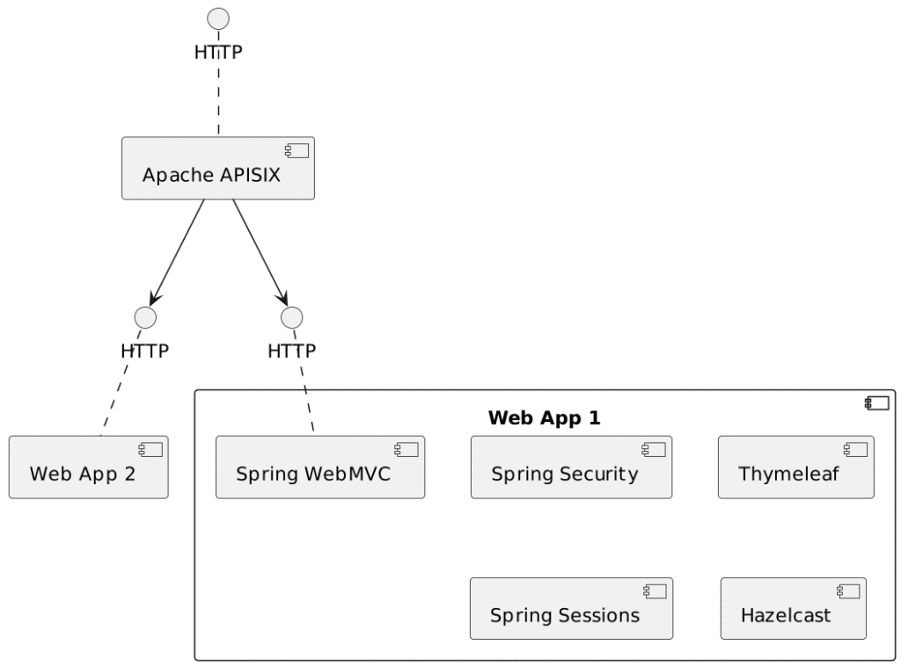
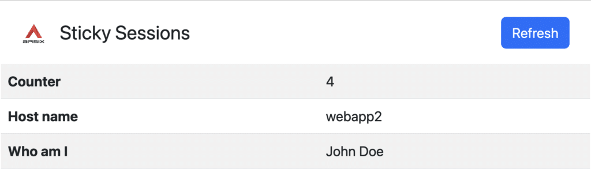

We've described the concept behind [sticky sessions](https://foojay.io/today/sticky-sessions-with-apache-apisix/): you forward a request to the same upstream because there's context data associated with the session on that node.

However, if necessary, you should replicate the data to other upstreams because this one might go down. In this post, we are going to illustrate it with a demo.

The overall design {#h2-0-the-overall-design}
---------------------------------------------

Design options are limitless. I'll keep myself to a familiar stack, the JVM. Also, as mentioned in the previous post, one should only implement sticky sessions with session replication.

The final design consists of two components: an Apache APISIX instance with sticky sessions configured and two JVM nodes running the same application with session replication.

The application uses the following:

|                                 Dependency                                 |                   Description                    |
|----------------------------------------------------------------------------|--------------------------------------------------|
| [Spring Boot](https://spring.io/projects/spring-boot)                      | Eases the usage of Spring libraries              |
| [Spring MVC](https://spring.io/projects/spring-session)                    | Allows offering HTTP endpoints                   |
| [Thymeleaf](https://www.thymeleaf.org/)                                    | View technology                                  |
| [Spring Session](https://spring.io/projects/spring-session)                | Offers an abstraction over *session replication* |
| [Hazelcast](https://hazelcast.com/products/hazelcast-platform/) (embedded) | Implements session replication                   |
| [Spring Security](https://spring.io/projects/spring-security)              | Binds an identity to a user session              |

The design looks like the following:



`app1` and `app2` are two instances of the same app; I didn't want to overcrowd the diagram with redundant data.

The heart of the application {#h2-1-the-heart-of-the-application}
-----------------------------------------------------------------

The heart of the application is a session-scoped bean that wraps a counter, which can only be incremented:

<pre class="EnlighterJSRAW" data-enlighter-language="java">@Component
@SessionScope
public class Counter implements Serializable {              //1

    private int value = 0;

    public int getValue() {
        return value;
    }

    public void incrementValue() {
        value++;
    }
}</pre>

1. Necessary for Hazelcast serialization to work

We can use this bean in the controller:

<pre class="EnlighterJSRAW" data-enlighter-language="java">@Controller
public class IndexController {

    private final Counter counter;

    public IndexController(Counter counter) {               //1
        this.counter = counter;
    }

    @GetMapping("/")
    public String index(Model model) {                      //2
        counter.incrementValue();
        model.addAttribute("counter", counter.getValue());
        return "index";
    }
}</pre>

1. Inject the session-scoped bean in the singleton controller thanks to Spring's magic
2. When we send a `GET` request to the root, increment the counter value and pass it to the model

Finally, we display the bean's value on the Thymeleaf page:

<pre class="EnlighterJSRAW" data-enlighter-language="html">&lt;!DOCTYPE html&gt;
&lt;html xmlns:th="http://www.thymeleaf.org" lang="en"&gt;
&lt;body&gt;
&lt;div th:text="${counter}"&gt;3&lt;/div&gt;</pre>

Configuring Spring Session with Hazelcast {#h2-2-configuring-spring-session-with-hazelcast}
-------------------------------------------------------------------------------------------

Spring Session offers a filter that wraps the original `HttpServletRequest` to override the `getSession()` method. This method returns a specific `Session` implementation backed by the implementation configured with Spring Session, in our case, Hazelcast.

We need only a few tweaks to configure Spring Session with Hazelcast.

First, annotate the Spring Boot application class with the relevant annotation:

<pre class="EnlighterJSRAW" data-enlighter-language="java">@SpringBootApplication
@EnableHazelcastHttpSession
public class SessionApplication {
    ...
}</pre>

Hazelcast requires a specific configuration as well. We can use XML, YAML, or code.  

Since it's a demo, I can choose whatever I want, so let's code it. Spring Boot requires either an Hazelcast object or a configuration object. The latter is enough:

<pre class="EnlighterJSRAW" data-enlighter-language="java">@Bean
public Config hazelcastConfig() {
  var config = new Config();
  var networkConfig = config.getNetworkConfig();
  networkConfig.setPort(0);                                                      //1
  networkConfig.getJoin().getAutoDetectionConfig().setEnabled(true);              //2
  var attributeConfig = new AttributeConfig()                                     //3
          .setName(HazelcastIndexedSessionRepository.PRINCIPAL_NAME_ATTRIBUTE)
          .setExtractorClassName(PrincipalNameExtractor.class.getName());
  config.getMapConfig(HazelcastIndexedSessionRepository.DEFAULT_SESSION_MAP_NAME) //3
          .addAttributeConfig(attributeConfig)
          .addIndexConfig(new IndexConfig(
            IndexType.HASH,
            HazelcastIndexedSessionRepository.PRINCIPAL_NAME_ATTRIBUTE
  ));
  var serializerConfig = new SerializerConfig();
  serializerConfig.setImplementation(new HazelcastSessionSerializer())            //3
                  .setTypeClass(MapSession.class);
  config.getSerializationConfig().addSerializerConfig(serializerConfig);
  return config;
}</pre>

1. Choose a random port to avoid port conflict
2. Allow Hazelcast to search for other instances and automagically form a cluster. It's going to be necessary when deployed as per our design
3. Copy-pasted from the Spring Session documentation

Configuring Spring Security {#h2-3-configuring-spring-security}
---------------------------------------------------------------

Most Spring Session examples somehow use Spring Security, and though it's not strictly necessary, it makes the design easier. I want to explain why first.

One can think about sessions as a gigantic hash table. In regular applications, the key is the `JSESSIONID` cookie value, the value, another hash table of session data. However, the `JSESSIONID` is specific to the node. The app will give a different `JSESSIONID` if one uses another node. Since the key is different, there's no way to access the session data, even if the session data is shared across nodes. To prevent this loss, we need to come up with a different key. Spring Security allows using a principal (or the login name) as the session data key.

Here's how I set up a basic Spring Security configuration:

<pre class="EnlighterJSRAW" data-enlighter-language="java">@Bean
public SecurityFilterChain securityFilterChain(UserDetailsService service, HttpSecurity http) throws Exception {
  return http.userDetailsService(service)                                    //1
             .authorizeHttpRequests(authorize -&gt; authorize.requestMatchers(
                 PathRequest.toStaticResources().atCommonLocations())        //2
                            .permitAll()                                     //2
                            .anyRequest().authenticated()                    //3
             ).formLogin(form -&gt; form.permitAll()
                                     .defaultSuccessUrl("/")                 //4
             ).build();
}</pre>

1. The default in-memory user details service doesn't allow custom user details classes. I had to provide my own.
2. Allow everybody to access static resources at "common" locations
3. All other requests must be authenticated
4. Allow everybody to access the authentication form
5. Redirect to the root if successful, which maps the above controller

Putting our design to the test {#h2-4-putting-our-design-to-the-test}
---------------------------------------------------------------------

Beside the counter, I want to display two additional pieces of data: the hostname and the logged-in user.

For the hostname, I add the following method to the controller:

<pre class="EnlighterJSRAW" data-enlighter-language="java">@ModelAttribute("hostname")
private String hostname() throws UnknownHostException {
    return InetAddress.getLocalHost().getHostName();
}</pre>

Displaying the logged-in user requires an additional dependency:

<pre class="EnlighterJSRAW" data-enlighter-language="xml">&lt;dependency&gt;
    &lt;groupId&gt;org.thymeleaf.extras&lt;/groupId&gt;
    &lt;artifactId&gt;thymeleaf-extras-springsecurity6&lt;/artifactId&gt;
&lt;/dependency&gt;</pre>

On the page, it's straightforward:

<pre class="EnlighterJSRAW" data-enlighter-language="html">&lt;!DOCTYPE html&gt;
&lt;html xmlns:th="http://www.thymeleaf.org"
      xmlns:sec="http://www.thymeleaf.org/extras/spring-security"&gt;  &lt;!--1--&gt;
&lt;body&gt;
&lt;td sec:authentication="principal.label"&gt;Me&lt;/td&gt;                    &lt;!--2--&gt;</pre>

1. Add the `sec` namespace. It's not necessary but may help the IDE to help you
2. Require the underlying `UserDetail` implementation to have a `getLabel()` method

Last but not least, we need to configure Apache APISIX with sticky sessions, as we saw last week:

<pre class="EnlighterJSRAW" data-enlighter-language="yaml">routes:
  - uri: /*
    upstream:
      nodes:
        "webapp1:8080": 1
        "webapp2:8080": 1
      type: chash
      hash_on: cookie
      key: cookie_JSESSIONID
#END</pre>

Here's the design implemented on Docker Compose:

<pre class="EnlighterJSRAW" data-enlighter-language="yaml">services:
  apisix:
    image: apache/apisix:3.3.0-debian
    volumes:
      - ./apisix/config.yml:/usr/local/apisix/conf/config.yaml:ro
      - ./apisix/apisix.yml:/usr/local/apisix/conf/apisix.yaml:ro    #1
    ports:
      - "9080:9080"                                                  #2
    depends_on:
      - webapp1
      - webapp2
  webapp1:
    build: ./webapp
    hostname: webapp1                                                #3
  webapp2:
    build: ./webapp
    hostname: webapp2                                                #3</pre>

1. Use the previous configuration file
2. Only expose the API Gateway to the outside world
3. Set the hostname to display it on the page

We can log in using one of the two hard-coded accounts. I'm using `john`, with password `john` and label `John Doe`. Notice that Apache APISIX sets me on a node and keeps using the same if I refresh.



We can try to log in with the other account (`jane`/`jane`) from a private window and check the counter starts from 0.

Now comes the fun part. Let's stop the node which should be hosting the session data, here `webapp2` and refresh the page:

```bash
docker compose stop webapp2
```

We can see exciting things in the logs. Apache APISIX can no longer find the `webapp2`, so it forwards the request to the other upstream that it knows, `webapp1`.

1. The request is still authenticated; it goes through Spring Security
2. The framework gets the principal out of the request
3. It queries Spring Session
4. And gets the correct counter value that Hazelcast replicated from the other node

The only side-effect is an increased latency because of Apache APISIX timeout. It's 5 seconds by default, but you can configure it to a lower value if needed.

When we start `webapp2` again, everything works as expected again.

Conclusion {#h2-5-conclusion}
-----------------------------

In this article, I've described a possible setup for sticky sessions with Apache APISIX and replication involving the Spring ecosystem and Hazelcast.

Many other options are available depending on your stack and framework of choices.

The complete source code for this post can be found on [GitHub](https://github.com/ajavageek/sticky-sessions-apisix).

**To go further:**

* [Spring Session and Spring Security with Hazelcast](https://docs.spring.io/spring-session/reference/guides/java-hazelcast.html)
* [Spring Session Hazelcast](https://docs.hazelcast.com/tutorials/spring-session-hazelcast)

*** ** * ** ***

*Originally published at [A Java Geek](https://blog.frankel.ch/sticky-sessions-apache-apisix/2/) on July 2^nd^, 2023*
