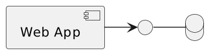
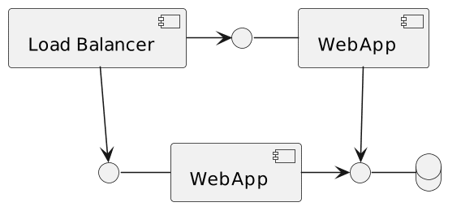

Sticky sessions, also known as session affinity, is a mechanism by which a routing component that acts as a facade always routes a request to the same underlying upstream node.

In this article, I'll describe the reason behind sticky sessions, available alternatives, and how to implement them via Apache APISIX.

Why sticky sessions? {#h2-0-why-sticky-sessions}
------------------------------------------------

Sticky sessions became popular when we stored the state on the upstream node, not the database. I'll use the example of a simplified e-commerce shop to explain further.

The basic foundations of a small e-commerce site can consist of a web application and a database.



If the business is successful, it will grow, and you'll need to scale this architecture at some point.Once you cannot scale vertically (bigger machines), you must scale horizontally (more nodes).With additional apps node, you'll also need a load balancer mechanism in front of the web app nodes to distribute the load among them.



Going to the database every time is an expensive operation. It's ok for data that is accessed infrequently.However, we want to display the cart's content for every request.A couple of alternatives are available to speed things up.If we assume that the web app uses Server-Side Rendering, the classical solution is to keep cart-related data in memory on the web app node.

However, if we store user X's cart on node 1, we need to ensure that we forward every request of user X to the same node.Otherwise, they will feel as if they lost their cart's content.Sticky sessions, or session affinity, is the mechanism that consistently routes the same user to the same node.

Limitation of sticky sessions {#h2-1-limitation-of-sticky-sessions}
-------------------------------------------------------------------

Before going further, I must explain a significant limitation of sticky sessions.If the webapp node that stores the data goes down for any reason, the data are irremediably lost.For the e-commerce scenario above, it means users will lose their cart occasionally, which is unacceptable from a business point-of-view.

For this reason, sticky sessions must go hand-in-hand with **session replication**: data stored on a node must be copied and kept in synch with all other nodes.

While session replication exists in all tech stacks, there's no related specification. I'm familiar with the JVM, so here are a couple of options:

* Tomcat offers [session replication](https://tomcat.apache.org/tomcat-10.1-doc/cluster-howto.html) out-of-the-box
* [Hazelcast](https://github.com/hazelcast/hazelcast-wm) offers a clustered in-memory solution that you can integrate at different levels
* [Spring Session](https://spring.io/projects/spring-session) is an abstraction layer upon specific solutions

When data is replicated on all nodes (or a remote cluster), you may think you no longer need sticky sessions.It's true if one accounts only for availability and not for performance.It's about data locality: fetching data on the current node than from somewhere else via the network is faster.

Sticky sessions on Apache APISIX {#h2-2-sticky-sessions-on-apache-apisix}
-------------------------------------------------------------------------

Sticky sessions are a must-have for any Load Balancer, Reverse Proxy, and API Gateway worth their salt. However, I must admit that Apache APISIX's documentation needs an easy entry point into the subject.

Apache APISIX binds a *route* to an *upstream*.An upstream consists of one or more nodes.When a request matches the route, Apache APISIX must choose among all available nodes to forward the request to.By default, the algorithm is weighted round-robin.Round-robin uses one node after the other, and after the last one, get back to the first one.With weighted round-robin, the weight affects how many requests Apache APISIX forwards to a node before it switches to the next one.

However, other algorithms are available:

* Consistent hashing
* [Exponentially Weighted Moving Average Chart](https://en.wikipedia.org/wiki/EWMA_chart)
* Least connection
* A custom-made one

Consistent hashing allows forwarding to the same node depending on some value: an NGINX variable, an HTTP header, a cookie, etc.

Remember that HTTP is a stateless protocol, so application servers set a cookie on the first response to track the user across HTTP requests.It's what we call a "session".We need to know the underlying session cookie name.Different application servers hand out different cookies:

* `JSESSIONID` for JVM-based servers
* `PHPSESSID` for PHP
* `ASPSESSIONID` for ASP.Net
* etc.

I shall use a regular Tomcat, so the session cookie is `JSESSIONID`. Henceforth, the Apache APISIX documentation for two nodes is the following:

```yaml
routes:
  - uri: /*
    upstream:
      nodes:
        "tomcat1:8080": 1            #1
        "tomcat2:8080": 1            #1
      type: chash                    #2
      hash_on: cookie                #3
      key: cookie_JSESSIONID         #4
```


1. Define the upstream nodes
2. Choose the consistent hashing algorithm
3. Hash on cookie
4. Define which cookie to hash on

Conclusion {#h2-3-conclusion}
-----------------------------

In this article, we detailed sticky sessions, that you should always use session replication with sticky sessions, and how to implement sticky sessions on Apache APISIX.

**To go further:**

* [Load Balancing](https://en.wikipedia.org/wiki/Load_balancing_(computing))
* [Upstream configuration](https://apisix.apache.org/docs/apisix/admin-api/#request-body-parameters-3)
* [The illusion of statelessness](https://blog.frankel.ch/illusion-statelessness/)

*Originally published at [A Java Geek](https://blog.frankel.ch/sticky-sessions-apache-apisix/) on June 25^th^, 2023*
