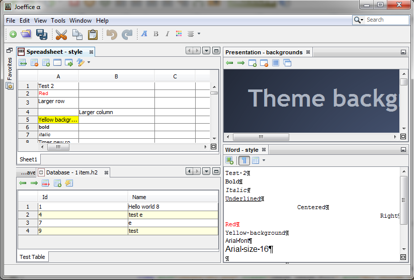

10 years ago, I challenged myself to write an office suite in Java in [30 days](https://www.youtube.com/watch?v=6oJyaUzkQVM&list=PLsezR6w8oWsJAKvFuv3JI34PLFFMIxLVA). This is how the first version of [Joeffice](https://www.joeffice.com/) was born. This created quite some buzz, including articles on [Slashdot](https://tech.slashdot.org/story/13/05/26/0418229/java-developer-says-he-built-launched-basic-open-source-office-suite-in-30-days), [Ars Technica](https://arstechnica.com/information-technology/2013/06/joeffice-an-open-source-office-suite-one-developer-built-in-30-days/) and [PC World](https://www.pcworld.com/article/452028/java-developer-says-he-built-launched-basic-open-source-office-suite-in-30-days.html).

Last month I released a second update. Let's explore how I did this. By levering Java libraries, I was able to create such a complex piece of software very quickly.

## The NetBeans Platform

[The NetBeans Platform](https://netbeans.apache.org/kb/docs/platform/) is a desktop application framework. You can see it as shopping for the parts (modules) that you'd like to have from the NetBeans IDE.

In the case of Joeffice, I shopped for many things: the core API and UI, the start-up screen, the look and feels including the dark themes, the file system, the search and progress API, the settings, print and more.

One of the most visible benefits of the platform is the windows management system. It allows you to have multiple documents opened in the same application, either with a tab system or docked next to each others.

I remember when tabs were introduced in Quattro Pro 5 spreadsheet software or Opera browser, quickly the competition followed up and now you can't have a browser or spreadsheet software without tabs.

With the NetBeans Platform, I had this feature directly out of the box for free, so people can have 20, 50 documents opened and still be able to manage the windows.  
 4 documents opened and visible at the same time

Another part where the NetBeans Platform will save you a lot of time is for creating installers for the different platforms Windows, Mac OS and Linux.

There is online documentation and several [books](https://www.amazon.com/Pro-Apache-NetBeans-Building-Applications-ebook/dp/B0836C3Y86/) to learn how to use it.

## Apache POI

[Apache POI](https://poi.apache.org/) is an Apache library to read Microsoft Office documents. It has more than 1,500 stars on GitHub and has an [active community](https://poi.apache.org/changes.html).

Depending of the kind of document you want to open, Apache POI has a more or less complete API to get the details. The most complete is to read Excel files. It also includes an interface API with 2 implementations, one for *xls* files, the old Excel format and one for *xlsx* format, the current Excel format. In Joeffice, I also implemented the interface to be able to parse CSV documents.

A big part of Joeffice is to translate the information from the document to its visual representation. If you use Apache POI at your company, you could use Joeffice as a playground to understand and play with the Apache POI library.

## Swing

[Swing](https://docs.oracle.com/javase/tutorial/uiswing/TOC.html) is a Java graphical user interface included in Java. Instead of relying on native components, like the AWT API is, each component is drawn in Java using the Java 2D API. The main advantages are consistency between the platforms, the possibility to make the component skinnable, also called look and feel, and it's quite easy to define or override new components.

Joeffice makes heavy use of 2 Swing components:

* JTextPane: This component is used to represent rich text and is the base to show word and powerpoint documents.
* JTable: This component is used to represent a table and is the base to show spreadsheets and database data.

As previously mentioned, it's easy to override or create swing components, for example Joeffice is using the SwingX library that contains extra components and the ETable component from the NetBeans Platform.

In the latest release of Joeffice, I've made it easier to reuse the Excel table component without relying on the NetBeans Platform. From it, I've created an Excel viewer applet and the [Sheet Viewer](https://www.japplis.com/sheet-viewer/) application.



## Other libraries

Here is a quick overview of some other libraries used in Joeffice:

* [H2 Database](https://www.h2database.com/html/main.html): An open source pure Java database. It also includes a CSV parser.
* [Apache Batik SVG](https://xmlgraphics.apache.org/batik/): An API to draw .svg files. It is also part of Apache POI dependencies.
* [JUniversalCharDet](https://github.com/albfernandez/juniversalchardet): Help to detect character encoding of text files. Used to parse CSV text file.

## Conclusion

In this article, we've seen on how by combining several API's we can create a new software.

Joeffice is under the Apache license, so if you're interested to learn any of the previously named libraries, you can download the [code from GitHub](https://github.com/Japplis/Joeffice) and play with the libraries.
