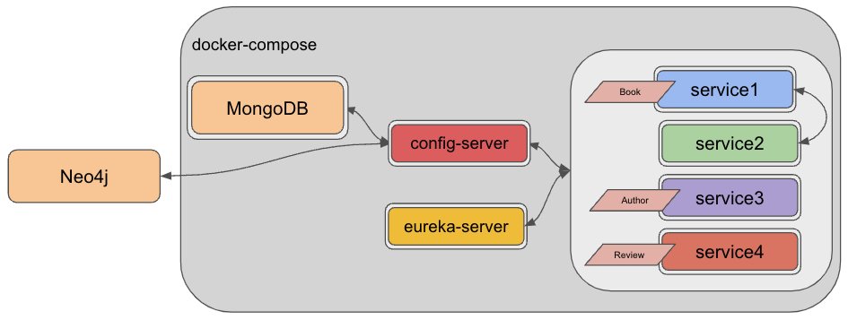
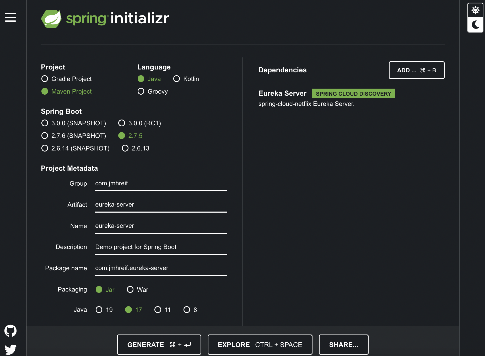
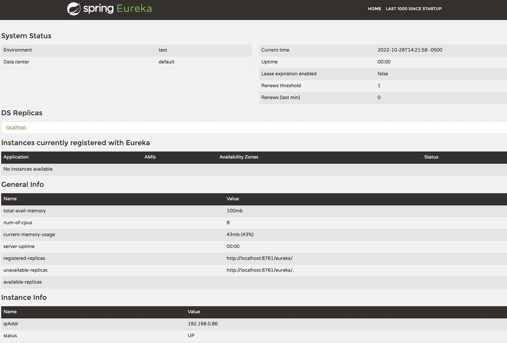
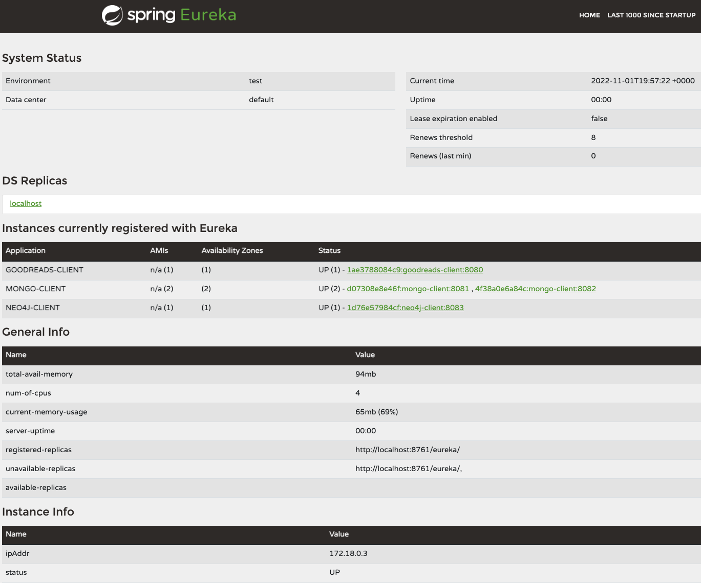

Gaining complexity in a microservices system certainly isn't for the faint of heart (though neither is complexity in monoliths!).

When there are many services that need to communicate with one another, we might need to coordinate multiple services communicating with multiple other services.

We also might code for varying environments such as local, development server, or the cloud.

* How do services know where to find one another?
* How can we avoid problems when a service is unavailable?
* How do we handle requests when we scale up or down certain parts of our system?

This is where something like Spring Cloud Netflix Eureka comes into play.

Eureka is a service discovery project that helps services interact with one another without hardwiring in instance-specific or environment-dependent details.

Architecture {#_architecture}
-----------------------------

Our microservices system has come a long way from [two local applications communicating over REST](https://jmhreif.com/blog/microservices-level1/) to a more intricate web containing multiple data stores, utility services, APIs, and client applications. Last [blog post](https://jmhreif.com/blog/microservices-level9/), we migrated any standalone services into Docker Compose so that it could orchestrate startup and shutdown as a unit.

In this post, we will add a service discovery component, so that services can find and talk to one another without hard-coding host and port information into applications or environments.

Updated architecture:

Docker Compose manages most of the services (in dark gray area), with each containerized service encompassed in a light gray box. Neo4j is the only component managed externally with Neo4j's database-as-a-service (Aura). Interactions between services are shown using arrows, and the types of data objects passed to numbered services (1-4) are depicted next to each.

Spring Cloud Netflix Eureka {#_spring_cloud_netflix_eureka}
-----------------------------------------------------------

Spring Cloud Netflix originally contained a few open-sourced projects from Netflix, [including Eureka, Zuul, Hystrix, and Ribbon](https://www.interviewgrid.com/interview_questions/spring_cloud/spring_cloud_netflix). Since then, most of those have been migrated into other Spring projects, except for Eureka.

Eureka handles service registry and discovery. A Eureka server is a central place for services to register themselves. Eureka clients register with the server and are able to find and communicate with other services on the registry without referencing hostname and port information within the service itself.

Config + Eureka Architecture Decision {#_config_eureka_architecture_decision}
-----------------------------------------------------------------------------

I had to make a decision on architecture when using Spring Cloud Config and Eureka together in a microservices system. There are a couple of options:

1. Config-first approach. Applications (services1-4) will reach out to config server first before gathering up other properties. In this approach, the config server does not register with Eureka.
2. Discovery-first approach. Applications will register with Eureka before connecting to config and gathering properties. In this approach, config server becomes a Eureka client and registers with it.

There is an [excellent blog post](https://medium.com/@athulravindran/spring-cloud-config-server-discovery-first-vs-config-first-72cc6a56f471) that provides a clear explanation of each, along with pros and cons. I'd highly encourage checking that out!

I opted for the config-first approach because there is already a bit of delay starting up applications in Docker Compose (see [blog post detailing this](https://foojay.io/today/journeys-in-java-level-9-docker-compose-all-the-things/)). Going with discovery-first would mean an extra step in the chain before applications could connect to config and contact databases. Since I didn't want to slow this step down any further, I decided not to register the config server app with Eureka, leaving it separate.

Without further ado, let's start coding!

Applications - Eureka server {#_applications_eureka_server}
-----------------------------------------------------------

We will use the Spring Initializr at [start.spring.io](https://start.spring.io/) to set up the outline for our Eureka server application.

On the form, we choose Maven for the `Project`, then leave `Language` and `Spring Boot` version fields defaulted. Under the `Project Metadata` section, I updated the group name for my personal projects, but you are welcome to leave it defaulted. I named the artifact `eureka-server`, though naming is up to you, as long as we map it properly where needed. All other fields in this section can remain as they are. Under the `Dependencies` section, we need only `Eureka Server`. Finally, we can click the `Generate` button at the bottom to download the project.

*Note: the Spring Initializr displays in dark mode or light mode via the moon or sun icons in the right column of the page.*

The project will download as a zip, so we can unzip it and move it to our project folder with the other services. Open the project in your favorite IDE and let's get coding!

The `pom.xml` contains the dependencies and software versions we set up on the Spring Initializr, so we can move to the `application.properties` file in the `src/main/resources` folder.

<pre class="EnlighterJSRAW" data-enlighter-language="text">server.port=8761
eureka.client.register-with-eureka=false
eureka.client.fetch-registry=false</pre>

We need to specify a port number for this application to use so that its traffic doesn't conflict with our other services. The default port for Spring Cloud Eureka server is `8761`, so we will use that. Next, we don't need to register the server itself with Eureka (useful in systems with multiple Eureka servers), so we will set the `eureka.client.register-with-eureka` value to `false`. The last property is set to `false` because we also don't need this server to pull the registry from other sources (like other Eureka servers). A [StackOverflow question and answer](https://stackoverflow.com/questions/57639611/what-is-the-use-of-fetchregistry-property-in-eureka-server) addresses these settings well.

In the `EurekaServerApplication` class, we only need to add the annotation `@EnableEurekaServer` to set this up as a Eureka server.

Let's test this locally by starting the application in our IDE and navigating a web browser window to `localhost:8761`. This should show us a page like the one below, which gives details about the server and a section for `Instances currently registered with Eureka`. Since we haven't connected any other services with Eureka, we don't have any services registered with the server.

That's it for the server, so let's start retrofitting our other services as Eureka clients.

Applications - Service1 {#_applications_service1}
-------------------------------------------------

We don't have many changes to add for Spring Cloud Eureka. Starting in the `pom.xml`, we need to add a dependency.

<pre class="EnlighterJSRAW" data-enlighter-language="xml">&lt;dependency&gt;
	&lt;groupId&gt;org.springframework.cloud&lt;/groupId&gt;
	&lt;artifactId&gt;spring-cloud-starter-netflix-eureka-client&lt;/artifactId&gt;
&lt;/dependency&gt;</pre>

This dependency enables the application as a Eureka client. Most recommendations would also have us adding an annotation like `@EnableEurekaClient` (Eureka-specific) or `@EnableDiscoveryClient` (project-agnostic) to the main application class. However, that is not a necessary requirement, as it is defaulted to enabling this functionality when you add the dependency to the `pom.xml`.

To run the service locally, we will also need to add a property to the `application.properties` file.

<pre class="EnlighterJSRAW" data-enlighter-language="text">eureka.client.serviceUrl.defaultZone=http://localhost:8761/eureka</pre>

This tells the application where to look for the Eureka server. We will move this property to the config server file for this application, so we can comment this one out when we test everything together. However, for testing a siloed application, you will need it enabled here.

Let's start on changes to service2, which interacts with service1.

Applications - Service2 {#_applications_service2}
-------------------------------------------------

Just like with service1, we need to add the Eureka client dependency to service2's `pom.xml` to enable service discovery.

<pre class="EnlighterJSRAW" data-enlighter-language="xml">&lt;dependency&gt;
	&lt;groupId&gt;org.springframework.cloud&lt;/groupId&gt;
	&lt;artifactId&gt;spring-cloud-starter-netflix-eureka-client&lt;/artifactId&gt;
&lt;/dependency&gt;
&lt;dependency&gt;
	&lt;groupId&gt;org.springframework.cloud&lt;/groupId&gt;
	&lt;artifactId&gt;spring-cloud-starter-config&lt;/artifactId&gt;
&lt;/dependency&gt;</pre>

We also want to have this application use Spring Cloud Config for referencing the Eureka server, so we can retrofit that by adding the dependency. We will walk through the config file changes in a bit.

Again, if we test locally, we would also need to add the following property to the `application.properties` file.

<pre class="EnlighterJSRAW" data-enlighter-language="text">eureka.client.serviceUrl.defaultZone=http://localhost:8761/eureka</pre>

Since we will test everything together, it is commented out in the application for now. Instead, we will add a properties file for Spring Cloud Config to host, similar to our other services (next section).

Next, we need to make some adjustments to the the main application class to utilize Eureka over previously-defined hostname and port locations.

<pre class="EnlighterJSRAW" data-enlighter-language="java">public class Service2Application {
	public static void main(String[] args) {
		SpringApplication.run(Service2Application.class, args);
	}

	@Bean
	@LoadBalanced
	WebClient.Builder createLoadBalancedBuilder() { return WebClient.builder(); }

	@Bean
	WebClient client(WebClient.Builder builder) { return builder.baseUrl("http://mongo-client").build(); }
}</pre>

If you [compare the code to the previous version](https://github.com/JMHReif/microservices-level9/blob/main/service2/src/main/java/com/jmhreif/service2/Service2Application.java#L19) (Level 9), you will see there are some changes.

First, we have removed the `@Value` annotation and `hostname` variable. When we originally implemented the `@Value`, we did so for dynamic environments - running a local versus containerized application. Eureka lets calling applications reference an application name, and it will map the hostname/port details behind-the-scenes, no matter where the application is running. This is where we see the `mongo-client` referenced in the second `@Bean` definition ([11th line of above code](https://github.com/JMHReif/microservices-level10/blob/main/service2/src/main/java/com/jmhreif/service2/Service2Application.java#L29)).

We also need to create a load-balanced bean (only required when using Eureka). Step-by-step, I created a `WebClient.Builder` bean, load balanced it with the `@LoadBalanced` annotation, then used that to create the actual `WebClient` bean that gets injected for use in method calls ([in the BookController class](https://github.com/JMHReif/microservices-level10/blob/main/service2/src/main/java/com/jmhreif/service2/Service2Application.java#L36)).

Applications - Service3 and Service4 {#_applications_service3_and_service4}
---------------------------------------------------------------------------

Next, we need to add our other services to Eureka using the steps below.

1. Add the dependency to each `pom.xml` file.
2. For local testing, add the commented out property in the `application.properties` file.

Now let's add the Eureka property to the Spring Cloud Config files for our applications!

Spring Cloud Config {#_spring_cloud_config}
-------------------------------------------

For each config file the server hosts, we will need to add the following:

<pre class="EnlighterJSRAW" data-enlighter-language="text">eureka:
  client:
    serviceUrl:
      defaultZone: http://goodreads-eureka:8761/eureka</pre>

This tells the application where to look so it can register with Eureka. Full sample code for each config file is located in the [related Github repository folder](https://github.com/JMHReif/microservices-level10/tree/main/microservices-java-config).

We also need to create a whole new config file for service2 to use the config server.

<pre class="EnlighterJSRAW" data-enlighter-language="text">spring:
  application:
    name: goodreads-client

eureka:
  client:
    serviceUrl:
      defaultZone: http://goodreads-eureka:8761/eureka</pre>

A sample is provided on the [Github repository](https://github.com/JMHReif/microservices-level10/blob/main/microservices-java-config/goodreads-client-docker.yaml), but this file is created in a local repository initialized with [git](https://git-scm.com/), and then referenced in the [config server properties file](https://github.com/JMHReif/microservices-level10/blob/main/config-server/src/main/resources/application.properties#L2) for that project to serve up. More information on that is in a [previous blog post](https://jmhreif.com/blog/microservices-level7/).

Let's make a few changes to the `docker-compose.yml`!

docker-compose.yml {#_docker_compose_yml}
-----------------------------------------

We need to remove the dynamic environment property for service2 and to add the Eureka server project for Docker Compose to manage.

<pre class="EnlighterJSRAW" data-enlighter-language="yaml">goodreads-svc2:
	#other properties...
    environment:
      - SPRING_APPLICATION_NAME=goodreads-client
      - SPRING_CONFIG_IMPORT=configserver:http://goodreads-config:8888
      - SPRING_PROFILES_ACTIVE=docker</pre>

We removed the `BACKEND_HOSTNAME` we see in the [previous version of the code](https://github.com/JMHReif/microservices-level9/blob/main/docker-compose.yml#L57), and instead replaced it with [environment variables](https://github.com/JMHReif/microservices-level10/blob/main/docker-compose.yml#L57) for application name, config server location, and spring profiles like we see in our other services.

Next, we need to add our Eureka server application to the compose file.

<pre class="EnlighterJSRAW" data-enlighter-language="yaml">goodreads-eureka:
    container_name: goodreads-eureka
    image: jmreif/goodreads-eureka
    ports:
      - "8761:8761"
    environment:
      - EUREKA_CLIENT_REGISTER-WITH-EUREKA=false
      - EUREKA_CLIENT_FETCH-REGISTRY=false
    volumes:
      - $HOME/Projects/docker/goodreads/config-server/logs:/logs
    networks:
      - goodreads</pre>

For our last step, we need to build all of the updated applications and create the Docker images. To do that we can execute the following commands from the project folder:

<pre class="EnlighterJSRAW" data-enlighter-language="shell">cd service1
mvn clean package -DskipTests=true
cd ../service2
mvn clean package -DskipTests=true
cd ../service3
mvn clean package -DskipTests=true
cd ../service4
mvn clean package -DskipTests=true
cd ../eureka-server
mvn clean package</pre>

*\*Note:\* The Docker Compose file is using my pre-built images with Apple silicon architecture. If your machine has a different chip, you will need to do one of the following: 1) utilize the `build` option in the docker-compose.yml file (comment out `image` option), 2) create your own Docker images and publish to DockerHub (plus modify the `docker-compose.yml` file `image` options).*

Put it to the test! {#_put_it_to_the_test}
------------------------------------------

We can run our system with the same command we have been using.

<pre class="EnlighterJSRAW" data-enlighter-language="shell">docker-compose up -d</pre>

*\*Note:\* If you are building local images with the `build` field in docker-compose.yml, then use the command `docker-compose up -d --build`. This will build the Docker containers each time on startup from the directories.*

Next, we can test all of our endpoints.

* Goodreads-config (mongo): command line with `curl localhost:8888/mongo-client/docker`.
* Goodreads-eureka: web browser with `localhost:8761` and note the applications (might take a few minutes for everything to register).
* Goodreads-svc1: command line with `curl localhost:8081/db`, `curl localhost:8081/db/books`, and `curl localhost:8081/db/book/623a1d969ff4341c13cbcc6b`.
* Goodreads-svc2: command line with `curl localhost:8080/goodreads` and `curl localhost:8080/goodreads/books`.
* Goodreads-svc3: `curl localhost:8082/db`, `curl localhost:8082/db/authors`, and `curl localhost:8082/db/author/623a48c1b6575ea3e899b164`.
* Goodreads-config (neo4j): command line with `curl localhost:8888/neo4j-client/docker`.
* Neo4j database: ensure [AuraDB instance is running](https://console.neo4j.io/) (free instances are automatically paused after 3 days).
* Goodreads-svc4: `curl localhost:8083/neo`, `curl localhost:8083/neo/reviews`, and `curl localhost:8083/neo/reviews/178186` or web browser with only URL.

Bring everything back down again with the below command.

<pre class="EnlighterJSRAW" data-enlighter-language="shell">docker-compose down</pre>

Wrapping up! {#_wrapping_up}
----------------------------

In this iteration of the project, we integrated service discovery through the Spring Cloud Netflix Eureka project. We created a Eureka server project, and then retrofitted our other services as Eureka clients with an added dependency.

Finally, we integrated the new Eureka server project to Docker Compose and updated some of the options for the other services. We tested all of our changes by spinning up the entire microservices system and checking each of our endpoints.

Keep following along in this journey to find out what comes next (or [review previous iterations](https://jmhreif.com/blog/) to see what we have accomplished). Happy coding!

Resources {#_resources}
-----------------------

* Github: [microservices-level10](https://github.com/JMHReif/microservices-level10) repository
* Blog post: [Baeldung's guide to Spring Cloud Netflix Eureka](https://www.baeldung.com/spring-cloud-netflix-eureka)
* Blog post: [Config First vs. Discovery First](https://medium.com/@athulravindran/spring-cloud-config-server-discovery-first-vs-config-first-72cc6a56f471)
* Documentation: [Spring Cloud Netflix](https://spring.io/projects/spring-cloud-netflix)
* Interview Questions: [What is Spring Cloud Netflix](https://www.interviewgrid.com/interview_questions/spring_cloud/spring_cloud_netflix)
