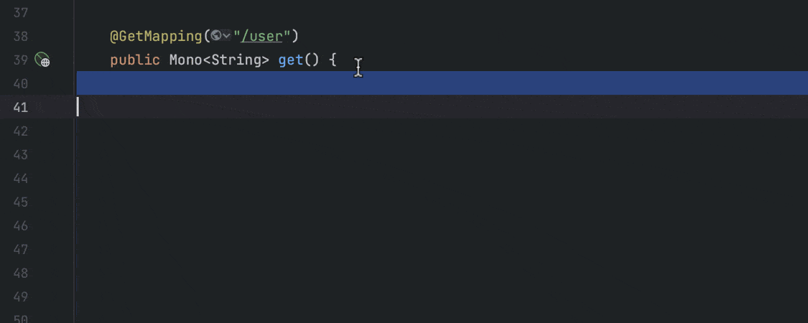
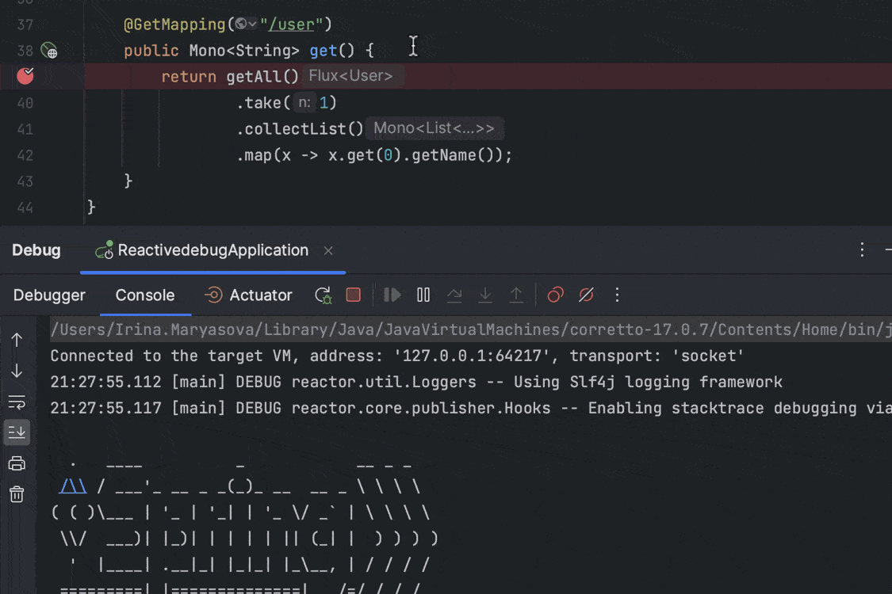
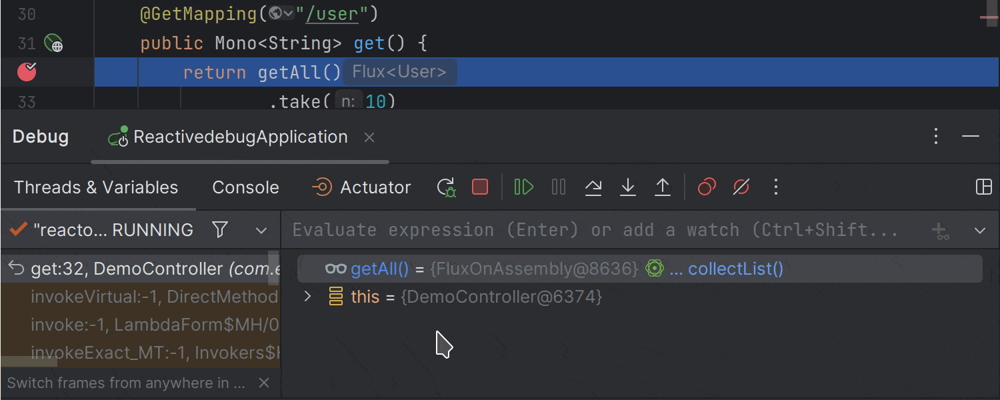
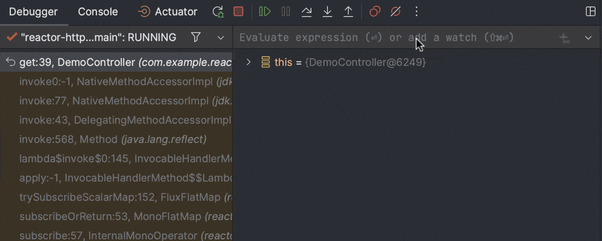
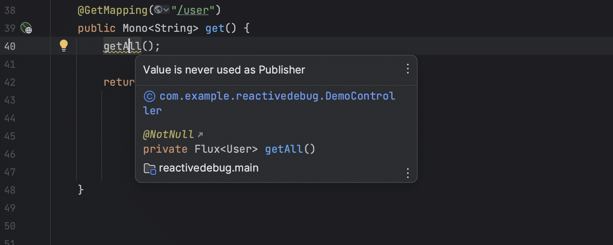
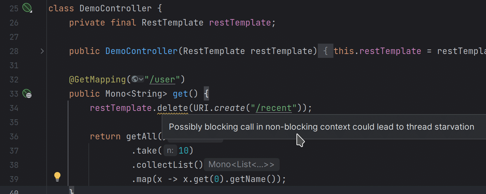
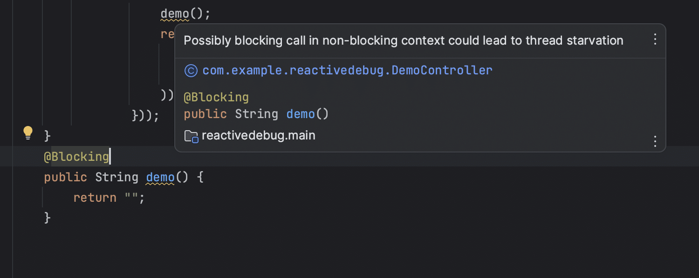

This article discusses essential features and tools in IntelliJ IDEA for Reactor developers. These include live templates, a dedicated debug mode, and a couple of inspections.

We've got all of the project Reactor adepts and enthusiasts out there covered! Whether you're a seasoned pro or just taking your first steps in the field, IntelliJ IDEA will make reactive coding a breeze. It simplifies the complexities of Reactive Streams, ensuring a smooth and efficient experience for all skill levels.

This article covers the most significant features and tools, including live templates, a dedicated debug mode, and helpful inspections. The examples provided below are from existing projects, so we won't discuss adding reactor support at the initial launch.

Get ready to unlock the full potential of reactive programming with IntelliJ IDEA!

In reactive programming, Mono and Flux are two fundamental types of the Publisher interface used to represent reactive streams. They provide powerful operators and methods to change and organize data effectively.

Let's see what features and tools IntelliJ IDEA provides to conveniently work with these crucial types.

Reactor live templates {#h2-0-reactor-live-templates}
-----------------------------------------------------

Who doesn't love typing less and coding faster? Reactive live templates will help you do exactly that!

IntelliJ IDEA also offers a feature called postfix code completion for projects that use Reactor. With this feature, you can automatically transform a previously typed expression into a reactive one based on what you've written.

When working on projects that have Reactor support, IntelliJ IDEA can automatically wrap an expression with the appropriate Reactor factory, either Flux or Mono.

Here's how you can effortlessly return Mono from the string with the help of the toMono live template:  

Debugging Reactor Streams {#h2-1-debugging-reactor-streams}
-----------------------------------------------------------

IntelliJ IDEA allows you to debug your reactive projects. Prior to starting the process, you'll need to adjust your configurations. Go to Preferences/Settings \| Languages \& Frameworks \| Reactive Streams. Tick the Enable Reactor Debug mode option and select Hooks.onOperatorDebug().

Now, when the necessary configurations are there, let's see how the IntelliJ IDEA debugger works with reactive projects. The first thing worth noting is that it detects the Flux and Mono types while debugging. You can see them marked with green icons. Once you click on them, you'll see the results of calculations inside them on the right, in the Variables view.

It's now possible to evaluate these types. To do so, click the get or collectList link next to the displayed result. The IDE will then instantly compute the reactive stream items.

You can also perform more complex evaluations.

By default, the debugger fetches the first 100 items of Flux. You can configure this number in *File \| Settings \| Languages \& Frameworks \| Reactive Streams*. Each time you trigger a computation, the IDE subscribes to a Publisher value and assumes the operation is safe to retry.

Noteworthy inspections for daily needs {#h2-2-noteworthy-inspections-for-daily-needs}
-------------------------------------------------------------------------------------

Our helpful inspections are always ready to highlight inconsistencies in your code -- everybody can use an extra set of eyes! We'll demonstrate two of the most helpful inspections that you can benefit from when using Reactive Streams.

### Unused Publisher value {#h3-3-unused-publisher-value}

To use an operator that produces a new Publisher instance, you must subscribe to the created Publisher via *subscribe()* or return a value from a method. If you don't do this, the created reactive stream is never used -- in reactive programming terminology, "The value is never used as the Publisher type". Here is where our first inspection comes in handy by reporting unused Publisher instances.

### Blocking call in non-blocking context {#h3-4-blocking-call-in-non-blocking-context}

You can use code that might cause a delay or pause in a program where it's not supposed to. IntelliJ IDEA provides the *Possibly blocking call in non-blocking context* inspection that looks for situations like this.

It is convenient to annotate code blocks with @Blocking and @NonBlocking annotations from the JetBrains annotations collection. This helps IntelliJ IDEA detect blocking calls in non-blocking contexts. To get the annotations, add org.jetbrains:annotations version 22.0.0 or later to your project's dependencies.

That is it! In this article, I've shown the most helpful features IntelliJ IDEA has for developers who work with Reactive Streams. Let's hope they will help you work faster and more productively in IntelliJ IDEA. Stay tuned for more tips and tricks.
