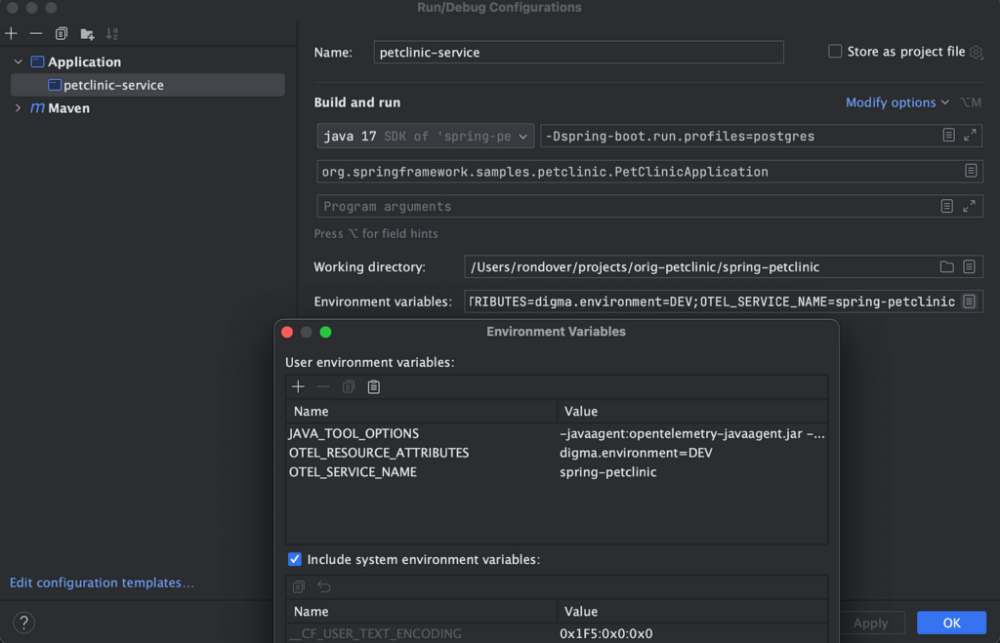
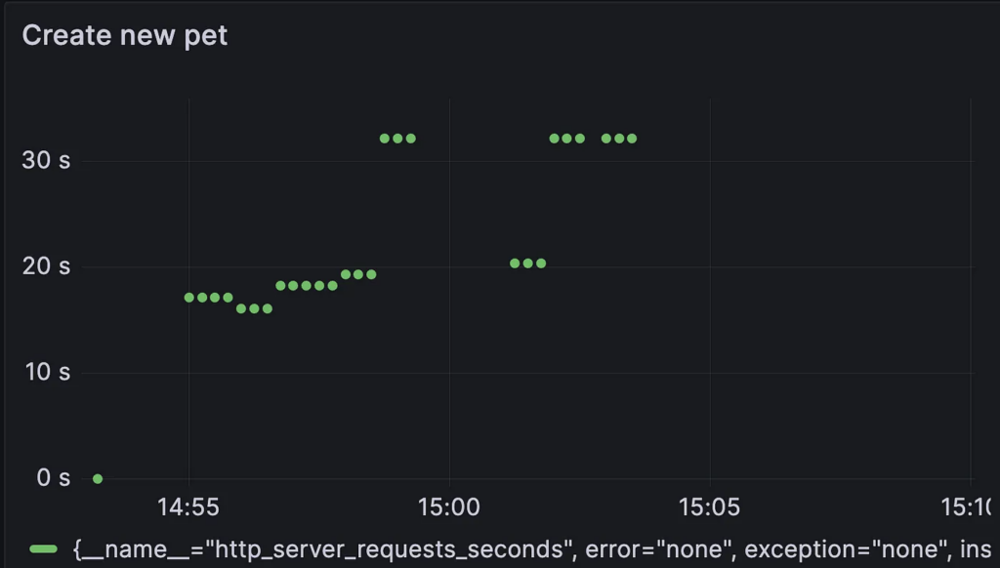
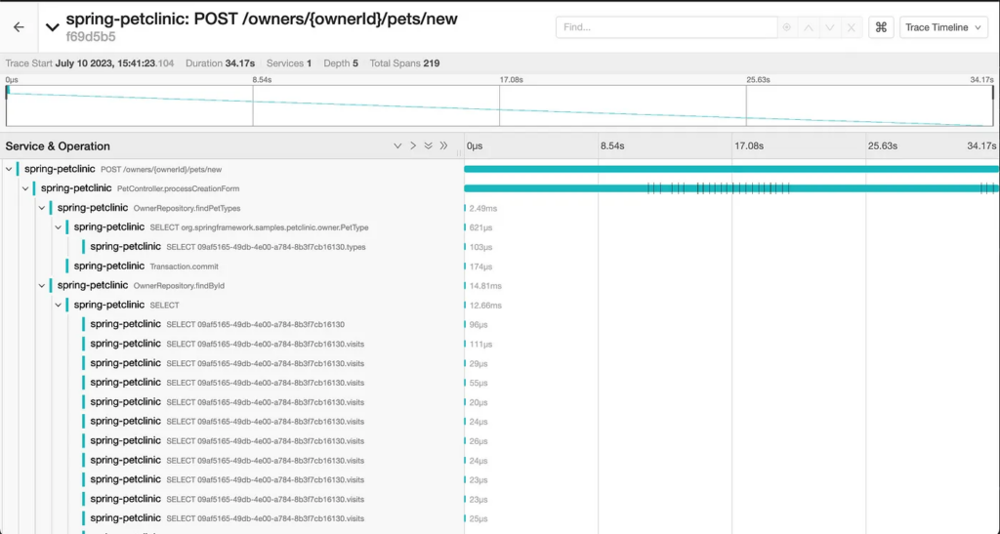
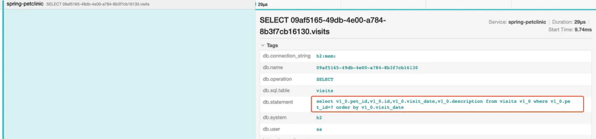
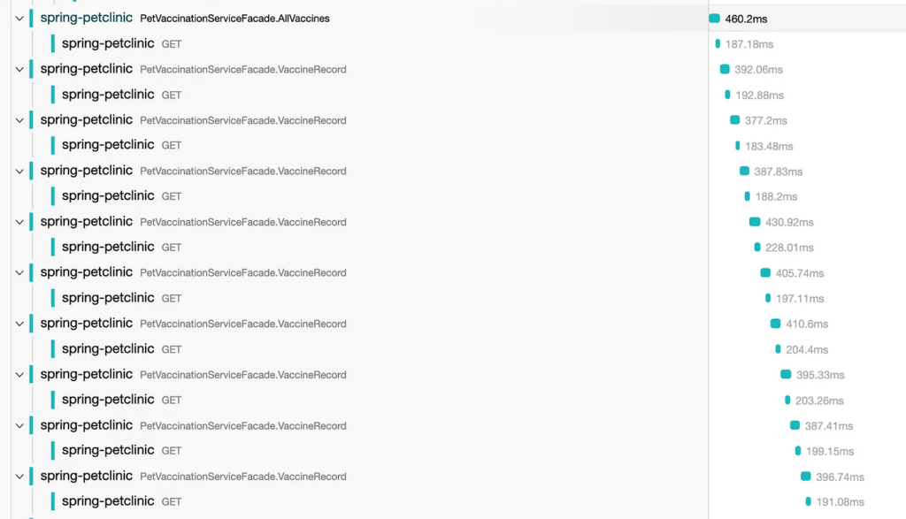
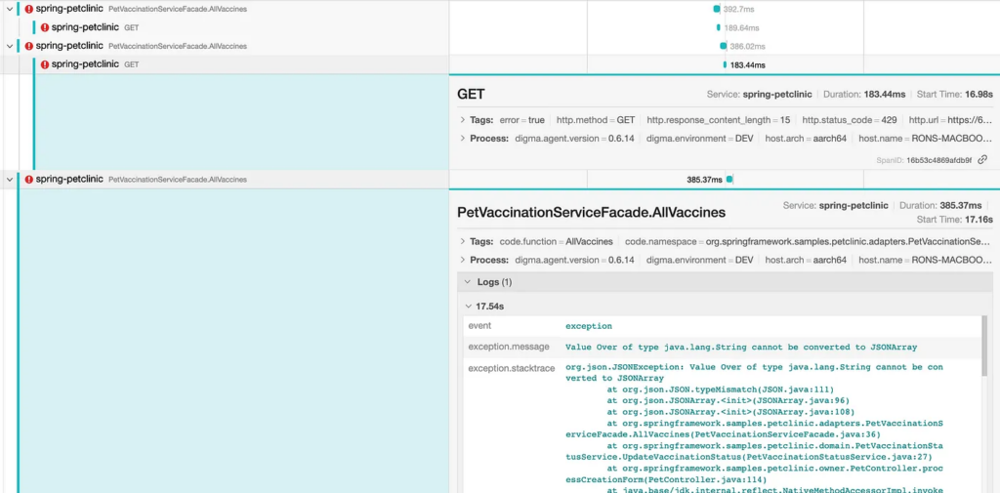
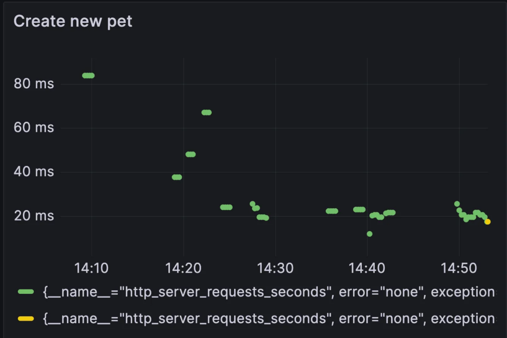
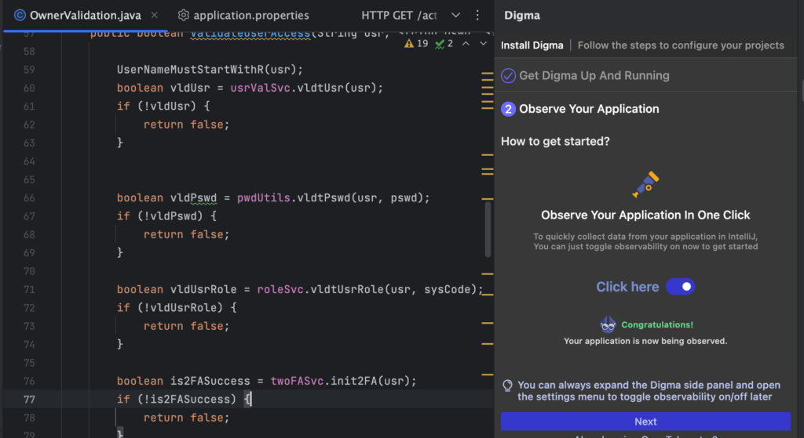
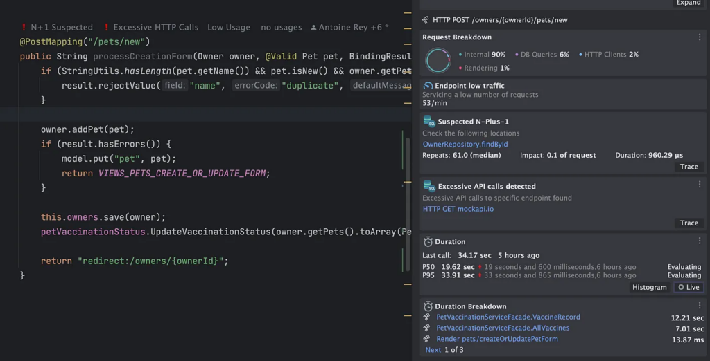
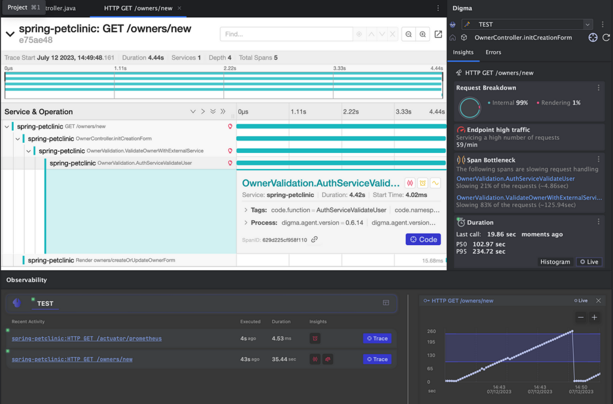

## Things you can do right now to learn new and valuable things that can improve your code.

There are many common mistakes I've seen repeated over the years while trying to make observability initiatives successful. However, the most critical and fundamental of these organizational stumbles is the irresistible infatuation with technology and toolings themselves.

It should not come as a surprise. Many 'let's add observability platform X' projects start off with plenty of fanfare but also a very hazy sense of direction and extremely muddled criteria for success. The vision of what effective observability can do to**actually help** developers work better is suspiciously missing from the preaching of many of its commercial vendors and oracles. Ask yourself, how often do you find yourself taking your eyes off the code in the IDE to find out what you can learn from its execution data?

Please don't get me wrong, I am a huge believer in the role observability (fancy name for data about your app) can play in software development. OpenTelemetry is huge. I can see clearly how it can help developers write better code, introduce new paradigms, and accelerate development cycles. It can inspire developers to ask questions they did not yet even consider. However, everywhere you look online the focus still seems to be on observability itself, how to enable it, and how to get started. As awesome as shiny dashboards with cool graphics are, many teams are left in the dark as to where to take it from there.
 *Source: Merktoonist, license acquired by the author*

In this post, I will try to address this far more interesting topic: *What does success for developers using observability look like? How can the team expect to **code** and **release** better using the wealth of code runtime data? More importantly, what are examples of things that observability can tell you, right now, about your code and how can it help you improve it? We'll look at concrete code examples to find out how to leverage observability as a coding practice.*

\[Edit: I should caveat my statement regarding online content exclusively focusing on tutorials for observability. There is, in fact, some great [content](https://www.youtube.com/watch?v=fh3VbrPvAjg) by Marcin Grzejszczak, Tommy Ludwig, Jonatan Ivanov, and others that I highly recommend looking into, although it is more of the exception to the rule\]

#### Beyond monitoring --- shorter feedback loops in dev

The greatest promise of observability is in providing feedback. Real, objective feedback that is free from some of the skews and biases of unit testing. Imagine being alerted to any regressions or issues stemming from your code changes while you're still working on them. Alternatively, being always aware of which parts of your code are actually in use in production and easily identifying weak spots that need attending based on integration testing results.

I consider this the true potential of observability for developers, far from its traditional role as a 'monitoring' solution. Monitors and alerts are critical but tragically their focus has always been reporting issues that have already happened. Perhaps because the technology was mostly in use by DevOps/SRE/IT teams who were predominantly concerned with production stability.

At one time, in one of these crazy product launch stages when myself and the other developers in the team felt more like a fire brigade than a Development team, I jokingly referred to our mad bug-fixing scurries as BDD --- not Behavior Driven Design but Bug Driven Development. The sad truth of it was that this description was not entirely inaccurate. Instead of being proactive in improving our code, we were extremely **reactive** chasing one issue after another which soon became unsustainable.

#### Let's take a more practical example

To illustrate how we can utilize observability for improving our dev cycle, let's take a more practical example of a real-life scenario: Bob, a senior developer in the team, has been asked to add some functionality to the [Spring PetClinic](https://github.com/spring-projects/spring-petclinic) example. It seems like vaccination records for pets are extremely important to keep track of and Bob has been asked to integrate with an external data source to do so. For the initial MVP, Bob creates a feature branch and moves forward to implement some new pieces of functionality.


Having read many tutorials on how to collect observability data from Java applications, Bob has several OSS and free tools running in the background to assist him in his task. In the context of this post, I won't go into the details of how to set that entire stack up (as it's also widely documented) but would be happy to do that in a follow-up post if there is demand for it. You can, however, find the entire stack available as a docker_compose file [here](https://github.com/doppleware/spring-petclinic-cf/blob/main/observability/tracing/docker-compose.trace.yml).

Bob's basic observability stack:

* [Opentelemetry](https://opentelemetry.io/docs/instrumentation/java/automatic/) for tracing, he also has an OTEL [collector](https://opentelemetry.io/docs/collector/getting-started/) container running locally to route the data to the various tools.
* [Jaeger](https://www.jaegertracing.io/) for visualizing traces
* [Micrometer](https://micrometer.io/) for collecting metrics
* [Prometheus](https://prometheus.io/) for saving matrics and the OSS version of [Grafana](https://grafana.com/oss/) for visualizing them

It's important to note that to start collecting code data with OTEL, Bob didn't need to make **any code changes** . Running locally, he can safely use the [OTEL agent](https://opentelemetry.io/docs/instrumentation/java/automatic/). In his case, he just references the agent in the run config of the IDE so it would be picked up when running/debugging locally. He also adds a [docker-compose.override](https://github.com/doppleware/spring-petclinic-cf/blob/main/docker-compose.override.otel.yml) file to be used launching the application using Docker/Podman (this also doesn't require changing the sourced docker-compose file, I wrote about this neat little trick [here](https://digma.ai/blog/observing-java-application-running-via-docker-compose-using-opentelemetry/)).


With everything up and running, Bob creates a new feature branch and begins work on the new functionality. You can find the entire forked project available in [this](https://github.com/doppleware/spring-petclinic-cf) repo if you wish to take a closer look at the code.

#### The Vaccine API facade Component

By sheer luck, someone has already written a Spring Component for communicating with the mock API for another module. Bob's job is simple: inject the component into the PetController and use it to retrieve the data whenever a pet is added. The component is very straightforward and uses the OKHttp library to implement a basic REST call to get the data in JSON form.  

```java
        @WithSpan
	public VaccinnationRecord[] AllVaccines() throws JSONException, IOException {

		var vaccineListString = MakeHttpCall(VACCINES_RECORDS_URL);
		JSONArray jArr = new JSONArray(vaccineListString);
		var vaccinnationRecords =
			new ArrayList<VaccinnationRecord>();

		for (int i = 0; i < jArr.length(); i++) {

			VaccinnationRecord record = parseVaccinationRecord(jArr.getJSONObject(i));
			vaccinnationRecords.add(record);

		}
		return vaccinnationRecords.toArray(VaccinnationRecord[]::new);

	}

	@WithSpan
	public VaccinnationRecord VaccineRecord(int vaccinationRecordId) throws JSONException, IOException {

		var idUrl = VACCINES_RECORDS_URL + "/" + vaccinationRecordId;

		var vaccineListString = MakeHttpCall(idUrl);

		JSONObject vaccineJson = new JSONObject(vaccineListString);
		return parseVaccinationRecord(vaccineJson);

	}
```

## Updating the Pet Model

Next, in order to save the vaccination data and not retrieve it each time, the model and DB structure have to be updated. This involves a lot of boilerplate really, but necessary in order to save the vaccination info for each pet. Bob duly adds a new table, models the relationship in his classes, and also updates the DDL scripts.{#3d47}

```java
@Entity
@Table(name = "pet_vaccines")
public class PetVaccine extends BaseEntity {

	@Column(name = "vaccine_date")
	@DateTimeFormat(pattern = "yyyy-MM-dd")
	private LocalDate date;

	/**
	 * Creates a new instance of Visit for the current date
	 */
	public PetVaccine() {
	}

	public LocalDate getDate() {
		return this.date;
	}

	public void setDate(LocalDate date) {
		this.date = date;
	}

}
```

## Adding a Domain Service to retrieve and update the new Pet vaccination date field

Following best practices, Bob creates a simple domain service that will be injected into the PetController. The new service orchestrates the domain logic for retrieving the vaccine record for the new pet from the external API and updating the model with the latest date. Unfortunately, this is where Bob also makes several mistakes, some of which are related to the leaky abstraction of the facade which obscures the expensive HTTP calls. Bob also doesn't notice much of the logic is redundant.{#193e}

```java
@Component
public class PetVaccinationStatusService {

	@Autowired
	private PetVaccinationService adapter;

	public void UpdateVaccinationStatus(Pet[] pets){

		for (Pet pet: pets){
			try {
				var vaccinationRecords = this.adapter.AllVaccines();
				for (VaccinnationRecord record : vaccinationRecords){

					var recordInfo = this.adapter.VaccineRecord(record.recordId());
					if (recordInfo.petId()==pet.getId()){
						PetVaccine petVaccine = new PetVaccine();
						petVaccine.setDate(recordInfo.vaccineDate());
						pet.addVaccine(petVaccine);
					}
				}

			} catch (JSONException |IOException e) {
				//Fail silently
				Span.current().recordException(e);
			}

		}

	}
}
```

#### Update the View Template

Finally, Bob adds a new field that will indicate whether a pet vaccine is overdue.

```html
..

<table class="table table-striped" th:object="${owner}">
      <tr>
        <th>Name</th>
        <td><b th:text="*{firstName + ' ' + lastName}"></b></td>
      </tr>
      <tr>
        <th>Address</th>
        <td th:text="*{address}"></td>
      </tr>
      <tr>
        <th>City</th>
        <td th:text="*{city}"></td>
      </tr>
      <tr>
        <th>Telephone</th>
        <td th:text="*{telephone}"></td>
      </tr>

      <tr>
        <th>Needs Vaccine</th>
        <td th:text="*{isVaccineExpired()}"></td>
      </tr>
    </table>
...
```

That's it! The changes are ready. Bob even writes some tests and watches them turn into a happy shade of green. Pleased with the quick progress and feeling confident about the code that runs without incident when testing out locally, Bob turns to the collected runtime data to see what it can reveal about his changes. He decides to [stretch the Definition of Done](https://digma.ai/blog/youre-never-done-by-definition/) and spends additional effort in examining the data related to his changes.


## Observability to the rescue

First, it's important to refer to some sort of baseline. There are two API operations that were impacted by the changes and Bob would like to get some sense of how they were performing before and after the changes were in place. As a part of the observability setup, Bob also configured Micrometer and the Actuator to provide useful metrics about the API (more info [here](https://mokkapps.de/blog/monitoring-spring-boot-application-with-micrometer-prometheus-and-grafana-using-custom-metrics)). These can be accessed directly via the actuator URL, in our case <http://localhost:8082/actuator/metrics>. This endpoint is not recommended for production usage, but it is extremely simple to activate in dev. For better visualization and more graphing options, Bob will be using Prometheus and Grafana OSS running locally in his stack.{#9043}

Looking at some common Grafana dashboards, it was surprising to see there are no default graphs for tracking response times for APIs. Perhaps because most dashboards are Ops-related, focusing on CPU/RAM and heap sizes rather than everyday developer insights. Luckily, it's easy to configure such a dashboard using the Actuator metrics. We can create such a graph focusing on the API for creating new pets, using the following query:{#aae4}

```
http_server_requests_seconds{uri="/owners/{ownerId}/pets/new", quantile="0.5", method="POST", outcome="REDIRECTION"} != 0
```

We can then examine the graph before and after the code change.{#4117}

**Before:**{#3fa1}


**After:**


Yikes! Undoubtedly the changes caused a significant performance issue. We can immediately spot it just by looking at the metrics but the traces can reveal much more about the root causes and underlying problems. It's time to call up Jaeger, another component of our observability stack. Jaeger is used to visualize the captured traces and presents Bob with the opportunity to investigate what his code has been up to while he was busy adding more logic and functionality:


Thus, without adding a single breakpoint we can already learn a lot going on with this code in this request. Information that until now Bob was quite oblivious to. While he did notice some lagginess when trying out the new request, he did not pay it much attention. Maybe the external API is just slow? Now that he has access to the trace, he can take a fresh look at the code he's introducing.{#6c7e}

## Select statements galore

The first issue that stands out is the many SQL statements triggered as a part of the findById repository method. This gets automatically instrumented by Spring.Data and gives us some context into what's going on. Examining the queries more closely reveals a familiar Hibernate pitfall:{#8100}


It looks like the 'Visits' relationship is being fetched lazily for each pet in what is commonly referred to as an **N+1 Select.**Interestingly enough, this issue seems to be endemic to the PetClinic application and seems to pre-date Bob's changes. Indeed, while this is causing some slowdown it is not as significant as some of the other issues, as becomes apparent when Bob examines the trace further.{#1e5e}

## HTTP Requests Chatter

The true cause of the performance regression seems to be related to a misunderstanding of Bob's, probably due to the ambiguous naming of the `VaccineServiceFacade` methods. It seems that it was not that clear to him that an API call is executed behind the scenes each time the `VaccineRecord` function was invoked. This leaky abstraction might have been alleviated with a better naming convention, emphasizing this is in fact an execution of a long synchronous operation.{#1369}




## Hidden Errors

Something else is going on with the HTTP requests. As we scroll down the list of requests Bob notices some of them ended with an error, followed by an exception in trying to serialize the nonexisting response. The underlying cause, based on the HTTP error code is related to a rate limit or throttling or the external API. This problem may be temporarily solved by optimizing the number of calls but may resurface as more users start using this component concurrently. Additionally, the exception handling in this code is definitely faulty, perhaps a retry mechanism might be in order.{#df14}


## Open Session in View

Just before he is off to start correcting the many issues revealed by examining the observability artifacts, Bob decides to take a quick look at the other API he modified. There doesn't seem to be a significant performance degradation in this case, but examining the trace still reveals at least one issue that needs to be fixed.{#d288}



There is a significant number of SQL calls occurring during the rendering phase, an anti-pattern caused by accessing lazy Hibernate attributes while the Session is still open, known as [**open session in view**](https://vladmihalcea.com/the-open-session-in-view-anti-pattern/)**.**This issue can be tricky to spot but is immediately apparent in the trace.{#a7ae}

## The writing was on the observability wall

There are other issues that can be identified in the data, but let's rewind our scenario and consider for a moment what would have happened had Bob not analyzed it before merging his changes: The code eventually gets deployed. Some of the issues are caught on during the CR or later stage testing, leading to more changes, additional delays, and painful merges as more changes steam in the interim. Other issues escape into production leading to further woes: slowing down the release, rushing hotfixes, increasing the team's anxiety and frustration, etc. Beyond doubt, we can find a lot of benefits in shortening the feedback loop.{#c90c}

## Big win? Not quite

In this somewhat naive example, we were able to demonstrate how simply turning OTEL ON and streaming the data through some OSS tools, has the potential to provide an additional guardrail for Bob and other developers. However, the reality of the situation is that Bob's team would most likely have failed to continue to apply such feedback in a sustainable way. There are several key reasons why this is the case:{#1396}

1. **A manual process that is not continuous**: The entire experiment relied on Bob having the dedication, discipline, and will to double-check his code. As the release pressure mounts, he is less and less likely to do so. Especially if in a considerable number of instances he will have spent the time to investigate the data without coming up with anything of significance. Similar to testing, unless it is continuous and automatic, it will probably not happen at scale.
2. **Expertise requirements**: As mentioned, this example is somewhat contrived in highlighting some clear-cut scenarios. In reality, it is very hard, without knowledge of statistics, regressions, and even basic ML to work with the data in such a way to understand the impact of code changes. Take as an example the first graph we examine, the 'before' state. Does the difference between the values represent a fluke, some ramp-up cost, or something else?



3. **Context switching and tooling overload** - Context switching is hard**.** For this kind of programming paradigm to work, it has to be a solution that can be **owned** by the Engineering team. It can't be a bunch of dashboards and tools which developers need to master and know how to read correctly. The more we reduce the required cognitive effort the more likely it is that this information will be put to use.

<figure class="wp-block-embed is-type-rich is-provider-twitter wp-block-embed-twitter">
 <div class="wp-block-embed__wrapper">
  <blockquote class="twitter-tweet" data-width="500" data-dnt="true">
   <p lang="en" dir="ltr">If you're building solutions for developer teams, it is imperative to integrate your solution into their existing tools, IDEs, and development lifecycle⚙️<br>
    Nobody likes yet another destination, and developers are allergic to it all together.</p>— Amir Shevat (@ashevat) <a target="_blank" href="https://twitter.com/ashevat/status/1651257702436282368?ref_src=twsrc%5Etfw">April 26, 2023</a>
  </blockquote>
 </div>
</figure>

## The Future is Continuous Feedback

[Continuous Feedback](https://digma.ai/blog/ci-cd-cf-the-devops-toolchains-missing-link-continuous-feedback/) is a new development practice that aims to bridge the gap we've identified: having plenty of data that is easy to collect about the code runtime — but requiring manual work, expertise, and time to process into something practical and actionable. There are three ingredients that can make it work: A continuous pipeline (an inverted CI pipeline), integrated tooling, and ML/data science to automate the data analytics.{#0f37}

Full disclosure: I am the author of [**Digma**](https://digma.ai/)**,** a free Continuous Feedback plugin that I created because this inexplicable chasm preventing developers from using code data was driving me mad with frustration. More than once I've encountered a 'Bob' scenario where all of the information was there, right there in the open. It could be found either in the debug/test data or even in the production data about the code, it's just that no one would or could examine it.{#0fc5}

What we envisioned with Digma was pipeline automation that could spot all of the different issues Bob finally picked up on and more, and make that continuous — just a part of the normal dev cycle. In fact, we removed the whole OTEL configuration, boilerplate, and toolings from the equation. Reducing the work required to 'turn it on' to a simple button toggle. In this manner, the entire initiative now requires Bob to do only two things - enable observability, and run his code. This means more developers would be able to start exploring the potential of code runtime data, and not just die-hards like Bob.{#1314}


Having enabled observability collection, here is the IDE view of the code Bob would have seen had he been using the Digma plugin while debugging and running locally:{#1314}


Everything from the Session in View anti-pattern, the N+1 Queries, detecting slowdowns, and the hidden errors become just a part of the developer's view --- living documentation. It is continually unlocked and deciphered from the huge amounts of data that are collected as Bob continues to code, run and debug.

In this manner, similar to testing, we can finally make observability transparent --- something that requires no conscious effort. Just like plumbing, the role of observability should be to blend into the background. It should not matter how the data is collected or whether it was OTEL or some other technology. More importantly, we've reversed the process. Instead of Bob searching in a haystack of metrics and traces for issues related to the code, he beings by viewing the code issues which themselves contain links to relevant metrics and traces for further investigation.


## What do you know / or want to know about your code?

The most eye-opening exercise in considering continuous feedback is simply turning it off. It is maddening to know all of the issues are still there, except completely invisible — to me it feels like coding in the dark.{#4d12}

Many developers have commented to me that similar to the adoption of testing, the transformation is partly technical and partly cultural. Who knows what [coding horrors](https://digma.ai/blog/coding-horrors-complex-codebase/) would come to light or how many assumptions would come crashing down if we actually examined them using evidence-based metrics? Maybe some folks prefer coding in the dark?{#a24e}

In my mind, it would simply allow us to give more shape and form to another gnawing beast in our code bases: technical debt. Understanding the gaps, impact and system-wide ramifications of delaying code changes would hopefully help drive change and offset some of the forward-leaning bias many organizations suffer from. So whereas I'm a big proponent of dark themes, prefer to turn off bright fluorescent lights when I work, and am definitely a night owl when it comes to productivity hours — I am looking forward to shining a bright beacon of light on the darkest recesses of my code.{#7728}

That's it! There are many more examples and nuances that can be material for a future blog post, and we hardly touched on the topic of using CI/Prod data as well, which can have a huge impact. If you're interested in learning more about Continuous Feedback and different tools and practices that can be helpful in adopting it, please consider joining our [Slack](https://join.slack.com/t/continuous-feedback/shared_invite/zt-1hk5rbjow-yXOIxyyYOLSXpCZ4RXstgA) group.
