**In this tutorial, we are going to take a look at contributing to Open Source Software, specifically how to do a pull request (PR).**

We will look at forking and cloning the project, making the changes, committing and pushing these changes, creating the pull request, the review and hopefully merge of your PR.

The same process may apply when making contributions to a project at work that you don't own. In this example, the project is on GitHub. Other Git code repositories may use a similar process.

There are many reasons to contribute to open source projects, and different ways to find an issue to work on, from fixing a bug that is bothering you, to simply wanting to help out, or even just to gain more experience and learn something new.

If you're fixing something that is currently bothering you, you will have a specific issue and project to work on. If not, you could consider contributing to a project you like to use, or finding an issue that is suitable for someone new to contributing to open source and/or the project.

There are also many different things you can contribute. Code is one, but projects also need testing and other things. For more information on what you can contribute and how to find something to contribute, please have a look at [this video](https://www.youtube.com/watch?v=GAqfMNB-YBU).

For this blog post, let's assume we've found a project we want to work on, and an issue we want to fix.

## Getting the project

When making your first contribution, you won't have access to push to the open source project directly. So, the first thing we will need to do is **fork** this project to our own profile. This means we create a copy of the original project on our profile.

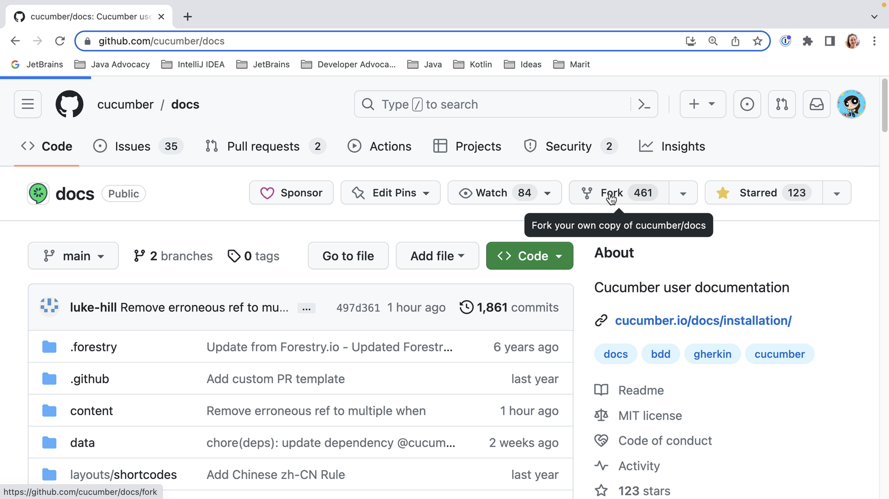

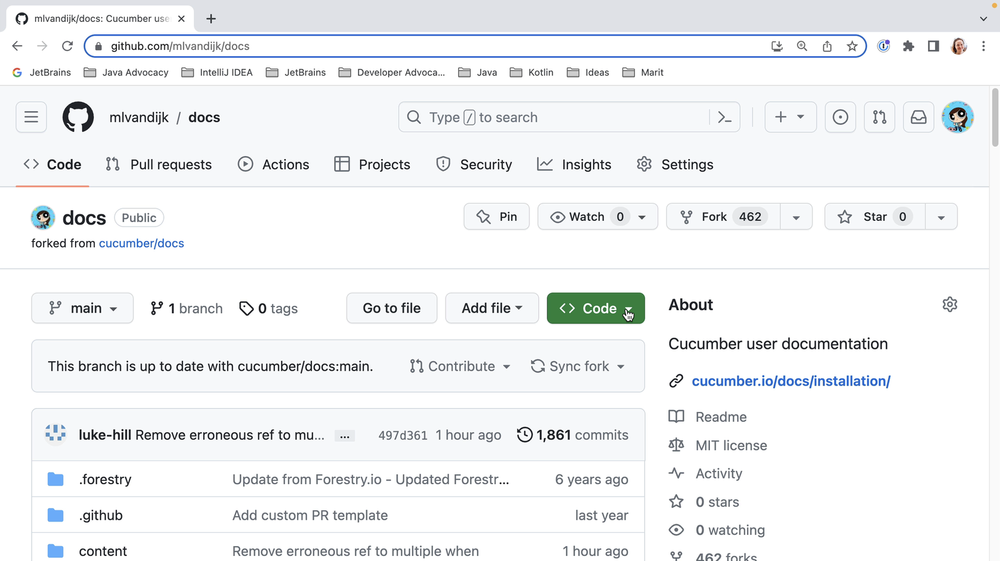

We then need to **clone** this project to our local machine. We see that we have several options to get the code. Let's use HTTPS as that can be the simplest option. When we click the clipboard icon, the URL will be copied to our clipboard.

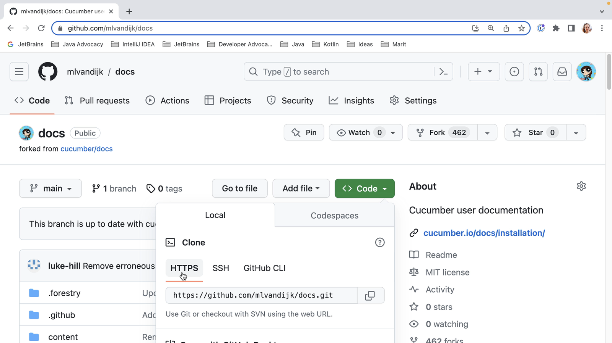

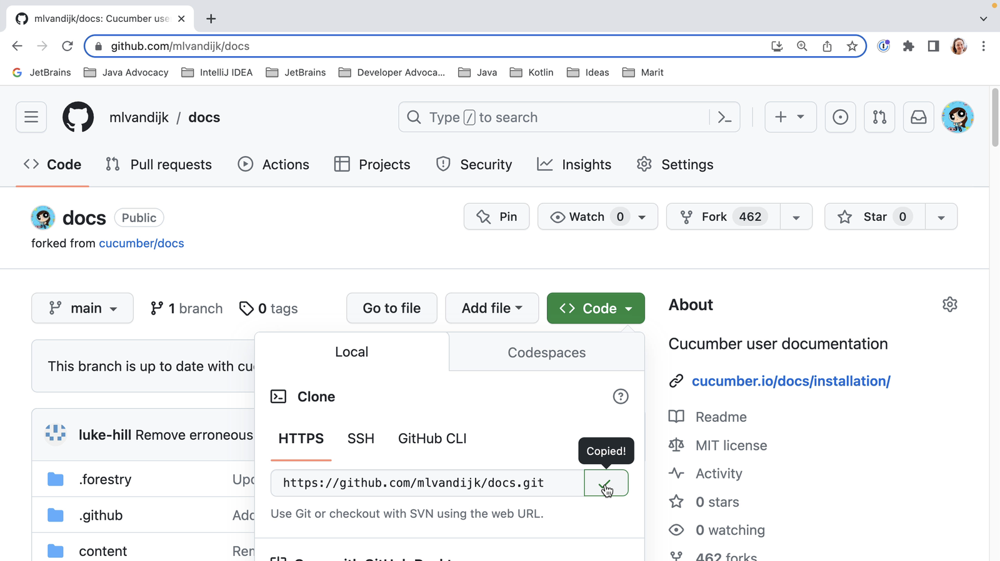

When we open [IntelliJ IDEA](https://www.jetbrains.com/idea/) and don't already have a project open, we'll see the **Welcome screen** . Here we have the option to **Get from VCS** (version control system).

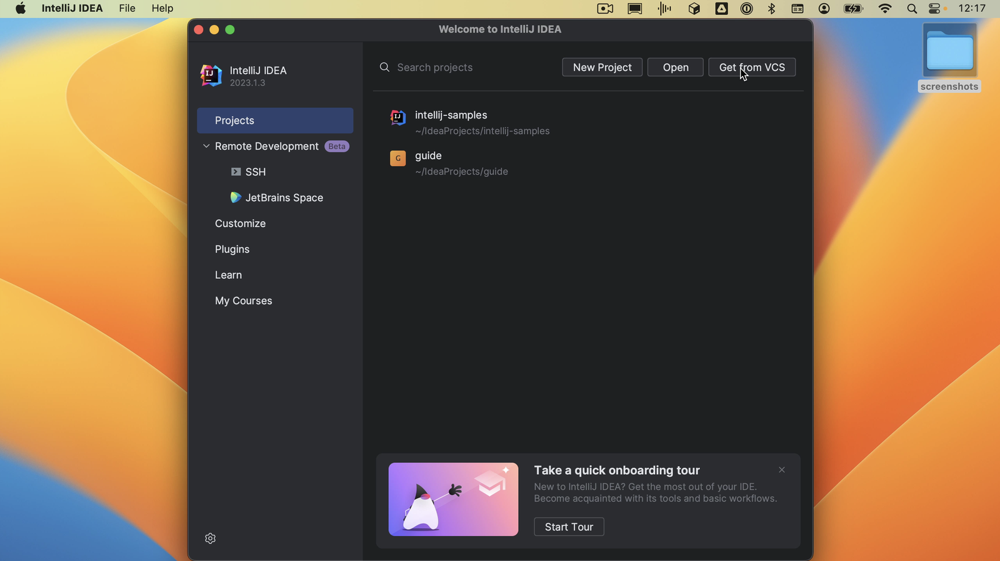

When we click the button, the **Get from Version Control** dialog opens. We can paste the URL we just copied. We can select where we want to store this project on our computer; let's stick with the default. When we select **Clone**, IntelliJ IDEA will clone the GitHub repository to the selected directory.

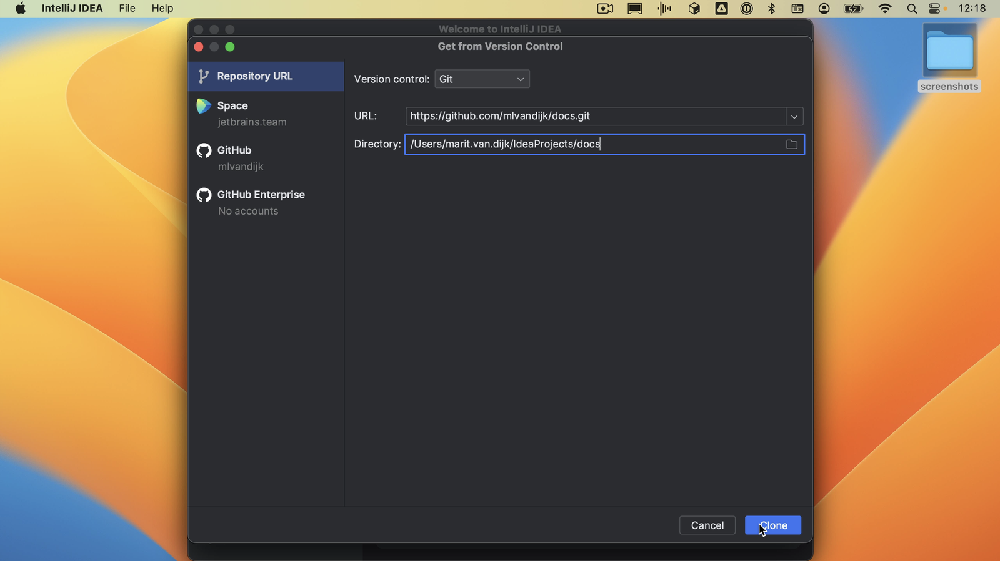

If we already have a project open, we can open the **Get from Version Control** dialog by going to **File \> New \> Project from version control**.

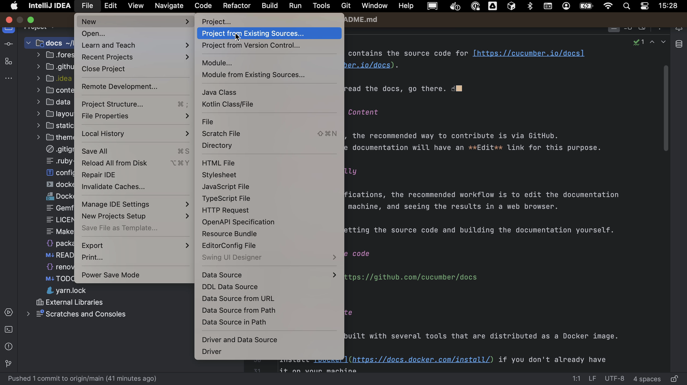

IntelliJ IDEA will open the project on our machine.

## Making and committing our changes

Before making any changes, we'll want to make sure that we can build the project. Hopefully, how to build the project will be described in the **README**, as it is for this example. Let's open the terminal and build the project as described. In this example, we need Docker, which is already installed and running.

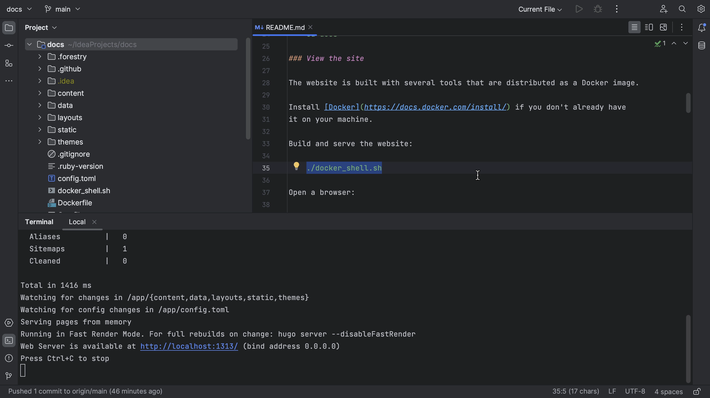

Now that we know we can build the project, we can start making changes. First, we need to look for the right place to make the change. We might navigate the project in the **Project tool window** (**⌘1** on macOS, or **Alt+1** on Windows/Linux), or look for a specific file or code snippet using **Find in Files** (**⌘⇧F** on macOS, or **Ctrl+Shift+F** on Windows/Linux).

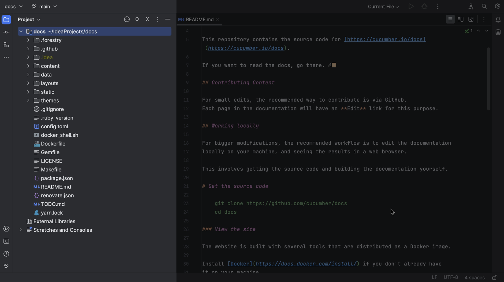

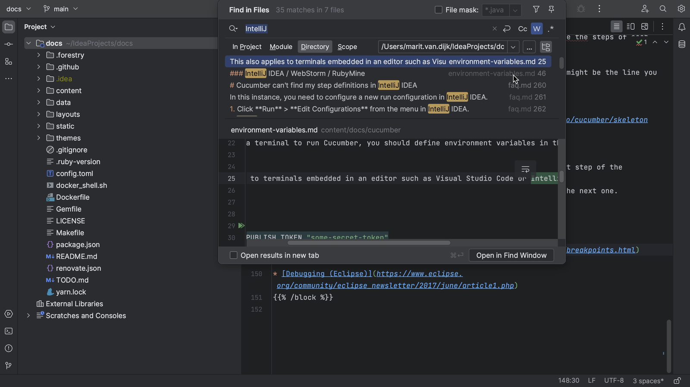

We might want to create a specific branch for our changes.

Once we are done making our changes and the project still builds, we can **commit our changes** (**⌘K** on macOS, or **Ctrl+K** on Windows/Linux). We can check our changes in the **Commit tool window** (**⌘1** on macOS, or **Alt+1** on Windows/Linux) to see if these are the right files and use **Show Diff** (**⌘D** on macOS, or **Ctrl+D** on Windows/Linux) to see if the changes are correct.

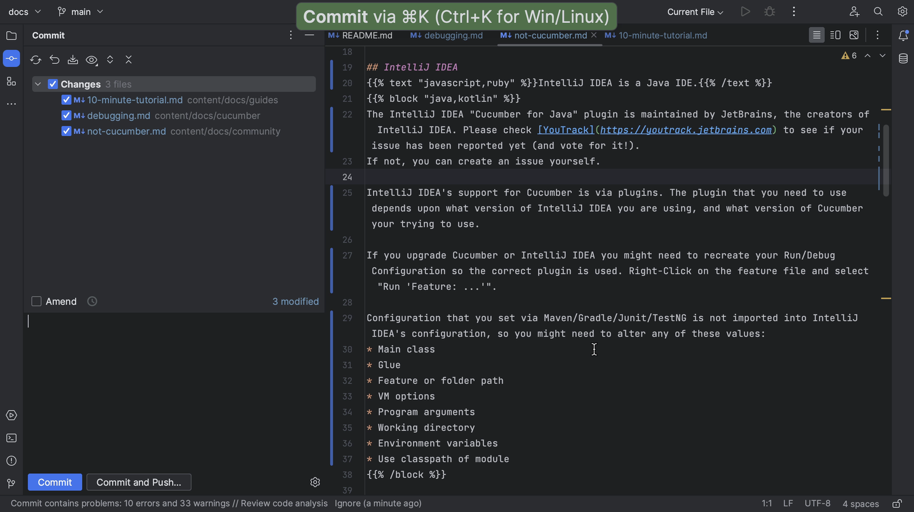

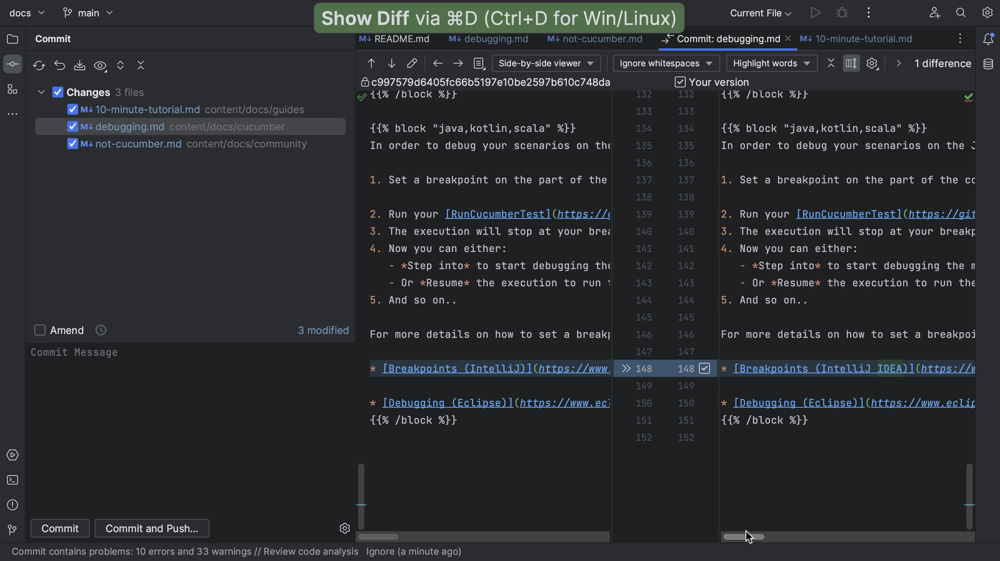

If we don't have access to the original project, we need to push our code to our fork.

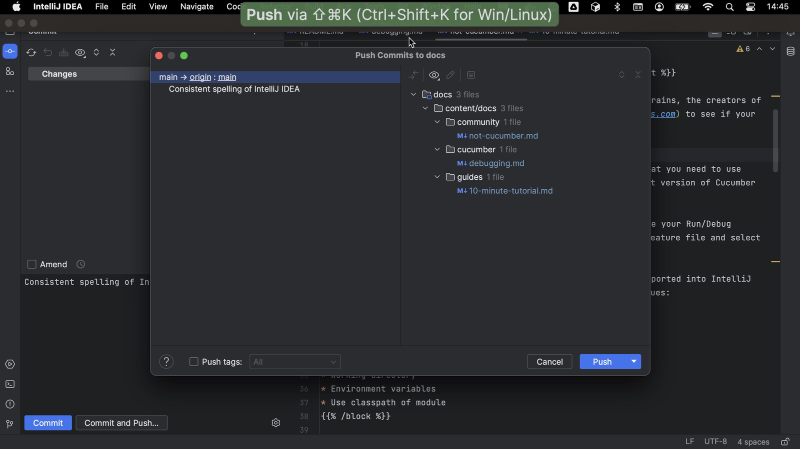

## Creating the pull request

Once we are happy with our changes, we can create a pull request.

We go back to our GitHub profile and create a pull request from there. After we have pushed our changes, we can see that our fork is **1 commit ahead** . We can start creating our pull request by clicking **Contribute**.

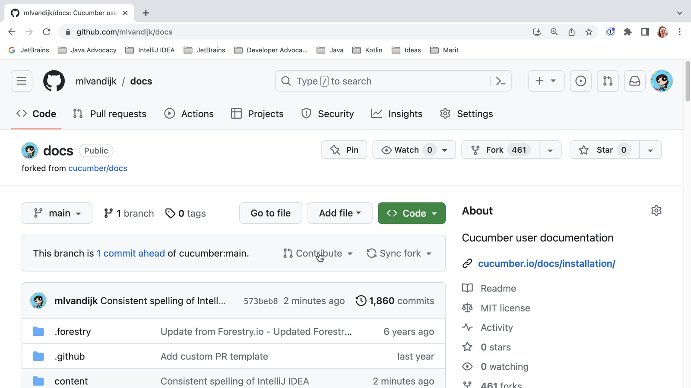

We need to provide a title and description for our pull request. Make sure the title is a good description of the changes you want to contribute. If your PR fixes an issue, you can add "fixed #x" (where x is the issue number) to the title; this will automatically close the linked issue when the PR is merged. Once you are happy with the title and description, click the button **Create pull request** to open your pull request.

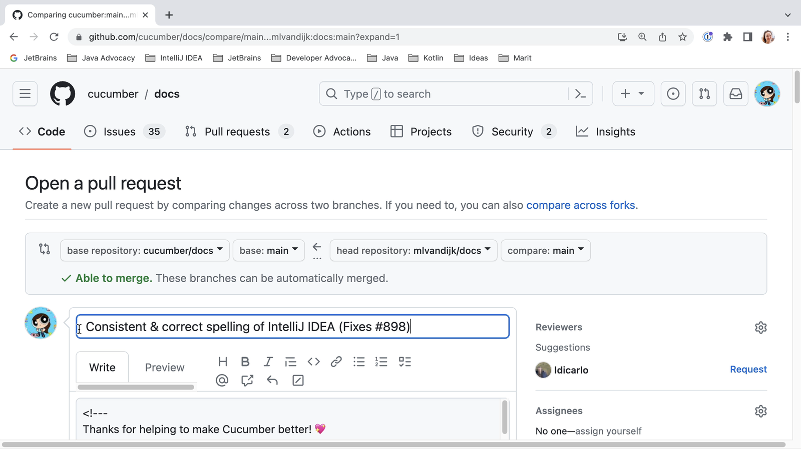

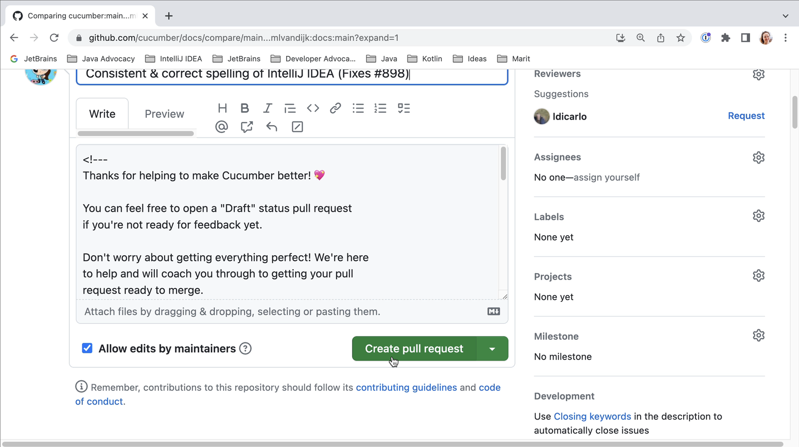

## Negotiating the review process

Now the waiting starts. On an active project, hopefully your PR will be reviewed soon. Your PR might get comments from reviewers that you need to fix. For complex changes, this might take several iterations. For smaller changes, hopefully it won't. Before doing a lot of work on an issue you might want to check that your contribution is wanted and your solution is what they are looking for. Don't be discouraged by review comments. Keep in mind that the maintainers will have to maintain your solution in the future and they want to make sure that it fits their project.

As you can see, reviewers can comment on your PR, approve the PR or request changes which must be addressed before merging. A project might have other checks set up that need to pass before merging. You might want to check that these checks pass and that there are no conflicts with the main branch.

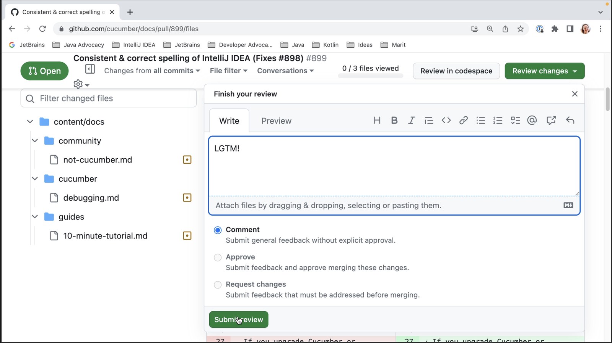

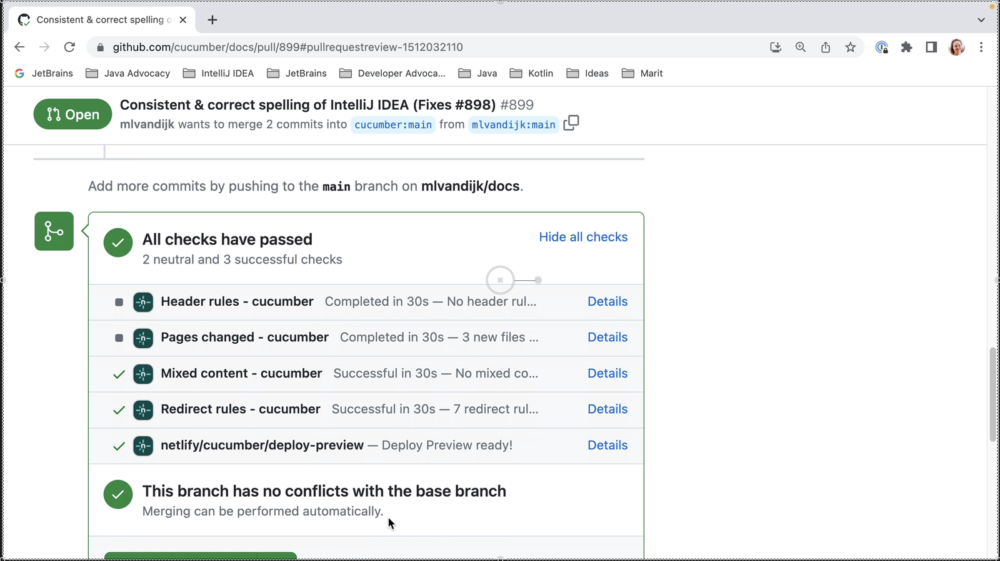

## Summary and shortcuts

In this blog post, we've seen how to do an open source pull request. For more information on what you can contribute and how to find something to contribute, please have a look at [this video](https://www.youtube.com/watch?v=GAqfMNB-YBU).

### IntelliJ IDEA Shortcuts Used

Here are the IntelliJ IDEA shortcuts that we used.

|                                               Name                                               | macOS Shortcut | Windows / Linux Shortcut |
|--------------------------------------------------------------------------------------------------|----------------|--------------------------|
| Open / Close [Project Tool Window](https://www.jetbrains.com/help/idea/project-tool-window.html) | **⌘1**         | **Alt+1**                |
| Find in Files                                                                                    | **⌘⇧F**        | **Ctrl+Shift+F**         |
| Commit changes                                                                                   | **⌘K**         | **Ctrl+K**               |
| Commit tool window                                                                               | **⌘1**         | **Alt+1**                |
| Show diff                                                                                        | **⌘D**         | **Ctrl+D**               |

### Related Links

* (video) [How I Started Contributing to Open Source and Why You Should Too, by Marit van Dijk](https://www.youtube.com/watch?v=GAqfMNB-YBU)
* (blog) [Collaborating on open source](https://maritvandijk.com/collaborating-on-open-source/)
* (video) [IntelliJ IDEA. Cloning a Project from GitHub](https://www.youtube.com/watch?v=aBVOAnygcZw)
* (video) [IntelliJ IDEA. GitHub Pull Requests](https://www.youtube.com/watch?v=MoXxF3aWW8k)
* (documentation) [JetBrains IntelliJ IDEA -- Fork GitHub projects](https://www.jetbrains.com/help/idea/fork-github-projects.html)


