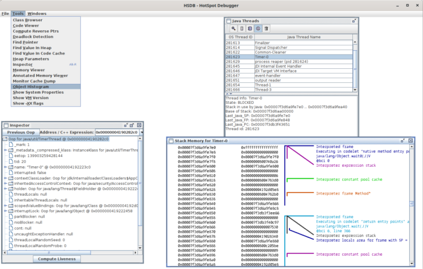

We all have some hobby, be it sports, fishing, playing games or building compilers.

One of my hobbies is regularly searching the JDK for new Java classes with executable main methods.

Many years ago, during my forays through the JDK sources, I first encountered a class with a main-method I didn't know about. That was in 2007 (oh boy).

The class was Class2HTML from the BCEL (Bytecode Engineering Library) library embedded in the JDK back then.

With this class, you could create a clear HTML representation of the bytecode of a class. [Click here for an example](https://www.tutorials.de/threads/informationen-zu-java-klassen-mit-bcel-als-htmlcode-generieren-lassen.266704/ "See here for an example").

Of course, that was many moons ago, in the meantime, BCEL has been replaced in the JDK by the ASM bytecode analysis library.

Since then, I've been looking for new unknown tools and possibilities in the JDK :).

Many binary tools from the `$JDK_HOME/bin` directory are, in fact, only wrappers around corresponding classes with main methods, which can also be executed directly.  

An example is the tool `jcmd`, which is based on the class `sun.tools.jcmd.JCmd`, and can alternatively be called via `java -m jdk.jcmd/sun.tools.jcmd.JCmd`.

In addition to these programs, however, many other small executable programs in the JDK have no direct equivalent in the `$JDK_HOME/bin` directory.

There are different approaches to searching the JDK for classes with main methods.  

For example, one could try to open all JDK libraries (jar's) as `JarFile` and then analyze all it's classes with dynamic class-loading and reflection. Although, this approach would work to some degree (reading .jmods this way would not work), it would be very inefficient and slow due to expensive class-loading and memory usage.

My alternative approach combines a fast-analysis technique with low memory consumption and provides compatibility across different JDK (bytecode) versions.

* Instead of reflection, I use ASM to scan the classes for executable main-method signatures.
* Using the `ForkJoin` framework and `RecursiveAction` to analyze JDK libraries in parallel.
* Using `FileSystem.provider().newInputStream(...)` to read from both `.jar` and `.jmod` (Java Modules) archives.

Here is a small program I use for this. The program works with Java 11 and above and can parse JDK versions \>= 8. The program can analyze the current or a different JDK and print an appropriate command-line for the java launcher to execute the found classes with main-methods.

*Note that the following classes can be copied into a single file **MainMethodFinder.java** for ease of use.*

## MainMethodFinder

The class **MainMethodFinder** is the main driver of our scanning tool. It detects the current execution environment and checks if the current JDK or a different JDK should be analyzed. The `Path` of the current JDK is derived via `ProcessHandle.current().info().command()`.

It uses a **MainMethodReportingVisitor** , to recursively analyze the libraries of a given JDK. The actual "class with main method"-search is performed by a **MainMethodVisitor.** The found main method locations are reported as instances of the **MainMethod** data-holder class.

```java
import jdk.internal.org.objectweb.asm.*;

import java.io.*;
import java.nio.file.*;
import java.nio.file.attribute.BasicFileAttributes;
import java.util.*;
import java.util.concurrent.*;
import java.util.function.Consumer;

public class MainMethodFinder {

    private static final boolean VERBOSE = Boolean.getBoolean("verbose");

    // hack to determine if we are running as GRAAL VM native-image
    private static final boolean IS_NATIVE_IMAGE = System.getProperty("org.graalvm.nativeimage.imagecode") != null;

    private static final boolean SHOW_COMMAND = Boolean.getBoolean("showCommand");

    public static void main(String[] args) throws IOException {

        long time = System.nanoTime();
        try {

            boolean customJdkPathProvided = args.length > 0;
            if (!customJdkPathProvided && IS_NATIVE_IMAGE) {
                System.err.println("MainMethodFinder: Missing path operand.");
                System.err.println("Usage: MainMethodFinder /path/to/jdk");
                System.exit(-1);
                return;
            }

            var jdkHomePath = customJdkPathProvided ? Path.of(args[0]) : detectCurrentJdkPath();

            if (VERBOSE) {
                System.out.printf("Scanning Java Installation: %s%n", jdkHomePath);
            }

            MainMethodReportingVisitor visitor = new MainMethodReportingVisitor();
            Files.walkFileTree(jdkHomePath, visitor);

            Consumer<MainMethod> printMainMethodInfo = mainMethod -> {

                String libraryFileName = mainMethod.library.getName();
                if (libraryFileName.endsWith(".jar")) {
                    libraryFileName = jdkHomePath.relativize(mainMethod.library.toPath()).toString();
                }
                String mainClassName = mainMethod.className;
                String libraryName = libraryFileName.replaceAll("\\.jmod", "");

                if (SHOW_COMMAND) {
                    String launchCommand = generateLaunchCommand(!customJdkPathProvided, jdkHomePath, libraryFileName, mainClassName, libraryName);
                    System.out.printf("%s%n", launchCommand);
                } else {
                    System.out.printf("%s %s%n", libraryName, mainClassName);
                }
            };

            var mainMethods = visitor.waitForCompletionAndReturnMainMethods();
            mainMethods.forEach(printMainMethodInfo);
        } finally {
            time = System.nanoTime() - time;
            if (VERBOSE) {
                System.out.printf("time = %dms%n", TimeUnit.NANOSECONDS.toMillis(time));
                // System.out.printf("ForkJoin Pool Stats: %s%n", ForkJoinPool.commonPool());
            }
        }
    }

    private static String generateLaunchCommand(boolean useCurrentJdk, Path jdkHomePath, String libraryFileName, String mainClassName, String libraryName) {

        var launchCommand = (useCurrentJdk ? "" : jdkHomePath.toFile().getAbsolutePath() + "/bin/") + "java";

        if (libraryFileName.endsWith(".jmod")) {
            launchCommand += (useCurrentJdk ? "" : " --module-path " + jdkHomePath.toFile().getAbsolutePath() + "/jmods");
            launchCommand += " -m " + libraryName + "/" + mainClassName;
        } else if (libraryFileName.endsWith(".jar")) {
            launchCommand += " -cp " + jdkHomePath.toFile().getAbsolutePath() + "/" + libraryFileName;
            launchCommand += " " + mainClassName;
        } else {
            launchCommand = String.format("Could not generate launch command for: %s %s", libraryFileName, mainClassName);
        }

        return launchCommand;
    }

    private static Path detectCurrentJdkPath() {
        return Paths.get(ProcessHandle.current().info().command().orElseThrow()).resolve("../..").normalize();
    }
}
```

## MainMethod

The class **MainMethod** is a data-holder class that captures the name of a found Class with a main-method and the library containing it.

*Allthough this class could be a record, we use a normal class to be able to run the tool also with JDKs \< 14.*

```java
class MainMethod {

    final File library;

    final String className;

    public MainMethod(File library, String className) {
        this.library = library;
        this.className = className;
    }
}
```

## MainMethodVisitor

The class **MainMethodVisitor** is an ASM `ClassVisitor` which analyzes the class byte code to detect executable main methods. An executable main-Method obviously has the name `"main"` and is `public static` and has a `String[]` as single parameter.

Fun fact: With **Java 21** and the introduction of [JEP 445 Unnamed Classes and Instance Main Methods (Preview)](https://openjdk.org/jeps/445) the ways to declare main-methods got extended, therefore the detection rule above will no longer catch all main-method variants. If you are curious to see what's possible, just take a look at **JEP 445**.

The **MainMethodVisitor** uses the `FileSystem#provider().newInputStream(..)` method in the **tryGetClassBytes** method to load class bytes from a `.jar` and `.jmod` files. The `FileSystem` instance is created via `FileSystems.newFileSystem(...)` with a `Path` to a `.jar` or `.jmod` file.

*Note that we deliberately duplicate the ASM version constants, to be able to run the tool with older JDK versions.*

```java
class MainMethodVisitor extends ClassVisitor {

    // Adapted from Opcodes.ASM* to be usable across jdk versions.
    private static final int ASM6 = 6 << 16;

    private static final int ASM7 = 7 << 16;

    private static final int ASM8 = 8 << 16;

    private static final int ASM9 = 9 << 16;

    private static final String JAVA_VERSION_STRING = System.getProperty("java.version");

    private static final int ASM_API_VERSION =
            // not using Opcodes.* constants to support running on Java11-21
            JAVA_VERSION_STRING.startsWith("11.") //
                    ? ASM6 //
                    : JAVA_VERSION_STRING.startsWith("15.") //
                    ? ASM7 //
                    : JAVA_VERSION_STRING.startsWith("20.") //
                    ? ASM8 //
                    : ASM9;

    private final File library;

    private final FileSystem fileSystem;

    private final Consumer<MainMethod> mainMethodConsumer;

    private final ThreadLocal<String> currentInternalClassName;

    public MainMethodVisitor(File library, Consumer<MainMethod> mainMethodConsumer, FileSystem fileSystem) {
        super(ASM_API_VERSION);
        this.library = library;
        this.fileSystem = fileSystem;
        this.mainMethodConsumer = mainMethodConsumer;
        this.currentInternalClassName = new ThreadLocal<>();
    }

    @Override
    public void visit(int version, int access, String name, String signature, String superName, String[] interfaces) {
        currentInternalClassName.set(name);
        super.visit(version, access, name, signature, superName, interfaces);
    }

    @Override
    public void visitEnd() {
        super.visitEnd();
        currentInternalClassName.remove();
    }

    @Override
    public MethodVisitor visitMethod(int access, String name, String descriptor, String signature, String[] exceptions) {
        if (isRunnableMainMethod(access, name, descriptor)) {
            mainMethodConsumer.accept(new MainMethod(library, currentInternalClassName.get().replace('/', '.')));
        }
        return super.visitMethod(access, name, descriptor, signature, exceptions);
    }

    private boolean isRunnableMainMethod(int access, String name, String descriptor) {
        return "main".equals(name) && (access & Opcodes.ACC_STATIC) != 0 && "([Ljava/lang/String;)V".equals(descriptor);
    }

    void scanClassForMainMethod(Path pathToLibraryClass) {
        tryGetClassBytes(pathToLibraryClass, fileSystem).ifPresent(this::visitClassBytes);
    }

    private void visitClassBytes(byte[] classBytes) {
        new ClassReader(classBytes).accept(this, 0);
    }

    private Optional<byte[]> tryGetClassBytes(Path nestedFilePath, FileSystem fileSystem) {

        // use filesystem to access .jar and .jmod file contents
        try (var is = fileSystem.provider().newInputStream(nestedFilePath)) {
            return Optional.of(is.readAllBytes());
        } catch (IOException e) {
            e.printStackTrace();
        }
        return Optional.empty();
    }
}
```

## MainMethodReportingVisitor

The actual scanning of JDK `.jar`-Files and `.jmods` is performed by the **MainMethodReportingVisitor** class, which is a `SimpleFileVisitor` used in combination with `Files.walkFileTree(jdkHomePath, visitor)` in the `MainMethodFinder` main-method.

To speed up the scanning we spawn and enqueue a new `RecursiveAction` in the `visitFile(..)` method with the `ForkJoin` infrastructure. The method `waitForCompletionAndReturnMainMethods(..)` waits for all spawned scanning actions to complete and returns the `List` of detected `MainMethod`s to the `MainMethodFinder` which eventuelly prints command-lines to execute the all detected main-methods.

```java
class MainMethodReportingVisitor extends SimpleFileVisitor<Path> {

    private final CopyOnWriteArrayList<MainMethod> mainMethods = new CopyOnWriteArrayList<>();

    private final Queue<RecursiveAction> outstanding = new ConcurrentLinkedQueue<>();

    @Override
    public FileVisitResult visitFile(Path filePath, BasicFileAttributes attrs) {
        var maybeJdkLibrary = filePath.toFile();
        if (isJdkLibrary(maybeJdkLibrary.getName())) {
            var action = new RecursiveAction() {
                protected void compute() {
                    scanLibraryForMainClasses(maybeJdkLibrary);
                }
            };
            action.fork();
            outstanding.add(action);
        }
        return FileVisitResult.CONTINUE;
    }

    public List<MainMethod> waitForCompletionAndReturnMainMethods() {

        for (RecursiveAction action; (action = outstanding.poll()) != null; ) {
            action.join();
        }

        List<MainMethod> result = new ArrayList<>(this.mainMethods);
        this.mainMethods.clear();

        var cmp = Comparator.comparing((MainMethod left) -> left.library.getName()).thenComparing((MainMethod left) -> left.className);
        result.sort(cmp);

        return result;
    }

    private boolean isJdkLibrary(String maybeJdkLibraryName) {
        return maybeJdkLibraryName.endsWith(".jar") || maybeJdkLibraryName.endsWith(".jmod");
    }

    private void scanLibraryForMainClasses(File library) {
        // Using FileSystems.newFileSystem(library.toPath(), (ClassLoader)null) for Java 11 compatibility
        try (var fileSystem = FileSystems.newFileSystem(library.toPath(), (ClassLoader) null)) {
            var root = fileSystem.getRootDirectories().iterator().next();
            var visitor = new MainMethodVisitor(library, mainMethods::add, fileSystem);
            try (var files = Files.walk(root).parallel().filter(this::isClassFile)) {
                files.forEach(visitor::scanClassForMainMethod);
            }
        } catch (Exception e) {
            System.err.println("Could not scan library: " + library.getAbsolutePath());
            e.printStackTrace();
        }
    }

    private boolean isClassFile(Path nestedFilePath) {
        return nestedFilePath.toString().endsWith(".class");
    }
}
```

If you want to try it yourself, take a look at [this Github Gist](https://gist.github.com/thomasdarimont/1d91117aca91be5b6e8151388d671c66) which combines everything in one file for your convenience.

Now let's see the tool in action!

Thanks to the support for single-file source-code programs from Java 11 onwards, we can call the tool with the following command without explicitly compiling the example first.

```
java --show-version -DshowCommand=true --add-exports java.base/jdk.internal.org.objectweb.asm=ALL-UNNAMED MainMethodFinder.java
```

Running the command with JDK 21-ea+27-2343 yields the following output:

```
$ java --show-version -DshowCommand=true --add-exports java.base/jdk.internal.org.objectweb.asm=ALL-UNNAMED MainMethodFinder.java                                          
openjdk 21-ea 2023-09-19
OpenJDK Runtime Environment (build 21-ea+27-2343)
OpenJDK 64-Bit Server VM (build 21-ea+27-2343, mixed mode, sharing)
java -m java.base/java.lang.foreign.snippets.Snippets$ArenaSnippets
java -m java.base/java.util.regex.PrintPattern
java -m java.base/jdk.internal.org.objectweb.asm.util.ASMifier
java -m java.base/jdk.internal.org.objectweb.asm.util.CheckClassAdapter
java -m java.base/jdk.internal.org.objectweb.asm.util.Textifier
java -m java.base/sun.launcher.LauncherHelper$FXHelper
java -m java.base/sun.security.provider.PolicyParser
java -m java.base/sun.security.tools.keytool.Main
java -m java.desktop/sun.java2d.loops.GraphicsPrimitiveMgr
java -m java.prefs/java.util.prefs.Base64
java -m java.rmi/sun.rmi.registry.RegistryImpl
java -m java.scripting/com.sun.tools.script.shell.Main
java -m java.xml/com.sun.org.apache.xalan.internal.xsltc.ProcessorVersion
java -m java.xml/com.sun.org.apache.xerces.internal.impl.Constants
java -m java.xml/com.sun.org.apache.xerces.internal.impl.xpath.XPath
java -m java.xml/com.sun.org.apache.xerces.internal.impl.xpath.regex.REUtil
java -m jdk.compiler/com.sun.tools.javac.Main
java -m jdk.compiler/com.sun.tools.javac.launcher.Main
java -m jdk.compiler/sun.tools.serialver.SerialVer
java -m jdk.hotspot.agent/com.sun.java.swing.ui.TabsDlg
java -m jdk.hotspot.agent/com.sun.java.swing.ui.WizardDlg
java -m jdk.hotspot.agent/sun.jvm.hotspot.CLHSDB
java -m jdk.hotspot.agent/sun.jvm.hotspot.DebugServer
java -m jdk.hotspot.agent/sun.jvm.hotspot.HSDB
java -m jdk.hotspot.agent/sun.jvm.hotspot.HelloWorld
java -m jdk.hotspot.agent/sun.jvm.hotspot.ObjectHistogram
java -m jdk.hotspot.agent/sun.jvm.hotspot.SALauncher
java -m jdk.hotspot.agent/sun.jvm.hotspot.StackTrace
java -m jdk.hotspot.agent/sun.jvm.hotspot.debugger.bsd.BsdAddress
java -m jdk.hotspot.agent/sun.jvm.hotspot.debugger.dummy.DummyAddress
java -m jdk.hotspot.agent/sun.jvm.hotspot.debugger.linux.LinuxAddress
java -m jdk.hotspot.agent/sun.jvm.hotspot.debugger.posix.elf.ELFFileParser
java -m jdk.hotspot.agent/sun.jvm.hotspot.debugger.remote.RemoteAddress
java -m jdk.hotspot.agent/sun.jvm.hotspot.debugger.win32.coff.DumpExports
java -m jdk.hotspot.agent/sun.jvm.hotspot.debugger.win32.coff.TestDebugInfo
java -m jdk.hotspot.agent/sun.jvm.hotspot.debugger.win32.coff.TestParser
java -m jdk.hotspot.agent/sun.jvm.hotspot.debugger.windbg.WindbgAddress
java -m jdk.hotspot.agent/sun.jvm.hotspot.tools.ClassLoaderStats
java -m jdk.hotspot.agent/sun.jvm.hotspot.tools.FinalizerInfo
java -m jdk.hotspot.agent/sun.jvm.hotspot.tools.FlagDumper
java -m jdk.hotspot.agent/sun.jvm.hotspot.tools.HeapDumper
java -m jdk.hotspot.agent/sun.jvm.hotspot.tools.HeapSummary
java -m jdk.hotspot.agent/sun.jvm.hotspot.tools.JInfo
java -m jdk.hotspot.agent/sun.jvm.hotspot.tools.JMap
java -m jdk.hotspot.agent/sun.jvm.hotspot.tools.JSnap
java -m jdk.hotspot.agent/sun.jvm.hotspot.tools.JStack
java -m jdk.hotspot.agent/sun.jvm.hotspot.tools.ObjectHistogram
java -m jdk.hotspot.agent/sun.jvm.hotspot.tools.PMap
java -m jdk.hotspot.agent/sun.jvm.hotspot.tools.PStack
java -m jdk.hotspot.agent/sun.jvm.hotspot.tools.StackTrace
java -m jdk.hotspot.agent/sun.jvm.hotspot.tools.SysPropsDumper
java -m jdk.hotspot.agent/sun.jvm.hotspot.tools.jcore.ClassDump
java -m jdk.hotspot.agent/sun.jvm.hotspot.ui.AnnotatedMemoryPanel
java -m jdk.hotspot.agent/sun.jvm.hotspot.ui.CommandProcessorPanel
java -m jdk.hotspot.agent/sun.jvm.hotspot.ui.DebuggerConsolePanel
java -m jdk.hotspot.agent/sun.jvm.hotspot.ui.HighPrecisionJScrollBar
java -m jdk.hotspot.agent/sun.jvm.hotspot.ui.ObjectHistogramPanel
java -m jdk.hotspot.agent/sun.jvm.hotspot.utilities.PlatformInfo
java -m jdk.hotspot.agent/sun.jvm.hotspot.utilities.RBTree
java -m jdk.httpserver/sun.net.httpserver.simpleserver.JWebServer
java -m jdk.httpserver/sun.net.httpserver.simpleserver.Main
java -m jdk.internal.le/jdk.internal.org.jline.terminal.impl.Diag
java -m jdk.jartool/sun.security.tools.jarsigner.Main
java -m jdk.jartool/sun.tools.jar.Main
java -m jdk.javadoc/jdk.javadoc.internal.doclint.DocLint
java -m jdk.javadoc/jdk.javadoc.internal.tool.Main
java -m jdk.jcmd/sun.tools.jcmd.JCmd
java -m jdk.jcmd/sun.tools.jinfo.JInfo
java -m jdk.jcmd/sun.tools.jmap.JMap
java -m jdk.jcmd/sun.tools.jps.Jps
java -m jdk.jcmd/sun.tools.jstack.JStack
java -m jdk.jcmd/sun.tools.jstat.Jstat
java -m jdk.jconsole/sun.tools.jconsole.JConsole
java -m jdk.jdeps/com.sun.tools.javap.Main
java -m jdk.jdeps/com.sun.tools.jdeprscan.Main
java -m jdk.jdeps/com.sun.tools.jdeps.Main
java -m jdk.jdeps/com.sun.tools.jdeps.Profile
java -m jdk.jdi/com.sun.tools.example.debug.expr.ExpressionParser
java -m jdk.jdi/com.sun.tools.example.debug.tty.TTY
java -m jdk.jfr/jdk.jfr.internal.tool.Main
java -m jdk.jfr/jdk.jfr.snippets.Snippets
java -m jdk.jfr/jdk.jfr.snippets.Snippets$ConfigurationOverview
java -m jdk.jfr/jdk.jfr.snippets.Snippets$Example
java -m jdk.jfr/jdk.jfr.snippets.consumer.Snippets$EventStreamMetadata
java -m jdk.jfr/jdk.jfr.snippets.consumer.Snippets$PackageOverview
java -m jdk.jlink/jdk.tools.jimage.Main
java -m jdk.jlink/jdk.tools.jlink.internal.Main
java -m jdk.jlink/jdk.tools.jmod.Main
java -m jdk.jpackage/jdk.jpackage.main.Main
java -m jdk.jshell/jdk.internal.jshell.tool.JShellToolProvider
java -m jdk.jshell/jdk.jshell.execution.RemoteExecutionControl
java -m jdk.jstatd/sun.tools.jstatd.Jstatd
java -m jdk.security.auth/com.sun.security.auth.module.Crypt
java -m jdk.zipfs/jdk.nio.zipfs.ZipInfo
```

The listed classes contain the known tools from the `$JDK_HOME/bin` directory and many small debugging tools and test programs. Just have a look for yourself 🙂

Did you ever want to know how the pattern node tree looks for a compiled regex pattern? Just run:

`$ java -m java.base/java.util.regex.PrintPattern "^[\w-\.]+@([\w-]+\.)+[\w-]{2,4}$"`

```
Pattern: ^[\w-\.]+@([\w-]+\.)+[\w-]{2,4}$
0: <Begin>
1: <BmpCharPropertyGreedy java.util.regex.Pattern$Lambda/0x800000033@5ca881b5+>
2: <BmpCharProperty>
3: <Prolog>
4: <Loop + >
5: <Group.head 1>
6: <BmpCharPropertyGreedy java.util.regex.Pattern$Lambda/0x800000033@2ff4acd0+>
7: <BmpCharProperty>
8: </Group.tail 1> (=>4)
</Loop>
9: <Curly GREEDY {2, 4}>
10: <BmpCharProperty>
</Curly>
11: <Dollar>
12: <END>
```

Another tool that many Java developers are not familiar with is the HotSpot Debugger UI, which allows you to look and poke at some JVM internals. The tool itself is actually not so hidden, as it can be started via `jhsdb hsdb`, but [I discovered it a few years](https://www.tutorials.de/threads/mit-debugger-interne-hotspot-jvm-informationen-auslesen-in-java-7.387020/) ago by scanning for main methods.

You can also start the hsdb ui via: `java -m jdk.hotspot.agent/sun.jvm.hotspot.HSDB`.  



HotSpot Debugger UI{#caption-attachment-101022}

Tip: If we want to analyze an older JDK, e.g., JDK8 we can do it like this:

```
java -DshowCommand=true --add-exports java.base/jdk.internal.org.objectweb.asm=ALL-UNNAMED MainMethodFinder.java /path/to/jdk
```

*Note an easy way to install and manage different JDKs for experiments is [sdkman](https://sdkman.io/).*

Output:

```
$ java --show-version -DshowCommand=true --add-exports java.base/jdk.internal.org.objectweb.asm=ALL-UNNAMED MainMethodFinder.java ~/.sdkman/candidates/java/8.0.282.hs-adpt
openjdk 21-ea 2023-09-19
OpenJDK Runtime Environment (build 21-ea+27-2343)
OpenJDK 64-Bit Server VM (build 21-ea+27-2343, mixed mode, sharing)
/home/tom/.sdkman/candidates/java/8.0.282.hs-adpt/bin/java -cp /home/tom/.sdkman/candidates/java/8.0.282.hs-adpt/lib/jconsole.jar sun.tools.jconsole.JConsole
/home/tom/.sdkman/candidates/java/8.0.282.hs-adpt/bin/java -cp /home/tom/.sdkman/candidates/java/8.0.282.hs-adpt/jre/lib/jfr.jar jdk.jfr.internal.tool.Main
/home/tom/.sdkman/candidates/java/8.0.282.hs-adpt/bin/java -cp /home/tom/.sdkman/candidates/java/8.0.282.hs-adpt/jre/lib/ext/nashorn.jar jdk.nashorn.tools.Shell
/home/tom/.sdkman/candidates/java/8.0.282.hs-adpt/bin/java -cp /home/tom/.sdkman/candidates/java/8.0.282.hs-adpt/jre/lib/rt.jar com.sun.corba.se.impl.activation.ORBD
/home/tom/.sdkman/candidates/java/8.0.282.hs-adpt/bin/java -cp /home/tom/.sdkman/candidates/java/8.0.282.hs-adpt/jre/lib/rt.jar com.sun.corba.se.impl.activation.RepositoryImpl
/home/tom/.sdkman/candidates/java/8.0.282.hs-adpt/bin/java -cp /home/tom/.sdkman/candidates/java/8.0.282.hs-adpt/jre/lib/rt.jar com.sun.corba.se.impl.activation.ServerMain
/home/tom/.sdkman/candidates/java/8.0.282.hs-adpt/bin/java -cp /home/tom/.sdkman/candidates/java/8.0.282.hs-adpt/jre/lib/rt.jar com.sun.corba.se.impl.activation.ServerTool
/home/tom/.sdkman/candidates/java/8.0.282.hs-adpt/bin/java -cp /home/tom/.sdkman/candidates/java/8.0.282.hs-adpt/jre/lib/rt.jar com.sun.corba.se.impl.naming.cosnaming.TransientNameServer
/home/tom/.sdkman/candidates/java/8.0.282.hs-adpt/bin/java -cp /home/tom/.sdkman/candidates/java/8.0.282.hs-adpt/jre/lib/rt.jar com.sun.corba.se.impl.naming.pcosnaming.NameServer
/home/tom/.sdkman/candidates/java/8.0.282.hs-adpt/bin/java -cp /home/tom/.sdkman/candidates/java/8.0.282.hs-adpt/jre/lib/rt.jar com.sun.corba.se.impl.util.JDKBridge
/home/tom/.sdkman/candidates/java/8.0.282.hs-adpt/bin/java -cp /home/tom/.sdkman/candidates/java/8.0.282.hs-adpt/jre/lib/rt.jar com.sun.corba.se.impl.util.ORBProperties
/home/tom/.sdkman/candidates/java/8.0.282.hs-adpt/bin/java -cp /home/tom/.sdkman/candidates/java/8.0.282.hs-adpt/jre/lib/rt.jar com.sun.corba.se.impl.util.Version
/home/tom/.sdkman/candidates/java/8.0.282.hs-adpt/bin/java -cp /home/tom/.sdkman/candidates/java/8.0.282.hs-adpt/jre/lib/rt.jar com.sun.corba.se.internal.CosNaming.BootstrapServer
/home/tom/.sdkman/candidates/java/8.0.282.hs-adpt/bin/java -cp /home/tom/.sdkman/candidates/java/8.0.282.hs-adpt/jre/lib/rt.jar com.sun.corba.se.spi.orbutil.fsm.FSMTest
/home/tom/.sdkman/candidates/java/8.0.282.hs-adpt/bin/java -cp /home/tom/.sdkman/candidates/java/8.0.282.hs-adpt/jre/lib/rt.jar com.sun.java.util.jar.pack.Driver
/home/tom/.sdkman/candidates/java/8.0.282.hs-adpt/bin/java -cp /home/tom/.sdkman/candidates/java/8.0.282.hs-adpt/jre/lib/rt.jar com.sun.org.apache.xalan.internal.xslt.EnvironmentCheck
/home/tom/.sdkman/candidates/java/8.0.282.hs-adpt/bin/java -cp /home/tom/.sdkman/candidates/java/8.0.282.hs-adpt/jre/lib/rt.jar com.sun.org.apache.xalan.internal.xsltc.ProcessorVersion
/home/tom/.sdkman/candidates/java/8.0.282.hs-adpt/bin/java -cp /home/tom/.sdkman/candidates/java/8.0.282.hs-adpt/jre/lib/rt.jar com.sun.org.apache.xalan.internal.xsltc.cmdline.Compile
/home/tom/.sdkman/candidates/java/8.0.282.hs-adpt/bin/java -cp /home/tom/.sdkman/candidates/java/8.0.282.hs-adpt/jre/lib/rt.jar com.sun.org.apache.xalan.internal.xsltc.cmdline.Transform
/home/tom/.sdkman/candidates/java/8.0.282.hs-adpt/bin/java -cp /home/tom/.sdkman/candidates/java/8.0.282.hs-adpt/jre/lib/rt.jar com.sun.org.apache.xerces.internal.impl.Constants
/home/tom/.sdkman/candidates/java/8.0.282.hs-adpt/bin/java -cp /home/tom/.sdkman/candidates/java/8.0.282.hs-adpt/jre/lib/rt.jar com.sun.org.apache.xerces.internal.impl.Version
/home/tom/.sdkman/candidates/java/8.0.282.hs-adpt/bin/java -cp /home/tom/.sdkman/candidates/java/8.0.282.hs-adpt/jre/lib/rt.jar com.sun.org.apache.xerces.internal.impl.xpath.XPath
/home/tom/.sdkman/candidates/java/8.0.282.hs-adpt/bin/java -cp /home/tom/.sdkman/candidates/java/8.0.282.hs-adpt/jre/lib/rt.jar com.sun.org.apache.xerces.internal.impl.xpath.regex.REUtil
/home/tom/.sdkman/candidates/java/8.0.282.hs-adpt/bin/java -cp /home/tom/.sdkman/candidates/java/8.0.282.hs-adpt/jre/lib/rt.jar com.sun.org.apache.xml.internal.security.keys.storage.implementations.CertsInFilesystemDirectoryResolver
/home/tom/.sdkman/candidates/java/8.0.282.hs-adpt/bin/java -cp /home/tom/.sdkman/candidates/java/8.0.282.hs-adpt/jre/lib/rt.jar com.sun.security.auth.module.Crypt
/home/tom/.sdkman/candidates/java/8.0.282.hs-adpt/bin/java -cp /home/tom/.sdkman/candidates/java/8.0.282.hs-adpt/jre/lib/rt.jar com.sun.xml.internal.fastinfoset.tools.FI_DOM_Or_XML_DOM_SAX_SAXEvent
/home/tom/.sdkman/candidates/java/8.0.282.hs-adpt/bin/java -cp /home/tom/.sdkman/candidates/java/8.0.282.hs-adpt/jre/lib/rt.jar com.sun.xml.internal.fastinfoset.tools.FI_SAX_Or_XML_SAX_DOM_SAX_SAXEvent
/home/tom/.sdkman/candidates/java/8.0.282.hs-adpt/bin/java -cp /home/tom/.sdkman/candidates/java/8.0.282.hs-adpt/jre/lib/rt.jar com.sun.xml.internal.fastinfoset.tools.FI_SAX_Or_XML_SAX_SAXEvent
/home/tom/.sdkman/candidates/java/8.0.282.hs-adpt/bin/java -cp /home/tom/.sdkman/candidates/java/8.0.282.hs-adpt/jre/lib/rt.jar com.sun.xml.internal.fastinfoset.tools.FI_SAX_XML
/home/tom/.sdkman/candidates/java/8.0.282.hs-adpt/bin/java -cp /home/tom/.sdkman/candidates/java/8.0.282.hs-adpt/jre/lib/rt.jar com.sun.xml.internal.fastinfoset.tools.FI_StAX_SAX_Or_XML_SAX_SAXEvent
/home/tom/.sdkman/candidates/java/8.0.282.hs-adpt/bin/java -cp /home/tom/.sdkman/candidates/java/8.0.282.hs-adpt/jre/lib/rt.jar com.sun.xml.internal.fastinfoset.tools.PrintTable
/home/tom/.sdkman/candidates/java/8.0.282.hs-adpt/bin/java -cp /home/tom/.sdkman/candidates/java/8.0.282.hs-adpt/jre/lib/rt.jar com.sun.xml.internal.fastinfoset.tools.XML_DOM_FI
/home/tom/.sdkman/candidates/java/8.0.282.hs-adpt/bin/java -cp /home/tom/.sdkman/candidates/java/8.0.282.hs-adpt/jre/lib/rt.jar com.sun.xml.internal.fastinfoset.tools.XML_DOM_SAX_FI
/home/tom/.sdkman/candidates/java/8.0.282.hs-adpt/bin/java -cp /home/tom/.sdkman/candidates/java/8.0.282.hs-adpt/jre/lib/rt.jar com.sun.xml.internal.fastinfoset.tools.XML_SAX_FI
/home/tom/.sdkman/candidates/java/8.0.282.hs-adpt/bin/java -cp /home/tom/.sdkman/candidates/java/8.0.282.hs-adpt/jre/lib/rt.jar com.sun.xml.internal.fastinfoset.tools.XML_SAX_StAX_FI
/home/tom/.sdkman/candidates/java/8.0.282.hs-adpt/bin/java -cp /home/tom/.sdkman/candidates/java/8.0.282.hs-adpt/jre/lib/rt.jar java.util.prefs.Base64
/home/tom/.sdkman/candidates/java/8.0.282.hs-adpt/bin/java -cp /home/tom/.sdkman/candidates/java/8.0.282.hs-adpt/jre/lib/rt.jar jdk.internal.org.objectweb.asm.util.ASMifier
/home/tom/.sdkman/candidates/java/8.0.282.hs-adpt/bin/java -cp /home/tom/.sdkman/candidates/java/8.0.282.hs-adpt/jre/lib/rt.jar jdk.internal.org.objectweb.asm.util.CheckClassAdapter
/home/tom/.sdkman/candidates/java/8.0.282.hs-adpt/bin/java -cp /home/tom/.sdkman/candidates/java/8.0.282.hs-adpt/jre/lib/rt.jar jdk.internal.org.objectweb.asm.util.Textifier
/home/tom/.sdkman/candidates/java/8.0.282.hs-adpt/bin/java -cp /home/tom/.sdkman/candidates/java/8.0.282.hs-adpt/jre/lib/rt.jar sun.applet.AppletViewer
/home/tom/.sdkman/candidates/java/8.0.282.hs-adpt/bin/java -cp /home/tom/.sdkman/candidates/java/8.0.282.hs-adpt/jre/lib/rt.jar sun.applet.Main
/home/tom/.sdkman/candidates/java/8.0.282.hs-adpt/bin/java -cp /home/tom/.sdkman/candidates/java/8.0.282.hs-adpt/jre/lib/rt.jar sun.java2d.loops.GraphicsPrimitiveMgr
/home/tom/.sdkman/candidates/java/8.0.282.hs-adpt/bin/java -cp /home/tom/.sdkman/candidates/java/8.0.282.hs-adpt/jre/lib/rt.jar sun.launcher.LauncherHelper$FXHelper
/home/tom/.sdkman/candidates/java/8.0.282.hs-adpt/bin/java -cp /home/tom/.sdkman/candidates/java/8.0.282.hs-adpt/jre/lib/rt.jar sun.net.NetworkServer
/home/tom/.sdkman/candidates/java/8.0.282.hs-adpt/bin/java -cp /home/tom/.sdkman/candidates/java/8.0.282.hs-adpt/jre/lib/rt.jar sun.rmi.registry.RegistryImpl
/home/tom/.sdkman/candidates/java/8.0.282.hs-adpt/bin/java -cp /home/tom/.sdkman/candidates/java/8.0.282.hs-adpt/jre/lib/rt.jar sun.rmi.server.Activation
/home/tom/.sdkman/candidates/java/8.0.282.hs-adpt/bin/java -cp /home/tom/.sdkman/candidates/java/8.0.282.hs-adpt/jre/lib/rt.jar sun.rmi.server.ActivationGroupInit
/home/tom/.sdkman/candidates/java/8.0.282.hs-adpt/bin/java -cp /home/tom/.sdkman/candidates/java/8.0.282.hs-adpt/jre/lib/rt.jar sun.rmi.transport.proxy.CGIHandler
/home/tom/.sdkman/candidates/java/8.0.282.hs-adpt/bin/java -cp /home/tom/.sdkman/candidates/java/8.0.282.hs-adpt/jre/lib/rt.jar sun.security.provider.PolicyParser
/home/tom/.sdkman/candidates/java/8.0.282.hs-adpt/bin/java -cp /home/tom/.sdkman/candidates/java/8.0.282.hs-adpt/jre/lib/rt.jar sun.security.tools.keytool.Main
/home/tom/.sdkman/candidates/java/8.0.282.hs-adpt/bin/java -cp /home/tom/.sdkman/candidates/java/8.0.282.hs-adpt/jre/lib/rt.jar sun.security.tools.policytool.PolicyTool
/home/tom/.sdkman/candidates/java/8.0.282.hs-adpt/bin/java -cp /home/tom/.sdkman/candidates/java/8.0.282.hs-adpt/jre/lib/rt.jar sun.tools.jar.Main
/home/tom/.sdkman/candidates/java/8.0.282.hs-adpt/bin/java -cp /home/tom/.sdkman/candidates/java/8.0.282.hs-adpt/lib/sa-jdi.jar com.sun.java.swing.ui.TabsDlg
/home/tom/.sdkman/candidates/java/8.0.282.hs-adpt/bin/java -cp /home/tom/.sdkman/candidates/java/8.0.282.hs-adpt/lib/sa-jdi.jar com.sun.java.swing.ui.WizardDlg
/home/tom/.sdkman/candidates/java/8.0.282.hs-adpt/bin/java -cp /home/tom/.sdkman/candidates/java/8.0.282.hs-adpt/lib/sa-jdi.jar sun.jvm.hotspot.CLHSDB
/home/tom/.sdkman/candidates/java/8.0.282.hs-adpt/bin/java -cp /home/tom/.sdkman/candidates/java/8.0.282.hs-adpt/lib/sa-jdi.jar sun.jvm.hotspot.DebugServer
/home/tom/.sdkman/candidates/java/8.0.282.hs-adpt/bin/java -cp /home/tom/.sdkman/candidates/java/8.0.282.hs-adpt/lib/sa-jdi.jar sun.jvm.hotspot.HSDB
/home/tom/.sdkman/candidates/java/8.0.282.hs-adpt/bin/java -cp /home/tom/.sdkman/candidates/java/8.0.282.hs-adpt/lib/sa-jdi.jar sun.jvm.hotspot.HelloWorld
/home/tom/.sdkman/candidates/java/8.0.282.hs-adpt/bin/java -cp /home/tom/.sdkman/candidates/java/8.0.282.hs-adpt/lib/sa-jdi.jar sun.jvm.hotspot.ObjectHistogram
/home/tom/.sdkman/candidates/java/8.0.282.hs-adpt/bin/java -cp /home/tom/.sdkman/candidates/java/8.0.282.hs-adpt/lib/sa-jdi.jar sun.jvm.hotspot.StackTrace
/home/tom/.sdkman/candidates/java/8.0.282.hs-adpt/bin/java -cp /home/tom/.sdkman/candidates/java/8.0.282.hs-adpt/lib/sa-jdi.jar sun.jvm.hotspot.debugger.bsd.BsdAddress
/home/tom/.sdkman/candidates/java/8.0.282.hs-adpt/bin/java -cp /home/tom/.sdkman/candidates/java/8.0.282.hs-adpt/lib/sa-jdi.jar sun.jvm.hotspot.debugger.dummy.DummyAddress
/home/tom/.sdkman/candidates/java/8.0.282.hs-adpt/bin/java -cp /home/tom/.sdkman/candidates/java/8.0.282.hs-adpt/lib/sa-jdi.jar sun.jvm.hotspot.debugger.linux.LinuxAddress
/home/tom/.sdkman/candidates/java/8.0.282.hs-adpt/bin/java -cp /home/tom/.sdkman/candidates/java/8.0.282.hs-adpt/lib/sa-jdi.jar sun.jvm.hotspot.debugger.posix.elf.ELFFileParser
/home/tom/.sdkman/candidates/java/8.0.282.hs-adpt/bin/java -cp /home/tom/.sdkman/candidates/java/8.0.282.hs-adpt/lib/sa-jdi.jar sun.jvm.hotspot.debugger.proc.ProcAddress
/home/tom/.sdkman/candidates/java/8.0.282.hs-adpt/bin/java -cp /home/tom/.sdkman/candidates/java/8.0.282.hs-adpt/lib/sa-jdi.jar sun.jvm.hotspot.debugger.remote.RemoteAddress
/home/tom/.sdkman/candidates/java/8.0.282.hs-adpt/bin/java -cp /home/tom/.sdkman/candidates/java/8.0.282.hs-adpt/lib/sa-jdi.jar sun.jvm.hotspot.debugger.win32.coff.DumpExports
/home/tom/.sdkman/candidates/java/8.0.282.hs-adpt/bin/java -cp /home/tom/.sdkman/candidates/java/8.0.282.hs-adpt/lib/sa-jdi.jar sun.jvm.hotspot.debugger.win32.coff.TestDebugInfo
/home/tom/.sdkman/candidates/java/8.0.282.hs-adpt/bin/java -cp /home/tom/.sdkman/candidates/java/8.0.282.hs-adpt/lib/sa-jdi.jar sun.jvm.hotspot.debugger.win32.coff.TestParser
/home/tom/.sdkman/candidates/java/8.0.282.hs-adpt/bin/java -cp /home/tom/.sdkman/candidates/java/8.0.282.hs-adpt/lib/sa-jdi.jar sun.jvm.hotspot.debugger.windbg.WindbgAddress
/home/tom/.sdkman/candidates/java/8.0.282.hs-adpt/bin/java -cp /home/tom/.sdkman/candidates/java/8.0.282.hs-adpt/lib/sa-jdi.jar sun.jvm.hotspot.jdi.SADebugServer
/home/tom/.sdkman/candidates/java/8.0.282.hs-adpt/bin/java -cp /home/tom/.sdkman/candidates/java/8.0.282.hs-adpt/lib/sa-jdi.jar sun.jvm.hotspot.tools.ClassLoaderStats
/home/tom/.sdkman/candidates/java/8.0.282.hs-adpt/bin/java -cp /home/tom/.sdkman/candidates/java/8.0.282.hs-adpt/lib/sa-jdi.jar sun.jvm.hotspot.tools.FinalizerInfo
/home/tom/.sdkman/candidates/java/8.0.282.hs-adpt/bin/java -cp /home/tom/.sdkman/candidates/java/8.0.282.hs-adpt/lib/sa-jdi.jar sun.jvm.hotspot.tools.FlagDumper
/home/tom/.sdkman/candidates/java/8.0.282.hs-adpt/bin/java -cp /home/tom/.sdkman/candidates/java/8.0.282.hs-adpt/lib/sa-jdi.jar sun.jvm.hotspot.tools.HeapDumper
/home/tom/.sdkman/candidates/java/8.0.282.hs-adpt/bin/java -cp /home/tom/.sdkman/candidates/java/8.0.282.hs-adpt/lib/sa-jdi.jar sun.jvm.hotspot.tools.HeapSummary
/home/tom/.sdkman/candidates/java/8.0.282.hs-adpt/bin/java -cp /home/tom/.sdkman/candidates/java/8.0.282.hs-adpt/lib/sa-jdi.jar sun.jvm.hotspot.tools.JInfo
/home/tom/.sdkman/candidates/java/8.0.282.hs-adpt/bin/java -cp /home/tom/.sdkman/candidates/java/8.0.282.hs-adpt/lib/sa-jdi.jar sun.jvm.hotspot.tools.JMap
/home/tom/.sdkman/candidates/java/8.0.282.hs-adpt/bin/java -cp /home/tom/.sdkman/candidates/java/8.0.282.hs-adpt/lib/sa-jdi.jar sun.jvm.hotspot.tools.JSnap
/home/tom/.sdkman/candidates/java/8.0.282.hs-adpt/bin/java -cp /home/tom/.sdkman/candidates/java/8.0.282.hs-adpt/lib/sa-jdi.jar sun.jvm.hotspot.tools.JStack
/home/tom/.sdkman/candidates/java/8.0.282.hs-adpt/bin/java -cp /home/tom/.sdkman/candidates/java/8.0.282.hs-adpt/lib/sa-jdi.jar sun.jvm.hotspot.tools.ObjectHistogram
/home/tom/.sdkman/candidates/java/8.0.282.hs-adpt/bin/java -cp /home/tom/.sdkman/candidates/java/8.0.282.hs-adpt/lib/sa-jdi.jar sun.jvm.hotspot.tools.PMap
/home/tom/.sdkman/candidates/java/8.0.282.hs-adpt/bin/java -cp /home/tom/.sdkman/candidates/java/8.0.282.hs-adpt/lib/sa-jdi.jar sun.jvm.hotspot.tools.PStack
/home/tom/.sdkman/candidates/java/8.0.282.hs-adpt/bin/java -cp /home/tom/.sdkman/candidates/java/8.0.282.hs-adpt/lib/sa-jdi.jar sun.jvm.hotspot.tools.StackTrace
/home/tom/.sdkman/candidates/java/8.0.282.hs-adpt/bin/java -cp /home/tom/.sdkman/candidates/java/8.0.282.hs-adpt/lib/sa-jdi.jar sun.jvm.hotspot.tools.SysPropsDumper
/home/tom/.sdkman/candidates/java/8.0.282.hs-adpt/bin/java -cp /home/tom/.sdkman/candidates/java/8.0.282.hs-adpt/lib/sa-jdi.jar sun.jvm.hotspot.tools.jcore.ClassDump
/home/tom/.sdkman/candidates/java/8.0.282.hs-adpt/bin/java -cp /home/tom/.sdkman/candidates/java/8.0.282.hs-adpt/lib/sa-jdi.jar sun.jvm.hotspot.tools.soql.JSDB
/home/tom/.sdkman/candidates/java/8.0.282.hs-adpt/bin/java -cp /home/tom/.sdkman/candidates/java/8.0.282.hs-adpt/lib/sa-jdi.jar sun.jvm.hotspot.tools.soql.SOQL
/home/tom/.sdkman/candidates/java/8.0.282.hs-adpt/bin/java -cp /home/tom/.sdkman/candidates/java/8.0.282.hs-adpt/lib/sa-jdi.jar sun.jvm.hotspot.ui.AnnotatedMemoryPanel
/home/tom/.sdkman/candidates/java/8.0.282.hs-adpt/bin/java -cp /home/tom/.sdkman/candidates/java/8.0.282.hs-adpt/lib/sa-jdi.jar sun.jvm.hotspot.ui.CommandProcessorPanel
/home/tom/.sdkman/candidates/java/8.0.282.hs-adpt/bin/java -cp /home/tom/.sdkman/candidates/java/8.0.282.hs-adpt/lib/sa-jdi.jar sun.jvm.hotspot.ui.DebuggerConsolePanel
/home/tom/.sdkman/candidates/java/8.0.282.hs-adpt/bin/java -cp /home/tom/.sdkman/candidates/java/8.0.282.hs-adpt/lib/sa-jdi.jar sun.jvm.hotspot.ui.HighPrecisionJScrollBar
/home/tom/.sdkman/candidates/java/8.0.282.hs-adpt/bin/java -cp /home/tom/.sdkman/candidates/java/8.0.282.hs-adpt/lib/sa-jdi.jar sun.jvm.hotspot.ui.ObjectHistogramPanel
/home/tom/.sdkman/candidates/java/8.0.282.hs-adpt/bin/java -cp /home/tom/.sdkman/candidates/java/8.0.282.hs-adpt/lib/sa-jdi.jar sun.jvm.hotspot.utilities.PlatformInfo
/home/tom/.sdkman/candidates/java/8.0.282.hs-adpt/bin/java -cp /home/tom/.sdkman/candidates/java/8.0.282.hs-adpt/lib/sa-jdi.jar sun.jvm.hotspot.utilities.RBTree
/home/tom/.sdkman/candidates/java/8.0.282.hs-adpt/bin/java -cp /home/tom/.sdkman/candidates/java/8.0.282.hs-adpt/lib/tools.jar com.sun.tools.corba.se.idl.Compile
/home/tom/.sdkman/candidates/java/8.0.282.hs-adpt/bin/java -cp /home/tom/.sdkman/candidates/java/8.0.282.hs-adpt/lib/tools.jar com.sun.tools.corba.se.idl.toJavaPortable.Compile
/home/tom/.sdkman/candidates/java/8.0.282.hs-adpt/bin/java -cp /home/tom/.sdkman/candidates/java/8.0.282.hs-adpt/lib/tools.jar com.sun.tools.doclint.DocLint
/home/tom/.sdkman/candidates/java/8.0.282.hs-adpt/bin/java -cp /home/tom/.sdkman/candidates/java/8.0.282.hs-adpt/lib/tools.jar com.sun.tools.example.debug.expr.ExpressionParser
/home/tom/.sdkman/candidates/java/8.0.282.hs-adpt/bin/java -cp /home/tom/.sdkman/candidates/java/8.0.282.hs-adpt/lib/tools.jar com.sun.tools.example.debug.tty.TTY
/home/tom/.sdkman/candidates/java/8.0.282.hs-adpt/bin/java -cp /home/tom/.sdkman/candidates/java/8.0.282.hs-adpt/lib/tools.jar com.sun.tools.extcheck.Main
/home/tom/.sdkman/candidates/java/8.0.282.hs-adpt/bin/java -cp /home/tom/.sdkman/candidates/java/8.0.282.hs-adpt/lib/tools.jar com.sun.tools.hat.Main
/home/tom/.sdkman/candidates/java/8.0.282.hs-adpt/bin/java -cp /home/tom/.sdkman/candidates/java/8.0.282.hs-adpt/lib/tools.jar com.sun.tools.internal.jxc.SchemaGenerator
/home/tom/.sdkman/candidates/java/8.0.282.hs-adpt/bin/java -cp /home/tom/.sdkman/candidates/java/8.0.282.hs-adpt/lib/tools.jar com.sun.tools.internal.jxc.SchemaGeneratorFacade
/home/tom/.sdkman/candidates/java/8.0.282.hs-adpt/bin/java -cp /home/tom/.sdkman/candidates/java/8.0.282.hs-adpt/lib/tools.jar com.sun.tools.internal.ws.WsGen
/home/tom/.sdkman/candidates/java/8.0.282.hs-adpt/bin/java -cp /home/tom/.sdkman/candidates/java/8.0.282.hs-adpt/lib/tools.jar com.sun.tools.internal.ws.WsImport
/home/tom/.sdkman/candidates/java/8.0.282.hs-adpt/bin/java -cp /home/tom/.sdkman/candidates/java/8.0.282.hs-adpt/lib/tools.jar com.sun.tools.internal.xjc.Driver
/home/tom/.sdkman/candidates/java/8.0.282.hs-adpt/bin/java -cp /home/tom/.sdkman/candidates/java/8.0.282.hs-adpt/lib/tools.jar com.sun.tools.internal.xjc.XJCFacade
/home/tom/.sdkman/candidates/java/8.0.282.hs-adpt/bin/java -cp /home/tom/.sdkman/candidates/java/8.0.282.hs-adpt/lib/tools.jar com.sun.tools.internal.xjc.reader.xmlschema.parser.SchemaConstraintChecker
/home/tom/.sdkman/candidates/java/8.0.282.hs-adpt/bin/java -cp /home/tom/.sdkman/candidates/java/8.0.282.hs-adpt/lib/tools.jar com.sun.tools.internal.xjc.util.MimeTypeRange
/home/tom/.sdkman/candidates/java/8.0.282.hs-adpt/bin/java -cp /home/tom/.sdkman/candidates/java/8.0.282.hs-adpt/lib/tools.jar com.sun.tools.javac.Main
/home/tom/.sdkman/candidates/java/8.0.282.hs-adpt/bin/java -cp /home/tom/.sdkman/candidates/java/8.0.282.hs-adpt/lib/tools.jar com.sun.tools.javac.sym.CreateSymbols
/home/tom/.sdkman/candidates/java/8.0.282.hs-adpt/bin/java -cp /home/tom/.sdkman/candidates/java/8.0.282.hs-adpt/lib/tools.jar com.sun.tools.javac.sym.Profiles
/home/tom/.sdkman/candidates/java/8.0.282.hs-adpt/bin/java -cp /home/tom/.sdkman/candidates/java/8.0.282.hs-adpt/lib/tools.jar com.sun.tools.javac.util.Bits
/home/tom/.sdkman/candidates/java/8.0.282.hs-adpt/bin/java -cp /home/tom/.sdkman/candidates/java/8.0.282.hs-adpt/lib/tools.jar com.sun.tools.javadoc.Main
/home/tom/.sdkman/candidates/java/8.0.282.hs-adpt/bin/java -cp /home/tom/.sdkman/candidates/java/8.0.282.hs-adpt/lib/tools.jar com.sun.tools.javah.Main
/home/tom/.sdkman/candidates/java/8.0.282.hs-adpt/bin/java -cp /home/tom/.sdkman/candidates/java/8.0.282.hs-adpt/lib/tools.jar com.sun.tools.javap.Main
/home/tom/.sdkman/candidates/java/8.0.282.hs-adpt/bin/java -cp /home/tom/.sdkman/candidates/java/8.0.282.hs-adpt/lib/tools.jar com.sun.tools.jdeps.Main
/home/tom/.sdkman/candidates/java/8.0.282.hs-adpt/bin/java -cp /home/tom/.sdkman/candidates/java/8.0.282.hs-adpt/lib/tools.jar com.sun.tools.jdeps.Profile
/home/tom/.sdkman/candidates/java/8.0.282.hs-adpt/bin/java -cp /home/tom/.sdkman/candidates/java/8.0.282.hs-adpt/lib/tools.jar com.sun.tools.script.shell.Main
/home/tom/.sdkman/candidates/java/8.0.282.hs-adpt/bin/java -cp /home/tom/.sdkman/candidates/java/8.0.282.hs-adpt/lib/tools.jar com.sun.xml.internal.rngom.digested.DXMLPrinter
/home/tom/.sdkman/candidates/java/8.0.282.hs-adpt/bin/java -cp /home/tom/.sdkman/candidates/java/8.0.282.hs-adpt/lib/tools.jar com.sun.xml.internal.rngom.digested.Main
/home/tom/.sdkman/candidates/java/8.0.282.hs-adpt/bin/java -cp /home/tom/.sdkman/candidates/java/8.0.282.hs-adpt/lib/tools.jar com.sun.xml.internal.rngom.xml.util.EncodingMap
/home/tom/.sdkman/candidates/java/8.0.282.hs-adpt/bin/java -cp /home/tom/.sdkman/candidates/java/8.0.282.hs-adpt/lib/tools.jar sun.applet.AppletViewer
/home/tom/.sdkman/candidates/java/8.0.282.hs-adpt/bin/java -cp /home/tom/.sdkman/candidates/java/8.0.282.hs-adpt/lib/tools.jar sun.applet.Main
/home/tom/.sdkman/candidates/java/8.0.282.hs-adpt/bin/java -cp /home/tom/.sdkman/candidates/java/8.0.282.hs-adpt/lib/tools.jar sun.rmi.rmic.Main
/home/tom/.sdkman/candidates/java/8.0.282.hs-adpt/bin/java -cp /home/tom/.sdkman/candidates/java/8.0.282.hs-adpt/lib/tools.jar sun.rmi.rmic.iiop.StaticStringsHash
/home/tom/.sdkman/candidates/java/8.0.282.hs-adpt/bin/java -cp /home/tom/.sdkman/candidates/java/8.0.282.hs-adpt/lib/tools.jar sun.rmi.rmic.newrmic.Main
/home/tom/.sdkman/candidates/java/8.0.282.hs-adpt/bin/java -cp /home/tom/.sdkman/candidates/java/8.0.282.hs-adpt/lib/tools.jar sun.security.tools.jarsigner.Main
/home/tom/.sdkman/candidates/java/8.0.282.hs-adpt/bin/java -cp /home/tom/.sdkman/candidates/java/8.0.282.hs-adpt/lib/tools.jar sun.tools.jar.Main
/home/tom/.sdkman/candidates/java/8.0.282.hs-adpt/bin/java -cp /home/tom/.sdkman/candidates/java/8.0.282.hs-adpt/lib/tools.jar sun.tools.javac.Main
/home/tom/.sdkman/candidates/java/8.0.282.hs-adpt/bin/java -cp /home/tom/.sdkman/candidates/java/8.0.282.hs-adpt/lib/tools.jar sun.tools.jcmd.JCmd
/home/tom/.sdkman/candidates/java/8.0.282.hs-adpt/bin/java -cp /home/tom/.sdkman/candidates/java/8.0.282.hs-adpt/lib/tools.jar sun.tools.jinfo.JInfo
/home/tom/.sdkman/candidates/java/8.0.282.hs-adpt/bin/java -cp /home/tom/.sdkman/candidates/java/8.0.282.hs-adpt/lib/tools.jar sun.tools.jmap.JMap
/home/tom/.sdkman/candidates/java/8.0.282.hs-adpt/bin/java -cp /home/tom/.sdkman/candidates/java/8.0.282.hs-adpt/lib/tools.jar sun.tools.jps.Jps
/home/tom/.sdkman/candidates/java/8.0.282.hs-adpt/bin/java -cp /home/tom/.sdkman/candidates/java/8.0.282.hs-adpt/lib/tools.jar sun.tools.jstack.JStack
/home/tom/.sdkman/candidates/java/8.0.282.hs-adpt/bin/java -cp /home/tom/.sdkman/candidates/java/8.0.282.hs-adpt/lib/tools.jar sun.tools.jstat.Jstat
/home/tom/.sdkman/candidates/java/8.0.282.hs-adpt/bin/java -cp /home/tom/.sdkman/candidates/java/8.0.282.hs-adpt/lib/tools.jar sun.tools.jstatd.Jstatd
/home/tom/.sdkman/candidates/java/8.0.282.hs-adpt/bin/java -cp /home/tom/.sdkman/candidates/java/8.0.282.hs-adpt/lib/tools.jar sun.tools.native2ascii.Main
/home/tom/.sdkman/candidates/java/8.0.282.hs-adpt/bin/java -cp /home/tom/.sdkman/candidates/java/8.0.282.hs-adpt/lib/tools.jar sun.tools.serialver.SerialVer
/home/tom/.sdkman/candidates/java/8.0.282.hs-adpt/bin/java -cp /home/tom/.sdkman/candidates/java/8.0.282.hs-adpt/jre/lib/ext/zipfs.jar com.sun.nio.zipfs.ZipInfo
```

In this article we have learned that the JDK contains many more programmes than the `$JDK_HOME/bin` directory would suggest at first glance. We also learned about efficient ways to analyse Java classes with ASM.

I hope you discovered some new things in the article and have fun with your JDK Safari!
