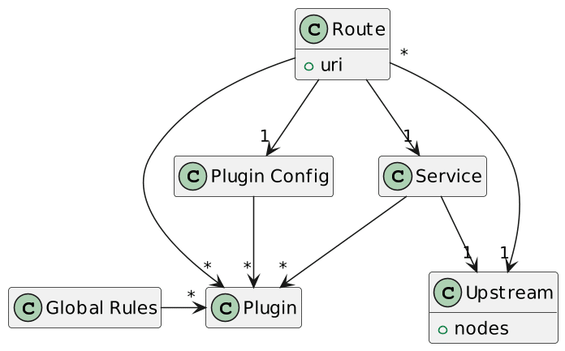
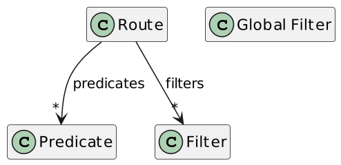
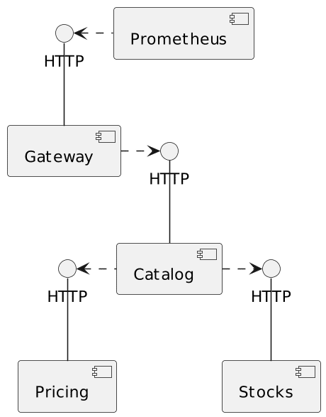

**Given the number of API Gateways available on the market, I'm regularly asked which is better. Better is a very subjective term. However, there's no denying that if you're advocating for a product, you should know your product and its competitors. In this article, I'd like to share my understanding of Spring Cloud Gateway and how it compares to Apache APISIX.**

I'm cautious when comparing products because most comparisons I read are heavily biased. That's a risk, especially when working on one of the products one is comparing. I'll also avoid "benchmarketing" - when you benchmark products in a context that favors your own; I'll focus on the so-called Developer Experience.


As a safeguard, I've asked my friend Iván López, a Spring Cloud Gateway user, to proofread the post. Iván reviewed the post as my friend, not as a VMWare developer. Despite all my best efforts, I may appear not as objective as I'd like. I accept it, and that's fine.

## First steps with Spring Cloud Gateway

All API Gateways that I know about provide a Docker image. For example, [Apache APISIX](https://hub.docker.com/r/apache/apisix) provide three flavours: Debian, CentOS, and recently, Red Hat. At this point, you can start deploying the images in your containerized architecture.

Spring Cloud Gateway's approach is radically different. It's just a regular dependency on a regular Spring project:

```xml
<dependency>
      <groupId>org.springframework.cloud</groupId>
      <artifactId>spring-cloud-starter-gateway</artifactId>
      <version>4.0.6</version>
</dependency>
```

You can leverage all standard ways to create the project, including the popular [start.spring.io](https://start.spring.io/#!type=maven-project&language=kotlin&platformVersion=3.1.0&packaging=jar&jvmVersion=17&groupId=ch.frankel.blog&artifactId=gateway&name=gateway&description=Gateway%20Demo%20project%20for%20Spring%20Boot&packageName=ch.frankel.blog.gateway&dependencies=cloud-gateway), as for any regular Spring project. This developer-oriented approach is pervasive in everything related to Spring Cloud Gateway.

## Concepts and abstractions

Apache APISIX features a rich model:



In particular, you can create an `Upstream` abstraction and share it across different routes. Likewise, `Plugin Config` allows you to create a reusable combination of plugins.

Here's the Spring Cloud Gateway model

The APISIX model is richer, with abstractions and the possibility of reuse.

## Configuration

Apache APISIX has two deployment modes (actually three, but let's not get into details): *traditional* and *standalone*.

In traditional mode, APISIX stores its configuration in [etcd](https://etcd.io/). APISIX offers a rich API to access and update the configuration, the [Admin API](https://apisix.apache.org/docs/apisix/admin-api/). In standalone mode, the configuration is just plain YAML. It's the approach for GitOps practitioners: you'd store your configuration in a Git repo, watch it via your favorite tool (*e.g.*, Argo CD or Tekton), and the latter would propagate the changes to APISIX nodes upon changes. APISIX reloads its configuration every second or so.

Here's a sample:

```yaml
upstreams:
  - id: 1
    nodes:
      "catalog:8080": 1
  - id: 2
    nodes:
      "pricing:8080": 1

routes:
  - uri: /v1/products*
    upstream_id: 1
    plugins:
      proxy-rewrite:
        regex_uri: ["/v1(.*)", "$1"]
  - uri: /prices*
    upstream_id: 2
    plugins:
      referer-restriction:
        whitelist:
          - catalog.me

global_rules:
  plugins:
    prometheus:
      prefer_name: true
```

Spring Cloud Gateway supports all configuration options of regular Spring projects, and they are [many](https://docs.spring.io/spring-boot/docs/3.1.x/reference/html/features.html#features.external-config). However, "flat" configurations, such as `.properties` file(s) and environment variables, are error-prone:

```
spring.cloud.gateway.routes[0].id=products
spring.cloud.gateway.routes[0].uri=http://catalog:8080
spring.cloud.gateway.routes[0].predicates[0]=Path=/v1/products*
spring.cloud.gateway.routes[1].id=pricing
spring.cloud.gateway.routes[1].uri=http://pricing:8080
spring.cloud.gateway.routes[1].predicates[0]=Path=/prices*
spring.cloud.gateway.routes[1].predicates[1]=Header=Referer, http://catalog.me
```

IMHO, one should stick to a hierarchical configuration, such as YAML - and remember that I'm not too fond of YAML. Here's the same configuration as above:

```yaml
spring.cloud.gateway.routes:
  - id: products
    uri: http://catalog:8080
    predicates:
      - Path=/v1/products*
    filters:
      - StripPrefix=1
  - id: pricing
    uri: http://pricing:8080
    predicates:
      - Path=/prices*
      - Header=Referer, http://catalog.me
```

I believe the YAML version leaves less space for errors, especially regarding indices.

Be warned that Spring applications don't reload their configuration by default when the latter changes. While it's possible - and indeed, a couple of options are available - it requires coding. [Here](https://www.baeldung.com/spring-reloading-properties)'s a good tutorial on how to achieve it.

As for Apache APISIX, you can also create [update and delete routes dynamically](https://cloud.spring.io/spring-cloud-gateway/reference/html/#creating-and-deleting-a-particular-route) via the `/actuator` endpoint. However, the API doesn't offer a `PATCH` method: you need to update the whole route in case of updates.

## Features comparison

Apache APISIX implements features with *plugins* , while Spring Cloud Gateway implements them with *filters*. While an exhaustive, detailed feature-by-feature comparison is beyond the scope of a single blog post, we can still get a good overview.

|            Feature            |                                                                                                                          Spring Gateway                                                                                                                           |                     Apache APISIX                      |
|-------------------------------|-------------------------------------------------------------------------------------------------------------------------------------------------------------------------------------------------------------------------------------------------------------------|--------------------------------------------------------|
| Request headers manipulation  | * `AddRequestHeader` * `AddRequestHeadersIfNotPresent` * `RemoveRequestHeader` * `SetRequestHeader` * `MapRequestHeader` * `SecureHeaders` * `FallbackHeaders` * `SetRequestHostHeader` * `PreserveHostHeader` * `AddRequestParameter` * `RemoveRequestParameter` | `proxy-rewrite`                                        |
| Path manipulation             | * `StripPrefix` * `PrefixPath` * `RewritePath` * `SetPath`                                                                                                                                                                                                        | `proxy-rewrite`                                        |
| Response headers manipulation | * `AddResponseHeader` * `DedupeResponseHeader` * `RewriteLocationResponseHeader` * `RemoveResponseHeader` * `RewriteResponseHeader` * `SetResponseHeader` * `SetStatus`                                                                                           | `response-rewrite`                                     |
| Redirection                   | `RedirectTo`                                                                                                                                                                                                                                                      | `redirect`                                             |
| JSON gRPC transcoding         | `JsonToGrpc`                                                                                                                                                                                                                                                      | `grpc-transcode`                                       |
| Body manipulation             | * `ModifyRequestBody` * `ModifyResponseBody` *Only available via code*                                                                                                                                                                                            | `response-rewrite` *Only the response can be modified* |
| Resiliency                    | * `CircuitBreaker` * `Retry`                                                                                                                                                                                                                                      | `api-breaker`                                          |
| Resiliency                    | `RequestRateLimiter` *No configuration via "shortcut" notation*                                                                                                                                                                                                   | * `limit-count` * `limit-conn` * `limit-request`       |
| Resiliency                    | -                                                                                                                                                                                                                                                                 | `fault-injection`                                      |
| Caching                       | `LocalResponseCache`                                                                                                                                                                                                                                              | `proxy-cache`                                          |

Apache APISIX and Spring Cloud Gateway offer more or less the same features set. Regarding common features, the Spring way is much more granular, with a dedicated filter for each operation. In contrast, APISIX provides a single plugin with many configuration options but for rate-limiting.

Some plugins are Spring-specific, *e.g.* , `SaveSession` - APISIX has no such integration. Conversely, APISIX provides many plugins for authentication with different third-party services, *e.g.*, KeyCloak, OpenId Connect, etc. Spring Cloud Gateway achieves it via the Spring Security dependency, a whole subject.

If a feature is unavailable out of the box, developing a custom plugin in Lua for APISIX, in a JVM language for Spring is possible.

## Observability

Observability implementations differ wildly between Spring Cloud Gateway and Apache APISIX.

The first relies on [the Actuator](https://docs.spring.io/spring-boot/docs/3.1.x/reference/html/actuator.html), which offers plenty of observability-related features. To use it in any Spring Boot project, just add the dependency:

```xml
<dependency>
    <groupId>org.springframework.boot</groupId>
    <artifactId>spring-boot-starter-actuator</artifactId>
    <version>3.1.0</version>
</dependency>
```

To serve metrics for Prometheus consumption, add the following Micrometer dependency:

```xml
<dependency>
    <groupId>io.micrometer</groupId>
    <artifactId>micrometer-registry-prometheus</artifactId>
    <version>1.11.0</version>
</dependency>
```

On the other hand, Apache APISIX uses the same plugin system for features for observability:

1. For tracing: `zipkin`, `skywalking`, and `opentelemetry`
2. For metrics: `prometheus`, `node-status`, and `datadog`
3. For logging: too many to list exhaustively, but integrates with Kafka, Elasticsearch, Splunk, Google Cloud, ClickHouse, etc.

Both products cover the three pillars of Observability and provide many integrations with third-party backends.

## Documentation

IMHO, Spring's documentation is second to none; [Spring Cloud Gateway's](https://spring.io/projects/spring-cloud-gateway#overview) is no exception. It belongs to the Spring portfolio and offers the same structure: an overview, the reference documentation (exhaustive), a get-started guide, and two sample projects organized by version.

The only reproach I have is that everything is developer-oriented. API Gateways are infrastructure components and should cater to Ops people. For example, configuration snippets should highlight YAML and only show code as a second option.

I won't comment on [Apache APISIX's documentation](https://apisix.apache.org/docs/apisix/getting-started/README/) because I know the issues too well. If you have any constructive feedback, however, I'm all ears. Please comment below.

## Usability

Usability is quite subjective, but I didn't notice significant differences in my sample demo. Here's the general design, pretending to mimic a microservices architecture.



I've slightly changed the implementation, though, to leverage the gateway. Instead of the catalog calling the pricing/stocks components, I call the gateway to forward the call. Additionally, I want to prevent external callers from accessing pricing and stocks: only the catalog should be allowed.

Many implementations of this requirement are possible. In real-world scenarios, I'd probably use a TLS-based authentication. For this demo, I chose to pass a configurable header.

Prometheus scraps the metrics of the gateway. Apache APISIX offers a dedicated port and thread, so regular routing and observing are decoupled. You can also customize the path to the endpoint. Spring Cloud Gateway uses the same port but a specific path, `/actuator`, which you can customize. You can also change the port of the **whole** actuator via the `management.server.port` property.

The project offers two branches, [apisix](https://github.com/ajavageek/apisix-spring-gateway/tree/apisix) and [spring](https://github.com/ajavageek/apisix-spring-gateway/tree/spring). To use it, check out one of the two branches.

Launch the project:

```bash
docker compose up
```

Then, test it:

```bash
curl localhost:8080/products
```

Both branches should yield the same result.

I've added a Grafana dashboard. Note that the Spring one doesn't output anything usable, but it's my fault that I could not configure it properly.

## Conclusion

Spring Cloud Gateway and Apache APISIX are two (API) Gateways offering more or less the same set of features. However, their approach is radically different.

Spring Cloud Gateway stems from the Spring framework and the Spring Boot platform and essentially focuses on developers already familiar with Spring. If you're in such a scenario, it's easy to get into as one feels right at home, with a slight warning. For performance reasons, Spring Cloud Gateway implements non-blocking I/O with Spring WebFlux, which relies Project Reactor. It will be a challenging ride if you need to code non-trivial logic using code and you're not familiar with `Mono` and `Flux`.

On the other side, while using it without prior knowledge of Spring internals is possible, it will be a massive step for non-Spring developers. It will be an even more gigantic step if they are not JVM developers and a complete leap of faith if they aren't developers at all, *i.e.*, Ops.

Apache APISIX is more suited to regular Ops profiles, providing the product in a packaging they're familiar with: Docker images and Helm charts for Kubernetes.

*Thanks [Iván López](https://twitter.com/ilopmar) for his kind review.* He also pointed out to me misconceptions I had about Spring Cloud Gateway. Muchas gracias amigo!

The complete source code for this post can be found on [GitHub](https://github.com/ajavageek/apisix-spring-gateway).

**To go further:**

* [Apache APISIX](https://apisix.apache.org/)
* [Apache APISIX reference guide](https://apisix.apache.org/docs/apisix/getting-started/README/)
* [Spring Cloud Gateway](https://spring.io/projects/spring-cloud-gateway)
* [Spring Cloud Gateway reference guide](https://docs.spring.io/spring-cloud-gateway/docs/current/reference/html/)

*Originally published at [A Java Geek](https://blog.frankel.ch/spring-cloud-gateway-apache-apisix/) on June 18^th^, 2023*
