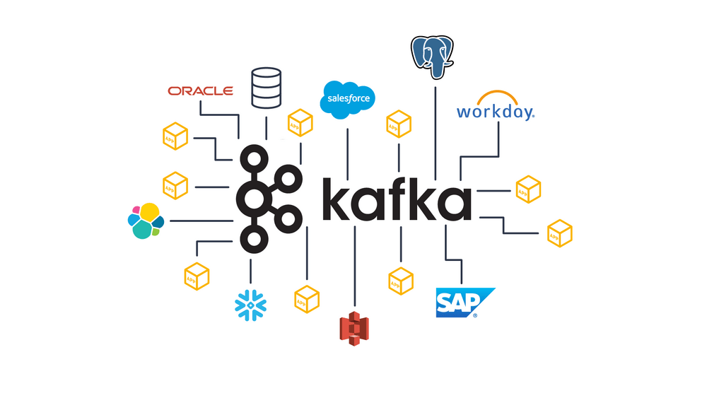
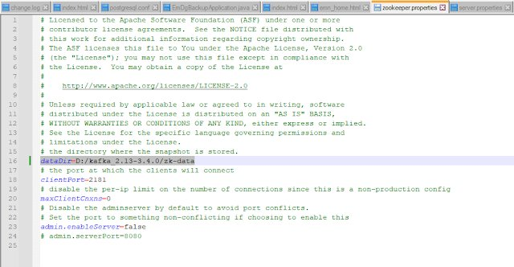
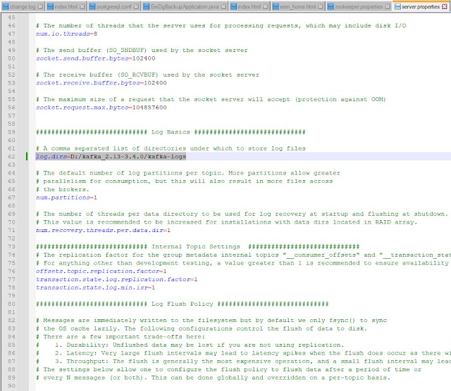
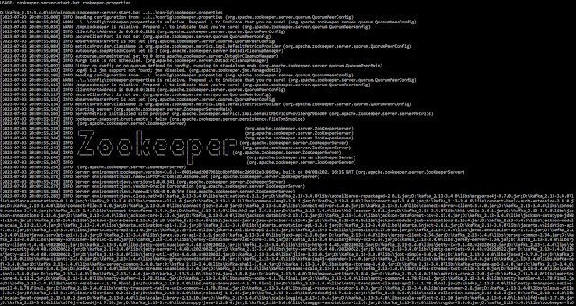
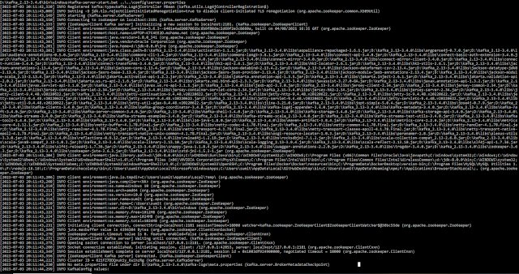
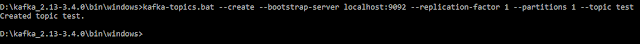
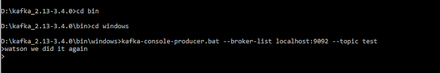
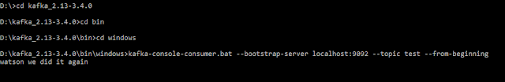

### Introduction

This is part one of a two part articles series on Running Apache Kafka Server, Configuring Kafka Topics, and Creating a Kafka Consumer and Kafka Producer.

All this is demonstrated step-by-step example that works from the Command Line.

All of this is for Apache Kafka v3.4 on Windows 10.

### Pre-Requisites

1. Install Java ( v8.0 is used in this Example )
2. Install Apache Kafka v3.4.0 from the Given Link
3. Set Java Classpath \> Set JAVA_HOME Correctly
4. UnZIP/UnTAR Apache Kafka Downloaded in (2)
5. Use a Text Editor like \[ Notepad++ \] for Editing



### Version 3.4.0

Apache Kafka Version 3.4.0 was Released on Feb 7, 2023, This article specifically is for the Kafka Version (2.13-3.4.0). For Purposes of this Article, I use {KAFKA_HOME} as the windows folder where Kafka was installed.

### Step-By-Step Guide

#### 0. Configure Zookeeper (Data Directory)

Create a folder to hold Zookeeper Data by modifying the file zookeper.properties (File is Located under {KAFKA_HOME}/config/). Create a Folder named zk-data (or as per your wish). In my case, I created this under {KAFKA_HOME}. You may then modify your properties file as show in the image below. Modify your dataDir to point to the newly created folder.



#### 0. Configure Kafka (Kafka Logs)

For the purpose of kafka logs, you can create a folder with the name kafka-logs. In my case, I created this under {KAFKA_HOME}. You may then modify your properties file as show in the image below. The property to be modified is log.dirs in server.properties that should now point to the newly created folder.



#### 1. Starting Zookeeper

First, Zookeeper has to be started using the following command.

```
zookeeper-server-start.bat ..\..\config\zookeeper.properties
```



#### 2. Starting Kafka Server

Next, we will start the Kafka Server using the following command.

```
kafka-server-start.bat ..\..\config\server.properties
```



#### 3. Creating a Test Topic

Create a Kafka Topic to test out the Kafka Installation using the following command.

```
kafka-topics.bat --create --bootstrap-server localhost:9092 --replication-factor 1 --partitions 1 --topic test
```



The above is an updated way to create topics in Kafka. In earlier versions of Kafka (Kafka v2), the suggested way to create topics was directly via Zookeeper. From v3, It has changed to create topics via Brokers.

**(Cited from StackOverflow)**

For version 2.\* you have to create the topic using zookeper with the default port 2181 as a parameter.

For the version 3.\* the zookeeper is not any more a parameter, you should use --bootstrap-server using localhost or the IP adresse of the server and the default port 9092.

[Documentation](https://kafka.apache.org/30/documentation.html#quickstart "Documentation")

#### 4. Create Kafka Producer

```
kafka-console-producer.bat --broker-list localhost:9092 --topic test
```



#### 5. Create Kafka Consumer

```
kafka-console-consumer.bat --bootstrap-server localhost:9092 --topic test --from-beginning
```



Next in this series of articles will be the demonstration of a Core Java Kafka Producer and Consumer followed by an article on Spring Boot based Kafka Integration.
