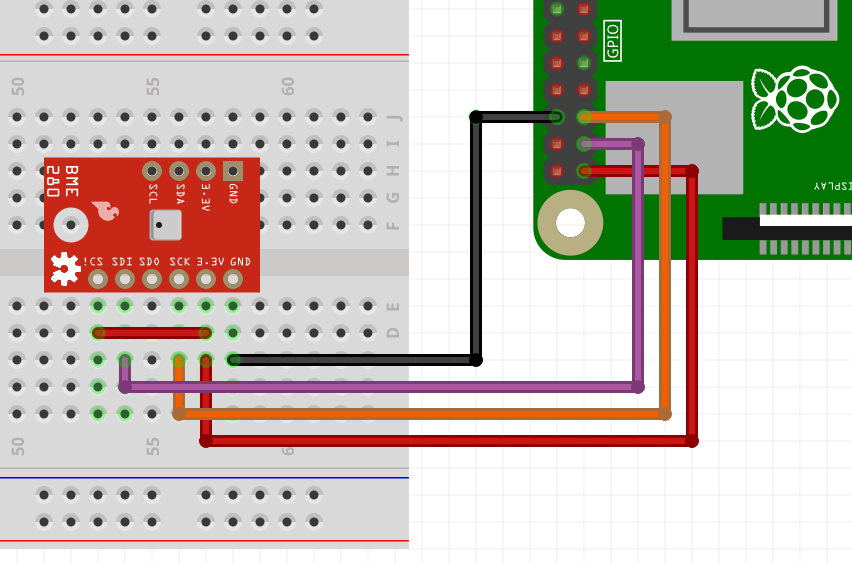
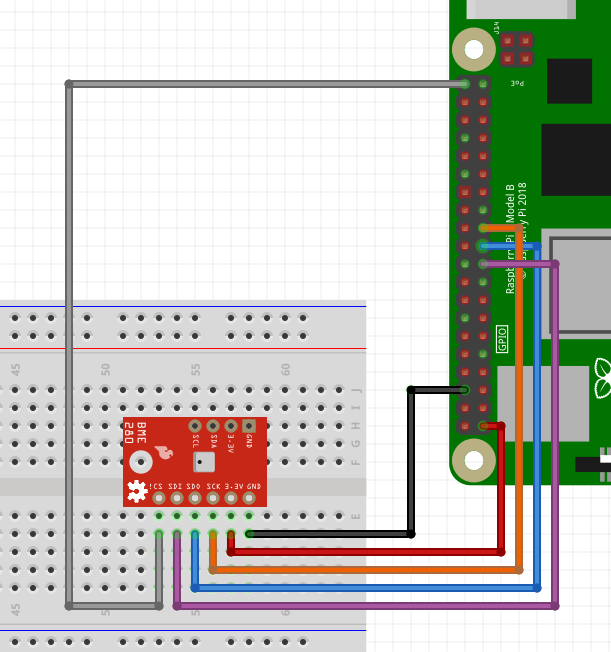

To make it as easy as possible to get started with Java on the Raspberry Pi to interact with electronic components, I started a [new section on the Pi4J website with JBang examples](https://pi4j.com/examples/jbang/).

**In this tutorial, I want to show you how you can read the temperature, humidity, and pressure from a BME280 Sensor.**

What Is Used? {#h2-0-what-is-used}
----------------------------------

As explained on the websites of each project:

### Pi4J {#h3-1-pi4j}

*A friendly object-oriented I/O API and implementation libraries for Java Programmers to access the full I/O capabilities of the Raspberry Pi platform. This project abstracts the low-level native integration and interrupt monitoring to enable Java programmers to focus on implementing their application business logic.*

All info on: [pi4j.com](https://pi4j.com/)

### JBang {#h3-2-jbang}

*Lets Students, Educators and Professional Developers create, edit and run self-contained source-only Java programs with unprecedented ease.*

All info on: [jbang.dev](https://www.jbang.dev/)

### Raspberry Pi {#h3-3-raspberry-pi}

*Computing for everybody. From industries large and small, to the kitchen table tinkerer, to the classroom coder, we make computing accessible and affordable for everybody.*

All info on: [raspberrypi.com](https://www.raspberrypi.com/)

Tutorial {#h2-4-tutorial}
-------------------------

This tutorial is also explained in this video, which is based on the [documentation provided by the Pi4J website](https://pi4j.com/examples/jbang/bme280_temperature_humidity_pressure/).



### About the BME280 {#h3-5-about-the-bme280}

The BME280 is a sensor produced by Bosch. It's very tiny, only 2,5 millimeters. The [datasheet](https://www.bosch-sensortec.com/media/boschsensortec/downloads/datasheets/bst-bme280-ds002.pdf) lists many different applications and devices for which this sensor can be used. But it's also an excellent component for experiments, as it provides both I2C and SPI interfaces.

The datasheet also contains example code on how to convert the values from the sensor to temperature, pressure, and humidity.

And to be honest, I find these pretty complex. I [tried to contact Bosch to learn more about the internals of such a sensor](https://community.bosch-sensortec.com/t5/MEMS-sensors-forum/BME280-questions-can-you-explain-this-device-from-hardware-point/m-p/79672#M15268) because I'm a software guy who doesn't understand why, for instance, the temperature is not just a single value you can read out directly.

Unfortunately, Bosch is only referring to the datasheet as it contains all the info they can provide. And they also gave a link to their [GitHub project with example code](https://github.com/boschsensortec/BME280_driver/blob/master/bme280.c#L1247), where you can find similar code as the one we saw in the datasheet.

In my example, the sensor in a version of [Adafruit](https://www.adafruit.com/product/2652) is used. It comes on a small board that can be quickly tested on a breadboard. It also exist in a version by [SparkFun where I2C and SPI connections are separated](https://www.sparkfun.com/products/13676).

### Wiring {#h3-6-wiring}

You can control the sensor both with I2C and SPI, so there are two wirings provided.

<figure class="wp-block-gallery has-nested-images columns-2 is-cropped wp-block-gallery-1 is-layout-flex wp-block-gallery-is-layout-flex">
 <figure class="wp-block-image size-large">
  
 </figure>
 <figure class="wp-block-image size-large">
  
 </figure>
</figure>

### Java Code {#h3-7-java-code}

The [full description and tutorial on the Pi4J website](https://pi4j.com/examples/jbang/bme280_temperature_humidity_pressure/) includes the code examples for both I2C and SPI.

It was inspired by the [existing work done by Tom Aarts](https://pi4j.com/examples/communityimplementation/bmp280/), one of the main contributors to the Pi4J project. He created an example in a [Maven project for the BMP280 sensor](https://github.com/Pi4J/pi4j-example-devices/tree/master/src/main/java/com/pi4j/devices/bmp280).

It's almost identical but doesn't have a humidity sensor.

Let's just look at some of the parts of the I2C example for JBang.

#### Dependencies and Imports

The file starts with a special line to instruct the system to execute it with JBang. Then the dependencies are listed in a line starting with `//DEPS`, which will be downloaded by JBang. And finally we have the normal `import` statements.

<pre class="EnlighterJSRAW" data-enlighter-language="java" data-enlighter-theme="" data-enlighter-highlight="" data-enlighter-linenumbers="" data-enlighter-lineoffset="" data-enlighter-title="" data-enlighter-group="">///usr/bin/env jbang "$0" "$@" ; exit $?

//DEPS org.slf4j:slf4j-api:1.7.35
//DEPS org.slf4j:slf4j-simple:1.7.35
//DEPS com.pi4j:pi4j-core:2.3.0
//DEPS com.pi4j:pi4j-plugin-raspberrypi:2.3.0
//DEPS com.pi4j:pi4j-plugin-linuxfs:2.3.0

import com.pi4j.Pi4J;
import com.pi4j.util.Console;
import com.pi4j.io.i2c.I2C;
import com.pi4j.io.i2c.I2CConfig;
import com.pi4j.io.i2c.I2CProvider;

import java.text.DecimalFormat;</pre>

#### Main Method

The `main` method initializes the communication with the component and reads the values ten times. This approach allows to show the difference with the SPI code, which mainly only differs in regards of this communication.

<pre class="EnlighterJSRAW" data-enlighter-language="java" data-enlighter-theme="" data-enlighter-highlight="" data-enlighter-linenumbers="" data-enlighter-lineoffset="" data-enlighter-title="" data-enlighter-group="">public static void main(String[] args) throws Exception {

    var pi4j = Pi4J.newAutoContext();

    // Initialize I2C
    I2CProvider i2CProvider = pi4j.provider("linuxfs-i2c");
    I2CConfig i2cConfig = I2C.newConfigBuilder(pi4j)
            .id("BME280")
            .bus(I2C_BUS)
            .device(I2C_ADDRESS)
            .build();

    // Read values 10 times
    try (I2C bme280 = i2CProvider.create(i2cConfig)) {
        for (int counter = 0; counter &lt; 10; counter++) {
            resetSensor(bme280);

            // The sensor needs some time to make the measurement
            Thread.sleep(300);

            getMeasurements(bme280);

            Thread.sleep(5000);
        }
    }

    pi4j.shutdown();
}</pre>

#### Reading the Temperature

Reading the values of the sensor is a "Java translation" of the code provided by Bosch in the datasheet and GitHub example project.

<pre class="EnlighterJSRAW" data-enlighter-language="java" data-enlighter-theme="" data-enlighter-highlight="" data-enlighter-linenumbers="" data-enlighter-lineoffset="" data-enlighter-title="" data-enlighter-group="">byte[] buff = new byte[6];
device.readRegister(BMP280Declares.press_msb, buff);
long adc_T =  (long)  ((buff[3] &amp; 0xFF) &lt;&lt; 12) |  (long)  ((buff[4] &amp; 0xFF) &lt;&lt; 4) |  (long) ((buff[5] &amp; 0x0F) &gt;&gt; 4);

...

DecimalFormat df = new DecimalFormat("0.###");

device.readRegister(readReg, compVal);
long dig_t1 = castOffSignInt(compVal);

device.readRegister(BMP280Declares.reg_dig_t2, compVal);
int dig_t2 = signedInt(compVal);

device.readRegister(BMP280Declares.reg_dig_t3, compVal);
int dig_t3 = signedInt(compVal);

double var1 = (((double) adc_T) / 16384.0 - ((double) dig_t1) / 1024.0) * ((double) dig_t2);
double var2 = ((((double) adc_T) / 131072.0 - ((double) dig_t1) / 8192.0) *
        (((double) adc_T) / 131072.0 - ((double) dig_t1) / 8192.0)) * ((double) dig_t3);
double t_fine = (int) (var1 + var2);
double temperature = (var1 + var2) / 5120.0;

console.println("Temperature: " + df.format(temperature) + " °C");
console.println("Temperature: " + df.format(temperature* 1.8 + 32) + " °F ");</pre>

### Running the Application {#h3-8-running-the-application}

Because JBang downloads the dependencies and compiles the code, we can execute all this with just one single Java file. This is the output of the I2C example:

<pre class="EnlighterJSRAW" data-enlighter-language="raw" data-enlighter-theme="" data-enlighter-highlight="" data-enlighter-linenumbers="" data-enlighter-lineoffset="" data-enlighter-title="" data-enlighter-group="">$ jbang Pi4JTempHumPressI2C.java

[jbang] Resolving dependencies...
[jbang]    org.slf4j:slf4j-api:1.7.35
[jbang]    org.slf4j:slf4j-simple:1.7.35
[jbang]    com.pi4j:pi4j-core:2.3.0
[jbang]    com.pi4j:pi4j-plugin-raspberrypi:2.3.0
[jbang]    com.pi4j:pi4j-plugin-pigpio:2.3.0
[jbang]    com.pi4j:pi4j-plugin-linuxfs:2.3.0
[jbang] Dependencies resolved
[jbang] Building jar...
[main] INFO com.pi4j.Pi4J - New auto context
[main] INFO com.pi4j.Pi4J - New context builder
[main] INFO com.pi4j.platform.impl.DefaultRuntimePlatforms - adding platform to managed platform map [id=raspberrypi; name=RaspberryPi Platform; priority=5; class=com.pi4j.plugin.raspberrypi.platform.RaspberryPiPlatform]
[main] INFO com.pi4j.util.Console - Initializing the sensor via I2C
[main] INFO com.pi4j.util.Console - **************************************
[main] INFO com.pi4j.util.Console - Temperature: 21.287 °C
[main] INFO com.pi4j.util.Console - Temperature: 70.316 °F 
[main] INFO com.pi4j.util.Console - Pressure: 100412.769 Pa
[main] INFO com.pi4j.util.Console - Pressure: 1.004 bar
[main] INFO com.pi4j.util.Console - Pressure: 0.991 atm
[main] INFO com.pi4j.util.Console - Humidity: 52.7 %
[main] INFO com.pi4j.util.Console - **************************************
[main] INFO com.pi4j.util.Console - Reading values, loop 2
...
[main] INFO com.pi4j.util.Console - **************************************
[main] INFO com.pi4j.util.Console - Finished</pre>

Conclusion {#h2-9-conclusion}
-----------------------------

After my earlier [JBang experiment with only a basic LED and button](https://foojay.io/today/controlling-electronics-with-jbang-on-the-raspberry-pi/), this BME280 was more challenging.

Luckily, I had the code from Tom Aarts to start from, and he added the humidity readout.

These I2C and SPI examples are great to show more complex interaction with an electronic component and Pi4J.

JBang is here to help regarding the dependencies. In my opinion, this is a much cleaner and easier way, compared to `pip install` with Python. Or is it `pip3 install`? 😉

I have a bunch of other components in my drawer waiting for more experiments, so I hope to extend this JBang-series further!

*** ** * ** ***

Read More {#h2-10-read-more}
----------------------------

* [Pi4J_V2-TemperatureSensor example code by Tom Aarts](https://github.com/Pi4J/pi4j-example-devices/blob/master/src/main/java/com/pi4j/devices/bmp280/README.md)
* [Bosch BMP280 Data Sheet](https://www.bosch-sensortec.com/media/boschsensortec/downloads/datasheets/bst-bmp280-ds001.pdf)
* [Bosch BME280 Data Sheet](https://www.bosch-sensortec.com/media/boschsensortec/downloads/datasheets/bst-bme280-ds002.pdf)
* [Bosch example code on GitHub](https://github.com/boschsensortec/BME280_driver/tree/master)
* [Product page: "Adafruit BME280 I2C or SPI Temperature Humidity Pressure Sensor - STEMMA QT"](https://www.adafruit.com/product/2652)
* [Tutorial with Arduino code: "Adafruit BME280 Humidity + Barometric Pressure + Temperature Sensor Breakout"](https://learn.adafruit.com/adafruit-bme280-humidity-barometric-pressure-temperature-sensor-breakout/pinouts)
* [Adafruit_CircuitPython_BME280 library source code](https://github.com/adafruit/Adafruit_CircuitPython_BME280/blob/main/adafruit_bme280/basic.py#L248)
