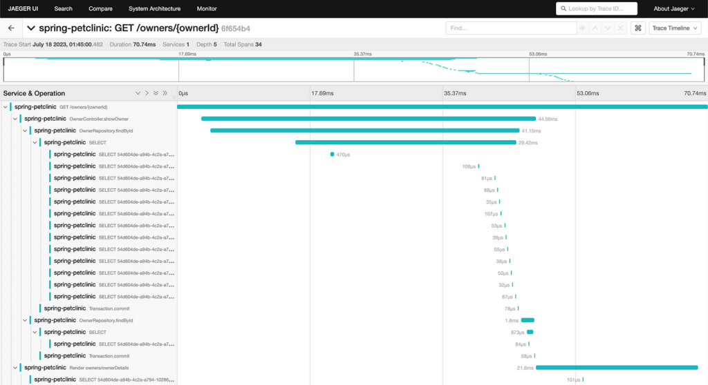
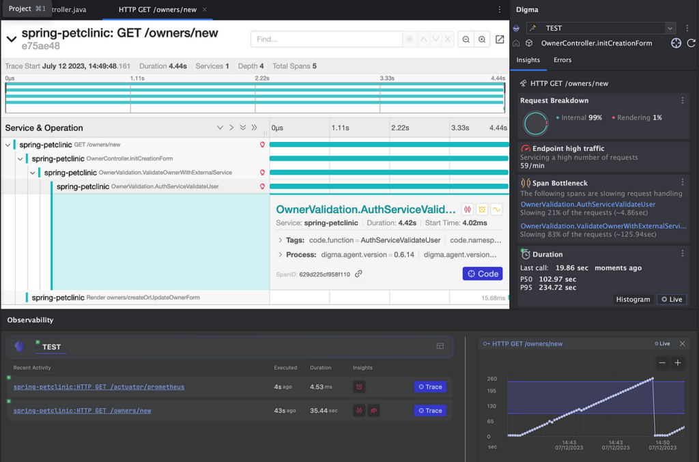
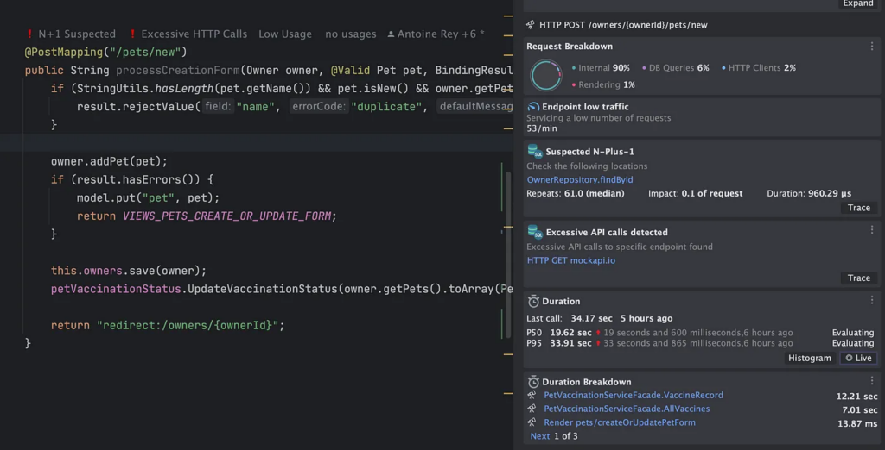

## An easy non-obtrusive way to collect data about your dockerized app without changing your existing docker-compose.yml or docker files!

This is just a neat trick that I discovered when I was trying to collect [OTEL](https://opentelemetry.io/docs/instrumentation/java/automatic/) data about my application which was running via Docker Compose. I was trying to understand more about the code using tracing. However, I definitely didn't want to modify any of the code or deployment-related artifacts, or risk checking in any changes by mistake.

Turns out, there is a simple way to collect observability data from your application running via Docker Compose *without* changing the original docker-compose.yml file. We can simply use an override file that will add the OTEL agent and set the appropriate environment variables which we can use in dev/test. Let's see how it's done:

#### 1. Download the agent and any extension you wish to use

For convenience, you can download the files into a path that is relative to the Docker Compose file location.

```bash
curl --create-dirs -O -L --output-dir ./otel https://github.com/open-telemetry/opentelemetry-java-instrumentation/releases/latest/download/opentelemetry-javaagent.jar
```

#### 2. Add a docker-compose override file

Create a file `docker-composer.override.otel.yml` which we'll use to extend the original compose file. We'll add volumes and the env. variables for configuring the agent.

Add the following code, and replace `[your-service]` below with the service you wish to instrument:

```yaml
#docker-compose.override.otel.yml
version: '3'
services:
  [your-service]:
  volumes:
      - "./otel/opentelemetry-javaagent.jar:/otel/opentelemetry-javaagent.jar"
  environment:
   - JAVA_TOOL_OPTIONS=-javaagent:/otel/opentelemetry-javaagent.jar
   - OTEL_SERVICE_NAME=[your-service]
   - DEPLOYMENT_ENV=DOCKER_LOCAL
  extra_hosts:
        - "host.docker.internal:host-gateway"
```

#### 3. Run the original docker-compose file along with the extended file we just created

```bash
docker compose -f docker-compose.yml -f docker-compose.override.otel.yml up -d
```

### WHAT CAN YOU DO WITH THE DATA?

#### Starting a development stack for observability

We can easily deploy a few containers locally to receive and visualize our observability data using only OSS tools. To make that tasks a little easier, I've created a simple development [stack](https://github.com/doppleware/developer-observability-oss) that includes the following components: a [collector](https://opentelemetry.io/docs/collector/), [Jaeger](https://www.jaegertracing.io/) for tracing, [Prometheus](https://prometheus.io/), and[Grafana OSS](https://grafana.com/oss/) for metrics.

Download and start the stack:

```bash
curl -L -O https://raw.githubusercontent.com/doppleware/developer-observability-oss/main/docker-compose.trace.yml
docker compose -f docker-compose.trace.yml up -dDownload and start the stack:
```

Start your application with the `docker-composer.override.otel.yml` file.

After running a few actions on your application, open the Jaeger interface to see the traces at [http://localhost:166868](http://localhost:16686/)



Traces provide a good means to see into the working of your app and services and understand exactly what the code is doing, without having to actively debug it.

Getting more interesting metrics might require you to enable some more settings in your Java application (depending on what framework you're running). But if you do [enable](https://mehmetozkaya.medium.com/monitor-spring-boot-custom-metrics-with-micrometer-and-prometheus-using-docker-62798123c714) them, you can browse the Grafana OSS deployment and load or create dashboards for your app.

### Using Digma for end-to-end analysis

We are writing [Digma](https://digma.ai/blog/introducing-the-digma-jetbrains-plugin/) to be an easy way to analyze dev and test observability data quickly in the IDE, without getting into more YAML configurations.

The benefit is that there are almost no requirements to start using your observability data. The one and only step is to install the Digma IntelliJ [plugin](https://plugins.jetbrains.com/plugin/19470-digma-continuous-feedback) from the marketplace. This will let you both collect data while debugging locally as well as from your Docker Compose application.

Digma's benefit is that it is used not only to collect data but also to analyze your traces and provide feedback about your code, identifying issues, code smells, regressions, bottlenecks, and more.

Similar to the previous example, we start by downloading the OTEL agent, and we'll also use the Digma OTEL extension to get additional data:

```bash
curl --create-dirs -O -L --output-dir ./otel
https://github.com/open-telemetry/opentelemetry-java-instrumentation/releases/latest/download/opentelemetry-javaagent.jar
curl --create-dirs -O -L --output-dir ./otel
https://github.com/digma-ai/otel-java-instrumentation/releases/latest/download/digma-otel-agent-extension.jar
```

We then modify our override file, adding the extension as well as an environment variable. As before, please update \[your-service\] with your application name.

```yaml
#docker-compose.override.otel.yml
version: '3'
services:
  [your-service]:
  volumes:
      - "./otel/opentelemetry-javaagent.jar:/otel/opentelemetry-javaagent.jar"
      - "./otel/digma-otel-agent-extension.jar:/otel/digma-otel-agent-extension.jar"
  environment:
   - JAVA_TOOL_OPTIONS=-javaagent:/otel/opentelemetry-javaagent.jar
   - OTEL_SERVICE_NAME=[your-service]
   - OTEL_EXPORTER_OTLP_ENDPOINT=http://localhost:5050
   - OTEL_METRICS_EXPORTER=none
   - DEPLOYMENT_ENV=DOCKER_LOCAL
  extra_hosts:
        - "host.docker.internal:host-gateway"
```

After running our application and triggering some actions, we'll be able to see the observability info in the IDE, closely integrated with your code:

The idea of Digma is to get [Continuous Feedback](https://digma.ai/blog/ci-cd-cf-the-devops-toolchains-missing-link-continuous-feedback/)between code and observability so that you're always aware of how your changes affect the application.





### Now what?

That's a great question. Getting data about your code is just the prerequisite, the important part is what to do with it --- how to transform it into something more meaningful than a science project. In a [previous](https://digma.ai/blog/coding-with-java-observability/) blog post, I wrote about this very question --- how to actually use observability data effectively to write better code. I also looked at a few code examples.

Let me know if you're using observability in your code, using these tools or different ones, and more importantly if you managed to effectively use it in dev!

Happy observing!
