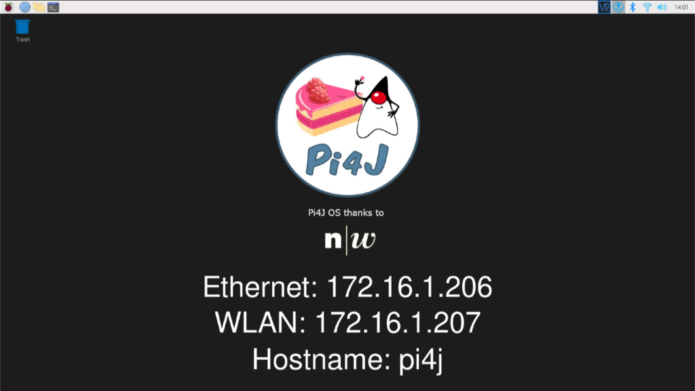
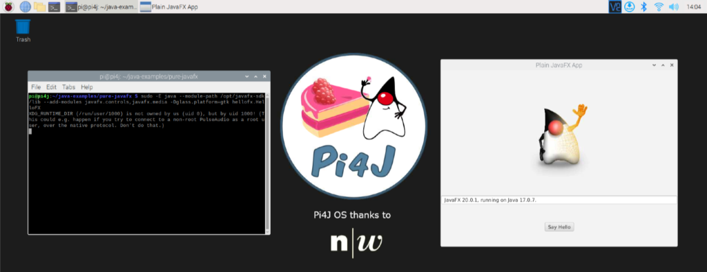
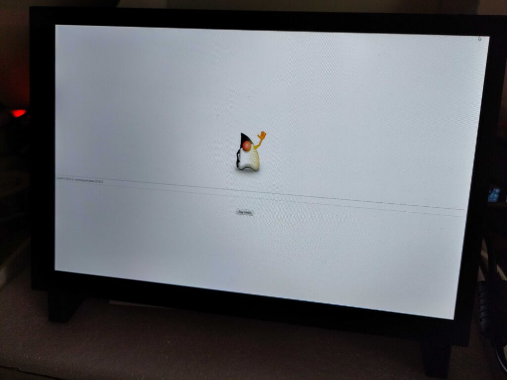

**Yes, the Raspberry Pi Operating System is awesome! But the Pi4J project made it even more awesome by adding "goodies" for Java developers! Pi4J OS is not yet another OS, but the official Raspberry Pi OS, with additional tools and preconfigurations to make it the ideal OS for any Java and JavaFX developer who wants to use a Raspberry Pi.**

The project is shared on [GitHub](https://github.com/Pi4J/pi4j-os) and documented on [the Pi4J website](https://pi4j.com/pi4j-os/). The zip-compressed archives of released versions can be downloaded from [pi4j-download.com](https://pi4j-download.com).

## Why Pi4J OS?

By using these images, you will get a lot of preconfigurations (locale, keyboard, wireless,...), pre-installations (Java, JavaFX, starter scripts), and a very useful desktop background showing the ethernet and/or WLAN address and hostname.

As the FHNW University uses this OS in different courses, and the Pi4J project provides examples for various use-cases, different "flavors" of the OS are available:

* Pi4J-Basic-OS
* Pi4J-CrowPi-OS = Pi4J-Basic-OS + support for [CrowPi](https://www.elecrow.com/crowpi-compact-raspberry-pi-educational-kit.html)
* Pi4J-Picade-OS = Pi4J-Basic-OS + support for [Picade Console](https://shop.pimoroni.com/products/picade-console) and [Picade X HAT USB-C](https://shop.pimoroni.com/products/picade-x-hat-usb-c?variant=29156918558803)

For all the info about what's included in each version, check the overview on [pi4j.com/pi4j-os](https://pi4j.com/pi4j-os/).

<figure class="wp-block-gallery has-nested-images columns-default is-cropped wp-block-gallery-1 is-layout-flex wp-block-gallery-is-layout-flex">
 <figure class="wp-block-image size-large">
  
 </figure>
 <figure class="wp-block-image size-large">
  
 </figure>
 <figure class="wp-block-image size-large">
  
 </figure>
</figure>

## History of the project

This project was originally started by [Pascal Mathis](https://www.linkedin.com/in/ppmathis/) as a student at the [FHNW University in Switzerland](https://www.fhnw.ch), while working on a project to control all the electronic components in an [Elecrow CrowPi](https://www.elecrow.com/steam-education/crowpi.html) with Java code.

[Dieter Holz](https://www.linkedin.com/in/dieter-holz-24761524/), Lecturer for Object-Oriented-Programming and UI Engineering at FHNW, further expanded the Pi4J OS in the different "flavors" to offer the ideal setup for his students.
>  
>
> Our students (1st and 2nd semester) should be able to focus on learning programming, especially in Java). Without the Pi4J OS images, they would have to learn a lot about Linux configuration, installation utilities, remote deployment, Maven, etc before they could start with their projects. All of these topics they need to learn later during their studies, but it's overwhelming if you need to know it from the very first day.  
>
> Setting up a complete image is really time consuming, even if you know the bits and pieces already. At FHNW we start with CrowPi. The SD-card with Pi4J-CrowPi-Image is already plugged in. Students can start with their Pi4J-experiments "immediately", even without typical hardware problems like connecting a LED.  
>
> In a second phase, we use the Pi4J-Basic-OS, and the first hardware-connection experiments are added.  
>
> In the third phase, using our [JavaFX-template-project](https://github.com/Pi4J/pi4j-template-javafx), they start with their "real" project. If they want to build a [FXGL game](http://almasb.github.io/FXGL/), the Picade-Image is used. The main advantage here is, that ENTER-, cursor-, and ESC-keys are mapped on OS-Level. This is necessary to get the default FXGL-behaviour for the main-menu.

## Conclusion

Pi4J is an ideal way to introduce the Java language into experiments with electronic components. And Pi4J OS makes this even easier for students and everyone interested in [#JavaOnRaspberryPi](https://foojay.social/tags/JavaOnRaspberryPi).
