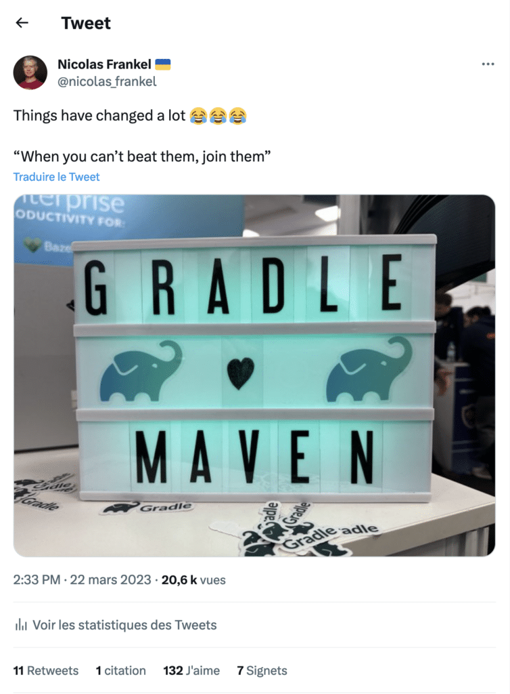

**I tweet technical content that I consider interesting, but the funny tweets are the ones that get the most engagement.**

I attended the JavaLand conference in March, stumbled upon the Gradle booth, and found this gem:

Of course, at some point, a fanboy hijacked the thread and claimed the so-called superiority of Gradle. In this post, I'd like to shed some light on my stance, so I can direct people to it instead of debunking the same "reasoning" repeatedly.

To manage this, I need to get back in time. Software development is a fast-changing field, and much of our understanding is based on personal experience. So here's mine.

My first build tool: Ant {#h2-0-my-first-build-tool-ant}
--------------------------------------------------------

 

I started developing in Java in 2002. At the time, there were no build tools: we compiled and built through the IDE. For the record, I first used Visual Age for Java; then, I moved to Borland JBuilder.

Building with an IDE has a huge issue: each developer has dedicated settings, so artifact generation depends on the developer-machine combination.

Non-repeatable builds are an age-old problem. My first experience with repeatable builds is Apache Ant:
> Apache Ant is a Java library and command-line tool whose mission is to drive processes described in build files as targets and extension points dependent upon each other. The main known usage of Ant is the build of Java applications. Ant supplies a number of built-in tasks allowing to compile, assemble, test and run Java applications. Ant can also be used effectively to build non Java applications, for instance C or C++ applications. More generally, Ant can be used to pilot any type of process which can be described in terms of targets and tasks.
>
> -- <https://ant.apache.org/>

Ant is based on three main abstractions:

* A *task* is an atomic unit of work, *e.g.* , `javac`to compile Java files, `war` to assemble a Web Archive, etc. Ant provides lots of tasks out-of-the-box but allows adding custom ones.
* A *target* is a list of tasks
* You can define dependencies between tasks, such as *package* depending on *compile*. In this regard, you can see Ant as a workflow execution engine.

I soon became "fluent" in Ant. As a consultant, I went from company to company, project to project. Initially, I mostly set up Ant, but Ant became more widespread as time passed, and I encountered existing Ant setups. I was consistent in my projects, but other projects were very different from each other.

Every time, when arriving at a new project, you had to carefully read the Ant setup to understand the custom build. Moreover, each project's structure was different. Some put their sources in `src`, some in `sources`, some in a nested structure, etc.

I remember once a generic build file that tried accommodating the whole of an organization's project needs. It defined over 80 targets in over 2,000 lines of XML. It took me a non-trivial amount of time to understand how to use it with help and even more time to be able to tweak it without breaking projects.

My second build tool: Maven {#h2-1-my-second-build-tool-maven}
--------------------------------------------------------------

 

The above project got me thinking a lot. I wanted to improve the situation as the maintainers had already pushed Ant's limits. At the time, I was working with my friend [Freddy Mallet](https://twitter.com/FreddyMallet) (of Sonar fame). We talked, and he pointed me to Maven. I had once built a project with Maven but had no other prior experience. I studied the documentation for hours, and through trial-and-error attempts, under the tutelage of Freddy, migrated the whole Ant build file to a simple parent POM.

In Ant, you'd need to define everything in each project. For example, Ant requires configuring the Java files location for compilation; Maven assumes they are under `src/main/java`, though it's possible to override it. Maven did revolutionize the Java build field with its **Convention over Configuration** approach. Nowadays, lots of software offer sensible configuration by default.

For developers who go from project to project, as I did, it means there's much less cognitive load when joining a new project. I expect Java sources to be located under `src/main/java`. Maven conventions continue beyond the project's structure. They also define the project's lifecycle, from compilation to uploading the artifact in a remote registry, via unit and integration testing.

Finally, junior developers tend to be oblivious about it, but Maven defined the term *dependency management*. It introduced the idea of artifact registries, where one can download immutable dependencies from and push artifacts to. Before that time, each project had to store dependencies in its dedicated repository.

For the record, there were a couple of stored dependencies on the abovementioned project. When I migrated from Ant to Maven, I had to find the exact dependency version. For most, it was straightforward, as it was in the filename or the JAR's manifest. One, however, had been updated with additional classes. So much for immutability.

Maven had a profound influence on all later build tools: they defined themselves in reference to Maven.

No build tool of mine: Gradle {#h2-2-no-build-tool-of-mine-gradle}
------------------------------------------------------------------

 

Gradle's primary claim was to fix Maven's shortcomings, or at least what it perceived as such. While Maven is not exempt from reproach, Gradle assumed the most significant issue was its lack of flexibility. It's a surprising assumption because that was precisely what Maven improved over Ant. Maven projects have similar structures and use the same lifecycle: the [principle of least surprise](https://en.wikipedia.org/wiki/Principle_of_least_astonishment) in effect. Conversely, Gradle allows customizing nearly every build aspect, including the lifecycle.

Before going to confront the flexibility argument, let me acknowledge two great original Gradle features that Maven implemented afterward: the Gradle daemon and the Gradle wrapper.

Maven and Gradle are both Java applications that run on the JVM. Starting a JVM is expensive in terms of time and resources. The benefit is that long-running JVM will optimize the JIT-ed code over time. For short-term tasks, the benefit is zero and even harmful if you take the JVM startup time into account. Gradle came up with the Gradle daemon. When you run Gradle, it will look for a running daemon. If not, it will start a new one. The command-line app will delegate everything to the daemon. As its name implies, the daemon doesn't stop when the command line has finished. The daemon leverages the benefits of the JVM.

Chances are that your application will outlive your current build tools. What happens when you need to fix a bug five years from now, only to notice that the project's build tool isn't available online? The idea behind Gradle's wrapper is to keep the exact Gradle version along with the project and just enough code to download the full version over the Internet. As a side-effect, developers don't need to install Gradle locally; all use the same version, avoiding any discrepancy.

Debunking Gradle's flexibility {#h2-3-debunking-gradle-s-flexibility}
---------------------------------------------------------------------

Gradle brought the two above great features that Maven integrated, proving that competition is good. Despite this, I still find no benefit of Gradle.

I'll try to push the emotional side away. At its beginning, Gradle marketing tried to put down Maven on every possible occasion, published crazy comparison charts, and generally was **very** aggressive in its communication. Let's say this phase lasted far more than would be acceptable for a young company trying to find its place in the market. You could say that Gradle was very Oedipian in its approach: trying to kill its Maven "father". Finally, after all those years, it seems it has wised up and now "loves Maven".

Remember that before Maven took over, every Ant project was ad hoc. Maven did put an end to that. It brought law to the World Wild West of custom projects. You can disagree with the law, but it's the law anyway, and everybody needs to stand by it. Maven standards are so entrenched that even though it's possible to override some parameters, *e.g.*, source location, nobody ever does it.

I did experience two symptoms of Gradle's flexibility. I suspect far more exist.

### Custom lifecycle phases {#h3-4-custom-lifecycle-phases}

Maven manages integration testing in four phases, run in order:

1. `pre-integration-test`: set up anything the tests need
2. `integration-test`: execute the tests
3. `post-integration-test`: clean up the resources, if any
4. `verify`: act upon the results of the tests

I never used the pre- and post-phases, as each test had a dedicated setup and teardown logic.

On the other side, **Gradle has no notion of integration tests** whatsoever. Yet, Gradle fanboys will happily explain that you can add the phases you want. Indeed, Gradle allows lifecycle "customization": you can add as many extra phases into the regular lifecycle as you want.

It's a mess, for each project will need to come up with both the number of phases required and their name: `integration-test`, `integration-tests`, `integration-testing`, `it` (for the lazy), etc. The options are endless.

### The snowflake syndrome {#h3-5-the-snowflake-syndrome}

Maven treats every project as a regular standard project. And if you have specific needs, it's possible to write a plugin for that. Writing a Maven plugin is definitely not fun; hence, you only write one when it's necessary, not just because you have decided that the law doesn't apply to you.

Gradle claims that lack of flexibility is an issue; hence, it wants to fix it. I stand by the opposite: lack of flexibility for my build tool is a feature, not a bug. Gradle makes it easy to hack the build. Hence, anybody who thinks their project is a special snowflake and deserves customization will happily do so. Reality check: it's rarely the case; when it is, it's for frameworks, not regular projects. Gradle proponents say that it still offers standards while allowing easy configuration. The heart of the matter is that it's not a standard if it can be changed at anybody's whim.

Gradle is the *de facto* build tool for Android projects. In one of the companies I worked for, somebody wrote custom Groovy code in the Gradle build to run Sonar and send the metrics to the internal Sonar instance. There was no out-of-the-box Sonar plugin at the time, or I assume it didn't cut it. So far, so good.

When another team created the company's second Android project, they copy-pasted the first project's structure and the build file. The intelligent thing to do would have been, at this time to make an internal Gradle plugin out of the Sonar-specific code. But they didn't do it because Gradle made it so easy to hack the build. And I, the Gradle-hater, took it upon myself to create the plugin. It could have been a better developer experience, to say the least. Lacking quality documentation and using an untyped language (Groovy), I used the console to print out the objects' structure to progress.

Conclusion {#h2-6-conclusion}
-----------------------------

Competition is good, and Gradle has brought new ideas that Maven integrated, the wrapper and the daemon. However, Gradle is built on the premise that flexibility is good, while my experience has shown me the opposite. Ant was very flexible, and the cognitive load to go from one project to the next was high.

We, developers, are human beings: we like to think our projects are different from others. Most of the time, they are not. Customization is only a way to satisfy our ego. Flexible build tools allow us to implement such customization, whether warranted or not.

Irrelevant customizations bring no benefit and are easy to develop but expensive to maintain. If managing software assets is part of my responsibilities, I'll always choose stability over flexibility for my build tool.

*** ** * ** ***

*Originally published at [A Java Geek](https://blog.frankel.ch/final-take-gradle/) on August 6^th^, 2023*
