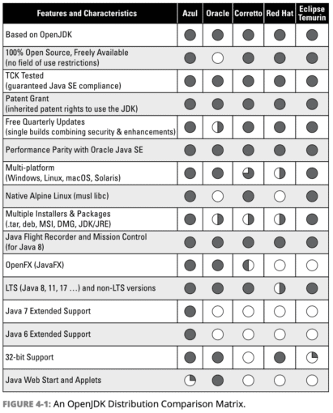

**I don't know anyone who is still using the Oracle JDK. It has been my recommendation for quite a while to just switch to an OpenJDK distribution as they are roughly drop-in replacements for Oracle's official JDK. I've repeated that advice quite frequently but I guess I glossed over a lot of details that might be insignificant for hackers but can become a pretty big deal in an enterprise setting.**

Following the [review from Bazlur](https://foojay.io/today/book-review-openjdk-migration-for-dummies/) I chose to also pick up [Simon Ritter's](https://www.linkedin.com/in/siritter/) "[OpenJDK Migration for Dummies](https://www.azul.com/openjdk-migration-for-dummies/)". This book has two things going against it:

* For dummies - I've never read one of these before and never considered reading those. While it does use overly simplified language I think the Dummies brand hurts this book. The subject matter is sophisticated and geared towards developers (and DevOps) who can follow the nuances. I think it might deter some developers from reading it, which is a shame.
* It's a corporate book - Simon is the Deputy CTO at Azul. This creates the justified concern that the book is a promotion for Azul products. It has those. But having read through it, the material seems objective and valuable.  
  It does give one advantage: we're getting the book for free.

Unique Analysis
---------------

There are many Java books but this is the first time I read a book that explains these specific subjects. The first chapter discusses licensing, TCK (Test Compatibility Kit) and similar issues. I'm familiar with all of them since I worked for Sun Microsystems and Oracle, I had a team composing TCKs for the mobile platform at Sun Microsystems. However, even experienced engineers outside of Sun might be unfamiliar with these tests.
> The TCK is how we verify that our port of OpenJDK is still compatible with Java. The book illustrates why a reputable OpenJDK distribution can be trusted due to the TCK. This is knowledge that's probably not available elsewhere if you aren't deeply involved in the JVM.

Simon explained nicely the scope of the current TCK (139k tests for Java 11), but I think he missed one important aspect: TCK isn't enforced. Oracle doesn't know you ran the TCK "properly", it can't verify that. This is why OpenJDK vendors must have a good reputation and understanding of the underlying QA process.

This is just the beginning but pretty much every chapter covered material that I haven't seen in other books.

As a side note, the whole TCK creation process is pretty insane. The engineers in my team would go over the JavaDoc like religious scholars and fill up Excel sheets with every statement made by the JavaDoc or implied by the Javadoc.

Then devise tests to verify in isolation that every statement is indeed true. In that sense, TCK doesn't test quality. It tests compliance to a uniform, consistent standard. A JDK can fail after running for a week and we might not be able to tell from running the TCK alone, early releases of JDK 8 did exactly that at that time...

Learning from a For Dummies Book
--------------------------------

I mentioned at the top of this post that I treat the OpenJDK migration casually as a drop-in replacement. This book convinced me that this is not always the case, there are some nuances. I was casually aware of most of them, e.g., I worked a lot with Pisces back in the day, but I never saw all of these nuances in a single place.

This is an important list for anyone considering a migration of this type. One should comb over these and verify the risks before embarking on such a migration. As a startup, you might not care about exact fonts or NTLM support, but in an enterprise environment, there are still projects that might rely on that.
> In a later chapter comparing the various OpenJDK distributions, Simon includes a great chart illustrating the differences. Take into consideration that Simon works for Azul and it is obvious in the chart. Still, the content of the chart is pretty accurate.

I am missing the Microsoft VM in the comparison but I guess it's a bit too new to be registered as a major vendor.

Business Related Aspects
------------------------

I did consulting work for major organizations quite often; such as banks, insurance companies etc. In these organizations commercial support is crucial. I used to scoff at that notion but as I ran into some of the edge cases those organizations run into, I get it. We had a senior engineer from IBM debug AIX and Websphere issues.

Similarly, a bank I worked with was having issues with RTL support in newer versions of Swing. As the older JDKs were nearing the end of their life cycle they were forced to migrate but had no way of addressing these issues. Oracle's support for those issues was a dud in that case. Commercial support for the JVM isn't something I ever needed or wanted to buy, but I understand the motivation.
> At the end of the book, Simon goes into more detail on the extra value that can be layered on top of an OpenJDK distribution. This was interesting to me as I often don't understand the "it's free" business model. It helped me both in understanding the motivation for offering (and maintaining) an OpenJDK release. It's also valuable when I work with larger organizations, I can advise better on the value they can deliver for Java (e.g. fast response to zero-days, etc).

Who Should Read This Book?
--------------------------

> It's not a book for everyone. However, if you're using the Oracle JDK then you need to pick this up and review it. Make sure the reasons you picked Oracle JDK are still valid, they probably aren't. If your job includes picking the JDKs for provisioning or development then you should make sure you're familiar with the materials in the book.

If you're just learning Java or using it in a hobbyist capacity then there's an appendix on Java's history that might be interesting to you. But the book as a whole is probably more targeted at developers who are handling production. In that regard, it's useful both for server and desktop developers.

[Get the book (for free) here.](https://www.azul.com/openjdk-migration-for-dummies/) BTW if you or someone you know is interested in learning Java please check out [my new book for learning Java](https://www.amazon.com/Java-Basics-Practical-Introduction-Full-Stack-ebook/dp/B0CCPGZ8W1/).
