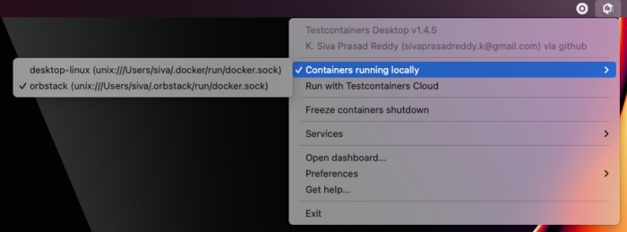
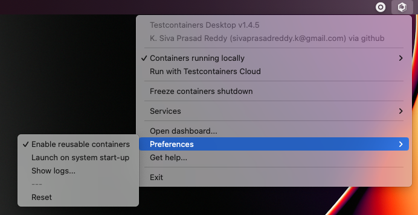

**Being able to release new features quickly is a must-have capability in today's competitive world. In order to release your software quickly and often you should have CI/CD infrastructure that can automatically build, test, and release our software with minimal to no human intervention. A comprehensive automated test suite is the key to release your software with confidence.**

[Testcontainers](https://testcontainers.com) libraries help you to write integration tests using the real dependencies with the ease of writing unit tests. Let us take a quick look at how Testcontainers enables you to write tests that give confidence in your software.

While writing integration tests you should test with the same type of real dependencies instead of using mocks or in-memory variations of those services.

## Why should you test with real dependencies?

Let's assume you are building a software product that uses PostgreSQL database, Kafka message broker, ElasticSearch for search capabilities, etc.

While writing tests for Repositories that talk to the database, you may think of using an in-memory database such as HSQL or H2. But, this is not ideal and here is why.

### False negatives:

There are cases where your embedded solution will not have the full capabilities of the real service, and you won't be able to use those in code and test the functionality. For example, you are using the following native SQL query which works fine with PostgreSQL but not with H2:

```sql
INSERT INTO products(code, name, price)
VALUES (?, ?, ?) ON CONFLICT DO NOTHING;
```

When you test this query with the H2 database, by default this syntax is not supported and will throw an error. You can try to run H2 with PostgreSQL compatibility mode and get it working. But, not all the PostgreSQL features are supported by H2 and every time you are writing a query you need to verify that it works with both H2 and PostgreSQL as well. This is an unnecessary effort and leads to low productivity.

### False positives:

What is even worse, sometimes you may write a query that works fine with H2 but not with PostgreSQL. This is way worse because your tests will pass and you will deploy the application and it breaks only when you start using it.

```sql
UPDATE products
SET name = ?, updated_at = CURRENT_TIMESTAMP()
where code = ?
```

Both of the above mentioned problems can be resolved if you test with the same type of database (ex: PostgreSQL) that you would be using in production.

You can find the sample code for this article in this [GitHub repository](https://github.com/AtomicJar/testcontainers-desktop-demo).

In a Spring Boot application, you can test a Spring Data Repository using PostgreSQL database with Testcontainers for Java very easily as follows:

```java
@DataJpaTest(properties = {
   "spring.test.database.replace=none",
   "spring.datasource.url=jdbc:tc:postgresql:15.2-alpine:///db"
})
class ProductRepositoryTest {

   @Autowired
   ProductRepository repository;

   @Test
   void shouldCreateProductIfNotExist() {
       String code = UUID.randomUUID().toString();
       Product product = new Product(null, code, "test product", BigDecimal.TEN);
       repository.upsert(product);
   }
}
```

By configuring the special Testcontainers JDBC URL, the Testcontainers library will spin up a PostgreSQL container using postgres-15.2-alpine image and execute your tests.  

Testcontainers provides support for a wide range of SQL and NoSQL databases with easy to use modules. To view all the modules available, please take a look at the [Testcontainers Modules Catalog](https://testcontainers.com/modules/).

## Local Development with Testcontainers

[Spring Boot 3.1.0 introduced excellent support for Testcontainers](https://www.atomicjar.com/2023/05/spring-boot-3-1-0-testcontainers-for-testing-and-local-development/) that not only simplifies writing tests but also helps in running the application locally during the development time. Now you can start the application dependencies such as databases, message brokers, etc as Docker containers using Testcontainers and run the application.

```java
@TestConfiguration(proxyBeanMethods = false)
public class TestApplication {

     @Bean
     @ServiceConnection
     PostgreSQLContainer<?> postgresContainer() {
        return new  PostgreSQLContainer<>( DockerImageName.parse("postgres:latest"));
     }

    public static void main(String[] args) {
          SpringApplication
                .from(Application::main)
                .with(TestApplication.class)
                .run(args);
     }
}
```

## Getting Started with Testcontainers Desktop

[AtomicJar](https://www.atomicjar.com/) just introduced [Testcontainers Desktop](https://testcontainers.com/desktop/) which is a free companion app for the Testcontainers libraries that makes local development and testing with real dependencies easier.

Let's explore various features of Testcontainers Desktop and how it helps while running and debugging your application locally.

### Switching container runtimes

Testcontainers Desktop will automatically detect your locally installed Docker runtime(s) and is configured to use it. You can choose which Docker runtime to use by the Testcontainers libraries by selecting from the menu options as shown below:



You can also create your free [Testcontainers Cloud](https://testcontainers.com/cloud/) account and choose to save local resources by running your containers in the cloud instead of running them on your computer.

### Using fixed ports to connect to the development services

As mentioned in the earlier section, you can use Testcontainers for local development as well. Typically during the development, you may want to connect to the application dependencies such as databases, and message brokers using client tools and verify the data.

Testcontainers by default map the container's port to a random available port onto the host machine so that there won't be any port conflicts. It would be tedious to always check for which random port is assigned on the host for a container and connect to it.

Testcontainers Desktop makes it easy to use fixed ports for the container services so that you can always connect to those services using the same configured fixed port.

Let's assume we are using the PostgreSQL database in our Spring Boot application as configured in **TestApplication.java** mentioned in the previous section. We can start the application by running **TestApplication.java** from your IDE.

We can use the Testcontainers Desktop fixed port support to connect to the PostgreSQL database running as a Docker container.

Click on **Testcontainers Desktop** -\> select **Services** -\> **Open config location**.

In the opened directory there would be a **postgres.toml.example** file. Rename it to **postgres.toml** file and it should contain the following configuration:

```
ports = [
    {local-port = 5432, container-port = 5432},
]
selector.image-names = ["postgres"]
```

We can configure the image selector by listing all the supported Docker image name(s). You can configure any PostgreSQL compatible images. We are mapping the PostgreSQL container's port 5432 onto the host's port 5432.

Now you should be able to connect to the PostgreSQL database running as a Docker container from the command line using the following command:

```bash
$ psql -h localhost -p 5432 -U test -d test
```

The ability to use fixed ports and connect to those services is very helpful during the development time without trading off the dynamic configuration Testcontainers provide or the ability to run your tests in parallel.

### Reusable containers to speed up the development

During the development, you would like to quickly change the code and verify the behavior either by running the tests or running the application locally. But, recreating the containers for every code change may slow down your feedback cycle. One technique that you can apply to speed up testing and local development is using the [reusable containers](https://java.testcontainers.org/features/reuse/) feature.

Since you are using the **Testcontainers Desktop** , the `testcontainers.reuse.enable` flag is set automatically for your dev environment. You can enable or disable it by clicking on **Enable reusable containers** option under **Preference**s.



When the reuse feature is enabled, you only need to configure which containers should be reused using the Testcontainers API. While using **Testcontainers for Java** you can achieve this using `.withReuse(true)` as follows:

```java
PostgreSQLContainer<?> postgresContainer() {
   return new PostgreSQLContainer<>("postgres:15.2-alpine")
           .withReuse(true);
}
```

When you spin up a container with reuse, a hash is calculated based on the container's configuration. When you request another container with the same configuration which yields the same hash value, then the existing container will be reused instead of creating a new container.

Now if you run the test and then execute `docker ps` command you can see the Postgres container still running. If you run the same test or any other test using a Postgres container with the same specification then the existing container will be reused.

Please note that, as an experimental capability, the implementation of reusable containers currently differs across Testcontainers libraries. See the [release note](https://newsletter.testcontainers.com/announcements/enable-reusable-containers-with-a-single-click) for the main limitations.

## Summary

Testcontainers libraries help you not only for testing your application with real dependencies but also to speed up and simplify local development. Various features of the free Testcontainers Desktop app greatly simplify running and debugging your application and Testcontainers based tests right from your IDE.

You can download Testcontainers Desktop from <https://testcontainers.com/desktop/> and to get started with it, follow the instructions in this [official guide](https://testcontainers.com/guides/simple-local-development-with-testcontainers-desktop/).
