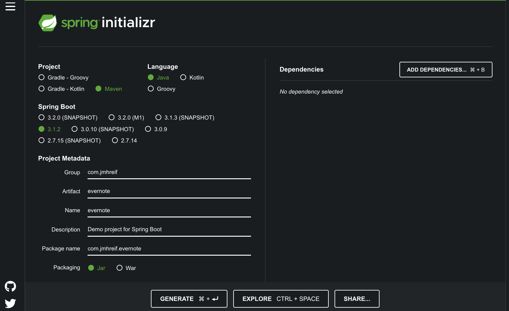

I recently started work on a joint project with my colleague, [Jason Koo](https://twitter.com/jalakoo). For this project, we want to import data from second brain apps (such as Obsidian, Notion, Evernote, etc) to Neo4j.

Since I use Evernote, I was tasked with getting my notes out of Evernote.

In this article, I will show you how to use the Evernote API and SDK in a Spring Boot application to retrieve data from Evernote.

## Starting steps

I knew nothing about what Evernote provided for developers, so I started by reading the [Evernote for Developers](https://dev.evernote.com/doc/) documentation. Evernote does seem to have some user experience bugs. Searching for answers to my questions also surfaced user frustration with missing or unreliable features. In my experience so far, things have been ok for what I need. I feel that many data APIs do not provide the best developer experience in one way or another, so I wasn't surprised by this.

To start, I created an account on [Evernote's development server](https://sandbox.evernote.com/Registration.action) in order to test the API. Unfortunately, there doesn't seem to be a way to import production-environment notes into the sandbox, so after I created a sandbox account, I manually copied/pasted the text from a few of my notes. Next, I needed to request an API key. This is just for the development environment, so you have to request a production version when testing is completed. Once your development API key request is approved, you get an API key that you can use to access the data. We also need to request a [developer token](https://dev.evernote.com/doc/articles/dev_tokens.php) to authenticate with the Evernote API.

Then, we need to utilize a provided SDK for our preferred language to call the API and retrieve the data. Since I am a Java developer, we will use the [Java SDK](https://github.com/evernote/evernote-sdk-java) in this article. The SDK is a Github project that includes a couple of code examples, which was a good start. I would need to make a few tweaks to the sample code, though.

First, I wanted to make use of the Maven dependency to access the functionality in the SDK. I also wanted to use Spring Boot instead of the vanilla Java code. Lastly, in a future piece of this project, I will want to use the [Spring Data Neo4j](https://spring.io/projects/spring-data-neo4j) library to import the data to Neo4j. Let's start with bringing the code over to Spring Boot. The final code for this article is available in a [Github repository](https://github.com/JMHReif/evernote-api-app).

## Spring Boot application

The starting place for all of my Spring Boot applications is the [Spring Initializr](https://start.spring.io/). I only changed a couple of description fields and didn't add any dependencies yet, as I'll only need one dependency added manually for now.



After downloading the project, I opened it in my IDE and added the Evernote dependency to the `pom.xml` file.

```xml
<dependency>
    <groupId>com.evernote</groupId>
    <artifactId>evernote-api</artifactId>
    <version>1.25.1</version>
</dependency>
```

Evernote's Java SDK provides a couple of sample code classes, and the [EDAMDemo one](https://github.com/Evernote/evernote-sdk-java/blob/master/sample/client/EDAMDemo.java) was pretty similar to what I was looking for. My initial approach for merging the sample Java code with Spring Boot was to copy/paste the entire `EDAMDemo.java` class into a new class file in the project folder, and then start tweaking broken imports and other issues. However, I quickly realized that this approach was extremely error-prone. Because of the large code blocks, I had trouble running the demo's main method with Spring Boot's `main()`. I also had issues passing the developer token around (should I put it in the Spring Boot main class or this demo class?). I needed to approach this with a different tactic.

After venting about it a bit to [Mark Heckler](https://github.com/mkheck), he reminded me to start super simple and build up. One example he gave was to move the developer token string to the properties file and just return that. So, I cleared out all the copied code and placed the developer token in the `application.properties` file as shown below.

```
AUTH_TOKEN=<your developer token here>
```

Next, I created a new class called `EvernoteDemo` annotated as a component and implemented the `CommandLineRunner` interface, so that this class will load on startup.

```java
@Component
public class EvernoteDemo implements CommandLineRunner {
    @Value("${AUTH_TOKEN}")
    private String token;

    @Override
    public void run(String... args) throws Exception {
        System.out.println("Developer token: " + token);
    }
}
```

When you implement the `CommandLineRunner` interface, you need to implement the `run()` method. Once that outline was there, I added [Spring's `@Value` annotation](https://www.baeldung.com/spring-value-annotation) outside the method to pull in the `AUTH_TOKEN` from the properties file into a variable `token`, so we can use it to access the API. Inside the `run()` method, I printed out the developer token to make sure it was being read from the properties file. I ran the application and saw the token string printed out in the console, so I knew I was on the right track.

Now I could slowly add in pieces of the sample code from the Github project.

## Incorporate Evernote SDK Example Code

First, I copied in the [`main()` method from the sample code](https://github.com/Evernote/evernote-sdk-java/blob/master/sample/client/EDAMDemo.java#L64) to my `EvernoteDemo` class's `run()` method.

```java
@Override
public void run(String... args) throws Exception {
    if ("your developer token".equals(token)) {
        System.err.println("Please fill in your developer token");
        System.err
                .println("To get a developer token, go to https://sandbox.evernote.com/api/DeveloperToken.action");
        return;
    }

    EvernoteDemo demo = new EvernoteDemo(token);
    try {
        demo.listNotes();
    } catch (EDAMUserException e) {
        if (e.getErrorCode() == EDAMErrorCode.AUTH_EXPIRED) {
            System.err.println("Your authentication token is expired!");
        } else if (e.getErrorCode() == EDAMErrorCode.INVALID_AUTH) {
            System.err.println("Your authentication token is invalid!");
        } else if (e.getErrorCode() == EDAMErrorCode.QUOTA_REACHED) {
            System.err.println("Your authentication token is invalid!");
        } else {
            System.err.println("Error: " + e.getErrorCode().toString()
                    + " parameter: " + e.getParameter());
        }
    } catch (EDAMSystemException e) {
        System.err.println("System error: " + e.getErrorCode().toString());
    } catch (TTransportException t) {
        System.err.println("Networking error: " + t.getMessage());
    }
}
```

I removed the first few lines that pull the `AUTH_TOKEN` from the environment because our `@Value` annotation handles that now. I also removed some of the method calls in the `try` block because I still want to start small and build up. Then, the EDAMDemo object (before the try block) needed renamed to match our class name `EvernoteDemo`. After importing some of the classes referenced in the block, I still had some red-highlighted text. To fix that, I needed to copy over the [`EDAMDemo` constructor](https://github.com/Evernote/evernote-sdk-java/blob/master/sample/client/EDAMDemo.java#L109) and the [`listNotes()` method](https://github.com/Evernote/evernote-sdk-java/blob/master/sample/client/EDAMDemo.java#L130).

```java
public EvernoteDemo(String token) throws Exception {
    EvernoteAuth evernoteAuth = new EvernoteAuth(EvernoteService.SANDBOX, token);
    ClientFactory factory = new ClientFactory(evernoteAuth);
    userStore = factory.createUserStoreClient();

    boolean versionOk = userStore.checkVersion("Evernote EDAMDemo (Java)",
            com.evernote.edam.userstore.Constants.EDAM_VERSION_MAJOR,
            com.evernote.edam.userstore.Constants.EDAM_VERSION_MINOR);
    if (!versionOk) {
        System.err.println("Incompatible Evernote client protocol version");
        System.exit(1);
    }

    noteStore = factory.createNoteStoreClient();
}
```

The EDAMDemo constructor from the sample code became the EvernoteDemo constructor in our code. After some imports, almost everything worked except that the `token` parameter was underlined red with the message `Could not autowire. No beans of 'String' type found.`. Digging into this, I found that Spring looks for an empty constructor to use when autowiring. So, I added an empty constructor to the `EvernoteDemo` class, and that solved it!

```java
public EvernoteDemo() {
}
```

The last piece of code to add is for the `listNotes()` method.

```java
private void listNotes() throws Exception {
    System.out.println("Listing notes:");

    List<Notebook> notebooks = noteStore.listNotebooks();

    for (Notebook notebook : notebooks) {
      System.out.println("Notebook: " + notebook.getName());

      NoteFilter filter = new NoteFilter();
      filter.setNotebookGuid(notebook.getGuid());
      filter.setOrder(NoteSortOrder.CREATED.getValue());
      filter.setAscending(true);

      NoteList noteList = noteStore.findNotes(filter, 0, 100);
      List<Note> notes = noteList.getNotes();
      for (Note note : notes) {
        System.out.println(" * " + note.getTitle());
      }
    }
    System.out.println();
}
```

Once I fixed all the imports, all the red highlighting and errors went away. I ran the application and saw the following output:

```
Listing notes:
Notebook: First Notebook
 * Docker
 * Microservices Project Notes
 * Goodreads data cleaning for db load
```

The code is working! I'm able to connect to the Evernote API and list out the notes in my account. The next piece I want to work on is getting the note contents from the note so that I can work towards importing notes into Neo4j. That will be a topic for another article, though.

## Wrap Up!

In this article, we took the vanilla Java code from the Evernote SDK and migrated it to a Spring Boot application. We saw how copying/pasting large amounts of code and working backwards to integrate it can sometimes be overwhelming and error-prone. Instead, creating a basic piece as a starting point, and then slowly adding in small pieces can work much better and hopefully lower frustration.

In a future article, we'll work on getting the note contents from the Evernote API and customizing the application to retrieve exactly what we need. Until next time, happy coding!

## Resources

* Github repository: [Accompanying code for this blog post](https://github.com/JMHReif/evernote-api-app)
* Documentation: [Evernote for Developers](https://dev.evernote.com/doc/)
* Evernote API: [Java Reference Docs](https://dev.evernote.com/doc/reference/javadoc/)
* Github: [Java SDK](https://github.com/evernote/evernote-sdk-java/blob/master/README.md)
