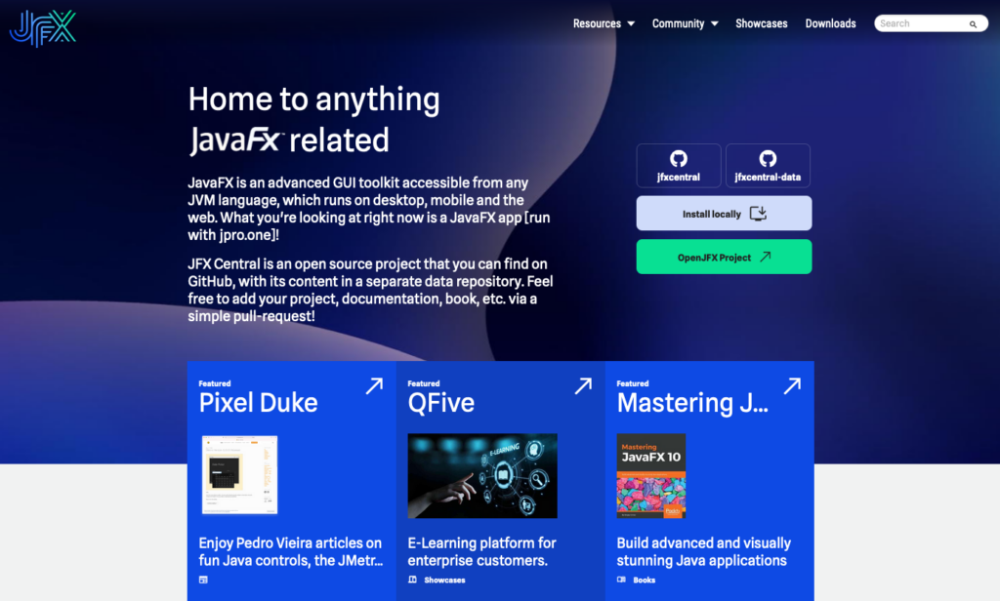
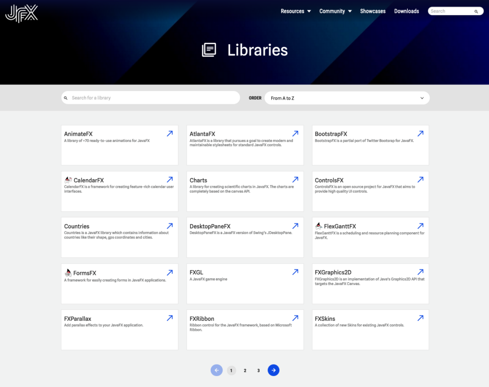

I've taken a holiday this month, so probably missed a lot of the amazing JavaFX news, but still some things caught my attention and you can find them in this LinksOfTheMonth overview.

But the most essential and thrilling news is the release of the new version of [jfx-central.com](https://www.jfx-central.com/)! A complete new home for "all things JavaFX" thanks to the amazing work of a whole [team of JavaFX enthousiast](https://www.jfx-central.com/team). Indeed, yes, it's a website but actually a JavaFX application, so you can also run it as a desktop app. And what's even more important... the [full sources are available on GitHub](https://github.com/dlemmermann/jfxcentral2).

<figure class="wp-block-gallery has-nested-images columns-default is-cropped wp-block-gallery-1 is-layout-flex wp-block-gallery-is-layout-flex">
 <figure class="wp-block-image size-large">
  
 </figure>
 <figure class="wp-block-image size-large">
  
 </figure>
 <figure class="wp-block-image size-large">
  
 </figure>
</figure>

Applications {#h2-0-applications}
---------------------------------

* [**Mark Baird** is working on a weather station](https://github.com/mbcoder/weather-station) with Pi4j, Medusa gauges, and JavaFX to show humidity and temperature on a Raspberry Pi.
* [**Robert Ladstätter** announced v23.2.1 of LogoRRR](https://github.com/rladstaetter/LogoRRR/releases/tag/23.2.1), a tool to explore log files. One of the important changes is the addition of calls to JNI / Swift to activate security scoped bookmarks for [access to files from the macOS App Sandbox](https://developer.apple.com/documentation/security/app_sandbox/accessing_files_from_the_macos_app_sandbox).
* Check out the [many Trinity update Tweets by **Sean Phillips**](https://twitter.com/search?q=%40seanmiphillips%20trinity&src=typed_query&f=live). It looks like he didn't take a holiday this summer and went full in to bring more 3D magic and data analysis into his amazing app.
* [**Pedro Duque Vieira** shared a webinar about Hero](https://twitter.com/P_Duke/status/1692525012446572670?s=20): "It's great to see an application I've created along with my client continue to thrive. It's a Java \& JavaFX app. Would web tech be a viable option here? I doubt it"
* [**Thanhpv** shared a link to BlueGrid in the Microsoft Store](https://twitter.com/realThanhpv/status/1689464542181400578?s=20): "Real app in real life #Javafx, #Graalvm, #gluonfx: BlueGrid allows engineers, quantity surveyors, auditors, and any ones to perform very exact quantity estimation on PDF, and image files in a concise amount of time."

Books {#h2-1-books}
-------------------

* [**Almas Baim** shared a Humble Bundle from Apress](https://twitter.com/AlmasBaim/status/1694403771772588213): 19 books for a ridiculous low price. It includes his book: "Learn JavaFX Game and App Development".

Tutorials {#h2-2-tutorials}
---------------------------

* [**Johan Vos** created an introduction video on a planned series for Quantum Computing in Java](https://mastodon.social/@johanvos/110886627253715612), and of course he is also using JavaFX.

Miscellaneous {#h2-3-miscellaneous}
-----------------------------------

* Do you want to experiment with JavaFX on the Raspberry Pi? [**Pi4J** has a custom Raspberry Pi OS to make it easy to get started](https://foojay.social/@pi4j/110808004449229039). Thanks to the [FHNW University](https://www.fhnw.ch) and Dieter Holz.

JFX-Central {#h2-4-jfx-central}
-------------------------------

* Yes, indeed, V2 is published! Go [check it out on jfx-central.com](https://www.jfx-central.com/).
* Here is the [announcement Tweet](https://twitter.com/jfxcentral/status/1692509973933105392): "Many of you have already noticed it, but here is the official announcement: the new version of [@JFXCentral](https://twitter.com/jfxcentral) - totally written in JavaFX - is now online at [jfx-central.com](http://jfx-central.com). You can also download the desktop version here: [downloads.hydraulic.dev/jfxcentral2/download.html](https://downloads.hydraulic.dev/jfxcentral2/download.html). #java #javafx #ui #ux [@jpro_one](https://twitter.com/jpro_one) [@GluonHQ](https://twitter.com/GluonHQ) [@HydraulicDev](https://twitter.com/HydraulicDev)"
* The desktop app has an auto-update system [thanks to the Conveyor tool by Hydraulic](https://twitter.com/dlemmermann/status/1693738821739790659).
