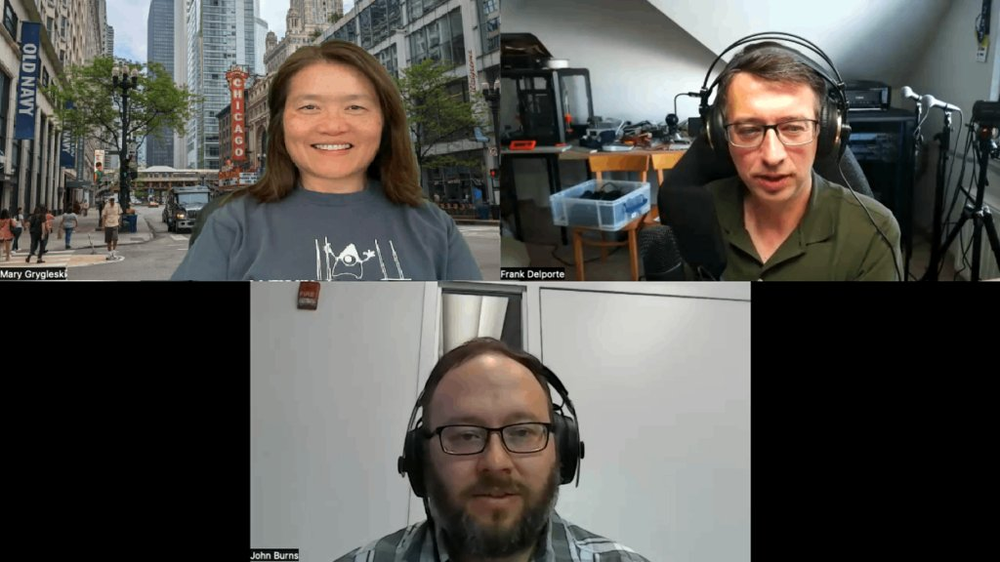

Since December last year, the Foojay podcast virtually visited a Java User Group monthly.

This journey has already brought us to many places around the world.

And this time, we are in Chicago to learn from the Java and Kotlin user groups.



## Podcast Apps

You can listen and subscribe to the Foojay Podcast on:

* [Spotify](https://open.spotify.com/show/6CpTfgn9LirzJGAtc4ICdQ)
* [Apple Podcasts](https://podcasts.apple.com/be/podcast/foojay-io-the-friends-of-openjdk/id1652281304)
* And most others...

## Guests

### Mary Grygleski

* <https://foojay.social/@mgrygles>
* <https://twitter.com/mgrygles>

### John Burns

* <https://bigshoulders.city/@wakingrufus>
* <https://twitter.com/wakingrufus>

## Podcast

### Host: Frank Delporte

* <https://foojay.social/@frankdelporte>
* <https://twitter.com/FrankDelporte>

## Links

### Chicago JUG

* <https://twitter.com/CJUG>
* <https://foojay.social/@ChicagoJUG>
* <https://www.youtube.com/@ChicagoJavaUsersGroup>
* <https://www.meetup.com/chicagojug>
* <https://discord.gg/U25g437>

### Chicago Kotlin

* <https://twitter.com/ChicagoKotlin>
* <https://foojay.social/@ChicagoKUG>
* <https://www.meetup.com/chicago-kotlin/>
* <https://www.youtube.com/channel/UCWCHNOYemampfWXMUdQ95Sw>
* <https://www.youtube.com/playlist?list=PLb1tSwQ0ReIFFJbVpbNGIvmELaucyBTaL>

### A gift from DataStax

DataStax Vector DB and Search (no credit card and $25 monthly complimentary usage for up to a year): <https://bit.ly/3L1Dkgi>

## Content

00:00 Intro and introduction of the guests  

02:08 How Mary and John got into Java, Kotlin and user groups  

06:55 History of the Chicago JUG  

08:43 How Chicago switched from dotnet to Java in 2010's  

09:09 How Chicago JUG and KUG cooperate  

13:04 Size of the communities  

13:55 Impact of Covid and working-from-home  

18:20 About streaming the event versus in-person  

19:47 How to attract new visitors  

23:00 Personal benefit of being part of a community  

27:39 Speaking at conferences around the world  

31:41 Most remarkable sessions  

38:25 Outro
