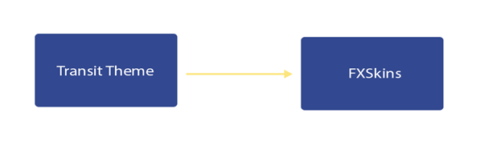
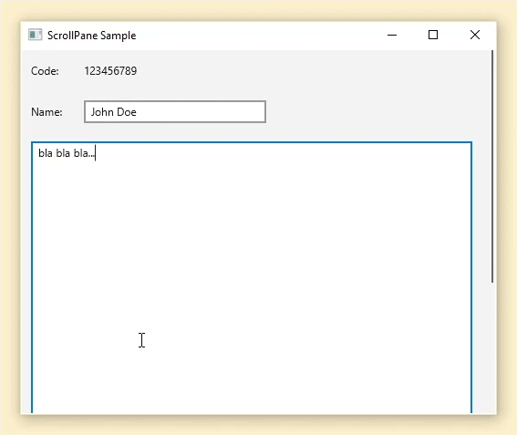

**A new Java (JavaFX) theme has been released. This is a new theme called "Transit" and it builds upon the lessons learned while developing JMetro. The code is hosted on [Github](https://github.com/dukke/Transit).**

It is not meant to be JMetro 2, it will be an entirely new theme.

## Strengths and Key Principles

This theme follows some of the design principles and has some of the key strengths of JMetro:

* Modern look and feel;
* Zero tight coupling with this library:
  * No new controls. "Pluggable" theme. Functionality is added "behind the curtains" to existing JavaFX controls through the Skin API (FXSkins library);
  * Setting and unsetting is seamless and easy (only 1 line of code) even on already existing apps that don't use this theme;
* Looks integrated on Windows (80%/90% of desktop users use Windows) also works well on other OSes;
* Light and Dark versions;
* Easily override and customize colors by overriding JavaFX CSS variables;
* Only relies on JavaFX CSS, JavaFX API and Java code (no other "foreign technologies");
* Samples and theme tester app on [samples sub-project](https://github.com/dukke/Transit/tree/main/transit-samples);
* Lots of real world, recognized Java apps already using it (NASA's applications, applications used in the White House, etc, etc) (JMetro and Transit) -- check the documentation page for more real world examples;
* Leverages lessons learned developing JMetro theme;

I like to use the term Michael Paus ([@MichaelPaus](https://twitter.com/MichaelPaus)) coined when he was referring to JMetro: this is a "pluggable" JavaFX theme (like JMetro).

This means there's zero coupling because it doesn't define any new Controls and the developer only needs to run 1 line of code to set the theme (this is all the coupling you'll get).

It adds features to the existing JavaFX controls that you regularly use (controls from the standard JavaFX API or from known third party libraries) by leveraging the JavaFX Skin API. This is achieved through the [FXSkins](https://github.com/dukke/FXSkins) library which Transit depends on.

The benefits of this approach are:

* Really easy to set this theme on an existing app. You'll have all the added features on your existing controls with almost zero effort;
* Very easy to switch to another theme either because you want to set another theme on a different environment (OS, etc) or you just want to start using another theme altogether;
* You'll keep having features added to the controls you're using in your application every time there's a new version of this theme with new features, without the need to change any code. All you need is to update the version of Transit.

## High level architecture

### **FXSkins**

The Transit Theme makes use of the FXSkins library. FXSkins adds behavior to existing JavaFX Controls without the developer having to do anything, by leveraging the JavaFX Skin API. For example, one of the controls FXSkins adds features to is the Slider control. It adds a popup that fades in and out when the user drags the thumb, that popup is always located over the thumb and shows the Slider current value. It also adds a fill color to the Slider which the default JavaFX Slider doesn't have. This is just an example, there are other controls that FXSkins adds behavior to (by setting new Skins on them).

Now the advantage of this architecture for the developer using the library is that you can use FXSkins independent of the Transit Theme. That is, you can have better skins with added features to your standard controls in your already existing themes without having to use the transit theme styles. Or you can even use FXSkins just as is (without any new theme), because it is already, by default, made to look good with Modena (the standard JavaFX theme). Check FXSkins documentation to learn how.

### **Transit Theme**

Adds the CSS styles to your control to make them look more modern. It also adds some more API for added style definitions.

If you want the whole package, add Transit Theme as a dependency and you'll get the styles and the added behavior on your controls (Transit Theme already depends on the FXSkins library).

## New in this release

* **Conscious ScrollPane Skin and style.**This new Skin for the ScrollPane will show the scrollbars in a minimal style with just the thumb showing. When the user mouses over the thumb the scrollbars transform to show their full UI. All of this is styleable through CSS: the minimal scrollbar visuals, the full scrollbar visuals, etc.

* **Compatible with latest Java LTS release and JavaFX (Java 17 and JavaFX 20).** At the moment of the writing of this post it is being built using Java 17 and JavaFX 20

<!-- -->

* **Clear architectural separation between skins and theme CSS definitions.** As mentioned previously there's now a clear separation between the new skin definition and the CSS theme definition. Transit Theme depends on FXSkins library which is an entirely different library.

## Conclusion

**A new theme called Transit has just been released, you can head on over to the [documentation page](https://pixelduke.com/transit-java-javafx-theme/) or [github page](https://github.com/dukke/Transit) for more information.**
