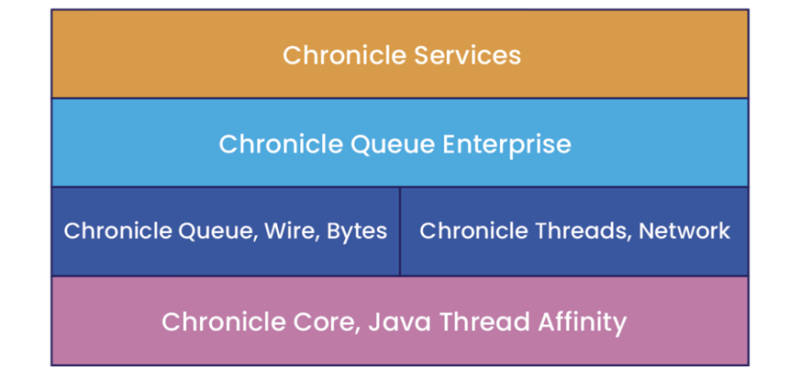
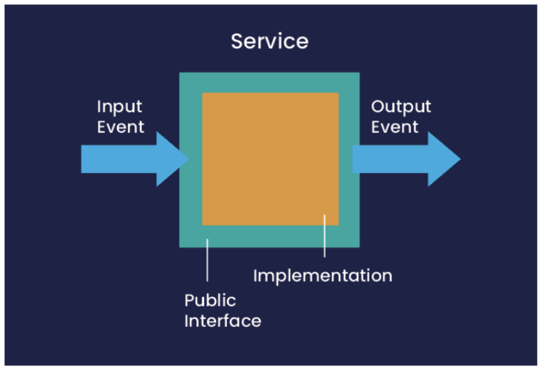
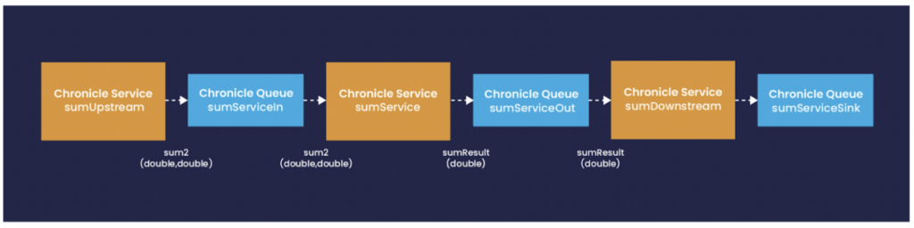
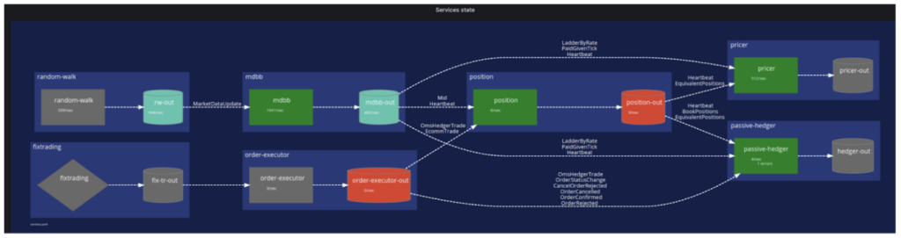
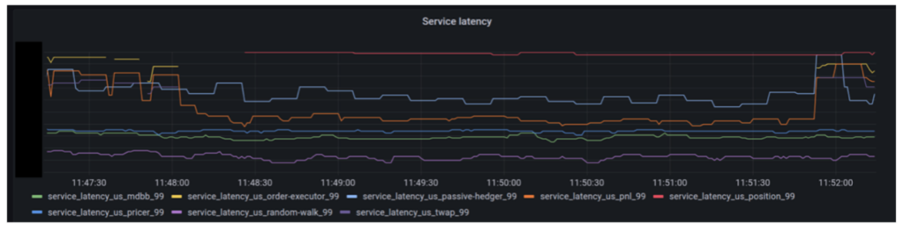

### Low Latency?

In computing, latency is defined as the length of time to perform some task. This could be the time it takes to respond to an interrupt from hardware or the time it takes for a message sent by one component to be available to its recipient.

In many cases, latency is not seen as a primary non-functional concern when designing an application, even when considering performance. Most of the time, after all, computers seem to do their work at speeds that are well beyond human perception, typically using scales of milliseconds, microseconds, or even nanoseconds.

The focus is often more on throughput -- a measure of how many events can be handled within a given time period. However, basic arithmetic tells us that if a service can handle an event with low latency (for example, microseconds), then it will be able to handle far more events within a given time period, say 1 second, than a service with millisecond event handling latency.

This can allow us to avoid, in many cases, the need to implement horizontal scaling (starting new instances) of a service, a strategy that introduces significant complexity into an application and may not even be possible for some workloads.

Additionally, there are many application domains where consistently low latency is a critical element of an application's success, for example:

* Electronic trading systems must be able to respond to changes in event loads based on market conditions fast enough to take advantage of these before competitors in the market -- huge sums of money may be gained by being able to do this (or lost by missing such opportunities). There is not enough time to respond to these load "spikes" by scaling horizontally -- which could take up to a second -- before opportunities are lost.
* Systems that monitor equipment, such as those found in the IoT space, need to be able to react to indications from that equipment with minimal delays. Alarms, for example, security or environmental alarms, must be notified and responded to as quickly as possible. The overhead introduced by monitoring itself must be minimal, to avoid becoming a factor that affects the data being recorded.
* Some machine learning or AI algorithms need to react to input data as it arrives, or as near to it as possible, making them more effective in areas such as pricing, threat detection, sentiment analysis or buy/sell decisions.
* Online gaming software must be able to react to input from potentially large numbers of users, adjusting feedback and strategies in as near real-time as possible.

At [Chronicle Software](https://chronicle.software/ "Chronicle Software"), our primary focus is to develop software that minimises latency.

It's often felt that Java is not a suitable language to use for such software, however as discussed in [this article](https://dzone.com/articles/java-and-low-latency "this article"), it is possible to achieve latency figures that approach those of lower-level languages such as C++ and Rust.

### Challenges in Building Low Latency Software

Modern applications tend to be implemented using architectural approaches based on loosely coupled components (microservices) that interact with each other based on asynchronous message passing. Several toolkits and frameworks exist that help in implementing such microservices in Java.

However, it is not straightforward to build truly low-latency software that follows this approach. Latency creeps in at many different levels. Existing microservice toolkits tend to focus on the quality of the abstractions provided, in order to protect their users from lower-level APIs and features. This higher level of abstraction often comes at the price of the creation of large numbers of intermediate objects, placing significant load on the memory management subsystem of the JVM -- something that is anathema to low-latency coding, as illustrated in [this article](https://chronicle.software/java-is-very-fast/ "this article").

Other approaches lean towards stripping away almost all abstractions, exposing developers to the lowest level of detail. While this clearly dispenses with overhead, it pushes more complexity into the application-level code, making it more error-prone and significantly more difficult to maintain and evolve.

Even at this level of detail, however, it is often necessary to understand and be able to tune operating system level parameters to achieve consistent low latency. [Chronicle Tune](https://chronicle.software/tune/ "Chronicle Tune") is a product that can be used to perform this level of analysis and configuration based on Chronicle's extensive knowledge and experience in this area.

### Introducing Chronicle Services

Over many years, Chronicle Software has been involved in building libraries, applications and systems that operate in environments where low latency is critical, primarily in the financial sector.

Based on experience gained in this work, we have developed an architectural approach for constructing low-latency applications based on event-driven microservices.

We have created the [Chronicle Services](https://chronicle.software/services/ "Chronicle Services") framework, to support this approach, taking care of necessary software infrastructure and enabling developers to focus on implementing business logic based on their functional requirements.


[Chronicle Services](https://portal.chronicle.software/docs/services-cookbook/chronicle-services-documentation/RG00-introduction/introduction.html "Chronicle Services") presents an opinionated view of several of the specialised libraries we have developed to support low-latency applications.

### Philosophy

A key requirement in achieving the strict requirements of minimal latency is the elimination of accidental complexity. Frameworks such as Spring Boot, Quarkus and Micronaut offer rich sets of abstractions to support the construction of microservices and patterns such as event sourcing and CQRS. These are useful parts of frameworks that are necessarily designed to support general-purpose applications, but they can introduce complexity that should be avoided when building highly focused, low-latency components.

[Chronicle Services](https://portal.chronicle.software/docs/services-cookbook/chronicle-services-documentation/RG00-introduction/introduction.html "Chronicle Services") offers a smaller set of abstractions, leading to considerable simplification in the framework, less load on the underlying JVM and hence much smaller overhead in processing events. This leads to a throughput of 1 million events per second for a single service. We have also been able to help customers refactor systems that were required to be run on multiple servers to run on a single server (plus one server for continuity in the event of failure).

### How it Works

There are two key concepts in[Chronicle Services](https://portal.chronicle.software/docs/services-cookbook/chronicle-services-documentation/RG00-introduction/introduction.html " Chronicle Services"): Services and Events.

A Service is a self-contained processing component that accepts input from one or more sources and outputs to a single sink. Service input and output are in the form of Events, where an Event is an indication that something has happened.

By default, events are transmitted between services using [Chronicle Queue](https://chronicle.software/queue-enterprise/ "Chronicle Queue"), a persisted low-latency messaging framework offering the ability to send messages with latencies of under 1 microsecond. Events are transmitted in a compact proprietary binary format. Encoding and decoding are extremely efficient in terms of both time and space and require no additional code generation on the sending or receiving side.


In a comparison, described [here](https://chronicle.software/benchmarking-kafka-vs-chronicle-for-microservices-which-is-750-times-faster/ "here"), Chronicle Services transmitted messages some 750 times faster than Kafka.

### Building a Service

The public interface of a Service is defined by the types of Events it expects as input and the types of Events that it outputs. The Service implementation itself provides implementations of handlers for each of the input events.

There is a clean separation of the Service from the underlying infrastructure for event delivery, so the developer can focus on implementing the business logic encapsulated in the event handlers. A Service handles all incoming events in a single thread, removing the need for dealing with concurrency, another common source of accidental complexity.

Detailed functional testing is available through a powerful testing framework, where input events are supplied as YAML, together with expected output events.

[Configuration of Services](https://portal.chronicle.software/docs/services-cookbook/chronicle-services-documentation/RG00-introduction/introduction.html "Configuration of Services") is available through APIs or using a declarative approach based on external files, or even dynamic configuration updates through events. An example of the static configuration file for a simple Services application is shown below:

```
!ChronicleServicesCfg {
    queues: {
        sumServiceIn: { path: data/sumServiceIn },
        sumServiceOut: { path: data/sumServiceOut },
        sumServiceSink: { path: data/sumServiceSink },
    },

    services: {
        sumService: {
            inputs: [ sumServiceIn ],
            output: sumServiceOut,
            implClass: !type software.chronicle.services.ex1.services.SumServiceImpl,
        },

        sumUpstream: {
            inputs: [ ],
            output: sumServiceIn,
            implClass: !type software.chronicle.services.ex1.services.SumServiceUpstream,
        },

        sumDownstream: {
            inputs: [ sumServiceOut ],
            output: sumServiceSink,
            implClass: !type software.chronicle.services.ex1.services.SumServiceDownstream,
        }
    }
}
```

Each Service is defined in terms of its implementation class and the Chronicle Queues that are used for the transmission of Events. There is enough information here for the Chronicle Services runtime to create and start each service.

Diagrammatically, the application described in the above file would appear like this:


**Deploying a Service**

[Chronicle Services](https://chronicle.software/services/) supports many options for deploying Services. Multiple services can share a single thread, can be run on multiple threads, or spread across multiple processes. Chronicle Queue is a shared memory-based IPC mechanism, so message exchange between Services in different processes is extremely fast.

Services can be further packaged into containers, which can simplify deployment, especially into Cloud environments.

**Enterprise Class Features**

[Chronicle Services](https://chronicle.software/services/) is based on the Enterprise edition of Chronicle Queue, which offers cluster-based replication of event storage, along with other Enterprise features. Replication is based on the single leader/multiple followers model, with both Active/Passive and Active/Active approaches to high availability available. In the event of failure of the cluster leader.

Chronicle Services applications can also integrate with industry-standard monitoring and observability components such as Prometheus and Grafana to provide visualisations of their operation.

For example, we can have a snapshot of the overall state of an application:


or specific latency statistics from individual services:


Monitoring solutions are described in more detail in [this article](https://chronicle.software/monitoring-chronicle-services/).

**Conclusion**

In order to achieve the best latency figures from an application, it is often necessary to depart from idiomatic techniques for developing in the chosen language.

It takes time to acquire the skills to do this effectively, and even if it can be done in the business logic layers of code, supporting frameworks do not always provide the same level of specialisation.

Chronicle Services is a highly opinionated framework that leverages concepts implemented in libraries that have been developed by Chronicle Software to support the development of asynchronous message-passing applications with market-leading latency performance.

It does not aim to compete with general-purpose microservice frameworks like Spring Boot or Quarkus.

Instead, it provides a low-latency platform on which business logic can be layered using a simple computational model, bringing the benefits of low latency without the pain.
