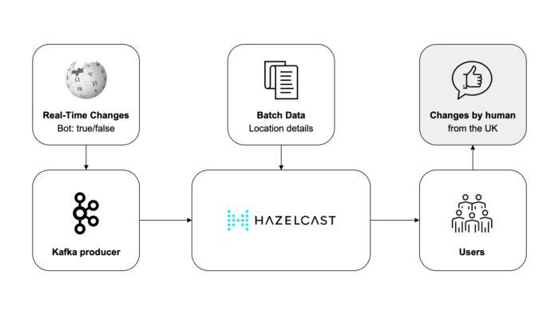

**In this tutorial, developers, solution architects, and data engineers can learn how to build high-performance, scalable, and fault-tolerant applications that react to real-time data using Kafka and Hazelcast.**

We will be using Wikimedia as a real-time data source. Wikimedia provides various streams and APIs (Application Programming Interfaces) to access real-time data about edits and changes made to their projects.

For example, this source provides a continuous stream of updates on recent changes, such as new edits or additions to Wikipedia articles. Developers and solution architects often use such streams to monitor and analyze the activity on Wikimedia projects in real-time or to build applications that rely on this data, like this tutorial.

Kafka is great for event streaming architectures, continuous data integration (ETL), and messaging systems of record (database). Hazelcast is a unified real-time stream data platform that enables instant action on data in motion by combining stream processing and a fast data store for low-latency querying, aggregation, and stateful computation against event streams and traditional data sources. It allows you to build resource-efficient, real-time applications quickly. You can deploy it at any scale from small edge devices to a large cluster of cloud instances.

**In this tutorial, we will guide you through setting up and integrating Kafka and Hazelcast to enable real-time data ingestion and processing for reliable streaming processing. By the end, you will have a deep understanding of how to leverage the combined capabilities of Hazelcast and Kafka to unlock the potential of streaming processing and instant action for your applications.**

So, let's get started!

**Wikimedia Event Streams in Motion**

First, let's understand what we are building: Most of us use or read Wikipedia, so let's use Wikipedia's recent changes as an example. Wikipedia receives changes from multiple users in real time, and these changes contain details about the change such as title, request_id, URI, domain, stream, topic, type, user, topic, title_url, bot, server_name, and parsedcomment. We will read recent changes from Wikimedia Event Streams.

Event Streams is a web service that exposes streams of structured event data in real time. It does it over HTTP with chunked transfer encoding in accordance with the Server-Sent Events protocol (SSE). Event Streams can be accessed directly through HTTP, but they are more often used through a client library. An example of this is a "recentchange".

But what if you want to process or enrich changes in real time? For example, what if you want to determine if a recent change is generated by a bot or human? How can you do this in real time? There are actually multiple options, but here we'll show you how to use Kafka to transport data and how to use Hazelcast for real-time stream processing for simplicity and performance. Here's a quick diagram of the data pipeline architecture:

 

Prerequisites {#h2-0-prerequisites}
-----------------------------------

* If you are new to Kafka or you're just getting started, I recommend you start with [Kafka Documentation](https://kafka.apache.org/documentation/).
* If you are new to Hazelcast or you're just getting started, I recommend you start with [Hazelcast Documentation](https://docs.hazelcast.com/home/).
* For Kafka, you need to download Kafka, start the environment, create a topic to store events, write some events to your topic, and finally read these events. Here's a [Kafka Quick Start](https://kafka.apache.org/quickstart).
* For Hazelcast, you can use either the [Platform](https://docs.hazelcast.com/hazelcast/latest/) or the [Cloud](https://docs.hazelcast.com/cloud/overview). I will use a local cluster.

Step #1: Start Kafka {#h2-1-step-1-start-kafka}
-----------------------------------------------

Run the following commands to start all services in the correct order:

<pre class="EnlighterJSRAW" data-enlighter-language="generic" data-enlighter-theme="" data-enlighter-highlight="" data-enlighter-linenumbers="" data-enlighter-lineoffset="" data-enlighter-title="" data-enlighter-group=""># Start the ZooKeeper service
$ bin/zookeeper-server-start.sh config/zookeeper.properties</pre>

Open another terminal session and run:

<pre class="EnlighterJSRAW" data-enlighter-language="generic" data-enlighter-theme="" data-enlighter-highlight="" data-enlighter-linenumbers="" data-enlighter-lineoffset="" data-enlighter-title="" data-enlighter-group=""># Start the Kafka broker service
$ bin/kafka-server-start.sh config/server.properties</pre>

 

Once all services have successfully launched, you will have a basic Kafka environment running and ready to use.

Step #2: Create a Java application project {#h2-2-step-2-create-a-java-application-project}
-------------------------------------------------------------------------------------------

The `pom.xml` should include the following dependencies in order to run Hazelcast and connect to Kafka:

<pre class="EnlighterJSRAW" data-enlighter-language="generic" data-enlighter-theme="" data-enlighter-highlight="" data-enlighter-linenumbers="" data-enlighter-lineoffset="" data-enlighter-title="" data-enlighter-group="">&lt;dependencies&gt;
    &lt;dependency&gt;
    &lt;groupId&gt;com.hazelcast&lt;/groupId&gt;
    &lt;artifactId&gt;hazelcast&lt;/artifactId&gt;
    &lt;version&gt;5.3.1&lt;/version&gt;
    &lt;/dependency&gt;
    &lt;dependency&gt;
    &lt;groupId&gt;com.hazelcast.jet&lt;/groupId&gt;
    &lt;artifactId&gt;hazelcast-jet-kafka&lt;/artifactId&gt;
    &lt;version&gt;5.3.1&lt;/version&gt;
    &lt;/dependency&gt;
&lt;/dependencies&gt;</pre>

Step #3: Create a Wikimedia Publisher class {#h2-3-step-3-create-a-wikimedia-publisher-class}
---------------------------------------------------------------------------------------------

Basically, the class reads from a URL connection, creates a Kafka Producer and sends messages to a Kafka topic:

<pre class="EnlighterJSRAW" data-enlighter-language="generic" data-enlighter-theme="" data-enlighter-highlight="" data-enlighter-linenumbers="" data-enlighter-lineoffset="" data-enlighter-title="" data-enlighter-group="">public static void main(String[] args) throws Exception {
    String topicName = "events";
    URLConnection conn = new URL
    ("https://stream.wikimedia.org/v2/stream/recentchange").openConnection();
    BufferedReader reader = new BufferedReader
    (new InputStreamReader(conn.getInputStream(), StandardCharsets.UTF_8));
    try (KafkaProducer&lt;Long, String&gt; producer = new KafkaProducer&lt;&gt;(kafkaProps())) {
        for (long eventCount = 0; ; eventCount++) {
            String event = reader.readLine();
            producer.send(new ProducerRecord&lt;&gt;(topicName, eventCount, event));
            System.out.format("Published '%s' to Kafka topic '%s'%n", event, topicName);
            Thread.sleep(20 * (eventCount % 20));
        }
    }
}
private static Properties kafkaProps() {
    Properties props = new Properties();
    props.setProperty("bootstrap.servers", "127.0.0.1:9092");
    props.setProperty("key.serializer", LongSerializer.class.getCanonicalName());
    props.setProperty("value.serializer", StringSerializer.class.getCanonicalName());
    return props;
}</pre>

Step #4: Create a Main stream processing class {#h2-4-step-4-create-a-main-stream-processing-class}
---------------------------------------------------------------------------------------------------

This class creates a pipeline that reads from a Kafka source using the same Kafka topic, then it filters out messages that were created by bots (bot:true) and keeps only messages created by humans. It sends the output to a logger.

<pre class="EnlighterJSRAW" data-enlighter-language="generic" data-enlighter-theme="" data-enlighter-highlight="" data-enlighter-linenumbers="" data-enlighter-lineoffset="" data-enlighter-title="" data-enlighter-group="">public static void main(String[] args) {
    Pipeline p = Pipeline.create();
    p.readFrom(KafkaSources.kafka(kafkaProps(), "events"))
    .withNativeTimestamps(0)
    .filter(event-&gt; Objects.toString(event.getValue()).contains("bot":false"))
    .writeTo(Sinks.logger());
    JobConfig cfg = new JobConfig().setName("kafka-traffic-monitor");
    HazelcastInstance hz = Hazelcast.bootstrappedInstance();
    hz.getJet().newJob(p, cfg);
}

private static Properties kafkaProps() {
    Properties props = new Properties();
    props.setProperty("bootstrap.servers", "127.0.0.1:9092");
    props.setProperty("key.deserializer", LongDeserializer.class.getCanonicalName());
    props.setProperty("value.deserializer", StringDeserializer.class.getCanonicalName());
    props.setProperty("auto.offset.reset", "earliest");
    return props;
}</pre>

Step #5: Enriching a stream {#h2-5-step-5-enriching-a-stream}
-------------------------------------------------------------

If you want to enrich real-time messages with batch or static data such as location details, labels or some features, you can follow the next step:

1. Create a Hazelcast Map and load static data into it.
2. Use the Map to enrich the Message stream using `mapUsingIMap`

Conclusion {#h2-6-conclusion}
-----------------------------

In this post, we explained how to build a real-time application to process Wikimedia streams using Kafka and Hazelcast.

Hazelcast allows you to quickly build resource-efficient, real-time applications.

You can deploy it at any scale, from small-edge devices to a large cluster of cloud instances.

A cluster of Hazelcast nodes shares the data storage and computational load, which can dynamically scale up and down.

Referring to the Wikimedia example, it means that this solution is reliable, even when there are significantly higher volumes of users making changes to Wikimedia.

We look forward to your feedback and comments about this blog post!

Share your experience with us in the Hazelcast [community Slack,](https://slack.hazelcast.com/) the Hazelcast GitHub repository and on Twitch.

Hazelcast also runs a weekly live stream on [Twitch](https://www.twitch.tv/thehazelcast), so give us a follow to get notified when we go live.

Interested in learning more?

* [Join Free Webinar](https://hazelcast.com/resources/pizza-delivery-in-motion-redpanda-and-hazelcast/): Pizza Delivery in Motion brought to you by Redpanda and Hazelcast
* Sign up for the virtual training: virtual trainings "intro to stream processing with Hazelcast" on [September 13](https://hazelcast.com/resources/intro-to-stream-processing-with-hazelcast-live-virtual-workshop/) \& [September 20](https://hazelcast.com/resources/introduction-to-stream-processing-with-hazelcast-live-virtual-workshop/),
* Meet with us at [Current 2023](https://hazelcast.com/resources/current-2023/)
