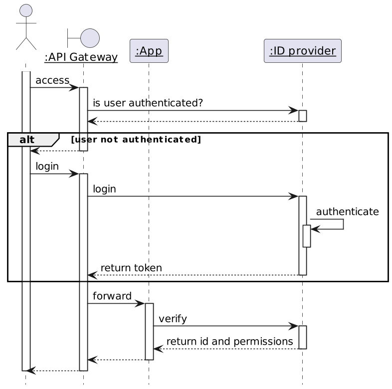
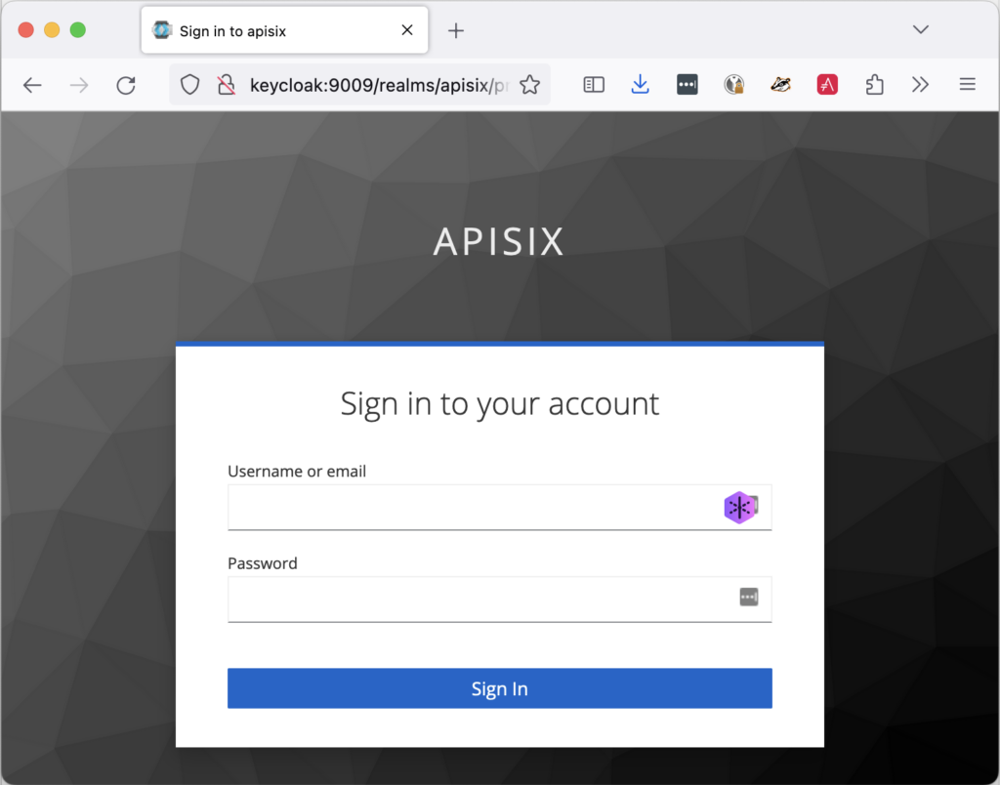
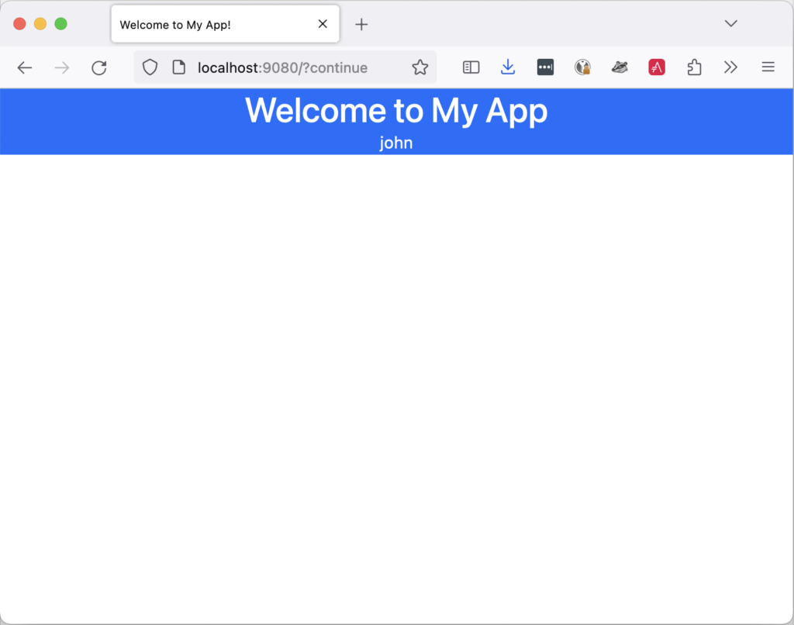

**When exposing an application to the outside world, consider a Reverse-Proxy or an API Gateway to protect it from attacks. Rate Limiting comes to mind first, but it shouldn't stop there. We can factor many features in the API Gateway and should be bold in moving them from our apps. In this post, I'll show how to implement authentication at the Gateway API stage.**

## Overall authentication flow

The API Gateway doesn't authenticate but delegates authentication to an authentication provider. After authentication, the Gateway forwards the request to the app. The app checks authentication and gets the associated identity and permissions.



Now, onto the implementation. We will implement the above flow with the following components:

* Keycloak for the Identity Provider
* Apache APISIX for the API Gateway
* The Spring ecosystem for developing the app

## Keycloak

Keycloak is a feature-rich Open Source identity provider:
> Add authentication to applications and secure services with minimum effort. No need to deal with storing users or authenticating users.
>
> Keycloak provides user federation, strong authentication, user management, fine-grained authorization, and more
>
> -- [Keycloak](https://www.keycloak.org/)

Keycloak offers the *realm* abstraction, a *namespace* to group logically-related objects. We will first create an `apisix` Realm to our configuration from other configurations. The [official documentation](https://www.keycloak.org/docs/latest/server_admin/#using-the-admin-console) explains how to do it in great detail. We can proceed further with creating objects under the `apisix` realm.

The next step is to create an OpenID client for Apache APISIX to call Keycloak in the `apisix` realm. Here are the data:

* General settings:
  * Client type: OpenID Connect
  * Client ID: apisix
* Capability config:
  * Client authentication: ON

Go to the *Credential* tab and note the client's secret value.

The final step is to create *users* . A user is a person who can log in to the system to access the app. Let's create two users, `john` and `jane`, and set their passwords. The demo repository already has Keycloak pre-configured - both users' password is `doe`.

## Spring Security

We secure our application via Spring Security.

Here are the required dependencies:

```xml
<dependency>
    <groupId>org.springframework.boot</groupId>
    <artifactId>spring-boot-starter-security</artifactId>        <!--1-->
</dependency>
<dependency>
    <groupId>org.springframework.boot</groupId>
    <artifactId>spring-boot-starter-oauth2-client</artifactId>   <!--2-->
</dependency>
```

1. Protect the application
2. Call the Keycloak server

The protecting code uses Spring Security:

```kotlin
bean {
    ref<HttpSecurity>().authorizeHttpRequests {
        it.requestMatchers("/*")                    //1
            .hasAuthority("OIDC_USER")              //1
            .anyRequest()
            .permitAll()
    }.oauth2Login {}                                //2
    .build()
}
```

1. Any request requires to have the `OIDC_USER` authority
2. "Log in" via OAuth2

The next step is configuring the framework:

```xml
spring.security:
  oauth2:
    client:
      registration.keycloak:
        client-id: apisix                                 #1
        authorization-grant-type: authorization_code
        scope: openid
      provider.keycloak:
        issuer-uri: http://localhost:9009/realms/apisix   #2
        user-name-attribute: preferred_username           #3
```

1. Use the client created in Keycloak. We pass the secret at runtime via an environment variable
2. Keycloak realm to use. We override the domain in the Docker compose file via an environment variable
3. Use the user name instead of the token for display purposes

I'll use a dummy Thymeleaf page to display the logged-in user. We need additional dependencies:

```xml
<dependency>
    <groupId>org.thymeleaf</groupId>
    <artifactId>thymeleaf</artifactId>                        <!--1-->
</dependency>
<dependency>
    <groupId>org.thymeleaf</groupId>
    <artifactId>thymeleaf-spring6</artifactId>                <!--2-->
</dependency>
<dependency>
    <groupId>org.thymeleaf.extras</groupId>
    <artifactId>thymeleaf-extras-springsecurity6</artifactId> <!--3-->
</dependency>
```

1. Thymeleaf proper
2. Thymeleaf and Spring integration
3. Offers dedicated Spring Security tags

The view is the following:

```html
<!doctype html>
<html lang="en" xmlns:sec="http://www.thymeleaf.org/extras/spring-security">
<body>
<header>
    <h1>Welcome to My App</h1>
    <p>
        <span sec:authentication="name">Bob</span>  <!--1-->
    </p>
</header>
</body>
</html>
```

1. Display the "name" of the logged-in user

## Apache APISIX

Lastly, let's configure the entry point into our system. I assume you're familiar with this blog and don't need an introduction to Apache APISIX. If you do, feel free to look at the [APISIX, an API Gateway the Apache way](https://blog.frankel.ch/apisix-api-gateway/).

In standalone mode, the configuration file is the following:

```
routes:
  - uri: /*
    upstream:
      nodes:
        "myapp:8080": 1
    plugins:
      openid-connect:
        discovery: http://keycloak:9009/realms/apisix/.well-known/openid-configuration #1
        client_id: apisix                                                              #2
        client_secret: rjoVkMUDpUH4TE7IXhhJuof4O7OFrbph
        bearer_only: false
        scope: openid
        realm: apisix                                                                  #3
        redirect_uri: http://localhost:9080/callback                                   #4
#END
```

1. Keycloak offers an endpoint that details every necessary endpoint for an OpenID integration
2. Use the same client as the app. In real-world scenarios, we should use one client per component, but it's a demo
3. Use the realm created in the Keycloak section
4. Any URL that's a subpath of the protected URL will do

## Putting it all together

We put everything together via Docker Compose:

```
services:
  apisix:
    image: apache/apisix:3.4.0-debian
    volumes:
      - ./config/apisix/config.yml:/usr/local/apisix/conf/config.yaml:ro             #1
      - ./config/apisix/apisix.yml:/usr/local/apisix/conf/apisix.yaml:ro             #2
    ports:
      - "9080:9080"
  keycloak:
    image: quay.io/keycloak/keycloak:22.0
    entrypoint:
      - /bin/bash
      - -c
      - |
        /opt/keycloak/bin/kc.sh import --file /opt/keycloak/data/import/keycloak.json --override true #3
        /opt/keycloak/bin/kc.sh start-dev --http-port 9009                           #4
    environment:
      KEYCLOAK_ADMIN: admin
      KEYCLOAK_ADMIN_PASSWORD: admin
    volumes:
      - ./config/keycloak:/opt/keycloak/data/import:ro
    ports:
      - "9009:9009"
  myapp:
    build: ./myapp
    environment:
      SPRING_SECURITY_OAUTH2_CLIENT_REGISTRATION_KEYCLOAK_CLIENT-SECRET: rjoVkMUDpUH4TE7IXhhJuof4O7OFrbph #5
      SPRING_SECURITY_OAUTH2_CLIENT_PROVIDER_KEYCLOAK_ISSUER-URI: http://keycloak:9009/realms/apisix      #5-6
      LOGGING_LEVEL_ORG_SPRINGFRAMEWORK_SECURITY: DEBUG                              #7
    depends_on:
      - keycloak
    restart: on-failure                                                              #8
```

1. Configure standalone mode
2. Routes and plugins configuration as seen in the previous section
3. Initialize Keycloak with the existing saved realm
4. Start Keycloak
5. Configure the OAuth client
6. Because the flow is browser-based, we will be redirected to a `keycloak` domain for authentication. Hence, we have to update our `/etc/hosts` with a new `127.0.0.1 keycloak` entry
7. Set Spring Security log level to debug helps understand issues
8. Spring Security eagerly tries to contact Keycloak. Keycloak takes a while to initialize itself; we need to let the app crash and start again until Keycloak is ready

Let's try to access the application via Apache APISIX. When we browse to , Apache APISIX redirects us to the Keycloak login page:



If we log in successfully, we are allowed to access the app. Notice that we display the username of the person who logged in:



## Conclusion

In this post, we described how to move the authentication step to the API Gateway stage, delegate authentication to an identity provider, and let the app verify the authentication status.

We implemented it with Apache APISIX, Keycloak, and Spring Security.

Many other options are available, depending on your environment.

The complete source code for this post can be found on [GitHub](_wp_link_placeholder).

**To go further:**

* [Keycloak Administration Guide](https://www.keycloak.org/docs/latest/server_admin/index.html)
* [How to Integrate Keycloak for Authentication with Apache APISIX](https://www.keycloak.org/2021/12/apisix)
* [A Quick Guide to Using Keycloak With Spring Boot](https://www.baeldung.com/spring-boot-keycloak)

*Originally published at [A Java Geek](https://blog.frankel.ch/authentication-api-gateway/) on July 30^th^, 2023*
