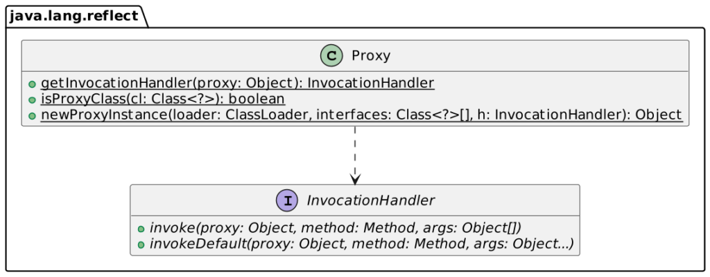
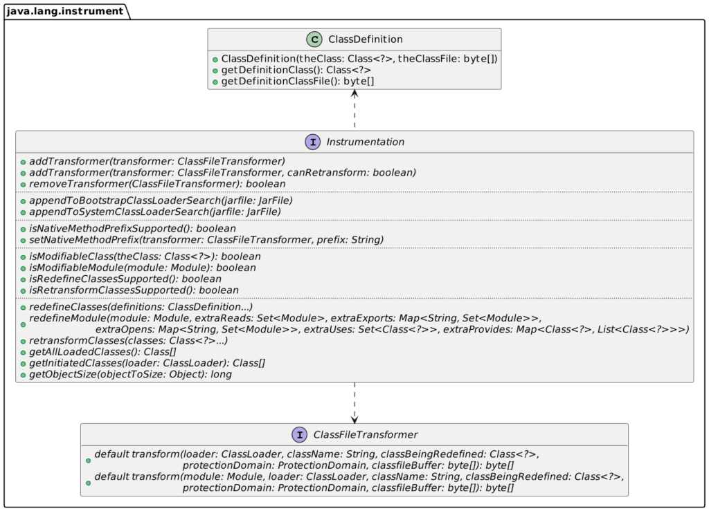
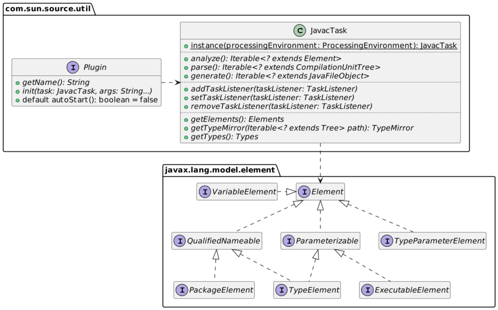

The JVM is an excellent platform for monkey-patching.
> Monkey patching is a technique used to dynamically update the behavior of a piece of code at run-time. A monkey patch (also spelled monkey-patch, MonkeyPatch) is a way to extend or modify the runtime code of dynamic languages (*e.g.* Smalltalk, JavaScript, Objective-C, Ruby, Perl, Python, Groovy, etc.) without altering the original source code.
>
> -- [Wikipedia](https://en.wikipedia.org/wiki/Monkey_patch)

I want to demo several approaches for monkey-patching in Java in this post.

As an example, I'll use a sample for-loop. Imagine we have a class and a method. We want to call the method multiple times without doing it explicitly.

The Decorator Design Pattern {#h2-0-the-decorator-design-pattern}
-----------------------------------------------------------------

While the Decorator Design Pattern is not monkey-patching, it's an excellent introduction to it anyway. Decorator is a **structural** pattern described in the foundational book, [Design Patterns: Elements of Reusable Object-Oriented Software](https://en.wikipedia.org/wiki/Design_Patterns).
> The decorator pattern is a design pattern that allows behavior to be added to an individual object, dynamically, without affecting the behavior of other objects from the same class.
>
> -- [Decorator pattern](https://en.wikipedia.org/wiki/Decorator_pattern)

Our use-case is a `Logger` interface with a dedicated console implementation:

We can implement it in Java like this:

<pre class="EnlighterJSRAW" data-enlighter-language="java">public interface Logger {
    void log(String message);
}

public class ConsoleLogger implements Logger {
    @Override
    public void log(String message) {
        System.out.println(message);
    }
}</pre>

Here's a simple, configurable decorator implementation:

<pre class="EnlighterJSRAW" data-enlighter-language="java">public class RepeatingDecorator implements Logger {        //1

    private final Logger logger;                           //2
    private final int times;                               //3

    public RepeatingDecorator(Logger logger, int times) {
        this.logger = logger;
        this.times = times;
    }

    @Override
    public void log(String message) {
        for (int i = 0; i &lt; times; i++) {                  //4
            logger.log(message);
        }
    }
}</pre>

1. **Must** implement the interface
2. Underlying logger
3. Loop configuration
4. Call the method as many times as necessary

Using the decorator is straightforward:

<pre class="EnlighterJSRAW" data-enlighter-language="java">var logger = new ConsoleLogger();
var threeTimesLogger = new RepeatingDecorator(logger, 3);
threeTimesLogger.log("Hello world!");</pre>

The Java Proxy {#h2-1-the-java-proxy}
-------------------------------------

The Java Proxy is a generic decorator that allows attaching dynamic behavior:
> Proxy provides static methods for creating objects that act like instances of interfaces but allow for customized method invocation.
>
> -- [Proxy Javadoc](https://docs.oracle.com/javase/8/docs/api/java/lang/reflect/Proxy.html)

The Spring Framework uses Java Proxies **a lot** . It's the case of the `@Transactional` annotation. If you annotate a method, Spring creates a Java Proxy around the encasing class at runtime. When you call it, Spring calls the proxy instead. Depending on the configuration, it opens the transaction or joins an existing one, then calls the actual method, and finally commits (or rollbacks).

The API is simple:

We can write the following handler:

<pre class="EnlighterJSRAW" data-enlighter-language="java">public class RepeatingInvocationHandler implements InvocationHandler {

    private final Logger logger;                                       //1
    private final int times;                                           //2

    public RepeatingInvocationHandler(Logger logger, int times) {
        this.logger = logger;
        this.times = times;
    }

    @Override
    public Object invoke(Object proxy, Method method, Object[] args) throws Exception {
        if (method.getName().equals("log") &amp;&amp; args.length ## 1 &amp;&amp; args[0] instanceof String) { //3
            for (int i = 0; i &lt; times; i++) {
                method.invoke(logger, args[0]);                        //4
            }
        }
        return null;
    }
}</pre>

1. Underlying logger
2. Loop configuration
3. Check every requirement is upheld
4. Call the initial method on the underlying logger

Here's how to create the proxy:

<pre class="EnlighterJSRAW" data-enlighter-language="java">var logger = new ConsoleLogger();
var proxy = (Logger) Proxy.newProxyInstance(           //1-2
        Main.class.getClassLoader(),
        new Class[]{Logger.class},                     //3
        new RepeatingInvocationHandler(logger, 3));    //4
proxy.log("Hello world!");</pre>

1. Create the `Proxy` object
2. We must cast to `Logger` as the API was created before generics, and it returns an `Object`
3. Array of interfaces the object needs to conform to
4. Pass our handler

Instrumentation {#h2-2-instrumentation}
---------------------------------------

Instrumentation is the capability of the JVM to transform bytecode before it loads it via a **Java agent**. Two Java agent flavors are available:

* Static, with the agent passed on the command line when you launch the application
* Dynamic allows connecting to a running JVM and attaching an agent on it via the [Attach API](https://docs.oracle.com/javase/8/docs/technotes/guides/attach/index.html). Note that it represents a huge security issue and has been drastically limited in the latest JDK.

The [Instrumentation API](https://docs.oracle.com/javase/8/docs/api/java/lang/instrument/Instrumentation.html)'s surface is limited:

As seen above, the API exposes the user to low-level bytecode manipulation via byte arrays. It would be unwieldy to do it directly. Hence, real-life projects rely on bytecode manipulation libraries. [ASM](https://asm.ow2.io/) has been the traditional library for this, but it seems that [Byte Buddy](https://bytebuddy.net/) has superseded it. Note that Byte Buddy uses ASM but provides a higher-level abstraction.

The Byte Buddy API is outside the scope of this blog post, so let's dive directly into the code:

<pre class="EnlighterJSRAW" data-enlighter-language="java">public class Repeater {

  public static void premain(String arguments, Instrumentation instrumentation) {      //1
    var withRepeatAnnotation = isAnnotatedWith(named("ch.frankel.blog.instrumentation.Repeat")); //2
    new AgentBuilder.Default()                                                         //3
      .type(declaresMethod(withRepeatAnnotation))                                      //4
      .transform((builder, typeDescription, classLoader, module, domain) -&gt; builder    //5
        .method(withRepeatAnnotation)                                                  //6
        .intercept(                                                                    //7
           SuperMethodCall.INSTANCE                                                    //8
            .andThen(SuperMethodCall.INSTANCE)
            .andThen(SuperMethodCall.INSTANCE))
      ).installOn(instrumentation);                                                    //3
  }
}</pre>

1. Required signature; it's similar to the `main` method, with the added `Instrumentation` argument
2. Match that is annotated with the `@Repeat` annotation. The reads fluently even if you don't know it (I don't).
3. Byte Buddy provides a builder to create the Java agent
4. Match all types that declare a method with the `@Repeat` annotation
5. Transform the class accordingly
6. Transform methods annotated with `@Repeat`
7. Replace the original implementation with the following
8. Call the original implementation three times

The next step is to create the Java agent package. A Java agent is a regular JAR with specific manifest attributes. Let's configure Maven to build the agent:

<pre class="EnlighterJSRAW" data-enlighter-language="xml">&lt;plugin&gt;
    &lt;artifactId&gt;maven-assembly-plugin&lt;/artifactId&gt;                                      &lt;!--1--&gt;
    &lt;configuration&gt;
        &lt;descriptorRefs&gt;
            &lt;descriptorRef&gt;jar-with-dependencies&lt;/descriptorRef&gt;                        &lt;!--2--&gt;
        &lt;/descriptorRefs&gt;
        &lt;archive&gt;
            &lt;manifestEntries&gt;
                &lt;Premain-Class&gt;ch.frankel.blog.instrumentation.Repeater&lt;/Premain-Class&gt; &lt;!--3--&gt;
            &lt;/manifestEntries&gt;
        &lt;/archive&gt;
    &lt;/configuration&gt;
    &lt;executions&gt;
        &lt;execution&gt;
            &lt;goals&gt;
                &lt;goal&gt;single&lt;/goal&gt;
            &lt;/goals&gt;
            &lt;phase&gt;package&lt;/phase&gt;                                                      &lt;!--4--&gt;
        &lt;/execution&gt;
    &lt;/executions&gt;
&lt;/plugin&gt;</pre>

1. Create a JAR containing all dependencies ()

Testing is more involved, as we need two different codebases, one for the agent and one for the regular code with the annotation. Let's create the agent first:

<pre class="EnlighterJSRAW" data-enlighter-language="bash">mvn install</pre>

We can then run the app with the agent:

<pre class="EnlighterJSRAW" data-enlighter-language="bash">java -javaagent:/Users/nico/.m2/repository/ch/frankel/blog/agent/1.0-SNAPSHOT/agent-1.0-SNAPSHOT-jar-with-dependencies.jar \ #1
     -cp ./target/classes                                                                                                    #2
     ch.frankel.blog.instrumentation.Main                                                                                    #3</pre>

1. Run java with the agent created in the previous step. The JVM will run the `premain` method of the class configured in the agent
2. Configure the classpath
3. Set the main class

Aspect-Oriented Programming {#h2-3-aspect-oriented-programming}
---------------------------------------------------------------

The idea behind is to apply some code across different unrelated object hierarchies - cross-cutting concerns. It's a valuable technique in languages that don't allow *traits* , code you can graft on third-party objects/classes. Fun fact: I learned about AOP before `Proxy`. AOP relies on two main concepts: an aspect is the transformation applied to code, while a point cut matches where the aspect applies.

In Java, AOP's historical implementation is the excellent [AspectJ](https://eclipse.dev/aspectj/) library. AspectJ provides two approaches, known as *weaving* : build-time weaving, which transforms the compiled bytecode, and runtime weaving, which relies on the above instrumentation. Either way, AspectJ uses a specific format for aspects and pointcuts. Before Java 5, the format looked like Java but not quite; for example, it used the `aspect` keyword. With Java 5, one can use annotations in regular Java code to achieve the same goal.

We need an AspectJ dependency:

<pre class="EnlighterJSRAW" data-enlighter-language="xml">&lt;dependency&gt;
    &lt;groupId&gt;org.aspectj&lt;/groupId&gt;
    &lt;artifactId&gt;aspectjrt&lt;/artifactId&gt;
    &lt;version&gt;1.9.19&lt;/version&gt;
&lt;/dependency&gt;</pre>

As Byte Buddy, AspectJ also uses ASM underneath.

Here's the code:

<pre class="EnlighterJSRAW" data-enlighter-language="java">@Aspect                                                                              //1
public class RepeatingAspect {

    @Pointcut("@annotation(repeat) &amp;&amp; call(* *(..))")                                //2
    public void callAt(Repeat repeat) {}                                             //3

    @Around("callAt(repeat)")                                                        //4
    public Object around(ProceedingJoinPoint pjp, Repeat repeat) throws Throwable {  //5
        for (int i = 0; i &lt; repeat.times(); i++) {                                   //6
            pjp.proceed();                                                           //7
        }
        return null;
    }
}</pre>

1. Mark this class as an aspect
2. Define the pointcut; every call to a method annotated with `@Repeat`
3. Bind the `@Repeat` annotation to the the `repeat` name used in the annotation above
4. Define the aspect applied to the call site; it's an `@Around`, meaning that we need to call the original method explicitly
5. The signature uses a `ProceedingJoinPoint`, which references the original method, as well as the `@Repeat` annotation
6. Loop over as many times as configured
7. Call the original method

At this point, we need to weave the aspect. Let's do it at build-time. For this, we can add the AspectJ build plugin:

<pre class="EnlighterJSRAW" data-enlighter-language="xml">&lt;plugin&gt;
    &lt;groupId&gt;org.codehaus.mojo&lt;/groupId&gt;
    &lt;artifactId&gt;aspectj-maven-plugin&lt;/artifactId&gt;
    &lt;executions&gt;
        &lt;execution&gt;
            &lt;goals&gt;
                &lt;goal&gt;compile&lt;/goal&gt;                  &lt;!--1--&gt;
            &lt;/goals&gt;
        &lt;/execution&gt;
    &lt;/executions&gt;
&lt;/plugin&gt;</pre>

1. Bind execution of the plugin to the `compile` phase

To see the demo in effect:

<pre class="EnlighterJSRAW" data-enlighter-language="bash">mvnd compile exec:java -Dexec.mainClass=ch.frankel.blog.aop.Main</pre>

Java compiler plugin {#h2-4-java-compiler-plugin}
-------------------------------------------------

Last, it's possible to change the generated bytecode via a Java compiler plugin, introduced in Java 6 as [JSR 269](https://jcp.org/en/jsr/detail?id=269). From a bird's eye view, plugins involve hooking into the Java compiler to manipulate the in three phases: parse the source code into multiple ASTs, analyze further into `Element`, and potentially generate source code.

The documentation could be less sparse. I found the following [Awesome Java Annotation Processing](https://github.com/gunnarmorling/awesome-annotation-processing). Here's a simplified class diagram to get you started:

I'm too lazy to implement the same as above with such a low-level API. As the expression goes, this is left as an exercise to the reader. If you are interested, I believe the `DocLint` [source code](https://github.com/openjdk/jdk/blob/jdk-21%2B0/src/jdk.javadoc/share/classes/jdk/javadoc/internal/doclint/DocLint.java) is a good starting point.

Conclusion {#h2-5-conclusion}
-----------------------------

I described several approaches to monkey-patching in Java in this post: the `Proxy` class, instrumentation via a Java Agent, AOP via AspectJ, and `javac` compiler plugins.

To choose one over the other, consider the following criteria: build-time vs. runtime, complexity, native vs. third-party, and security concerns.

**To go further:**

* [Monkey patch](https://en.wikipedia.org/wiki/Monkey_patch)
* [Guide to Java Instrumentation](https://www.baeldung.com/java-instrumentation)
* [Byte Buddy](https://bytebuddy.net/)
* [Creating a Java Compiler Plugin](https://www.baeldung.com/java-build-compiler-plugin)
* [Awesome Java Annotation Processing](https://github.com/gunnarmorling/awesome-annotation-processing)
* [Maven AspectJ plugin](https://www.mojohaus.org/aspectj-maven-plugin/)

*** ** * ** ***

*Originally published at [A Java Geek](https://blog.frankel.ch/monkeypatching-java/) on September 17^th^, 2023*

*[AOP]: Aspect-Oriented Programming
*[AST]: Abstract Syntax Tree
*[DSL]: Domain-Specific Language
