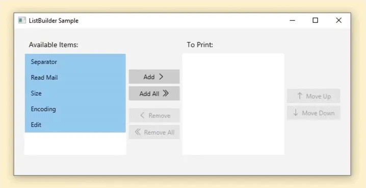
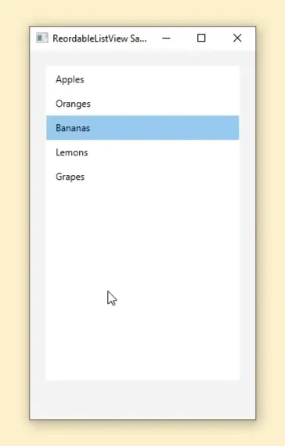
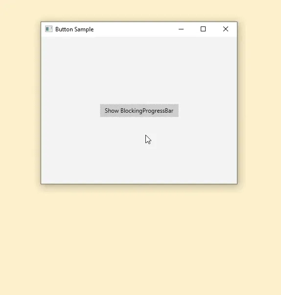
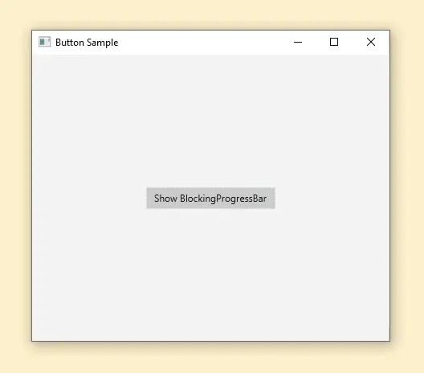

**A new library for Java / JavaFX has just been released. The library's name is FXComponents and it is a Java library that contains a collection of new controls to be used in JavaFX applications.**

As of the time of writing, FXComponents is being built using Java 17 and JavaFX 20.

Below is a brief description of the controls currently present in this library (more coming soon). If you want to know more, head on over to the [documentation page](https://pixelduke.com/2023/09/04/fxcomponents-library-released/) for more detailed information about this library and how to start using it.

## Controls

### List Builder

A control with 2 lists. A source list and a target list.

The target list will contain all the elements the user chose from the source list.

The user can drag and drop items from the source list onto the target list or use the buttons available to accomplish that.

Reordering of the lists is also possible through drag and drop.

### Reordable ListView

A ListView that the user can reorder by drag and dropping each cell.

### Blocking Progress Bar

A blocking dialog (blocks user input) that shows a progress bar while a background operation is in progress.

The ProgressBar can be of indeterminate progress or not.

The developer passes a Runnable to the showAndWait method. That Runnable will be executed in a background task, progress can be updated through convenience methods in the Task class API.

#### Indeterminate

#### Determinate

