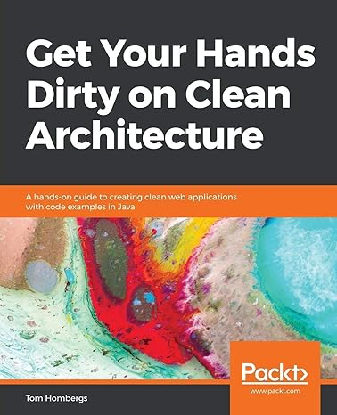

**I recently completed reading "Get Your Hands Dirty on Clean Architecture" authored by Tom Hombergs and I deem it an indispensable resource for developers aspiring to produce clean code and implement the Hexagonal Architecture. Consequently, I have resolved to compose a review to aid numerous individuals who harbor a fervent interest in technology!**

**Title:** Get Your Hands Dirty on Clean Architecture  
**Author:** Tom Hombergs  
**Genre:** Technical, Software Architecture

In the constantly changing realm of software development, architectural principles hold a crucial position in determining the triumph and sustainability of a project. The book authored by Tom Hombergs, titled "Get Your Hands Dirty on Clean Architecture: A hands-on guide to creating clean web applications with code examples in Java," is an exceptional guide that illuminates the importance of clean architecture, while also offering practical perspectives on its implementation through the Java programming language.

One of the most noteworthy characteristics of "Get Your Hands Dirty on Clean Architecture" is its clear and systematic content. Tom Hombergs commences the discussion by expounding upon the fundamental principles of clean architecture, thereby furnishing readers with a comprehensive comprehension of the reasoning and intention behind clean code and architecture. Following this, he leads readers through a progression of progressively complex concepts, methodically enhancing their foundational knowledge.

The exemplary organization of the book is noteworthy. It commences with an exposition on the deficiencies of Layered architecture, subsequently delving into the intricacies of Single Responsibility Principle (SRP), Dependency Injection (DI), Clean Architecture, and the Hexagonal Architecture, which collectively constitute a clean architecture. The seamless transition from one chapter to the next facilitates comprehension for readers.

* **Chapter 1:** The issues pertaining to the layered architecture were deliberated upon.
* **Chapter 2:** The topic of Inverting Dependencies was deliberated upon, with a detailed explanation of the Single Responsibility Principle, the implementation of the Dependency Inversion Principle, Clean Architecture, and Hexagonal Architecture. The discussion centered on how these principles aid in the development of software that is easily maintainable.
* **Chapter 3:** The topic of discussion pertained to the appropriate organization of code, package structure, and the significance of dependency injection.
* **Chapter 4:** The topic of discussion pertained to the implementation of the Use Case for the Hexagonal Architecture, specifically with regards to the creation of models, validation of inputs, and establishment of business rules.
* **Chapter 5:** The topic of discussion pertained to the implementation of a Web Adapter and the creation of efficient controllers.
* **Chapter 6:** The topic of discussion pertained to the implementation of a Persistence Adapter, the modularisation of port interfaces and persistence adapters, the utilization of Spring Data Jpa for implementation, and the incorporation of Database Transactions.
* **Chapter 7:** During the discussion, the significance of testing in architecture was deliberated upon. It was emphasized that each layer, namely Domain Entity, Web Adapters, and Persistence, must be effectively tested through Integration Tests.
* **Chapter 8:** The topic of discussion pertained to the mapping of boundaries for the entirety of the application.
* **Chapter 9:** The topic of discussion pertained to the process of assembling the Application through the utilization of plain code, Spring's class path scanning, and Spring's Java configuration.
* **Chapter 10:** Discussed regarding the implementation of architecture boundaries on boundaries and dependencies, the utilization of visibility modifiers, the verification of post-compilations, and the creation of artifacts.
* **Chapter 11, 12:** Discussed regarding the utilization of models, including the sharing of models across various use cases. Additionally, the group deliberated on the selection of an appropriate architectural style and emphasized the significance of the domain.

Tom Hombergs writes in a way that is easy to understand for many people, including those who are new to programming and those who are experienced. However, some parts of his writing, especially those that talk about complicated design patterns and decisions about how to build software, might be hard to understand if you don't already know a lot about object-oriented programming and Java.

In order to bridge the gap between theory and practice, "**Get Your Hands Dirty on Clean Architecture"** incorporates practical examples and code snippets to assist readers in applying the discussed concepts. However, readers with limited Java experience may encounter difficulties in comprehending these sections.

The book provides a comprehensive analysis of clean architecture principles, leaving no aspect unexplored. It delves deeply into the implementation of Hexagonal Architecture, Dependency Inversion, and various design patterns, including the Dependency Injection pattern and Repository pattern. These components are all fundamental to clean architecture, and Tom Hombergs elucidates them with precision and practical examples.

Furthermore, the book underscores the significance of testing within clean architecture, demonstrating how to write unit tests and integration tests effectively. This emphasis on testing aligns with contemporary software development best practices.

Although the book employs code snippets and diagrams to illustrate concepts, it could benefit from additional visual aids to enhance the understanding of complex architectural diagrams and patterns. Visual learners may find supplementary diagrams and illustrations useful in comprehending certain concepts.

Conclusion {#h2-0-conclusion}
-----------------------------

**"Get Your Hands Dirty on Clean Architecture" by Tom Hombergs is a valuable addition to the library of any software developer aiming to create maintainable, scalable, and clean code. The book's comprehensive coverage of clean architecture principles and its practical approach to implementation make it an essential resource for both beginners looking to learn about software architecture and experienced developers aiming to adopt clean architecture practices in Java projects.**

**While some sections may pose a challenge for readers with limited Java experience, the book's overall clarity and depth of coverage make it a highly recommended read for those seeking to elevate their software architecture skills. "Get Your Hands Dirty on Clean Architecture" is a blueprint for building modern, clean, and sustainable software, and it stands as a beacon for software developers on their journey to mastering clean architecture principles in Java.**
