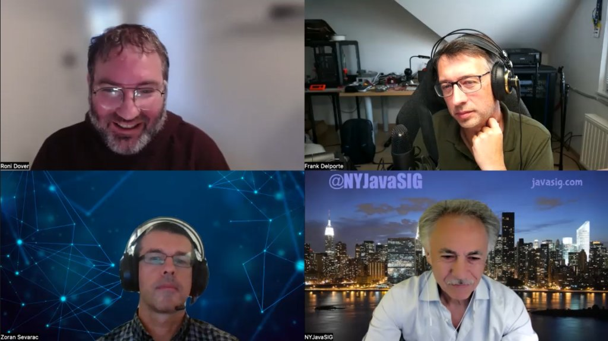

Artificial Intelligence and ChatGPT are the talk of the town.

Every conference has several talks about these technologies, and on Foojay, you can find multiple posts about it.

In this podcast, we want to take a look at it from the Java point of view.

How can we use AI in Java programs or our job as a developer?



## Podcast Apps

You can listen and subscribe to the Foojay Podcast on:

* [Spotify](https://open.spotify.com/show/6CpTfgn9LirzJGAtc4ICdQ)
* [Apple Podcasts](https://podcasts.apple.com/be/podcast/foojay-io-the-friends-of-openjdk/id1652281304)
* And most others...

## Guests

### Zoran Sevarac

* <https://www.linkedin.com/in/zoran-sevarac-phd-49a9a411/>
* <https://foojay.social/@zsevarac>
* <https://twitter.com/zsevarac>

### Frank Greco

* <https://www.linkedin.com/in/frankdgreco/>
* <https://twitter.com/frankgreco>
* <https://www.javasig.com/>

### Roni Dover

* <https://www.linkedin.com/in/ronidover/>
* <https://twitter.com/doppleware>

## Podcast

### Host: Frank Delporte

* <https://foojay.social/@frankdelporte>
* <https://twitter.com/FrankDelporte>

## Content

00:00 Intro and introduction of the guests  

02:31 Difference between AI, ML, DL, CV,…  

06:30 How ChatGPT and LLMs works  

07:50 AI with Java and DeepNetts  
[https://www.deepnetts.com/](https://www.deepnetts.com/%0A)10:42 NYJavaSIG and how AI and ML are influencing the content  

13:06 LLM is pattern matching, not a search tool  

13:41 Java developers want to develop this with Java  

15:03 Foojay articles about Java, AI, and DeepNetts  
<https://foojay.io/today/getting-started-with-deep-learning-in-java-using-deep-netts/>  
<https://foojay.io/today/visual-recognition-for-chess-with-deep-learning-in-java-on-android/>  
<https://foojay.io/today/deep-learning-in-java-for-drug-discovery/>  
<https://foojay.io/today/quick-start-with-machine-learning-in-java/>  

17:40 Java Specification Request 381: Visual Recognition Specification  
<https://jcp.org/en/jsr/detail?id=381>  
<https://github.com/JavaVisRec/visrec-api/wiki/Getting-Started-Guide>  

21:51 How Digma is using is AI  
<https://digma.ai/>  
<https://foojay.io/today/not-your-grandfathers-logs-a-java-librarys-new-approach-to-observability/>  
<https://foojay.io/today/java-developer-vs-chatgpt-part-i-writing-a-spring-boot-microservice/>  
<https://foojay.io/today/announcing-the-digma-beta-first-runtime-linter-for-java-code/>  
<https://foojay.io/today/effective-coding-with-java-observability/>  
<https://foojay.io/today/observing-java-applications-running-via-docker-compose-using-opentelemetry/>  

28:07 Will generated code be harder to debug?  
<https://foojay.io/today/java-developer-vs-chatgpt-part-i-writing-a-spring-boot-microservice/>  

32:29 Why companies don't allow ChatGPT  

34:53 Using these tools correctly (and locally?)  

44:07 This is just the start of the evolution  

48:05 What will AI bring to Java developers?  
<https://www.baeldung.com/java-project-panama>  

50:59 Involve other industries in the AI revolution  

54:44 Machines don't have emotions…  

55:29 Conclusion
